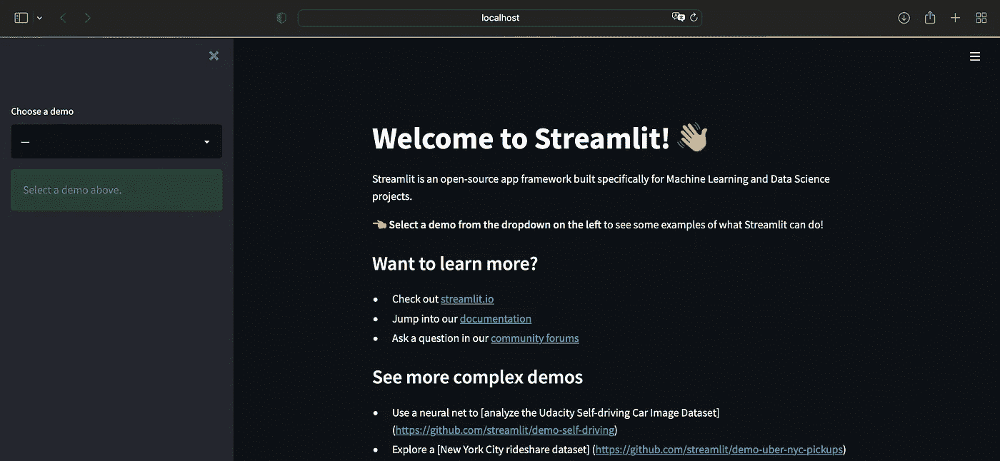
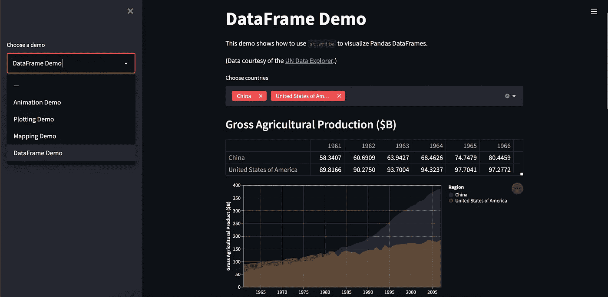
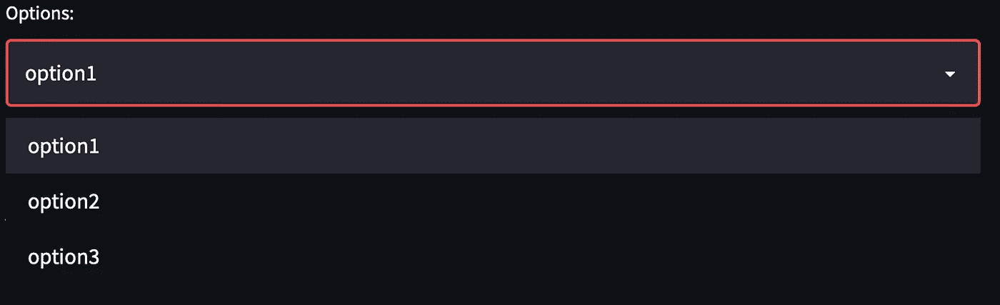
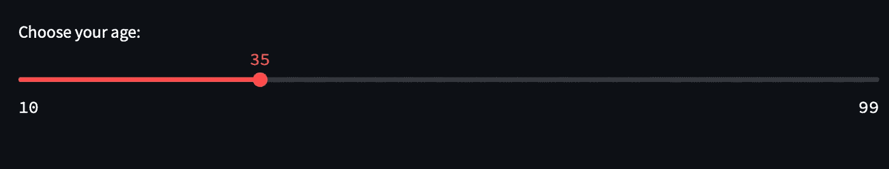
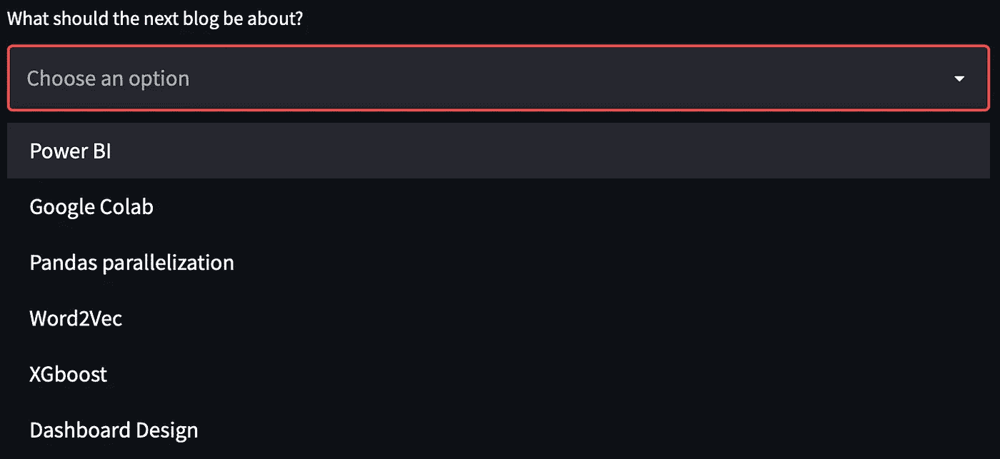
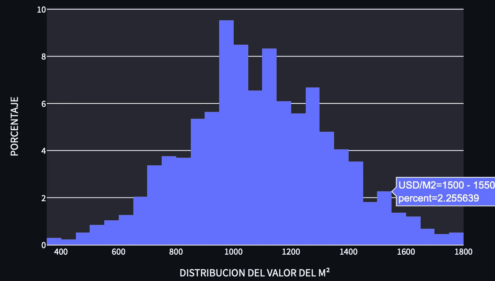
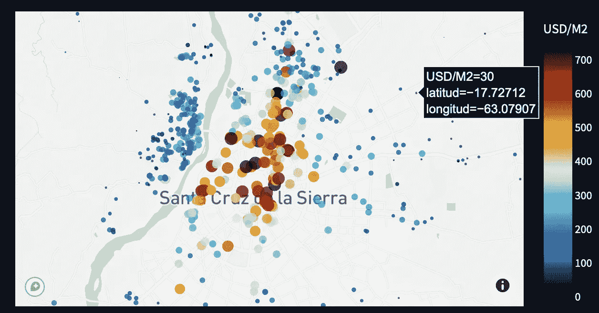

# Streamlit:从数据到 Web 应用

> 原文：<https://levelup.gitconnected.com/streamlit-from-data-to-web-app-195274760f26>

“哦，孩子！哦，好家伙！”你说当你看着你的数据，你的仪表板，你的发现。

Power BI 和 Tableau 是分享数据故事的绝佳工具。它们非常适合探索数据，它们可以从不同的来源读取数据，展示令人惊叹的交互式图表，它们确实令人惊叹！。问题是，当你想分享你在做数据科学工作时发现的惊人发现和见解时，会有一些缺点。这些工具的主要问题是它们非常昂贵！…即使是公司！

为了能够上传您的仪表板，以便公司中的每个人都可以看到它们，您需要有一个服务器设置和付费订阅。另一方面，如果你想把文件发送给某人，他们必须在他们的电脑上安装好程序，并且知道如何使用它。当你的同事对技术不感兴趣时，这是一个大问题(这很常见)。那你会怎么做？给他们发个幻灯片？一个 PDF？一个奇怪的 Excel！哦该死的不！如果我们超越公司来思考，这将是一个更大的问题…你如何与世界分享它🌎？介绍 **Streamlit。**

# 01 开始使用 Streamlit

Python 是一种令人惊叹的编程语言，首先是因为它简单的语法，但也因为它拥有巨大的社区。几乎任何东西都有库:数据操作、机器学习算法、视频和音频处理、应用程序开发、NLP 等。这个清单还在继续。这些令人惊叹的库之一是 Streamlit！。这个令人惊叹的库是专门为数据科学家构建的，通过将他们的数据脚本转换为 Web 应用程序，他们可以打破羞怯，面对世界。想象一下，你写了一个 Jupyter 脚本，你已经清理并转换了所有的数据，你用 Plotly 或 Matplotlib 构建了惊人的图形。有了 Streamlit，现在您可以构建和部署一个 Web 应用程序，并与世界分享您的见解、ML 模型、图表，基本上是用 Python 编写的任何东西。**这一切只用了不到 50 行代码！**


今天我将在 Pycharm 上工作，但是你可以在任何你喜欢的编辑器上工作。

假设您已经准备好了数据和漂亮的图表，让我们从安装 Streamlit 开始

```
pip install streamlit
```

一旦安装完成，我们就可以通过在终端中写入来测试我们的安装

```
streamlit hello
```

单击本地 URL 将打开我们的浏览器并向我们展示演示。检查左侧边栏。您可以使用一些演示来熟悉 Streamlit 的功能。



# 02 如何使用 Streamlit 构建 Web 应用程序

Streamlit 有不同的**“widgets”**，帮助我们以非常“pythonic”的方式向我们的网站添加不同的有用元素。选项列表、文本、标题、图表等元素。让我们来探索其中的一些小部件。顺便说一下，在这个例子中我将使用 Plotly，但是你可以使用其他库来创建你的可视化，比如 Matplotlib，Altair 等等。它甚至可以与音频和视频库一起使用！

## -读取数据和缓存

Streamlit 非常重要的一点是，每次更换过滤器时，都要重新运行。这意味着，例如，如果你有一个带选项的下拉菜单，当你选择一个选项时，整个脚本从上到下运行。因此，我们需要缓存计算密集型任务，比如读取数据或模型。我们可以通过使用一个函数来读取我们的数据文件，并在我们的函数定义上添加 **@st.cache** ，以便将其保存在**缓存**中。这可以用来缓存任何我们认为不需要经常重载的函数。因此，要读取 CSV，我们需要执行以下操作:

```
@st.cache
def readCSV(name):
   return pd.read_csv(name, delimiter='|')df = readCSV('DB.csv')
# Show a sample of the dataset.
st.write(df.head(5))
```

## -书写文本

我们有几个选项可以在网站上写文字。最好探索每一种方法，看看哪一种最适合您的项目。

```
st.title("My freaking website!")
st.write("Some description about my freaking website!")
st.markdown("### 🎲 A more stylish description….about my freaking website!")
```


## -选择框

```
filterValue = st.selectbox([“option1”, “option2”, “option3”])
```



现在我们可以使用输入值来过滤我们的数据帧！

```
df = df[df["Type"]==filterValue]
```


## -滑块

```
age = st.slider("Choose your age: ", min_value=10,  max_value=99, value=35, step=1)
```



## -多选

```
nextPost = st.multiselect(“What should the next blog be about?",["Power BI”, "Google Colab","Pandas parallelization", "Word2Vec", "XGboost",”Dashboard Design”])
```



## -可视化

与上面显示的小部件类似，我们也可以添加小部件来显示 Plotly 图表。以下是如何显示直方图和地理坐标图的两个示例

```
#HistogramfigHist = px.histogram(df, x='USD/M2',histnorm='percent')
figHist.update_layout(title_text='DISTRIBUCION DEL VALOR DEL M²', title_x=0.5)
figHist.update_yaxes(title_text='PORCENTAJE')
figHist.update_xaxes(title_text='DISTRIBUCION DEL VALOR DEL M²')st.plotly_chart(figHist, use_container_width=True)#Mappx.set_mapbox_access_token(mapboxToken)figMap = px.scatter_mapbox(df, lat='latitud', lon='longitud',color='USD/M2', size='USD/M2',
color_continuous_scale=px.colors.cyclical.IceFire, size_max=10,zoom=10,
#mapbox_style="carto-darkmatter")st.plotly_chart(figMap, use_container_width=True)
```



Streamlit 还有更多小部件和选项，我鼓励您去探索，但是通过这几行代码，我们可以为我们的 Web 应用程序构建一个脚本。

点燃了！…简化！


请继续阅读

# 03 Heroku 部署

有了我们热门的 Web 应用程序，我们可以在线托管它！。我们将与 Heroku 一起实现这一目标(免费！)，所以一定要**在他们的网站[https://www.heroku.com](https://www.heroku.com/)上创建一个账户**。我们还需要 **Heroku 命令行界面**，可以从这里下载[https://dev center . Heroku . com/articles/getting-started-with-python # setup](https://devcenter.heroku.com/articles/getting-started-with-python#set-up)。

每当使用 Heroku 进行部署时，我们的项目中都必须有一些必需的文件:

*   **app.py:** 这是我们之前构建的主要 Python 脚本。
*   **requirements.txt:** 服务器运行我们的 app.py 需要安装的所有库的列表
*   一个告诉 Heroku 哪一个是我们的应用程序的 liner。
*   **setup.sh:** 服务器的配置文件

您可以在这里看到我使用的所有文件和代码，并将其用作您项目的示例:

*   [https://github.com/erichho/streamlitExample](https://github.com/erichho/streamlitExample)

准备好所有这些文件后，我们通过终端或 CMD 命令登录 Heroku:

```
heroku login
```

它会在你的浏览器上打开一个窗口登录，你就进入了。接下来，我们创建 Heroku 项目:

```
heroku create
```

然后把我们的项目推到 Heroku。

```
git push heroku main
```

这个命令将需要一些时间来推送，安装库，并为我们的应用程序设置好一切。如果没有出现错误，我们最后运行以下命令，以确保至少有一个应用程序实例正在运行。

```
heroku ps:scale web=1
```

最后我们看到我们的杰作

```
heroku open
```

这将在您的浏览器上显示您的新 Web 应用程序。现在每个人都可以访问这个 URL！

你可以在这里看到我的网络应用程序:

## https://terrabolivia.herokuapp.com

**记住！**由于我们正在使用 Heroku 的免费订阅，如果一段时间不使用，我们的 Web 应用程序**将关闭**，我认为这是最后一次使用后 30 分钟才会关闭。但是，每当有人再次访问该网址时，它就会再次启动，只是需要一些额外的时间来加载。我想提的另一件事是，如果你有一个域名，比如说“myfreakingapp.com”，你可以去 Heroku**把网址**改成你的，去掉“. herokuapp.com”。

# 04 最后的想法

Streamlit 项目与日俱增。他们不断改进，增加新功能，越来越多的人使用它来展示他们的机器学习项目。就我个人而言，我发现启动并运行一个项目、对其进行实验并对其进行改进非常简单。不需要关于 HTML、CSS、Django 或任何服务器复杂性的知识！

我真的很喜欢这个项目，希望你有机会尝试一下，请！

**…与世界分享您的项目**🌎

