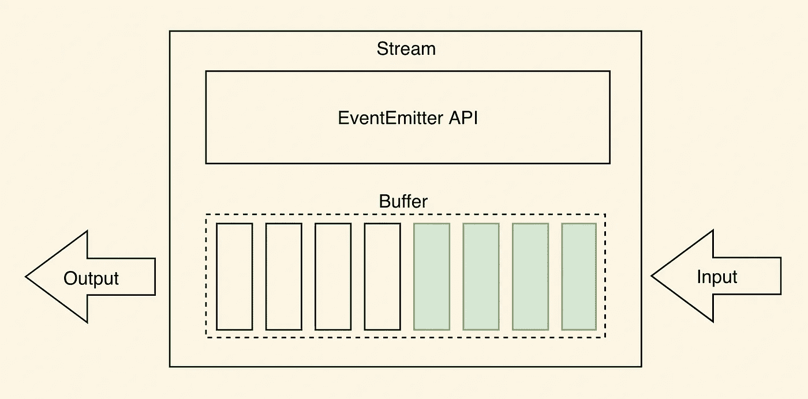
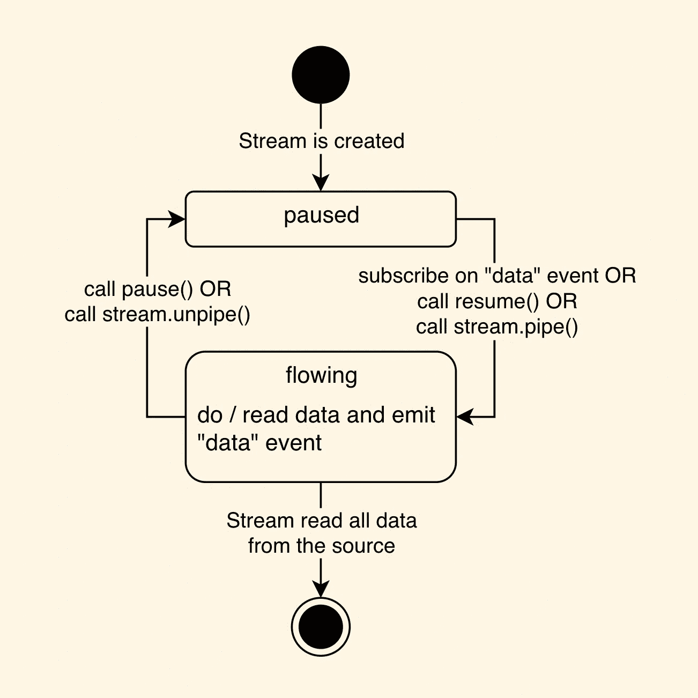
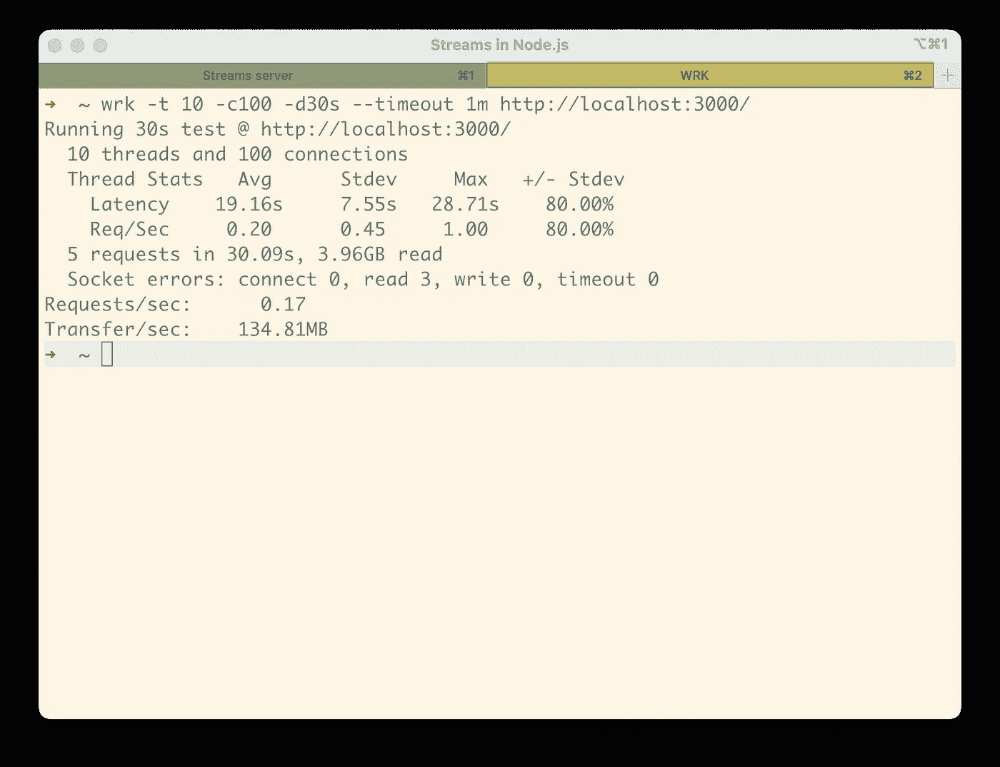
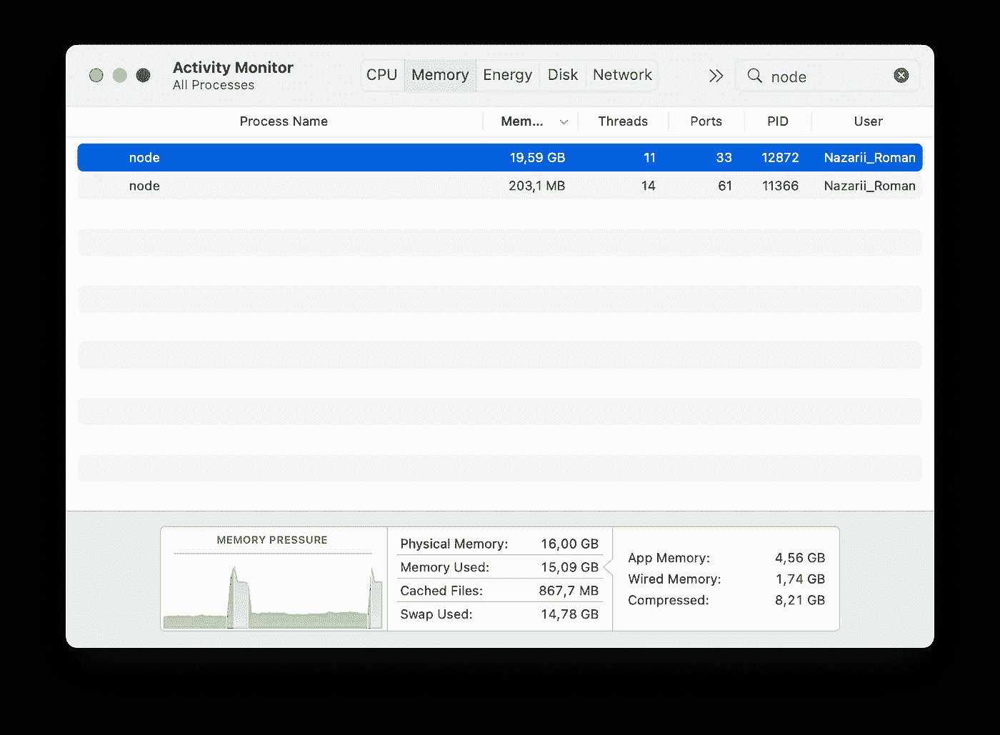
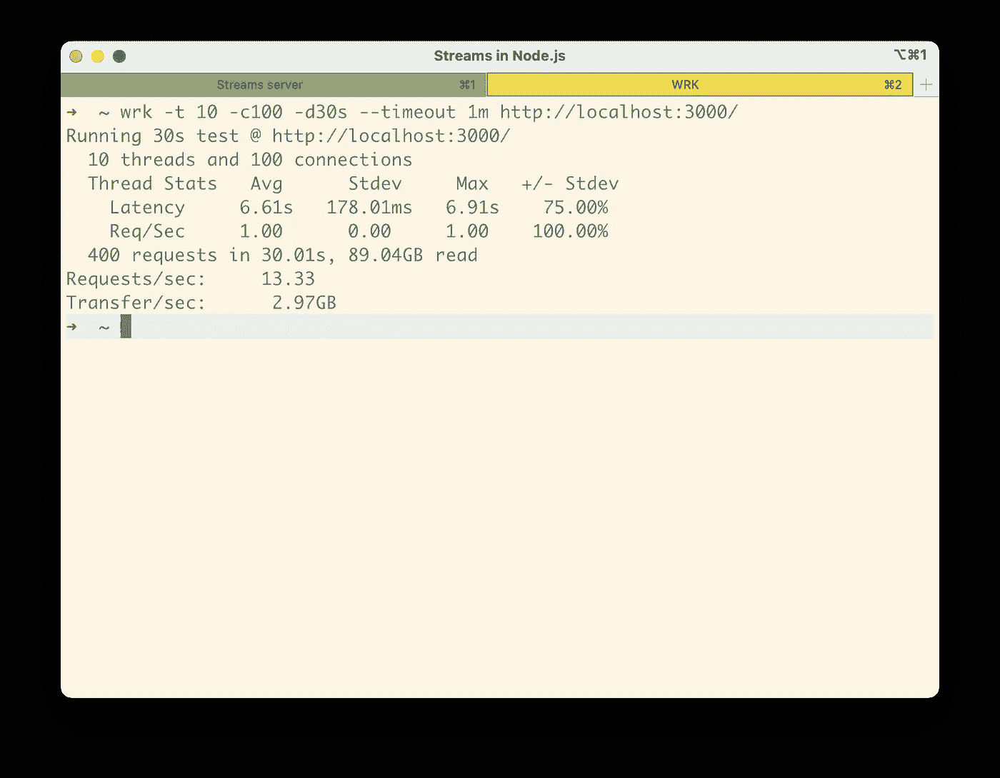
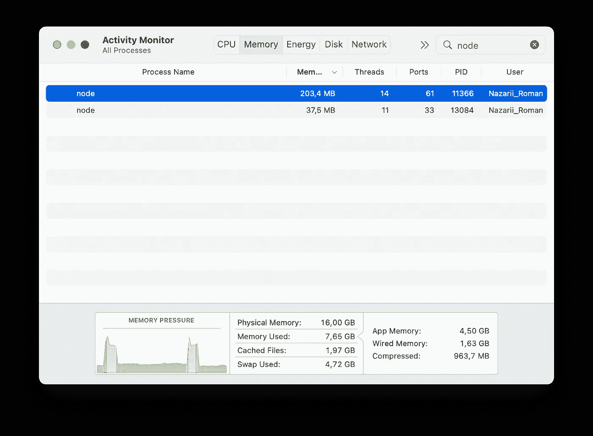
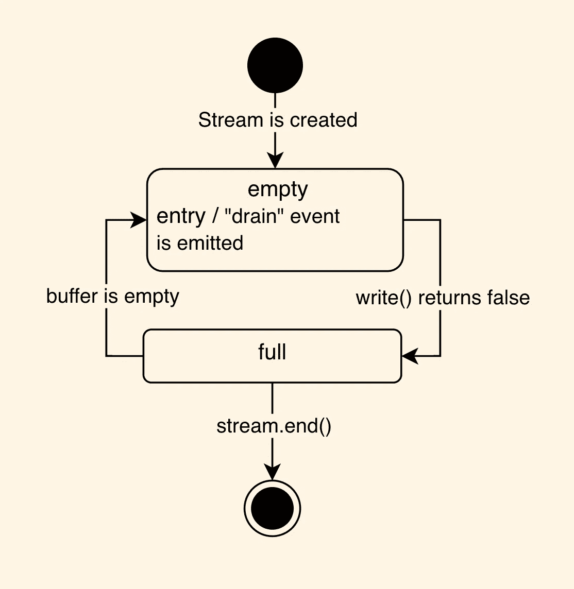
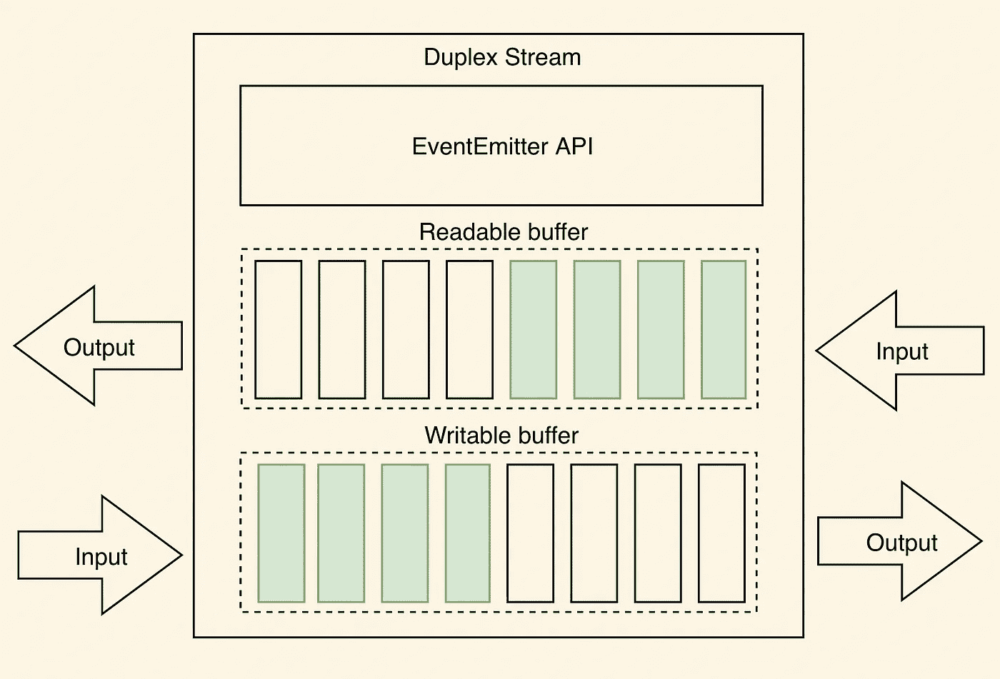

# 流以及它们如何适应 Node.js 的异步特性。

> 原文：<https://levelup.gitconnected.com/streams-and-how-they-fit-into-node-js-async-nature-a08723055a67>

## Node.js 中的流介绍和性能测试。

正如你从[以前的文章](/how-to-handle-blockers-in-node-js-1966d0399703)中已经知道的，异步服务器的基本思想是一个接一个地处理微小的工作。流理想地代表了这个概念，所以让我们在 Node.js 中揭开流的神秘面纱。

## Node.js 中的流是什么？

如果我们去掉细节，流就只是一个数据缓冲区，用来消费或产生小块的数据。

那么流有什么好处呢？要回答这个问题，让我们来谈谈我们拥有的不同类型的流，第一个是…

## 可读流

创建可读流是为了从源中“读取”数据。我们也可以说**可读流是数据生产者。**

可读流有两种工作模式，暂停和流动。在第一种模式中，流只有在您要求时才会返回数据，而在后一种模式中，它会不断发出带有数据块的`[data](https://nodejs.org/api/stream.html#event-data)`事件。下面你可以看到一个可读流的状态机图。

正如您所看到的，默认情况下，流处于暂停状态，一旦您订阅了`[data](https://nodejs.org/api/stream.html#event-data)`事件，它就会转变为流动状态。然后你可以通过`[pause](https://nodejs.org/api/stream.html#readablepause)`方法暂停它。

你可能想知道为什么我们需要两种模式。我们将在本文的后面回到这个主题。

让我们进入服务器的性能测试，我们将比较两台服务器。一种是使用异步文件读取向客户端提供大文件(220 MB)…

…另一个将使用可读流向客户端提供文件。

一如既往，我将使用 [wrk](https://github.com/wg/wrk) 基准测试，我们将从读取完整文件的服务器开始。我们将在 30 秒内为服务器加载 100 个并发连接。

如您所见，服务器每秒只能处理 0.17 个请求，更重要的是，服务器在峰值时消耗了高达 20 GB 的 RAM。

现在让我们测试使用流的服务器。正如您在下图中看到的，服务器平均每秒可以处理 13 个请求。

使用流的服务器平均只使用 200 MB 的 RAM。**我们能够将内存消耗减少近 100 倍**！这意味着您可以在同一台机器上放置更多的应用程序实例，并处理更多的请求。

值得提醒你的是，在异步服务器中处理阻塞的方法之一是使用分区，正如你从[上一篇文章](/how-to-handle-blockers-in-node-js-1966d0399703)中所知道的。流是分区方法的一个很好的实现。

既然有一个生产者，就应该有可以消费这些数据的东西，这就是为什么我们需要…

## 可写流

如果可读流是生产者，那么**可写流就是消费者。**与任何其他流一样，它有一个内部缓冲区，这个内部缓冲区用于保存“待处理”的数据，这些数据将被发送到我们想要存放这些数据的目标存储器。

可写流也有不同的状态，您可以在下图中看到它们的表示。

流是用空缓冲区创建的，生产者可以将数据推送到流中，但当缓冲区满了时，`[write()](https://nodejs.org/api/stream.html#writablewritechunk-encoding-callback)`方法会将`false`返回给你，你需要等到缓冲区变空并发出`[drain](https://nodejs.org/api/stream.html#event-drain)`事件。

## 反压力

你有没有想过，如果一个可读的流产生的数据比一个可写的流所能处理的多，会发生什么？是的，我们已经知道流有一个内部缓冲区，所以数据将被存储在缓冲区中，但是如果缓冲区满了会发生什么呢？

JS 是一种非常动态的语言，因此流会尝试为其内部缓冲区分配更多的内存来处理这种情况。但是，这可能会导致内存不足的异常。

这就是背压派上用场的时候了。这是为处理此类案件而设立的机制。你还记得不同流的状态机吗？因此，可读流将数据推入可写流，直到缓冲区满了，然后进入暂停模式。之后，等待`[drain](https://nodejs.org/api/stream.html#event-drain)`事件再次进入流动模式。

如你所见**，背压是可读流需要两种模式的唯一原因。通过这种方式，我们可以处理可读流产生的数据多于可写流所能处理的数据的情况。**

您可能想知道每次使用 streams 时是否需要处理这个问题，答案是不需要。有一个名为`[pipeline](https://nodejs.org/api/stream.html#streampipelinestreams-callback)`的功能可以帮你处理这个问题。

现在我们知道了可读和可写的流，是时候谈谈第三种类型的流了，它被称为…

## 双重流

双工流是同时表示可读和可写流的流。因为它是一个可读写的流，所以它在内部维护两个缓冲区，一个用于读取数据，另一个用于写入数据。

这种类型的流可能对双向通信有用，例如，来自`[net](https://nodejs.org/api/net.html)`核心模块的`[Socket](https://nodejs.org/api/net.html#class-netsocket)`是双工流。

转换流是双工流的一个特例。顾名思义，转换流在将数据从一个地方传输到另一个地方的过程中修改数据。转换流的一个例子可以是来自`[zlib](https://nodejs.org/api/zlib.html)`核心模块的任何流，比如 Gzip 类。

## 摘要

Node.js 非常擅长处理小块工作，而 Streams 就是这种想法的代表。使用流可以提高 Node.js 服务器的性能，并显著减少 RAM 消耗。

尽管您很少在您的日常工作中实现定制的流，但是在我们以这种或那种方式构建的每个应用程序中都涉及到流。

您可以在[这个 GitHub 库](https://github.com/Ayzrian/streams-in-nodejs)中找到本文使用的源代码。

## 接下来呢？

爱 Node.js？你可以看看我关于它的其他文章

*   [bun . js 是 Node.js 杀手吗？](/is-bun-js-the-node-js-killer-ffeb0f89196a)
*   [如何处理 Node.js 中的拦截器？](/how-to-handle-blockers-in-node-js-1966d0399703)
*   [为什么异步是一种趋势？](https://medium.com/gitconnected/why-asynchronous-is-a-trend-c9892667e245)