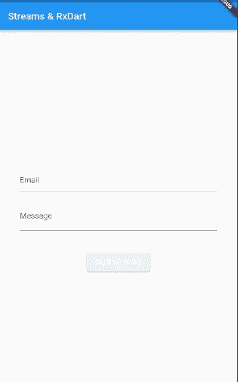
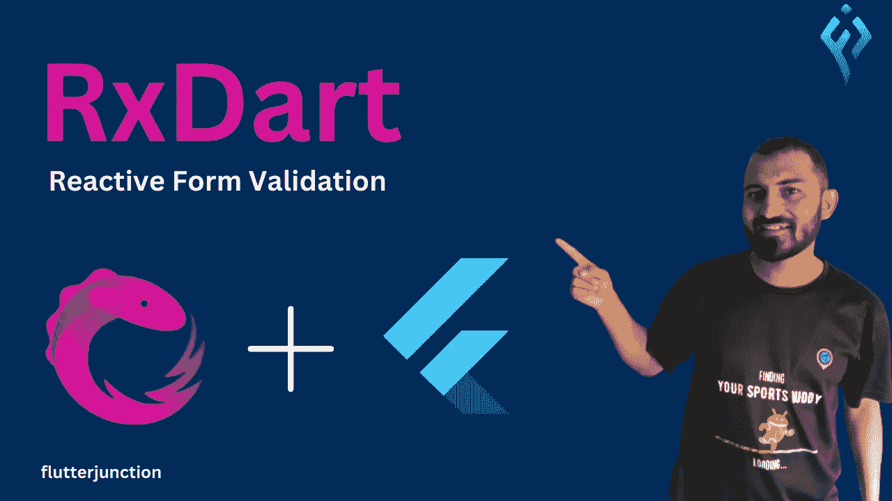

# 颤振中的流和 RxDart

> 原文：<https://levelup.gitconnected.com/streams-and-rxdart-in-flutter-9135ef64912e>

在本主题中，我们将了解 Flutter 中的**流**以及 **RxDart** 。在本指南中，我们将介绍流和 RxDart 的基础知识，然后创建应用程序来验证表单字段。

抖动中的 RxDart

我们的用户界面应该如下所示:



RxDart

首先，我们来讨论一下本指南的主题。

## **流**

流是一系列异步事件。简单地说，流也可以描述为管道。你在一端输入一个值，如果另一端有一个监听器，这个监听器就会收到这个值。

一个流可以有多个侦听器，当它被放入管道时，所有这些侦听器将接收相同的值。将值放在流上的方法是使用 StreamController。

有两种类型的流:单个订阅或广播。

## RxDart

RxDart 是一个结合了 react vex(Rx)流的强大功能和 Dart 语言优点的库。这是一个用于 Dart 和 Flutter 的反应式编程库，允许您以声明方式表达应用程序中的数据流。

RxDart 为 Streams API 添加了额外的功能，包括去抖动、节流和重试失败事件的能力，以及添加了处理单值(可观察)流的能力。

RxDart 有一些科目。

> 这些主题类型有一些不同，特别是在如何存储和传递给侦听器方面。然而，它们都是广播(热)控制器，这意味着流可以监听多次。它们都使用 Dart 的 StreamController，并具有将传递给 StreamController 的 onListen、onCancel 和 sync 参数。

*   **PublishSubject:** 这就像一个标准的 streamController，但是 Stream 返回一个 Observable 而不是 Stream。
*   **BehaviorSubject:** 它只捕获最新添加的项目。当新的侦听器开始侦听控制器时，它将接收存储的项。之后，任何新事件都将被发送给所有侦听器。或者，您可以设置一个种子值，该值仅在没有项目添加到主题时使用。
*   **ReplaySubject:** 它捕获所有已添加的项目。当新的监听器开始监听控制器时，它将接收所有项目。之后，任何新事件都将被发送给所有侦听器。

在这些主题之后，让我们回到一些编码。

首先，我们在 **lib** 文件夹中创建名为`***validator.dart***` 的新文件。

在内部，让我们创建 ***行为主题*** ，因为根据 UI，我们有两个字段需要验证。

```
final _email = BehaviorSubject<String>.seeded('@');
final _message = BehaviorSubject<String>.seeded('');
```

现在**流**和**沉**田。

```
Stream<String> get email => _email.stream;
Sink<String> get sinkEmail => _email.sink;

Stream<String> get message => _message.stream;
Sink<String> get sinkMessage => _message.sink;
```

接下来，我们将需要两个***stream transformers***，因为我们将用我们的逻辑转换流中的数据。

> StreamTransformer 是 Dart 编程语言的一个类。它代表一个转换器，接受一个数据流并将其转换为另一个数据流。
> 
> StreamTransformer 类通常用于在将流发出的数据传递给流的侦听器之前对其进行修改。这对于您希望在侦听器接收到流发出的数据之前对其进行某种转换的情况非常有用。

```
final validateEmail =
      StreamTransformer<String, String>.fromHandlers(handleData: (value, sink) {
    if (value.length != 1) {
      isEmail(value)
          ? sink.add(value)
          : sink.addError('Please enter valid email');
    }
  });

  final validateMessage =
      StreamTransformer<String, String>.fromHandlers(handleData: (value, sink) {
    if (value.length != 0) {
      value.length >= 8
          ? sink.add(value)
          : sink.addError('Message should be 8 characters long');
    }
  });
```

然后我们会经过我们溪流中的两个变压器。

```
 Stream<String> get email => _email.stream.transform(validateEmail);
  Sink<String> get sinkEmail => _email.sink;

  Stream<String> get message => _message.stream.transform(validateMessage);
  Sink<String> get sinkMessage => _message.sink;
```

在我们的流中传递了转换器之后，我们需要另一个流来获得上面两个流的结果。如果两个条件都满足，这个新的流将向按钮发送一个布尔值 true，并使其可点击。

```
Stream<bool> get submitValid => 
Rx.combineLatest2(email, message, (e, m) => true);
```

我们可以用验证器接收我们的 UI，如下所示:

```
StreamBuilder(
              stream: validation.email,
              builder: (_, snapShot) => TextField(
                onChanged: (val) => validation.sinkEmail.add(val),
                decoration: InputDecoration(
                    hintText: 'Email',
                    errorText:
                        snapShot.hasError ? snapShot.error.toString() : null),
                keyboardType: TextInputType.emailAddress,
              ),
            ),
```

我们结束了。

# 结论

您已经学习了 Flutter 中 Streams 和 Rxdart 的概念和用法。这个主题对你来说可能是新的，但是在你的应用中应用起来非常简单和有效。

如果你喜欢这篇文章，请点击👏图标，为您提供传递所有新事物的动力。

此外，关注令人兴奋的文章和项目的更新。

# 让我们连接起来

我们可以成为朋友。在[脸书](https://www.facebook.com/nabin.dhakal.714/)、 [Linkedin](https://www.linkedin.com/in/nabindhakal/) 、 [Github](https://github.com/nbnD) 、 [Youtube](https://www.youtube.com/channel/UCW6oYt_3QSl7J2HSHNqwXWw) 、 [BuyMeACoffee](https://www.buymeacoffee.com/nabindhakal) 和 [Instagram](https://www.instagram.com/nbn_d_/) 上查找。

访问:[颤振连接](https://flutterjunction.com/)

**投稿:** [BuyMeACoffee](https://www.buymeacoffee.com/nabindhakal)

**完整代码:**

[](https://github.com/nbnD/streams_rxdart) [## GitHub - nbnD/streams_rxdart

### 一个新的颤振项目。这个项目是颤振应用的起点。一些帮助您入门的资源…

github.com](https://github.com/nbnD/streams_rxdart) 

抖动中的 RxDart