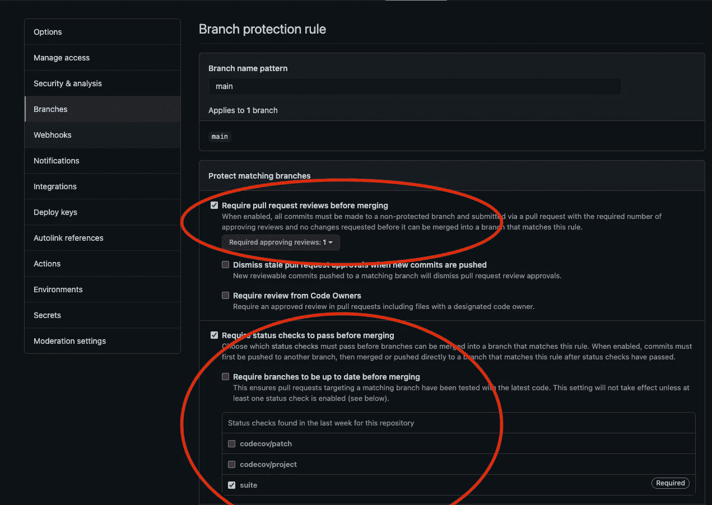

# 用 GitHub 和 Github 操作增强 React 应用程序

> 原文：<https://levelup.gitconnected.com/strengthen-a-react-application-with-github-and-github-actions-62977a781b37>

## 如何随着时间的推移使项目变得干净


肖恩·斯特拉顿在 [Unsplash](https://unsplash.com/s/photos/harmony?utm_source=unsplash&utm_medium=referral&utm_content=creditCopyText) 上拍摄的照片

> 开发团队的快乐与项目的稳定性、整洁度和架构成正比

当一个项目由一个团队维护时，团队领导有责任保持它的干净和安全，避免中断测试、不同的代码风格和其他不良实践，这些会使您的项目组织不良并随着时间的推移容易出错。

为了实现这一目标，我们可以使用两种方法:

*   手动检查:仅将已审核的 PRs(拉请求)合并到主分支。
*   自动检查:使用 CI(持续集成)服务，如 GH actions、CircleCI，即

这两种方法帮助我们保持每个 PR 的应用程序健康，避免合并不符合应用程序风格指南的代码。

在理解我们如何使用 CI 来自动化这个过程之前，我们应该选择工具来使我们的项目稳固并得到良好的维护。

# CI 相关反应带套件

下面是我通常用来构建新的 React 应用程序的库:

*   [ESLint](https://eslint.org/)
*   [更漂亮](https://prettier.io/)
*   [笑话](https://jestjs.io/)
*   [柏树](https://www.cypress.io/)
*   [Codecov](https://about.codecov.io/)

*这些是与配置项相关的库；还有其他重要的库来构建一个伟大的应用程序，比如 Storybook (* [*转到文章*](/configure-nextjs-with-storybook-and-tailwindcss-by-andrea-vassallo-21786844ebdd) *)、TailwindCSS、WebVitals 等等。*

# 关于图书馆的几句话

ESLint 是一个能够发现和修复代码问题的 linter，给项目一个全局的代码风格是有利的。

Jest 和 Cypress 分别是单元测试框架和端到端测试框架。单元测试对于测试每个功能和隔离责任非常重要。功能测试需要测试所有的拼图，模拟真实浏览器中的用户行为和交互。

Codecov 是一个工具，它可以检查和存储每个 pull 请求的覆盖率信息，并使用 GH 注释推送结果。

# TL；DR；

我为 React 和 Express JS 创建了一个完整的模板，您可以用它来用一个完全配置的 CI 启动您的项目:

*   [带 GraphQL 和 TS 的 ExpressJS】](https://github.com/vassalloandrea/express-template)
*   [与 TS 反应](https://github.com/vassalloandrea/react-template)

# 我们开始吧

## 下载项目

首先，我们需要一个完整的、经过全面测试的 React 应用程序。您可以派生和克隆这个库:[https://github.com/vassalloandrea/react-ci](https://github.com/vassalloandrea/react-ci)

fork 很重要，因为您需要一个个人的 Github 存储库来使用 GH 动作实现 CI。

```
git clone [git@github.com](mailto:git@github.com):yourusername/react-ci.git
cd react-ci
```

在该项目中，有许多自定义的 NPM 命令，可以帮助我们在本地和配置项上运行所有检查。

*   **npm 运行开始|** 在本地运行应用程序
*   **npm 运行测试:单元** |使用 Jest 运行单元测试
*   **npm 运行测试:e2e** |使用 Cypress 和 GUI 运行 e2e 测试(仅限本地)
*   **npm 运行测试:e2e:ci** |使用没有 GUI 的 Cypress 运行 e2e 测试
*   **lint** |运行 ESLint
*   **lint:fix** |使用`— fix`选项运行 ESLint linter，它将自动纠正所有发现的问题
*   **格式:检查** |运行更漂亮
*   **格式:修复** |使用`— write`选项运行更漂亮，该选项将自动纠正所有发现的样式问题
*   **覆盖率:推送** |运行 Codecov 推送覆盖率

熟悉这些命令并尝试运行它们。

## **配置生长激素储存库**

当你开始一个项目时，最好的做法是保护`main`分支，避免你或其他人直接推动它。保护主干分支是正确的，原因有很多:

*   避免代码冲突
*   添加使代码评审共享知识和减少错误的能力。
*   添加运行状态检查的功能。
*   每次 PR 合并到`main`时，将应用程序部署到暂存
*   启用预览部署，在专用环境中测试 PR 修复/功能

## 保护主枝

您可以通过添加一些有用的规则来保护您的分支，如下所示。

*   使用评审规则，只有当一个或多个团队成员评审并批准了代码时，PR 才可以被合并。
*   通过状态检查，您可以告诉 GH，如果其中一项检查没有通过，用户就不能合并 PR。状态检查可以是 CI 工作流或另一个 GH 应用程序(如 codecov)



## 实施 GH CI

我们希望 CI 达到的目标是保持项目的干净，并随着时间的推移进行测试。

为了创建 GH 工作流，我们需要在项目中创建两个名为`.github/workflows`的嵌套目录。

GH action 将运行该目录中的所有工作流。每个工作流程都有许多步骤，但不是强制性的。


这是包含成功和失败工作流的 GH 操作页面示例。


这是一个包含三个不同步骤的工作流细节

让我们在`.github/workflows`目录中创建一个名为`ci.yml`的文件。阅读评论，了解配置项如何工作。

最新的命令使用秘密令牌运行 codecov 脚本。可以通过创建一个帐户并将 GH 库链接到 [Codecov](https://about.codecov.io/) 来检索秘密令牌。

*如果你想跳过这一步，现在，注释从第 74 行到末尾的* `*cy.yml*` *文件。*


个人代码覆盖项目

将 Codecov 标记添加到存储库设置中的 GH secrets 中。


结果应该是这样的:


# 我们都准备好了！

游戏已经制作好了，你只需要提交修改并把它们推到原点来显示 GH 正在运行这个动作。

由于这是一个演示，您可以直接推送到您的主/主分支机构或创建一个 PR，结果是一样的。


# 享受你的 CI

仅此而已！我希望本文能帮助您建立一个强大的、维护良好的代码库。

你喜欢这篇文章吗？用掌声和评论让我知道🙏

React/NextJS 应用程序需要帮助吗？ [**雇佣我**](mailto:andrea.vassallo.94@gmail.com)