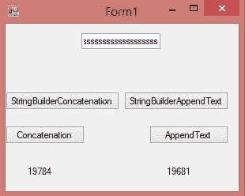
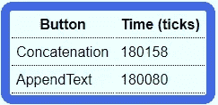
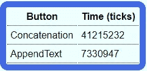
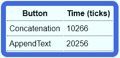
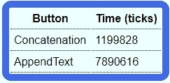

# 字符串效率。网

> 原文：<https://levelup.gitconnected.com/string-efficiency-in-net-befe7bb46a7e>

## 文本框。append text(" string ")；Vs 文本框。text+= " string "；

照片由[托马斯·格里斯贝克](https://unsplash.com/@jack_scorner)在 [Unsplash](https://unsplash.com/) 上拍摄

你有没有想过使用`TextBox.AppendText(“string”)`还是`TextBox.Text += “string”;`更高效？

我使用 Windows 窗体应用程序对此进行了测试，结果非常有趣

在 Windows 窗体应用程序中，我有 4 个按钮:

*   串联按钮
*   StringBuilder 串联按钮
*   AppendText 按钮
*   StringBuilder AppendText 按钮

串联按钮在 1000 次迭代的 for 循环中使用了`textBox1.Text += “s”`。

AppendText 按钮在 1000 次迭代的 for 循环中使用了`textBox1.AppendText(“s”)`。

`StringBuilder`按钮的等效物基本上做了同样的事情，但是它没有使用`+=`或`AppendText()`方法进行追加，而是在 for 循环中使用了`StringBuilder`实例的`Append()`方法，然后在 for 循环的末尾追加或连接了`StringBuilder`实例的字符串值。

看看下面 4 个按钮的代码:

# 结果

这四种方法的结果都挺有意思的。

## 文本框。Multiline = True

用`StringBuilder`:

`AppendText()`快了 78 个刻度。

不带`StringBuilder:`

`AppendText()`快了 33884285 个滴答。

## 文本框。Multiline = False

用`StringBuilder:`

串联快了 9990 个节拍。

不带`StringBuilder:`

串联快了 6690788 个节拍。

如结果所示，如果`TextBox.Multiline`属性设置为`true`，那么`TextBox.AppendText()`更快。

而如果`Multiline = false`，拼接会更快。

使用`StringBuilder`实例只是显示了在 for 循环中构建字符串时，它比串联要高效得多。