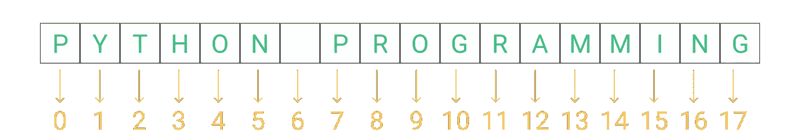
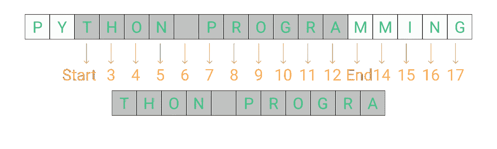
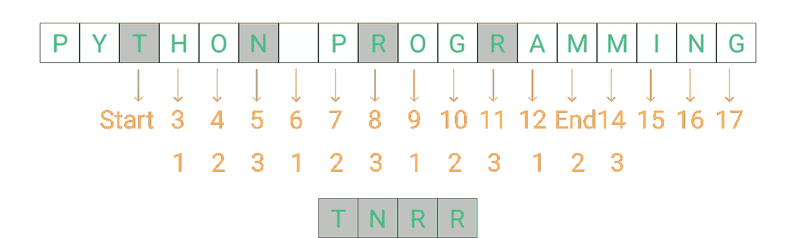
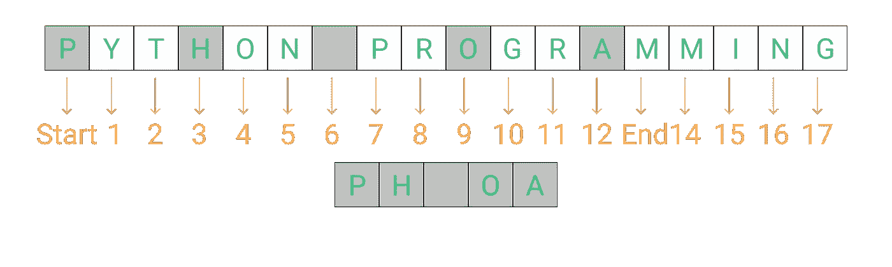
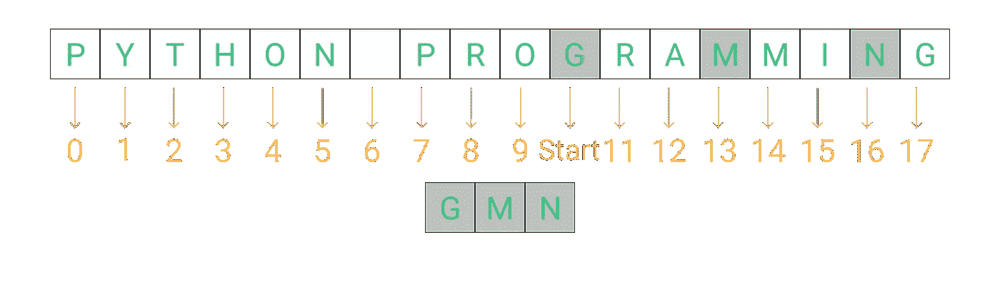
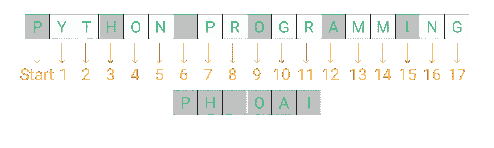
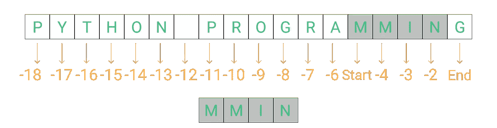
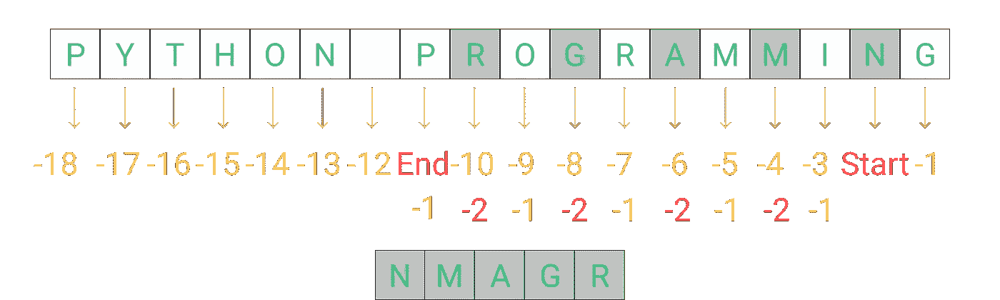
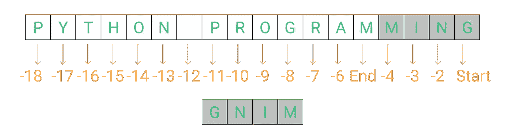

# Python 中奇妙的字符串数据类型带来的乐趣

> 原文：<https://levelup.gitconnected.com/string-manipulation-in-python-7f8f62236792>

## 了解如何在 Python 中使用内置的字符串操作方法


Python 中奇妙的字符串数据类型带来的乐趣

正如我们在前面的博客中看到的，字符串是一个字符序列。我们可以用这种数据类型存储任何类型的数据。例如名称、地址、URL、令牌或任何其他类型的数据。


由 [GIFs 忍者](https://gifs.ninja/its-showtime/)

# 1.使用切片运算符反转诗句

在本练习中，我们将看到使用 slice 运算符在 python 中反转字符串的不同方法。还有很多其他的方法来反转字符串。但是我的主要目标是向您展示如何使用切片操作符。

# 切片运算符

切片运算符是用方括号和三个参数编写的。这三个自变量是**开始**、**停止**和**步进**。Start 建议从哪里开始操作；stop 表示停止操作的位置，step 表示步数(1，2，-3，-1 等。)拿去。切片运算符可用于字符串、列表和元组。我们不能在整数、布尔集合或字典中使用它。

**注:**我们可以忽略 step 参数。这是一个可选参数。在某些情况下，我们可以忽略 start 和 stop 参数的使用。

```
string[start:stop:step] or list[start:stop:step] or tuple[start:stop:step]
```

假设我们有一个字符串“Python 编程”。在每种编程语言中，索引从 **0** 开始。因此，对于我们的字符串，我们有从 0 到 17 的索引。



如果我们想要索引 2 到 12 的数据，我们必须写 **str1[2:13]** 。切片运算符将停止点视为 12。或者通常在给定停止点之前的一个点。

```
str1 = "Python Programming"
print(str1[2:13])    #OUTPUT : thon Progra
```



现在，你会说我想要从索引 2 到索引 13 的每三个数据。因此，我们的切片操作符看起来类似于 **str1[2:13:3]** 。从下图中，您可以观察到它采用了起始索引，然后每隔三个索引一次。于是，我们得到了下面的索引 **2，5，8，11** 。由于停止点是 13，编译器不考虑第 14 个索引。

```
str1 = "Python Programming"
print(str1[2:13:3])    #OUTPUT : tnrr
```



正如我前面提到的，我们可以忽略 slice 操作符中的开始和停止参数。所以，在某些情况下，当我们希望起点为 0 时，我们可以忽略开始参数。例如，我们想要 **str1[0:13:3]** 那么我们可以把它写成 **str1[:13:3]** 。

```
str1 = "Python Programming"
print(str1[:13:3])    #OUTPUT : Ph oa
```



同样，我们也可以忽略停止点。所以，你可以写 **str1[10::3]** 或者 **str1[10:18:3]**

```
str1 = "Python Programming"
print(str1[10::3])    #OUTPUT : gmn
```



我们也可以同时忽略停止和开始端点。可以写类似 **str1[::3]** 的东西。在我们有步骤参数的情况下，我们应该忽略开始和停止参数的使用。否则，只使用 **str1[:]** 或 **str1[::]** 就没有任何意义。它将返回准确的字符串。

```
str1 = "Python Programming"
print(str1[::3])    #OUTPUT : Ph oai
print(str1[::])        #OUTPUT : Python Programming
print(str1[:])        #OUTPUT : Python Programming
```



我告诉过你我们也可以使用否定的开始、停止和步进参数吗🤔？

我们可以使用否定论点。但是，在使用否定的开始、停止或步进参数之前，要小心并正确地测试它。默认情况下，步长参数为 **1** 。

在下面给出的例子中，因为我们没有给出步长参数，所以它将 1 作为默认值。现在，-1 是我们字符串的最后一个元素，所以在加上 1 之后，我们得到 0。By，python 开头就不走了。它将尝试在索引-1 之后查找索引 0。因此，我们得到一个空字符串作为输出。

```
str2 = "Python Programming"
print(str2[-1:-5])    #OUTPUT :
```

现在，如果我们从-5 而不是-1 开始切片操作，那么我们将得到下面的输出。这样做的原因是，当编译器试图将 1 加到-5 中时，得到的是-4，它存在于索引-5 之后。

```
str2 = "Python Programming"
print(str2[-5:-1])    #OUTPUT : mmin
```



```
str2 = "Python Programming"
print(str2[-5:-1])    #OUTPUT : nmagr
```



```
str2 = "Python Programming"
print(str2[-1:-5:-1])    #OUTPUT : gnim
```



因此😮‍💨，如何使用切片运算符来反转字符串。我知道，现在你可能已经知道怎么做了。尽管如此，我们还是做吧！

```
str1 = "Python Programming"
str2 = str1[::-1]
print(str2)    #OUTPUT : gnimmargorP nohtyP
```

# 2.使用 7 种流行的方法操作字符串

python 提供了许多用于字符串操作的内置方法。在这里，我将介绍一些你可能会经常用到的。

1.  大写()，标题()&计数()
2.  查找()&索引()
3.  下部()&上部()
4.  islower() & isupper()
5.  strip()、lstrip() & rstrip()
6.  isalpha()、isnumeric() & isalnum()
7.  split()，join() & replace()

# 大写()，标题()&计数()

**Capital()**方法将字符串的首字符转换为大写字母。然而， **title()** 方法将字符串中每个单词的首字母大写。

```
str1 = "learn python programming"print(str1.capitalize())    #OUTPUT: Learn python programming
print(str1.title())    #OUTPUT: Learn Python Programming
```

**count()** 方法帮助统计字符串中特定字符或子串的出现次数。空白、数字和符号都被视为字符。您也可以使用字符串变量来使用 count 方法。

```
str1 = "learn python programming learn"
str2 = "python"print(str1.count('learn'))    #OUTPUT: 2
print(str1.co4unt(' '))    #OUTPUT: 3 
print(str1.count(str2))    #OUTPUT: 1
```

# 查找()&索引()

在字符串中搜索指定的字符或子字符串，并返回找到它的位置。 **find()** 和 **index()** 的主要区别是当指定的字符或子字符串不存在时，find()方法返回 **-1** ，而 index()方法抛出错误。

**找到()**

```
str1 = "learn python programming learn"print(str1.find('learn'))    #OUTPUT: 0
print(str1.find(' '))           #OUTPUT: 5
print(str1.find('z'))          #OUTPUT: -1
```

**指数()**

```
str1 = "learn python programming learn"
print(str1.index('learn'))    #OUTPUT: 0
print(str1.index(' '))        #OUTPUT: 5
print(str1.index('z'))
"""
OUTPUT 
---
Traceback (most recent call last):
  File "<stdin>", line 1, in <module>
ValueError: substring not found
"""
```

> ***注:*** 三重引号有两个用途。您可以将它们用于多行注释或多行字符串数据的赋值。

我建议使用 find()方法，而不是 index()。

# 下部()&上部()

有时，我们需要将数据转换成小写或大写。在数据科学和机器学习任务中，我们最有可能需要将所有东西都转换成小写。

**降低()**

```
str1 = "Learn Python Programming from @Sahil Fruitwala on 13-Oct 🙌"print(str1.lower())
#OUTPUT: learn python programming from @sahil fruitwala on 13-oct 🙌
```

**上层()**

```
str1 = "Learn Python Programming from @Sahil Fruitwala on 13-Oct 🙌"print(str1.upper())
#OUTPUT: LEARN PYTHON PROGRAMMING FROM @SAHIL FRUITWALA ON 13-OCT 🙌
```

> ***注意:*** 当我们应用 upper()或 lower()方法时，除了字母以外的任何字符都将被忽略。

# islower() & isupper()

islower()和 isupper()方法分别检查给定字符串的所有字符是小写还是大写。作为这些方法的结果，它将返回一个布尔值(真/假)。

```
str1 = "LEARN PYTHON PROGRAMMING FROM SAHIL FRUITWALA"print(str1.islower()) #OUTPUT: False
print(str1.isupper()) #OUTPUT: Truestr1 = "learn python programming from sahil fruitwala"print(str1.islower()) #OUTPUT: True
print(str1.isupper()) #OUTPUT: Falsestr1 = "Learn Python Programming from @Sahil Fruitwala on 13-Oct 🙌"print(str1.islower()) #OUTPUT: False
print(str1.isupper()) #OUTPUT: False
```

# strip()、lstrip() & rstrip()

strip()方法的标准定义是，它返回字符串的修整版本。但这意味着什么呢？这意味着 strip()方法将返回从字符串两端移除了多余空格的字符串。

**strip()**

```
str1 = " LEARN PYTHON PROGRAMMING "print(str1) 
#OUTPU: LEARN PYTHON PROGRAMMING 
print(str1.strip()) 
#OUTPU:LEARN PYTHON PROGRAMMING
```

**lstrip()&rst rip()**lstrip()删除字符串左侧多余的空格。然而，rstrip()从字符串右侧移除多余的空白。

```
str1 = " LEARN PYTHON PROGRAMMING "print(str1.lstrip()) 
#OUTPU:LEARN PYTHON PROGRAMMING  
print(str1.rstrip()) 
#OUTPU: LEARN PYTHON PROGRAMMING
```

> ***注:*** 你看不出太大的区别但是在你的系统上试一试，你就看出区别了。

# isalpha()、isnumeric() & isalnum()

如何验证字符串是只包含字母，还是只包含数字或字母数字数据？

Python 为您提供了 isalpha()、isnumeric() & isalnum()方法来验证您的字符串。

```
str1 = "LearnPythonProgramming"print(str1.isalpha())    # OUTPUT: True
print(str1.isnumeric())    # OUTPUT: False
print(str1.isalnum())    # OUTPUT: True# -----------------------str1 = "Learn Python Programming"print(str1.isalpha())    # OUTPUT: False
print(str1.isnumeric())    # OUTPUT: False
print(str1.isalnum())    # OUTPUT: False# -----------------------str1 = "123LearnPythonProgramming123"print(str1.isalpha())    # OUTPUT: False
print(str1.isnumeric())    # OUTPUT: False
print(str1.isalnum())    # OUTPUT: True# -----------------------str1 = "123456"print(str1.isalpha())    # OUTPUT: False
print(str1.isnumeric())    # OUTPUT: True
print(str1.isalnum())    # OUTPUT: True# -----------------------str1 = "123LearnPythonProgramming123@"print(str1.isalpha())    # OUTPUT: False
print(str1.isnumeric())    # OUTPUT: False
print(str1.isalnum())    # OUTPUT: False
```

# split()，join() & replace()

方法的作用是:将一个字符串拆分成一个列表。这种拆分基于在 split()方法中作为参数传递的字符。如果您没有在 split 方法中传递任何参数，它将把空白作为默认值。

split()方法的定义:`_string_.split(separator, maxsplit)`这里， **maxsplit** 是可选参数。它指定要进行多少次拆分。默认值为-1，即“所有事件”

```
str1 = "Learn#Python#Programming"print(str1.split("#"))
#OUTPUT: ['Learn', 'Python', 'Programming']# -----------------------str1 = "Learn Python Programming"print(str1.split())        #OUTPUT: ['Learn', 'Python', 'Programming']
print(str1.split(" "))    #OUTPUT: ['Learn', 'Python', 'Programming']# -----------------------str1 = "Learn#Python#Programming#From#Sahil_Fruitwala"print(str1.split("#", -1))
#OUTPUT: ['Learn', 'Python', 'Programming', 'From', 'Sahil_Fruitwala']
print(str1.split("#", 1))
#OUTPUT: ['Learn', 'Python#Programming#From#Sahil_Fruitwala']
print(str1.split("#", 3))
#OUTPUT: ['Learn', 'Python', 'Programming', 'From#Sahil_Fruitwala']
```

**join()** 方法获取 iterable 中的所有项，并使用指定的字符串或字符将它们连接成一个字符串。在下面的例子中，我们可以看到 iterable 使用空格连接。

```
myTuple = ("Learn", "Python", "Programming")
myList = ["Learn", "Python", "Programming"]tuple1 = " ".join(myTuple)
list1 = " ".join(myList)print(tuple1)    # OUTPUT: Learn Python Programming
print(list1)    # OUTPUT: Learn Python Programming
```

使用 join()方法，我们也可以连接字典的所有键。

```
myDict = {"Language":"Python", "Developer":"Sahil", "Year": 2021}dict1 = " ".join(myDict)
# or
# dict1 = " ".join(myDict.keys())
print(dict1)    # OUTPUT: Language Developer Year
```

我们可以使用以下方法连接字典的所有值:

```
myDict = {"Language":"Python", "Developer":"Sahil", "Year": "2021"}dict1 = " ".join(myDict.values())
print(dict1)    # OUTPUT: Language Developer Year
```

> ***注意:*** 使用 **join()** 方法只能连接字符串值。

**replace()** 方法用另一个指定的短语替换一个指定的字符串或字符。

```
myStr = "Python Programming"newStr = myStr.replace("Python", "C++")
print(newStr)
```

我们可以传递我们想要替换的出现次数。例如，如果我们只想替换两次出现的字符**‘a’**，我们可以编写下面的代码。

```
myStr = "Learn Python Programming from Sahil Fruitwala"newStr = myStr.replace("a", "@", 2)
print(newStr)
```

# 结论

10 分钟哈哈！但最后，我们在这一节的结尾😁。

我知道，一次接受太多了。但是，你不需要记住我在这里提到的一切。我只是展示给你看，这样你就能回忆起什么是可能的，什么是不可能的。还有一些我在这里没有提到的其他方法。

如果你想了解更多关于字符串方法的信息，请查看 [W3School](https://www.w3schools.com/python/python_ref_string.asp) 。

就这样。感谢您的阅读。

如果你需要任何帮助或者想讨论什么，请告诉我。在 [Twitter](https://bit.ly/3KjwgZV) 或 [LinkedIn](https://bit.ly/3JbsPDm) 上联系我。请务必在下面的评论中留下你的想法、问题或担忧。我很想看看他们。

> 想了解更多？
> 
> 注册我的[时事通讯](https://bit.ly/3Menk8Q)，把最好的文章放进你的收件箱。

直到下一次👋

> **查看 Python 101 系列的更多博客👇**

[](/variables-and-data-types-in-python-eee80a886a17) [## Python 中的变量和数据类型

### Python 初学者的变量和数据类型完全指南

levelup.gitconnected.com](/variables-and-data-types-in-python-eee80a886a17) [](/introduction-to-python-6c17499cd9da) [## Python 简介

### 了解如何在您的系统上安装和验证 Python 安装

levelup.gitconnected.com](/introduction-to-python-6c17499cd9da)