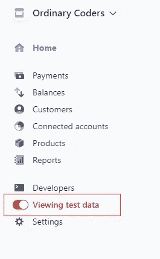
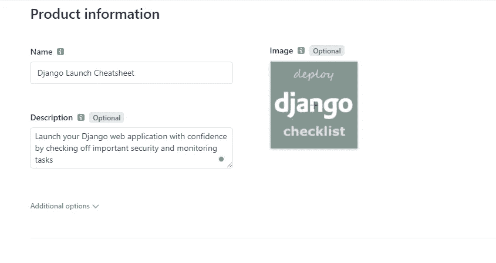
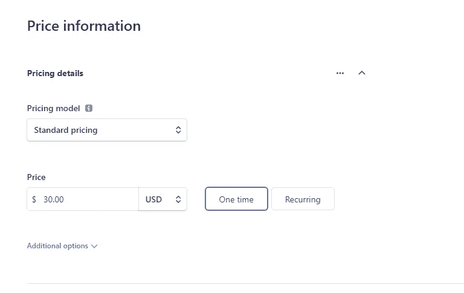
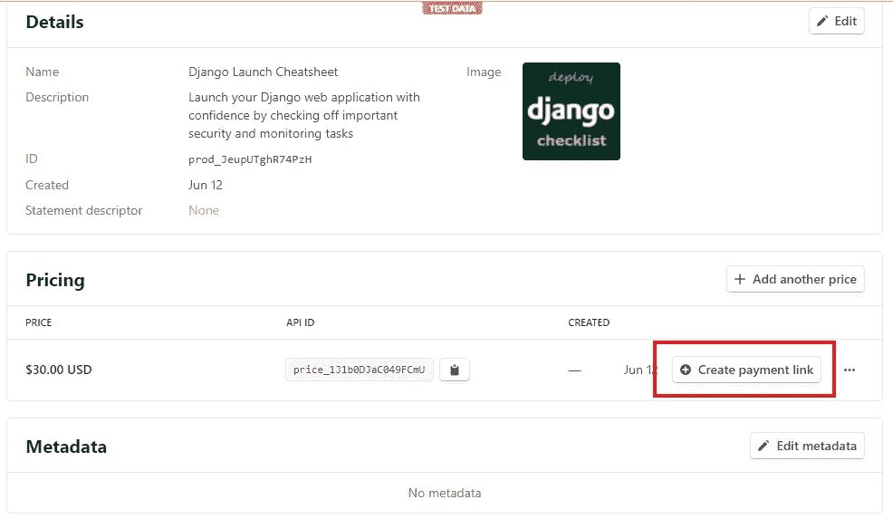
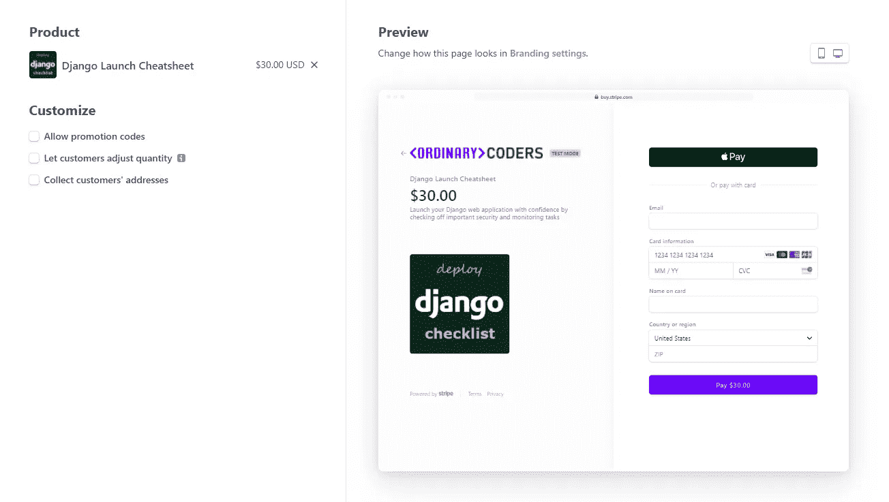
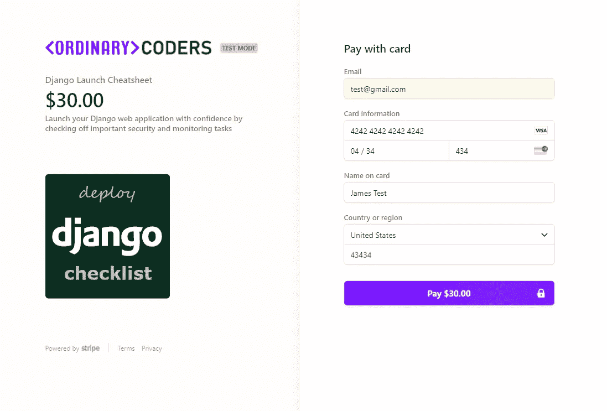
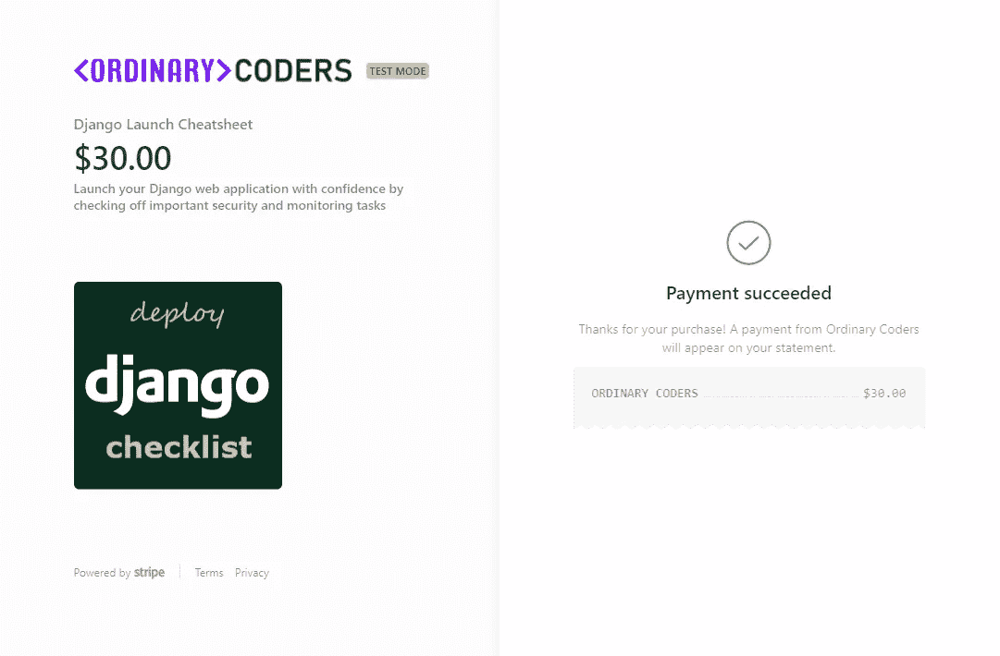

# Stripe 引入支付链接:接受无代码支付

> 原文：<https://levelup.gitconnected.com/stripe-introduces-payment-links-accept-payments-with-no-code-3dc3b364415e>

# **什么是条纹支付链接？**

最近，Stripe 宣布了一个新的无代码选项，以支付链接的形式接受支付。现在，Stripe 用户可以使用 Stripe dashboard 通过 Stripe 托管的链接快速销售产品或订阅，而不是配置后端、设计结账页面和创建支付意向来接受支付。稍后我将提供一个简短的演示，但让我们集中讨论一个鼓舞人心的创始人或企业家如何利用支付链接快速迭代和验证一个想法。

# **谁应该使用条纹支付链接？**

例如，如果你是一个创始人，想为一个机构或副业项目测试一个想法，你可能需要使用 Stripe 来接受支付。鉴于开发人员 API 的广度和集成的多样性，Stripe 与他们保持了密切的关系。然而，创建一个条纹支付链接允许企业家简单地通过电子邮件或文本发送一个支付链接来接受信用卡，而不需要网站。这使得任何人只需一个社交媒体账户或电子邮件地址就能创业！

老实说，我有点惊讶 Stripe 没有早点推出这个功能。如果你还记得的话，去年 Stripe 引入了结帐会话，这样开发者可以很容易地将用户重定向到 Stripe 托管的结帐页面。这是一个很棒的功能，它消除了你对你的结账页面是否值得信任的担忧。然而，它仍然需要一些后端工作来配置结帐页面。当然，支付链接更进一步，根本不需要编码。这是一个简单的无代码解决方案，似乎扩展了 Stripe 作为一体化支付平台的理念。

# **条纹支付链接教程**

让我们在 Stripe 仪表盘中快速创建一个产品，展示设置支付链接是多么简单。

1.访问 Stripe dashboard 并打开“测试模式”,这样您就可以在支付链接上输入测试信用卡

2.在左侧导航栏中选择“产品”。然后点击“添加产品”

3.输入产品信息并设定价格。对于我的例子，我创建了一个“Django deploy checklist”，我们可以想象它是部署前重要主题的 pdf 备忘单。

4.创建产品后，点击“创建付款链接”

5.设置支付链接选项。出于本教程的考虑，我们将使用默认选项。然后点击右上角的“创建支付链接”

6.查看您的支付链接！如果你想测试结帐页面，那么使用 4242 4242 4242 4242 作为信用卡。

# **结论**

这就是创建条纹支付链接。正如您所看到的，这是一个相当简单的过程，可以在大约 5 分钟内完成。随着创作者经济的不断扩大，Stripe 似乎对添加更多无代码工具感兴趣，以使创作者，而不仅仅是开发者，接受支付。我很想知道这对 Gumroad 等竞争产品有何影响。我没有看到像 Gumroad 这样上传实际文件的选项，但是，我相信你可以用 Zapier 自动完成这一部分。

*最初发表于*[*【https://ordinarycoders.com】*](https://www.ordinarycoders.com/blog/article/stripe-payment-links)*。*