# 具有反应和材料的条形付款表单-UI

> 原文：<https://levelup.gitconnected.com/stripe-payment-form-with-reactjs-and-material-ui-cf6fe3f0f653>


这些天来，越来越多的协会/组织正在寻找收集捐款或接收付款，所有可用的文件都与“购物车”和“结帐”有关。

如果我想让用户选择金额和货币，该怎么办？

这就是事情的原委。

> **免责声明**
> 本文绝不是由 Stripe 或 Material-UI 赞助的(尽管我希望是)。我已经使用这两个图书馆好几年了，我想是时候分享我的经验和知识了。

**本文共分 4 个部分 1 .**带材质的用户界面-UI
**2。** [创建表单](https://t.co/NiWBVDCcg5?amp=1)
**3。** [保存用户输入与 React use context](https://t.co/3nKnR4e8sC?amp=1)
**4。** [实现条纹](https://t.co/UArLhAcZDs?amp=1)

> 如果你只对如何实现 Stripe 感兴趣，直接跳到[第 4 部分](https://t.co/UArLhAcZDs?amp=1)。

有了这些，我们开始吧。以下是我们将要创建的内容:


> 懒得看全了…没问题，在这里找到完整项目[。](https://github.com/angeloron/react-material-ui-stripe-payment-form)

好了，现在让我们从书呆子气中走出来，进入有趣的部分。

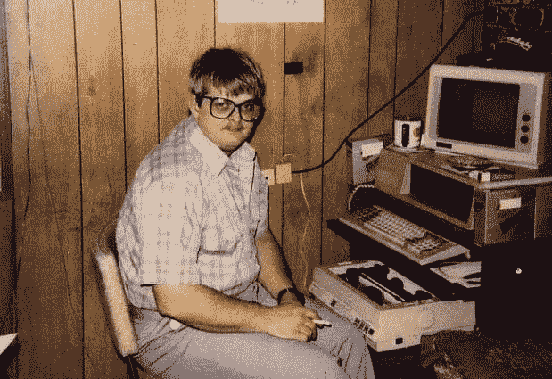

# 设置

让我们首先创建一个项目并安装所有需要的依赖项，或者在这里下载 package.json 文件。

```
npx create-react-app stripe-form
npm i @stripe/react-stripe-js @stripe/stripe-js @material-ui/core @material-ui/icons @material-ui/lab
```

对于工作流，我习惯于将组件与视图分开，并将主题和功能保存在一个固定的文件夹中。因此，在“src”文件夹中创建以下文件夹和文件。

你不必有相同的工作流程，但我就是这样做的:

```
src/
├── components/
│   └── StripeInput.js
├── constants/
│   ├── functions.js
│   └── theme.js
└── views/
    ├── Footer.js
    ├── Header.js
    ├── Main.js
    ├── Stepper.js
    ├── StepConnector.js
    ├── StepIcons.js
    └── Forms
        ├── ContactForm.js
        ├── PaymentForm.js
        └── ServiceForm.js
```

# 设计

我更像是一个前端类型的人，总是从设置主题开始，因为我希望看到我的项目以其适当的设计和 [Material-UI](https://material-ui.com) 使这一部分对我们来说很容易，因为“[createmiutheme](https://material-ui.com/customization/theming/)”不用说，我的网站必须有响应性，因此我也使用“ [responsiveFontSizes](https://material-ui.com/customization/theming/#responsivefontsizes-theme-options-theme) ”。

主题. js

清理 App.js 文件并将新主题应用到我们的应用程序中:

```
//App.js
import React from 'react';
import { ThemeProvider } from '@material-ui/styles';
import theme from './constants/theme';const App = () => <ThemeProvider theme={theme}></ThemeProvider>export default App;
```

# 页眉

*src/views/Header.js*

对于页眉，我们将使用 Material-UI 的[应用栏](https://material-ui.com/components/app-bar/#app-bar)，并使用 [makeStyles](https://material-ui.com/styles/api/#makestyles-styles-options-hook) 对其进行定制。默认情况下，我使用 ReactJS 的标志和标题的占位符:“标题在这里”，你应该把它改为你选择的标题。

我还使用了[排版](https://material-ui.com/components/typography)组件，而不是普通的< h1 >，因为自从我们将 [responsiveFontSizes](https://material-ui.com/customization/theming/#responsivefontsizes-theme-options-theme) 应用到我们的主题后，它将根据屏幕大小调整文本的大小。

同样为了保持响应，我使用了 Material-UI 中的[网格](https://material-ui.com/components/grid)，这使得 CSS 网格的实现更加容易。

请注意，我在版式上使用了 variant="h4 "和 component="h1 ",因为 h1 会太大，但出于搜索引擎优化(SEO)的目的，您希望有一个

# 作为标题。

向 App.js 文件添加头:

```
//App.js
import React from 'react';
import { ThemeProvider } from '@material-ui/styles';
import theme from './constants/theme';
**import Header from "./views/Header";**const App = () => <ThemeProvider theme={theme}>
    **<Header />**
</ThemeProvider>export default App;
```

如果还没有完成，尝试“npm 开始”,你应该有一个不错的标题。

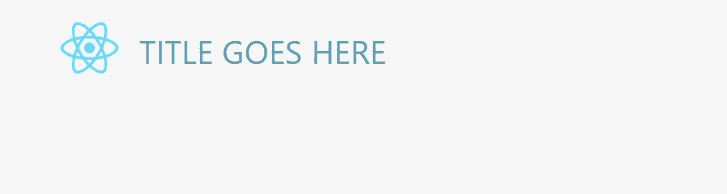

> 注意应用于 topAppBar 的 CSS:{ Height:" 20vh "，minHeight: "200px"}如果您更改这些数字，您将不得不调整我们稍后创建的主框。

# 页脚

*src/views/Footer.js*

在本文开头的原始截屏和最终源代码的链接上，您会看到“法律声明”、“隐私政策”等部分。但是我不想在这里讨论这个。你还会看到两个看似在页面中间的段落，但它们实际上是页脚的一部分，这取决于屏幕高度，你希望它与页脚保持比例。

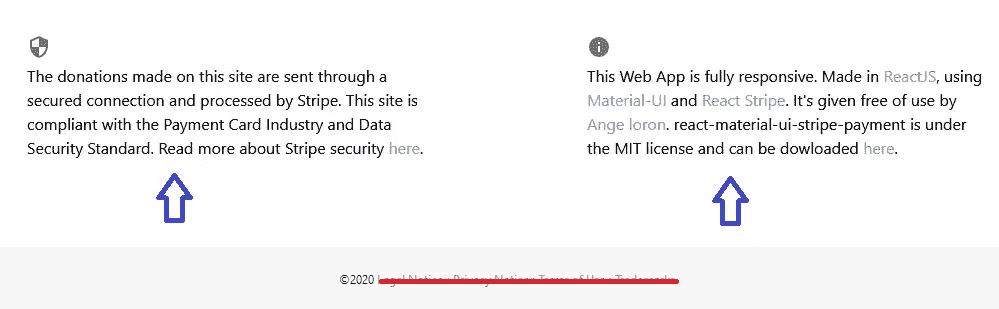

开始吧，我将使用[网格](https://material-ui.com/components/grid)用于两段，另一个 [AppBar](https://material-ui.com/components/app-bar/#app-bar) 用于版权声明。

我使用了安全和信息图标，你可以从[材质图标](https://material-ui.com/components/material-icons)中选择许多其他图标。

类似于页眉上的 H1，我将 component="footer "添加到 AppBar，因为我希望它呈现为一个

。

向 App.js 文件添加页脚:

```
//App.js
import React from 'react';
import { ThemeProvider } from '@material-ui/styles';
import theme from './constants/theme';
import Header from "./**views/**Header";
**import Footer from "./views/Footer";**const App = () => <ThemeProvider theme={theme}>
    <Header />
   ** <Footer />**
</ThemeProvider>export default App;
```

在这一点上，很明显你在页眉和页脚之间遗漏了一些东西。

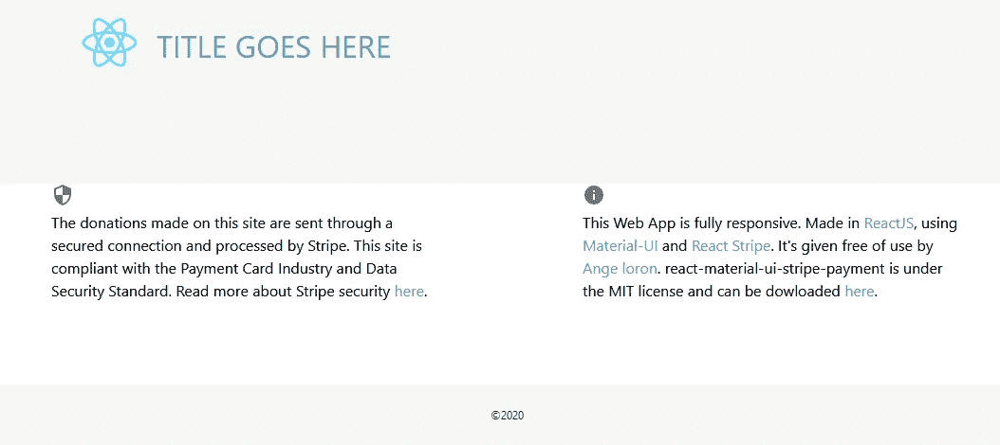

# 主要的

*src/views/Main.js*

首先，我将添加一个[框](https://material-ui.com/components/box)——这是一个简单的< div >包装器，并使用它来设置该组件的最小高度，以便页脚最低限度地位于页面底部(这显然取决于您的屏幕大小，如果您喜欢，您可以添加位置:固定到您的页脚)。

然后，我添加了一个[容器](https://material-ui.com/components/container/)，它确保组件能够响应，并在每个屏幕尺寸上正确居中。

有了这一套，我只是错过了[纸](https://material-ui.com/components/paper)组件添加一个漂亮的阴影到整个事情。

将这个新组件添加到 App.js:

```
//App.js
import React from 'react';
import { ThemeProvider } from '@material-ui/styles';
import theme from './constants/theme';
import Header from "./**views/**Header";
import Footer from "./**views/**Footer";
**import Main from "./views/Main";**const App = () => <ThemeProvider theme={theme}>
     <Header />
     **<Main />**
     <Footer />
</ThemeProvider>export default App;
```

你会看到这片神奇的白色空间:

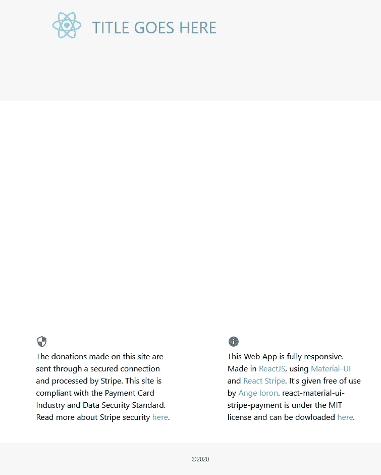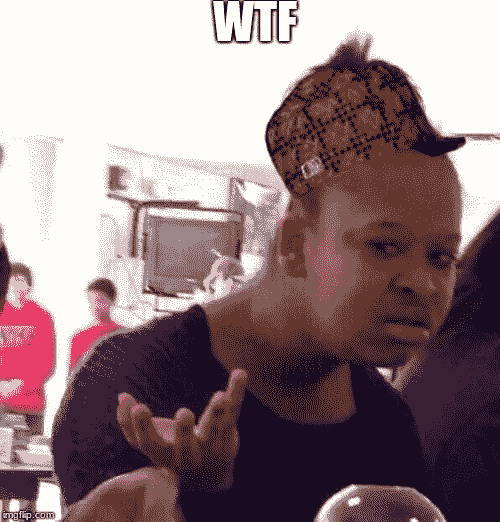

是的，我知道，没有性感的影子，没有盒子，什么都没有…不要担心它在那里，但只是缺少内容。

# 跳舞者

*src/views/Stepper.js*

在我看来，Material-UI 的 [stepper](https://material-ui.com/components/steppers/#customized-stepper) 组件可能是该库中最复杂的组件。我不得不定制它以适应整体设计。为了保持有序，我把图标和连接器放在不同的文件中。

通过在步进器中添加 3 个步骤和一个放表格的容器来渐变。

我再次为 CSS 使用了 makeStyles，并用框和网格的组合来包装表单。

我将步进器的高度设置为与标题成比例，并从在 theme.js 中创建的主题对象中获取背景色

我创建了一个空的可迭代数组来循环 3 次，因为我的步进器上有 3 步。

最后，您应该开始在应用程序上看到一些内容:

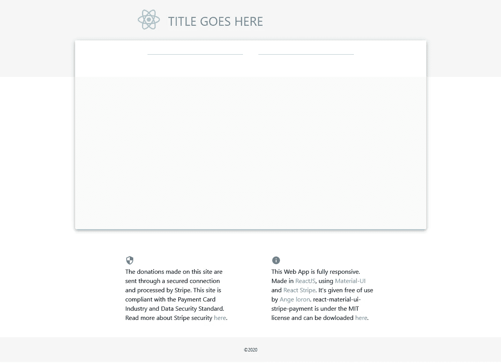

是时候添加图标和连接器了

# 阶梯图标

*src/views/StepIcons.js*

这次我选择了联系人邮件、信息和支付图标，但是你也可以从[材料图标库中选择任何你想要的图标](https://material-ui.com/components/material-icons/)。

在下面的代码中，你会看到使用 clsx，对于那些不知道的人来说，这个小函数允许我方便地使用多个类名。

向 Stepper.js 添加 StepIcons 和 StepLabel

```
//Stepper.js
import React from 'react';                       import { makeStyles } from '@material-ui/core/styles';                       import {
     Stepper,
     Step,
     **StepLabel,**
     Box,
     Grid,
} from '@material-ui/core';
**import StepIcons from "./StepIcons";**[...]<Stepper alternativeLabel className={classes.stepper}>
{/* Change the number of loops here based on StepContent */}
[1, 2, 3].map(e => <Step key={e}>
     **<StepLabel StepIconComponent={StepperIcons} />**
</Step>
)}
</Stepper>
```

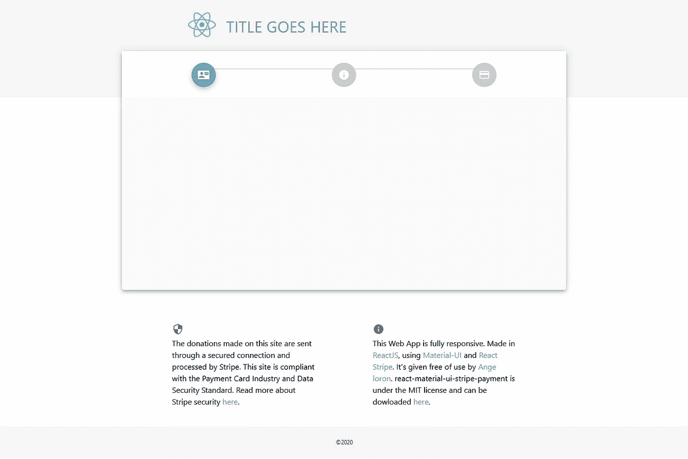

如你所见，连接器不合适，因此这是下一步要处理的事情。

# 阶梯连接器

*src/views/step connector . js*

[StepConnector](https://material-ui.com/api/step-connector/) 是 Material-UI 的一个组件，我们将使用[和](https://material-ui.com/guides/typescript/#usage-of-withstyles)重新设计。

将 StepConnector 添加到 Stepper.js

```
**import StepConnector from './StepConnector'**[...]return <>
<Stepper alternativeLabel className={classes.stepper} **connector={<StepConnector />}**>
     {/* Change the number of loops here based on StepContent */}
     {[1, 2, 3].map(e =>
          <Step key={e}>
              <StepLabel StepIconComponent={StepperIcons} />
          </Step>)}
</Stepper>
```

你最终会为我们的踏步机得到一个漂亮的头球。

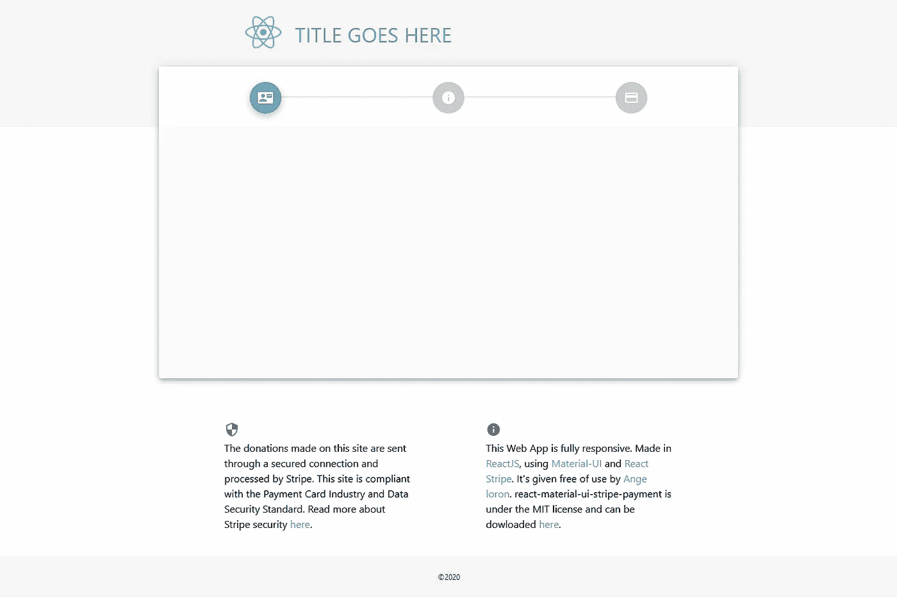

现在是时候创建一个在这些步骤之间切换的函数了…

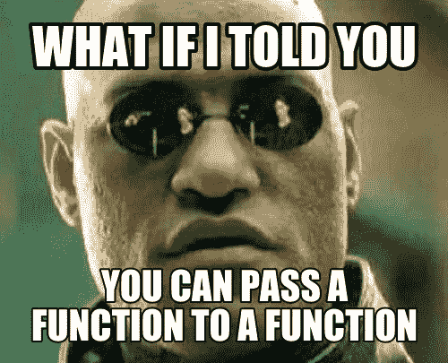

让我们回到 Stepper.js

# 跳舞者

*src/views/Stepper.js*

我们需要添加一个状态来查看哪个步骤当前是活动的。首先从 react 导入 useState。

```
import React**, { useState }** from "react";
```

并在步进器功能中添加“activeStep”状态:

```
const Steppers = () => {
**const [activeStep, setActiveStep] = useState(0)** //step 0 by default
```

Stepper 组件有一个 activeStep 属性，用于更新图标和连接器，所以让我们更新它。

```
<Stepper alternativeLabel className={classes.stepper} connector={<StepConnector />} **activeStep={activeStep}**>
```

现在，如果您将状态更改为 1“use state(1)”，您将会看到下一个图标会高亮显示。

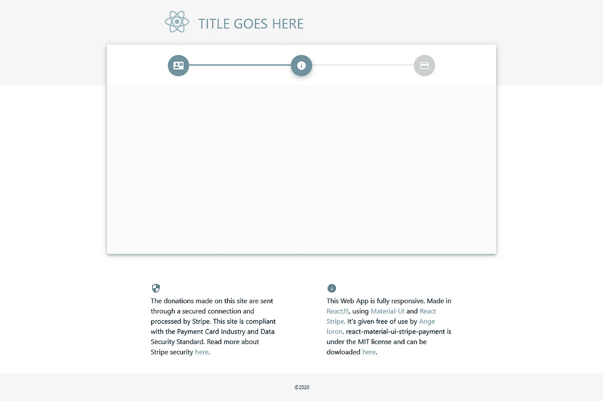

为了让用户与这些图标交互，我们将添加 2 个按钮。

首先将“Button”导入到@material-ui/core 中

```
import {
     Stepper,
     Step,
     StepLabel,
     Box,
     Grid,
     **Button**
} from '@material-ui/core';
```

给按钮添加一些样式

```
const style = makeStyles(theme => ({
 **button: {
         marginRight: theme.spacing(1),
    },**    mainBox: {...
```

在网格组件外部和框内部添加两个按钮。一个按钮是向前移动，另一个是向后移动。

```
 </Grid>
     <Button disabled={activeStep === 0} className={classes.button}>
        Back
     </Button>
     <Button variant="contained" color="primary" className={classes.button}>
         {activeStep === 2 ? 'Pay' : 'Next'}
     </Button>
</Box>
```

如果活动步骤是第一步，则后退按钮被禁用，如果活动步骤是最后一步(在本例中为 2)，则文本变为“支付”，因为最后一个按钮将启动支付。

在这一点上，你应该有两个漂亮但无用的按钮在你的步进器的底部。

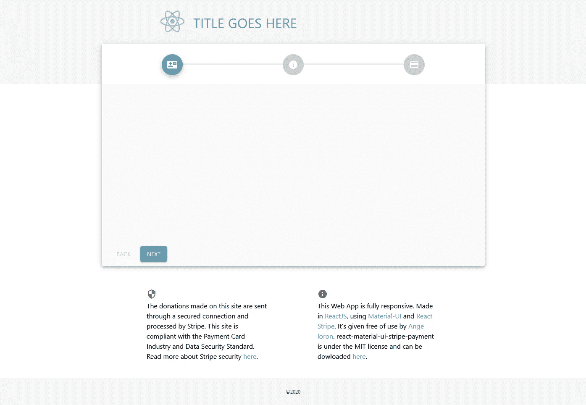

是时候创建一些函数来让这些按钮与步进器交互了。我们将创建两个函数:“handleNext”和“handleBack”。

```
const handleNext = () => setActiveStep(prevActiveStep => prevActiveStep + 1);
const handleBack = () => setActiveStep((prevActiveStep) => prevActiveStep - 1);
```

将这些函数添加到每个按钮上的 onClick 侦听器中:

```
<Button disabled={activeStep === 0} className={classes.button} onClick={handleBack}>
     Back
</Button>
<Button variant="contained" color="primary" className={classes.button} onClick={handleNext}>
     {activeStep === 2 ? 'Pay' : 'Next'}
</Button>
```

就这样，奇迹发生了！现在，您可以在这些步骤之间导航。

但是有一个问题…一旦你按下“支付”按钮就会变成“下一步”，其他什么也不会发生。这是因为我们没有写当用户完成这两个步骤时必须做什么。

当用户完成支付后，你会希望有一个感谢信息，也许是一个“重置”按钮，返回退出表单。

现在，我们将创建一个简单的“重置”按钮，它带有一个 onClick listenner，可以将 activeStep 改回 0，并且该按钮应该只在 activeStep = 3 时出现(即:当用户完成支付时)。

让我们首先在“handleNext”和“handleBack”函数之后创建一个“handleReset”函数:

```
const handleNext = () => setActiveStep(prevActiveStep => prevActiveStep + 1);
const handleBack = () => setActiveStep((prevActiveStep) => prevActiveStep - 1);
**const handleReset = () => setActiveStep(0);**
```

然后添加一个内联 if 语句，检查 activeStep 是否等于上一步(本例中为 3)。

```
{
activeStep === 3
?
<Button onClick={handleReset} className={classes.button}>
     Reset
</Button>
:
<>
     <Button disabled={activeStep === 0} className={classes.button} onClick={handleBack}>
          Back
     </Button>
     <Button variant="contained" color="primary" className={classes.button} onClick={handleNext}>
          {activeStep === 2 ? 'Pay' : 'Next'}
     </Button>
</>
}
```

总结一下，Stepper.js 应该是这样的:

这是第一部分，你现在有了页面的基本布局和一个功能步进器。

完成后，让我们进入第 2 部分:

[](https://t.co/NiWBVDCcg5?amp=1) [## 带反应和材料的条纹支付表单-ui -第 2 部分

### 一个语言很重要的地方

t.co](https://t.co/NiWBVDCcg5?amp=1)