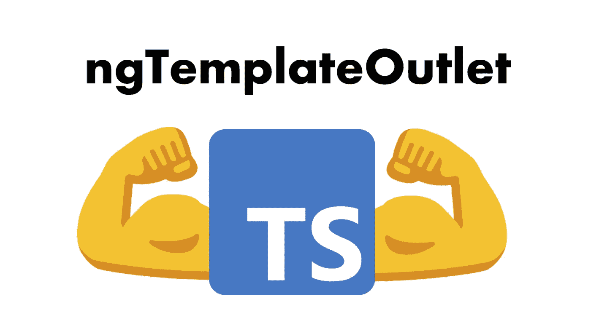
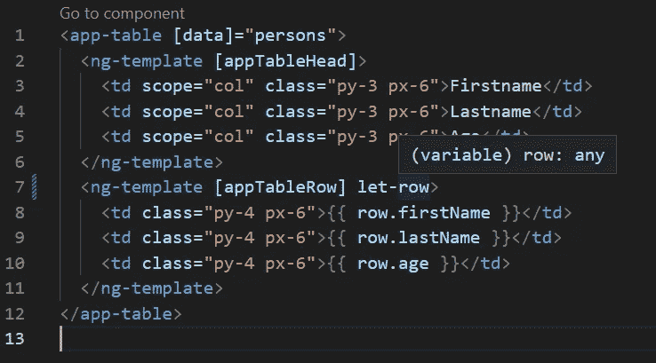

# 强类型 ngTemplateOutlet

> 原文：<https://levelup.gitconnected.com/strongly-typed-ngtemplateoutlet-3a3b55057e50>

## 泛型，ngTemplateContextGuard，指令



ngTemplateOutlet 可用于将内容投影到组件中，因此通用组件(如表格)通常会使用它们。但是实现强类型并不简单，需要一些小的 TypeScript 技巧。

[](https://ng-journal.com/blog/2022-11-28-strongly-typed-ng-template-outlet/) [## 强类型 ngTemplateOutlet

### 下面，您可以看到一个非常基本的通用表的代码，该表利用 ngTemplateOutlet 可重用于…

ng-journal.com](https://ng-journal.com/blog/2022-11-28-strongly-typed-ng-template-outlet/) 

# 松散类型表

下面，您可以看到一个非常基本的通用表的代码，该表利用了*ngtemplateeoutlet*来重用各种用例。

```
<div class="overflow-x-auto relative">
  <table class="w-full text-sm text-left text-gray-500 dark:text-gray-400 table-fixed">
    <thead class="text-xs text-gray-700 uppercase bg-gray-50 dark:bg-gray-700 dark:text-gray-400">
      <tr>
        <ng-container
          *ngTemplateOutlet="tableHead"
        ></ng-container>
      </tr>
    </thead>
    <tbody>
      <tr *ngFor="let row of data" class="bg-white border-b dark:bg-gray-800 dark:border-gray-700">
        <ng-container
          *ngTemplateOutlet="tableRow; context: { $implicit: row }"
        ></ng-container>
      </tr>
    </tbody>
  </table>
</div>
```

```
export class TableComponent {
  @Input() data!: any;
  @ContentChild('tableHead') tableHead!: TemplateRef<any>;
  @ContentChild('tableRow') tableRow!: TemplateRef<any>;
}
```

你可能已经发现了一些代码气味。比如*任何*类型。或者是用于*的 ContentChild* 的静态字符串选择器。

# 1.无商标消费品

首先，让我们删除任何类型的数据。为此，我们可以使用泛型类型，并确保该类型是一个对象数组，方法是使用下面的代码。我们知道，T 是一个对象，然后数据的类型是这个类型的数组。当涉及到从泛型推断类型时，TypeScript 是非常智能的，因此我们不需要做任何额外的事情。仅仅通过给数据赋值就可以推断出 t 的类型。

```
export class TableComponent<T extends object> {
  @Input() data!: T[];
  @ContentChild('tableHead') tableHead!: TemplateRef<any>;
  @ContentChild('tableRow') tableRow!: TemplateRef<any>;
}
```

# 2.指令

另一个代码味道是 ContentChild 中的静态字符串，它从模板中选择子元素。显然，这很容易出错，因为模板中的重构不会重构这个字符串。或者只是字符串中的一个简单的输入错误不会立即发出错误。

但是我们可以使用自定义指令来选择子元素，这样我们就可以摆脱字符串选择器。因此，我为每个 ContentChild 创建了一个指令。

```
@Directive({
  selector: 'ng-template[appTableHead]'
})
export class TableHeadDirective {
  constructor() { }
}
```

table-head.directive.ts

```
export class TableComponent<T extends object> {
  @Input() data!: T[];
  @ContentChild(TableHeadDirective, {read: TemplateRef}) tableHead!: TemplateRef<any>;
  @ContentChild(TableRowDirective, {read: TemplateRef}) tableRow!: TemplateRef<any>;
}
```

表.组件. ts

# 3.ngTemplateContextGuard

虽然这段代码已经简洁了很多，但是在实例化表的组件的 ng-template 中存在一个主要缺陷。通过 ngTemplateOutletContext 传递的隐式变量是 any 类型的，因此访问 ng-template 内部的属性根本不是类型化的，因此很容易出错。这个问题应该得到解决，但这绝对是重构中最棘手的部分。



为了推断正确的类型，我们可以使用已经创建的指令，并结合使用泛型和名为 ngTemplateContextGuard 的静态方法。此方法使用带有 is 关键字的类型谓词，用于保护上下文的类型。

```
interface Row<T extends object> {
  $implicit: T
}
```

```
@Directive({
  selector: 'ng-template[appTableRow]'
})
export class TableRowDirective<T extends object> {
  @Input() appTableRow!: T[]; constructor() { } static ngTemplateContextGuard<TContext extends object>(
    directive: TableRowDirective<TContext>,
    context: unknown
  ): context is Row<TContext> {
    return true;
  }}
```

表-行.指令. ts

```
<app-table [data]="persons">
  <ng-template [appTableHead]>
    <td scope="col" class="py-3 px-6">Firstname</td>
    <td scope="col" class="py-3 px-6">Lastname</td>
    <td scope="col" class="py-3 px-6">Age</td>
  </ng-template>
  <ng-template [appTableRow]="persons" let-row>
    <td class="py-4 px-6"></td>
    <td class="py-4 px-6"></td>
    <td class="py-4 px-6"></td>
  </ng-template>
</app-table>
```

app.component.html

通过向具有泛型类型的指令添加输入，该指令知道传递给表的类型。这需要使用静态上下文保护来推断上下文变量的类型，该静态上下文保护用于使用类型谓词断言类型。由于上下文保护是一个静态方法，它不能简单地重用指令的泛型类型，必须定义自己的泛型类型。

# 向约书亚·莫罗尼大喊

这篇博文的灵感来源于约书亚·莫罗尼关于这个问题的非常棒的 YouTube 视频。我推荐你去看看:[约书亚·莫罗尼的 YouTube 视频](https://www.youtube.com/watch?v=dau7kQMdH4A&ab_channel=JoshuaMorony)

# 谢谢你🤗

感谢您阅读本文！我希望你喜欢它，并能学到一些新的和有趣的东西。
如果你还有任何问题，不要犹豫，通过 [Twitter](https://twitter.com/StefanvHaas) 或 [LinkedIn](https://www.linkedin.com/in/stefan-haas-686a921b4/) 联系我进行讨论。
**还没订阅？向下滚动，不要再错过任何新文章。**

**阅读全文**[**ng-journal.com**](http://ng-journal.com)

[](https://ng-journal.com/blog/2022-11-28-strongly-typed-ng-template-outlet/) [## 强类型 ngTemplateOutlet

### 下面，您可以看到一个非常基本的通用表的代码，该表利用 ngTemplateOutlet 可重用于…

ng-journal.com](https://ng-journal.com/blog/2022-11-28-strongly-typed-ng-template-outlet/)