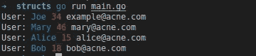

# Go 中的结构字段标记

> 原文：<https://levelup.gitconnected.com/struct-field-tags-in-go-fcc2428a1f91>

## 向数据中添加元信息。


安妮·斯普拉特在 [Unsplash](https://unsplash.com/s/photos/tags?utm_source=unsplash&utm_medium=referral&utm_content=creditCopyText) 上拍摄的照片。

Go 不是纯粹的面向对象编程语言。它不提供类，但是它提供了[结构](https://golang.org/ref/spec#Struct_types)。

如[语言规范](https://golang.org/ref/spec#Struct_types)所述:

> 结构是一系列命名元素，称为字段，每个字段都有一个名称和一个类型。

当您想要为数据定义一个由不同属性(字段)组成的模式时，可以使用 struct。

可以识别一个字段:

*   显式:和上面的`Person`结构一样，所有的字段都在同一个结构中声明。
*   隐式:和在`User`结构中一样，它嵌入了来自`Person`结构的字段。它也称为嵌入字段。您可以像在结构本身内部声明一样访问它们。

# 标签

每个字段后面可以跟一个可选的字符串文字，称为*标签*。该标签将成为该字段的属性。

这是为结构添加元信息的一种方式。您的包或外部包可以使用这些信息，以便它们知道如何执行给定的操作或正确处理数据。

这个元数据使用格式为`key:"value"`的字符串来声明，并由空格分隔。也就是说，在同一个字段中可以有多个标签，服务于不同的目的和库。

```
type T struct {
  Field fieldtype `key1:"value1" key2:"value2"`
}
```

每个包都有自己的`key`名称，通常是包本身的名称。

一些使用示例:

*   编码/解码目的(如`[json](https://golang.org/pkg/encoding/json/)`和`[xml](https://golang.org/pkg/encoding/xml/)`包)；
*   ORM(像 [Beego](https://godoc.org/github.com/astaxie/beego/orm) 和[Gorm](https://github.com/jinzhu/gorm))；
*   验证(像这里的)；
*   配置管理；
*   结构的默认值。

# 反射

为了实际访问标签并使用它们，您必须使用`[reflect](https://golang.org/pkg/reflect/)`包。

如果使用常规格式，我们可以使用两种方法`[StructTag](https://golang.org/pkg/reflect/#StructTag)`来检索关于标签的信息，`Get`和`Lookup`。

> **注意**:`Lookup`方法返回一个额外的值`ok`，指示标签是否在字段中被找到。

# 例子

让我们创建一个如何使用它的例子。

在我们的例子中，让我们创建一个名为`color`的标签，它将指示我们要打印字段的颜色。为了简单起见，唯一可用的颜色是`blue`、`red`和`yellow`。

> **注意**:对于这个例子，我使用的是包`[color](https://github.com/fatih/color)`。

函数`PrintWithColor`将为我们完成这项工作。它接收一个对象并检查标签`color`的所有字段。如果找到它，它将为控制台设置适当的颜色并打印该值。如果没有，它只是打印值。

如果运行它，您可能会得到如下结果:



当然，这个例子很简单，但是你可以得到在结构中使用标签的想法。更高级的使用，可以查看`[json](https://golang.org/pkg/encoding/json/)`包。

# 结论

结构是 Go 语言的重要组成部分，也是表示数据的强大方法。

使用字段标签，您可以向字段添加功能，或者将它们配置为您想要的行为。

这将使你的代码更整洁，可读性更强。