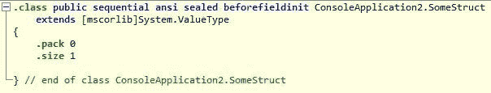

# 结构和继承

> 原文：<https://levelup.gitconnected.com/structs-and-inheritance-7314fde68c22>

## 为什么结构不支持继承？

[JJ 英](https://unsplash.com/@jjying)在 [Unsplash](https://unsplash.com/) 上拍照

如果您定义了一个与下面类似的结构:

您将看到它具有以下 CLI 代码:

我们可以看到它被标记为`sealed`，意思是不能继承，它`extends` `System.ValueType`

正如我们所看到的，struct 只是一个从`System.ValueType`继承的类，不能被继承。

# 为什么不能继承？—因为数组

它不能被继承的原因和数组有关。

出于性能和垃圾收集的原因，值类型的数组是“内联”存储的。

如果你有`new Foo[3]{}`，如果`Foo`是一个引用类型，你会有 4 个对象，一个用于数组，3 个用于数组的元素。

但是如果`Foo`是一个值类型，你将有一个数组对象，所有的元素都将与该对象内联存储。

假设您有以下代码:(感谢 jonp 的例子)

如果结构支持继承，坏事就开始发生了。

问题是`Double()`对`Derived`一无所知。它将只使用指针算法来访问数组的每个元素，递增一个常量(`sizeof(A)`)。

所以，如果这真的发生了，我们会有内存损坏的问题。具体来说，在`Double()`中，`values[1].A*=2`实际上会修改`values[0].B`！