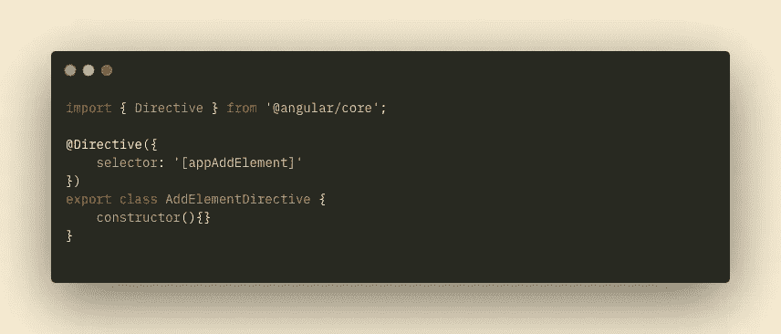
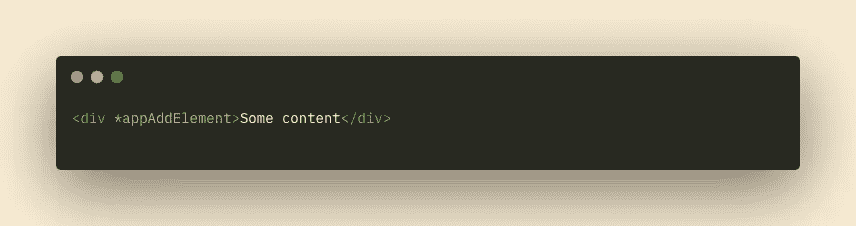

# 角度中的结构指令

> 原文：<https://levelup.gitconnected.com/structural-directives-in-angular-58f1054b674>

## 角度结构指令简明指南

由[托阿·海夫蒂巴](https://unsplash.com/@heftiba?utm_source=medium&utm_medium=referral)在 [Unsplash](https://unsplash.com?utm_source=medium&utm_medium=referral) 上拍摄的照片

你可能对 Angular 内置结构指令比较熟悉: [ngFor](https://angular.io/api/common/NgForOf) 、 [NgIf](https://angular.io/api/common/NgIf) 、 [NgSwitch](https://angular.io/api/common/NgSwitch) 。但是它们是如何工作的，它们有什么性质，幕后发生了什么？

在这篇文章中，我想做一个关于结构指令的小指南，展示当你使用指令时模板中发生了什么，以及在结构指令中使用装饰属性`exportAs`的情况。

## **角度指令简短指南**

角度指令用于改变 DOM 元素的外观或行为。有三种类型的指令:

1.  *组件*(自带模板)；
2.  *结构化*，改变 DOM 树的结构；
3.  *属性*改变 DOM 元素的外观或默认行为。

属性指令和结构指令有什么区别？结构化指令不仅可以改变元素的属性，还可以在 DOM 中删除或添加元素。另外，都是以*符号开头的(*ngFor，*ngIf 等)。

## **创建我们自己的结构指令**

例如，让我们创建自己的简单结构化指令 *addElement* ，它将向页面添加一个元素。

创建一个指令看起来就像是使用 *@Directive* 属性的一个类，其中我们有一个选择器来描述我们的指令添加到任何元素时的样子。

让我们将我们的指令添加到一些元素中。非常简单:将我们的新指令添加到组件模块中的声明对象，并将我们的指令挂在模板中的元素上。

现在回到指令的类本身，因为它是一个结构化指令，那么我们可以将以下服务注入到构造函数中:

我们的带有注入服务的指令类

**TemplateRef** 是一个用特殊的< ng-template / >标签包装的视图。对我们来说，这是我们悬挂指令的<分区>。稍后我会解释< ng-template / >与此有何关联。

ViewContainerRef 是我们指令的包装器。

现在，如果我们决定在浏览器中用 *appAddElement* 指令检查我们的元素。那么我们将什么也看不到，因为我们创建了一个结构化的指令，它会立即将我们的元素抛出 DOM。

为了解决这个问题，让我们通过 OnInit 方法中的容器来添加模板。

在 ngOnInit 中添加模板的指令类

现在，我们可以在浏览器中看到包含内容的 div。但是到目前为止看起来并不有趣。让我们考虑一些可以用指令实现的特性。

## **指令中的输入**

您可以向指令传递输入参数，就像在组件中一样。此外，为了简单起见，您可以将指令的名称作为输入。让我们在指令中添加逻辑，通过超时显示元素，并通过输入参数传递超时时间。

我们的带有输入参数的指令类

然后，当我们调用我们的指令时，我们将延迟秒数作为输入参数传递:

结构指令通过传递输入参数进行调用

正如预期的那样，在浏览器中，我们将看到我们的 div 在 3 秒钟后出现。

## **快速看一下在 Angular 的引擎盖下结构指令是如何工作的**

当有角度时看到下面的代码:

结构指令正常调用

它把一切都包装在<ng-template>标签中</ng-template>

在<ng-template>本身上，Angular 用这个名字放了一个简单的指示属性:</ng-template>

结构指令调用时不使用*

上面的符号与使用*的结构化指令的常用符号完全相同。

但是现在您可以看到先前在构造函数代码行中声明的到底是做什么的了:

**私有模板:TemplateRef < any >**

这是我之前写的 ng-template 标签的内容。

在构造函数中声明的 **ViewContainerRef** 是< ng-template >标签本身作为我们指令的包装器。

现在我想很明显，在结构指令中使用*只是一种语法糖，帮助我们有一个更短的指令符号。

## **ExportAs decorator 属性并与结构指令一起使用**

最后，我想指出一个非常有用的属性 **exportAs** ，它允许我们在附加指令的元素之外使用指令的类。在这种情况下，我们可以在使用该指令的组件模板中直接调用该指令的方法。

应该注意的是， **exportAs** 属性更常用于属性指令，但是现在我们将使用我们的结构指令的例子来看它的操作。

但是有一些限制。为了能够使用带有结构指令的 **exportAs** 属性，我们需要在**的**表单中使用不带 ***** 符号的结构指令

现在让我们稍微改变一下指令的逻辑——让我们将显示内容的逻辑从 ngOnInit 移到一个单独的方法中。并且还将 **exportAs** 属性添加到@Directive decorator 中，也就是说，我们将导出一个名为“addElement”的指令类。

我们的带有新方法 switchElement()的指令类

现在让我们继续调用我们的指令，正如我前面说过的，为了能够使用 exportAs，我们必须以**去糖**形式应用指令——没有*符号。现在，通过点击按钮，我们将从我们的指令类中直接调用 **switchElement()** 方法，切换 div 内容的可见性。

结构指令调用时不使用*

感谢阅读！我希望这篇文章是有用的，并且揭开了 Angular 中结构指令如何工作的神秘面纱。在我的下一篇文章中再见！