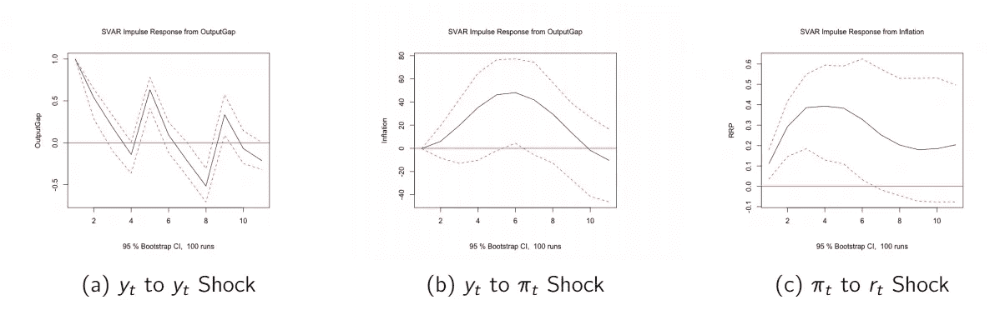

# 结构向量自回归简介

> 原文：<https://levelup.gitconnected.com/structural-vector-autoregression-in-r-5d6dbfc56499>


## **结构向量自回归**是一个非常灵活的工具，特别是对于分析实体经济的政策行为。

# 概观

结构风险值是无限制风险值模型的一种变体，它是一种预测系统中多个变量的方法。在常规的无限制风险值中，我们允许数据自己说话和行动，而另一方面，结构性风险值会施加关键限制，为某些变量的行为设定条件。

# 结构风险值的用途

结构风险值用于两个主要的宏观经济政策考虑，即财政政策和货币政策。

**财政政策**:假设政府预计封锁或隔离措施会导致私人需求减少。它可能试图对影响关键变量的事件序列进行建模，因此，该结构本质上是对反应时间线进行建模。例如，假设检疫措施减少了私人需求。政府将增加公共开支，从而增加赤字。然而，产量继续下降。增加一个结构可以防止得出政府支出增加导致产出下降的结论，这是一个错误的结论。这是你在常规无限制 VAR 中可以预期的一些结论。

**对于货币政策**:假设央行预期通货膨胀会有所上升。为了抑制这种增长，央行可以提高其主要政策利率。然而，恰好通货膨胀继续增加。与财政政策一样，使用 SVAR 可以防止我们得出结论，即提高政策利率会增加通胀，这也是错误的。增加一个结构就增加了限制，这实质上创建了一个先验的时间线，我们的模型通过这个时间线来表现。

我们将使用与 VAR 大致相似的方法，但是增加了一些对值的限制和更多的条件。这些限制基于经济基础或支撑直觉或理论。幸运的是，R 中有一个用于这个目的的命令库。对于我们的例子，我们将处理三个变量，即产出缺口(y)，通货膨胀率(pi)和利率(RRP)即(r)。

# 预赛

和往常一样，我们首先加载和安装包，将变量转换为时间序列对象，以图形方式查看这些变量，并检查一些一般条件。我们从加载和安装所需的包开始。像往常一样，我们将使用 *library()* 命令加载包，并使用 *install.packages()* 命令进行安装。

```
library(urca)
library(vars)
library(tseries)
library(TSstudio)
library(forecast)
library(tidyverse)
library(svars)
```

我们加载我们的数据集，这是 SVAR _ 菲律宾. csv 文件。这包含了我们从 2000 年 Q1 到 2020 年第一季度的研究数据。该数据的频率是每季度一次。除了作者使用卡尔曼滤波技术估计的输出差距之外，所有数据点均可在 BSP 网站上获得。该文件可以在下面的链接中找到。[https://drive . Google . com/drive/folders/11 max h0 trxjuf 1y _ yh-AJXgxulHQwcBEn？usp =共享](https://drive.google.com/drive/folders/11mAXh0trxjuf1y_yh-AJXgxulHQwcBEn?usp=sharing)

```
macro <- read_csv(file.choose())
head(macro)
```

加载数据集后，我们需要将变量转换成可用于 SVAR 的时间序列变量。像往常一样，我们使用 ts()命令来做这件事。

```
y <- ts(macro\$`Output Gap`, start = c(2000,1,1), frequency = 4)
pi <- ts(macro\$CPI, start = c(2000,1,1), frequency = 4)
r <- ts(macro\$RRP, start = c(2000,1,1), frequency = 4)
```

和往常一样，我们可以使用 *ts_plot()* 命令绘制每个时间序列。重要的是将系列可视化，以验证系列的加载，并获得对某些特征的感觉。您可以选择使用 *ts_decompose()* 命令来查看更好的分解。在标题图像中可以看到系列图。

```
ts_plot(y, title = "Output Gap", Xtitle = "Time", Ytitle = "Output Gap")ts_plot(pi, title = "Inflation Rate", Xtitle = "Time", Ytitle = "Inflation Rate")ts_plot(r, title = "Overnight Reverse Repurchase Rate", Xtitle = "Time", Ytitle = "RRP")
```

# 在 SVAR 设置限制

我们现在将通过添加限制来区分 VAR。我们需要建立约束矩阵，然后通过使用上一节讨论的递归排序法来估计结构系数。

我们现在到了 SVAR 分析的关键部分，即设定限制矩阵的值。正如我们已经说过的，这个矩阵是影响系统中变量的同期冲击的矩阵。在确定系数时，我们需要设置限制条件，而这些限制条件是由经济学原理定义的。在我们将要构建的矩阵中，我们将施加这样的行为:如果 *r* 是政策利率，我们可以说 *r* 的反应或变动将归因于同一时期 *pi* 和 *y* 的冲击。我们将构建矩阵，使得政策利率 *r* 仅滞后影响 *pi* 和 *y* 。因此，我们将矩阵公式化为以下形式。


限制矩阵

这一限制表明， *y* 的同期冲击会影响同期的 *pi* 和$r$以及系统中的滞后值。此外， *pi* 冲击只会同时影响 *r* 而不会影响 *y* 。同样，它也会影响系统中的滞后值。最后 *r* 不会同时影响 *y* 和 *pi* 但会影响系统中的滞后值。我们首先将一个矩阵定义为对象“amat”，并在代码中设置条件。

```
amat <- diag(3)
amat[2,1] <- NA
amat[3,1] <- NA
amat[3,2] <- NA
amat
```

命令创建一个 3×3 的单位矩阵。接下来的三个命令修改下面的三角形，使其值为 NA。本质上，我们是在识别可以任意取值的参数。因此，在我们估计之后，NA 将被填满。同时，我们将上面的三角形保留为零，它代表我们施加的限制，类似于我们在矩阵中预先指定的经济直觉。

# 构建模型

在此之后，我们现在将指定我们想要的排序。为了反映我们限制的经济直觉，我们必须首先遵循产出缺口的顺序，然后是通货膨胀，最后是政策利率。再一次，把这个 Choleskey 排序想象成事件的时间线或者事件的顺序。

```
sv <- cbind(y, pi, r)
colnames(sv) <- cbind(“OutputGap”, “Inflation”, “RRP”)
```

我们现在继续使用 *VARselect()* 命令来确定滞后排序。由于这是季度数据，我们预计滞后顺序约为 4 到 6。

```
lagselect <- VARselect(sv, lag.max = 8, type = "both")
lagselect$selection
lagselect$criteria
```

根据 AIC、SBIC、HQIC 和 FPE 的情况，似乎主要的滞后顺序是五个滞后。因此，让我们建立一个有 5 个滞后的模型。

为了估计 SVAR，我们首先需要估计一个简化形式的 VAR，这就是为什么我们在这里有一个 VAR()估计。同样，我们将滞后的数量设置为 5。之后，我们使用 SVAR()命令，并将 amat 选项设置为我们的 Amat 对象。这样做应该会产生我们估计的 SVAR 限制矩阵。

```
Model1 <- VAR(sv, p = 5, season = NULL, exog = NULL, type = "const") SVARMod1 <- SVAR(Model1, Amat = amat, Bmat = NULL, hessian = TRUE, estmethod = c("scoring", "direct"))SVARMod1
```

如果你这样做是正确的，你应该看到，我们估计我们的结构参数为 0.21，0.09 和-0.11，这可以作为估计的限制矩阵。

# 政策应用

我们现在将继续 SVAR 的应用。在此之前，您应该首先诊断 VAR，类似于我们在上一节中使用的步骤。在这一部分，我们将主要关注两个主要的应用，即脉冲响应函数和预测误差方差分解。

我们将聚焦于直觉如何在构建 IRF 中发挥作用，并观察政策利率 *r* 将如何应对系统中的冲击。要运行 IRF，我们只需使用 *irf()* 命令，按照我们的意愿设置脉冲和响应。由于系统中有三个变量，因此总共有九(3)个可能的 IRF。我们将聚焦在三个问题上，我希望你能清楚地理解基于我们强加的限制的反应。

```
SVARog <- irf(SVARMod1, impulse = "OutputGap", response = "OutputGap")plot(SVARog)SVARinf <- irf(SVARMod1, impulse = "OutputGap", response = "Inflation")plot(SVARinf)SVARrrp <- irf(SVARMod1, impulse = "Inflation", response = "RRP")plot(SVARrrp)
```



脉冲响应函数

脉冲响应非常直观。如果产出缺口中的冲击启动了这一序列，预计会加大产出缺口。产出缺口的增加增加了通胀缺口，这意味着经济产出超过了潜在预期，这可能导致经济过热。随着生产率继续提高，这种高于预期的产出缺口将推高通胀。由于中央银行看到产出缺口增加和通货膨胀增加，它可以通过增加 RRP 来适应这些，这正是在窗口(c)中看到的。这是典型的中央银行的货币反应，并得到了我们的 SVAR 的证实。

我们将转向 SVAR 的 FEVD 分解。为此，我们使用 *fevd()* 命令并提前设置一个地平线。在这种情况下，我们将其设置为提前十个周期。然后我们使用 *plot()* 命令绘制数值，如下图所示。

```
SVARfevd <- fevd(SVARMod1, n.ahead = 10)
SVARfevd
plot(SVARfevd)
```


预测误差方差分解

如果你会注意到，产出缺口的 FEVD 纯粹是由产出缺口来解释的。这只是因为我们先点了这个。如果你会看到其他变量的冲击，它们反映了预测误差方差分解的大部分是因为我们将该变量作为顺序中的第一个。

总的来说，我希望你能看到如何添加一个结构到 VAR 中，这是我们施加的不同限制，能够产生一个关键的政策结果。因此，我希望你能够认识到 SVARs 是政府在执行政策和控制不可观测事物时非常有用的政策工具。

为了获得更多的实践经验，我制作了一个 YouTube 视频来更好地指导你这个概念。