# 可扩展聊天应用的结构化 Firestore (Firebase)

> 原文：<https://levelup.gitconnected.com/structure-firestore-firebase-for-scalable-chat-app-939c7a6cd0f5>


如今，messenger 应用程序非常普遍，每个人都使用大量流行的聊天应用程序，如 Facebook Messenger、Whatsapp、Viber、Telegram 等。然而，用户有许多选择来连接到其他人，许多企业构建自己的聊天应用程序的原因是因为他们关注安全性或隐私，并且需要管理他们员工的对话或需要便利，而无需切换许多其他应用程序来进行对话。

# 什么是 Firebase

> *Firebase* 是谷歌的移动平台，可以帮助你快速开发高质量的应用并发展你的业务。

[Firebase](https://firebase.google.com/) 提供了一个为你所用付费的云平台。这意味着，当用户数量增加时，您不必构建自己的服务器来存储数据、优化和维护您的硬件、努力扩展您的系统，而是能够使用 Firebase 以合理的费用解决上述所有问题。此外，关于聊天应用的主题，Firebase 提供了两个基于云的数据库，即实时数据库和 Firestore:

> **Cloud Firestore** 是 Firebase 最新的移动应用开发数据库。它以实时数据库的成功为基础，采用了新的、更直观的数据模型。Cloud Firestore 还具有比实时数据库更丰富、更快速的查询和扩展能力。
> 
> **实时数据库**是 Firebase 的原始数据库。这是一种高效、低延迟的解决方案，适用于需要在客户端之间实时同步状态的移动应用。

您应该选择 Firestore 的原因是:

*   客户端优先的 SDK，无需部署和维护服务器
*   实时更新
*   免费层，然后付费使用

此外，也许你只是想尝试一些新的东西，看看怎么样。

> Cloud Firestore 是一个云托管的 NoSQL 数据库，您的 iOS、Android 和 web 应用可以通过原生 SDK 直接访问它。除了 REST 和 RPC APIs 之外，Cloud Firestore 还提供了 native Node.js、Java、Python、Unity、C++和 Go SDKs。

# 数据库的结构

即将提到的 Firebase 是一个 NoSQL 数据模型，您将数据存储在包含映射到值的字段的文档中。这些文档放入用于组织结构和构建查询的集合中。云 Firestore [数据模型](https://firebase.google.com/docs/firestore/data-model)支持最适合你的应用的任何数据结构。到目前为止，您的数据库只是一个大型 JSON 对象。

## 集合的定义

在创建数据库和集合之前，我们需要在 Firebase 中创建一个项目和数据库，否则，有一个[基本公会](/building-chat-app-using-firebase-cross-platform-with-mobile-app-nativescript-web-app-nuxtjs-44b5984e7b7a?source=your_stories_page---------------------------)开始使用 Firebase 的聊天应用程序。

## 在 Firebase 中启用 Google 身份验证

首先，收集用户是强制性的，你可以在 Firebase 中存储用户的数据，也可以不存储，用户的数据可以使用 Oracle，PostgreSQL，MySQL，SQLServer 等存储在你的数据库中，只需使用你的 userId 或类似的东西来识别 Firestore 中的用户。如果你将用户的数据存储在你自己的服务器或其他云平台的数据库中，你必须保证你的服务器的可用性和连接性。为了简化给大家，我会创建一个用户的集合来存储用户通过 Google 认证登录时的用户数据。

要在 Firebase 中启用 Google 身份验证，我们在左侧导航中选择“身份验证”,然后用铅笔点击“Google”右侧的“登录方式”并启用它。现在，我们可以通过谷歌认证登录 Firebase。

## 用户集合

当用户登录 Firebase 平台时，每个用户的数据都要保存在集合中，我们只保存用户的一些基本信息，用户唯一的 id 作为文档的一个关键字。这个集合的结构会表达这样的东西:

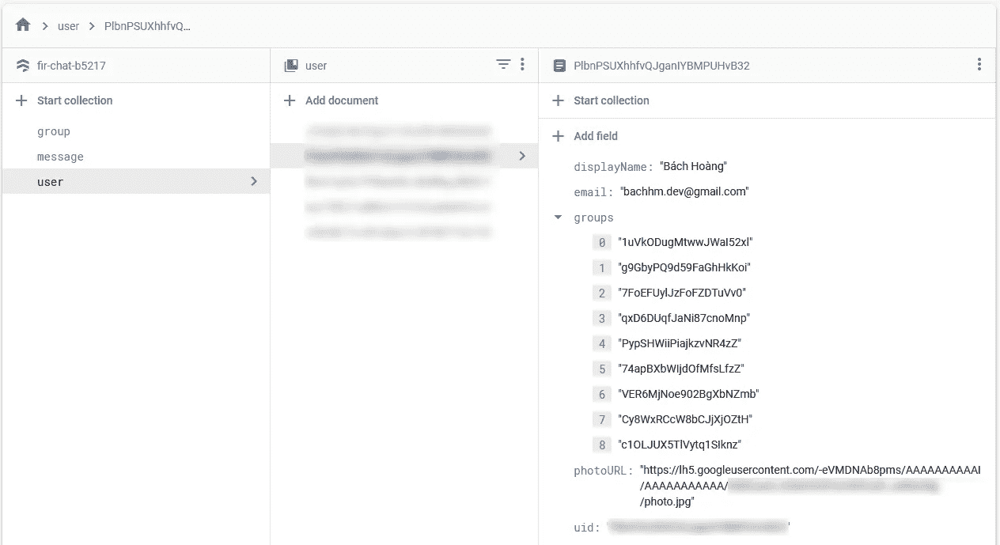

用户集合

创建**用户集合**，包含 uid、email、photoUrl、displayName 等基本信息(取决于您的需求)。

在这种情况下，收集登录用户的信息不成问题。以下示例可以帮助您通过 Google Authenticate 登录，并在使用 Javascript 登录后获取用户信息。

```
const auth = firebase.auth()
...
signInWithGoogleAuthentication() {
  const provider = new firebase.auth.GoogleAuthProvider()
  return new Promise((resolve, reject) => {
    auth
      .signInWithPopup(provider)
      .then(function (result) {
        resolve(result.user)
      })
      .catch(function (error) {
        reject(error)
      })
    })
},
```

这是一个将用户信息保存到 Firestore 的示例:

```
const db = firebase.firestore()
...
saveUserToFirestore(user) {
  const userRef = db.collection('user')
  userRef.doc(user.uid).set({
    uid: user.uid,
    displayName: user.displayName,
    photoURL: user.photoURL,
    email: user.email,
  })
},
```

接下来，我们需要注意群聊，因为一个用户可以加入多个群组，并且一个群组将包含多个用户。因此，我们应该在用户的集合中创建“组”来优化查询，并避免花费比预期更长的时间从复杂的查询中获得结果。

## 组的集合

组集合将存储组的创建者、组的类型、组的成员、名称等数据。

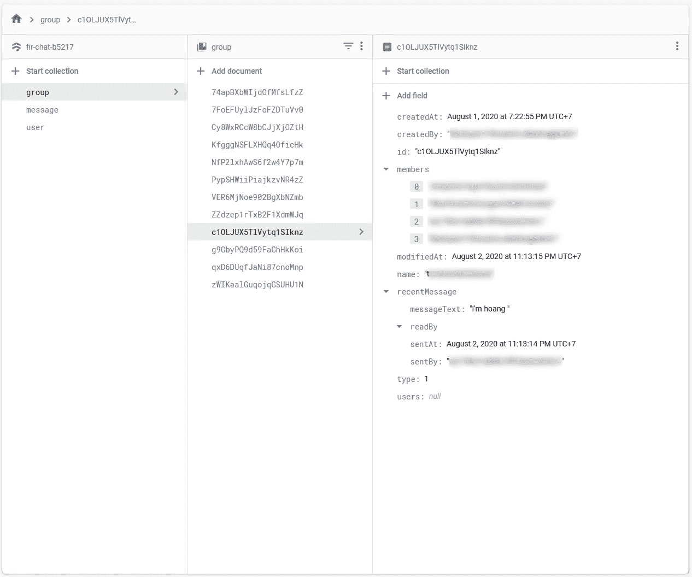

组集合

我们要把“userId”保存到“createdBy”，把“members”保存为“userId”的数组。“CreateAt”应该是自动生成的，最后一个是非常重要的类型，因为它区别于私聊和群聊。群聊可以包括多个成员，但私聊只包含 2 个人，所以我们使用“类型”来分隔前端或控制工作流，这取决于您的要求。此外，我们可以创建其他字段，如“姓名”、“最近消息”等，我们可以通过“阅读”字段来检查谁阅读了此消息。

## 消息集合

我们将把所有的消息存储到这个集合中，这个集合由组 id 来区分。消息的强制字段是“sentBy ”,它存储“userId”和“messageText”。

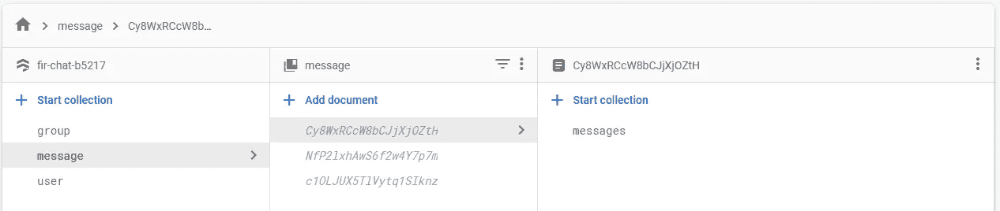

消息收集

消息集合包含具有与组 ID 相同的 **ID 的文档，并且每个文档具有它们的集合调用消息**

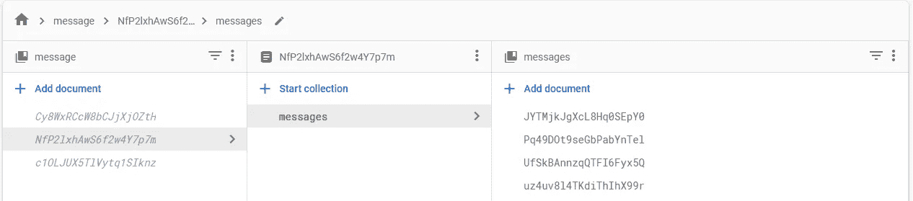

消息文档

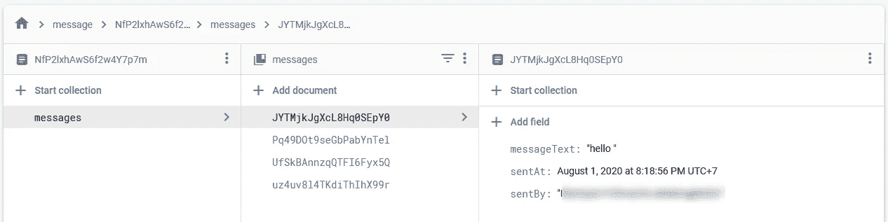

消息字段

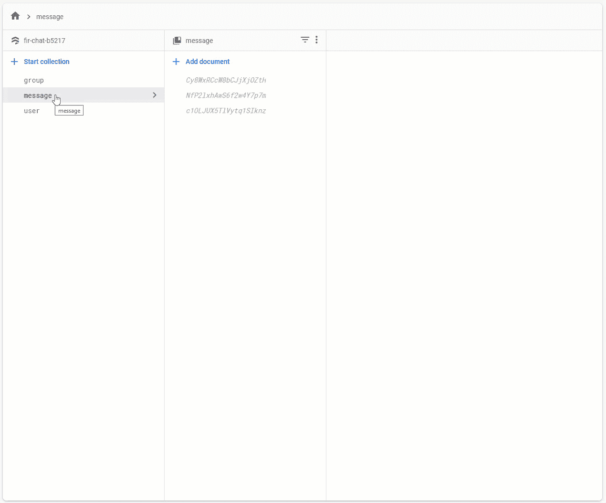

消息集合的结构

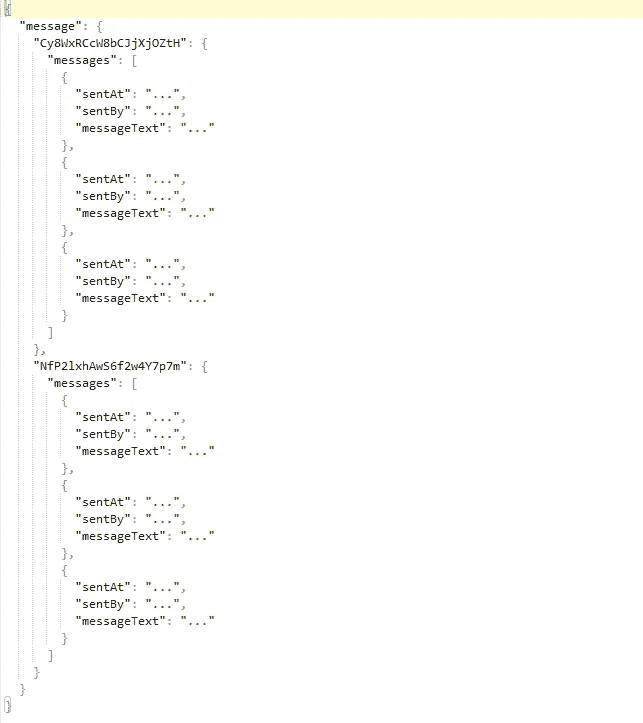

消息集合的结构

# 查询示例

在进入一个查询的例子之前，你需要设置和你的带有[链接](/building-chat-app-using-firebase-cross-platform-with-mobile-app-nativescript-web-app-nuxtjs-44b5984e7b7a?source=friends_link&sk=eab561263b2ec3c81bde623b55753c0f)的应用程序。

下面的代码是 Firestore 使用 Javascript 进行查询的一个示例，可能有助于您更好地理解这种结构。

## 通过用户 id 获取一个组的数组

```
const db = firebase.firestore()
...
fetchGroupByUserID(uid) {
  const vm = this
  return new Promise((resolve, reject) => {
    const groupRef = db.collection('group')
    groupRef
     .where('members', 'array-contains', uid)
     .onSnapshot((querySnapshot) => {
       const allGroups = []
       querySnapshot.forEach((doc) => {
         const data = doc.data()
         data.id = doc.id
         if (data.recentMessage) allGroups.push(data)
       })
       vm.groups = allGroups
     })
   })
},
```

## 使用用户数组筛选组

```
const db = firebase.firestore()
...
filterGroup(userArray) {
  const vm = this
  vm.groups = []
  return new Promise((resolve, reject) => {
    let groupRef = db.collection('group')
    userArray.forEach((userId) => {
      groupRef = groupRef.where('members', '==', userId)
    })
    groupRef
      .get()
      .then(function (querySnapshot) {
        const allGroups = []
        querySnapshot.forEach((doc) => {
          const data = doc.data()
          data.id = doc.id
          allGroups.push(data)
       })
       if (allGroups.length > 0) {
         resolve(allGroups[0])
       } else {
         resolve(null)
       }
    })
    .catch(function (error) {
      reject(error)
    })
  })
},
```

上面的代码是用来检查私人聊天(组只包含 2 个成员)，如果它还没有存在，我们应该创建新的，我会在这个故事的结尾展示一个演示。

## 按组 ID 提取消息

```
const db = firebase.firestore()
...
fetchMessagesByGroupId(groupId) {
  const vm = this
  db.collection('message')
    .doc(groupId.trim())
    .collection('messages')
    .orderBy('sentAt')
    .onSnapshot((querySnapshot) => {
      const allMessages = []
      querySnapshot.forEach((doc) => {
        if (doc) allMessages.push(doc.data())
      })
      vm.messages = allMessages
    })
},
```

## 保存消息

```
const db = firebase.firestore()
...
saveMessage(messageText, sentAt, currentGroupId) {
  if (messageText.trim()) {
  const message = {
    messageText,
    sentAt,
    sentBy: this.user.uid,
  }
  return new Promise((resolve, reject) => {
    db.collection('message')
      .doc(currentGroupId)
      .collection('messages')
      .add(message)
      .then(function (docRef) {
        resolve(message)
      })
      .catch(function (error) {
        reject(error)
      })
    })
  }
},
```

# 演示聊天应用程序

## 注册

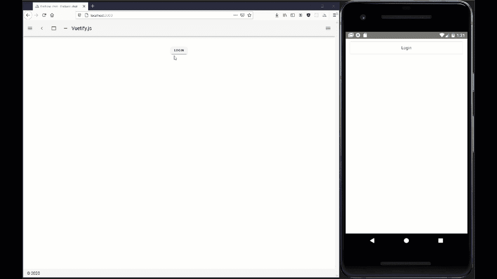

注册

## 私人聊天

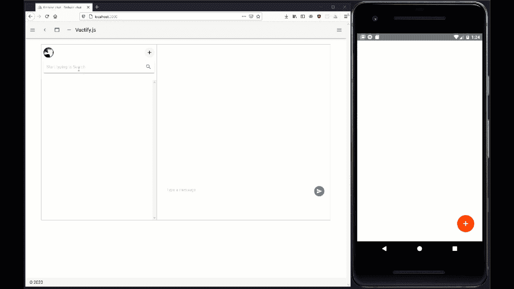

私人聊天

## 创建群组

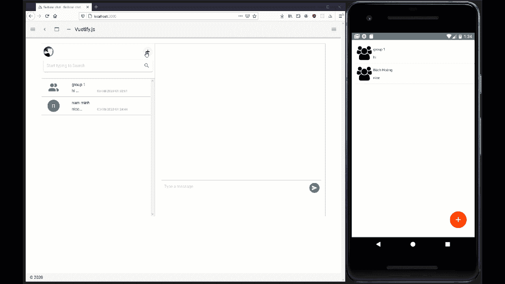

创建群组

## 群聊

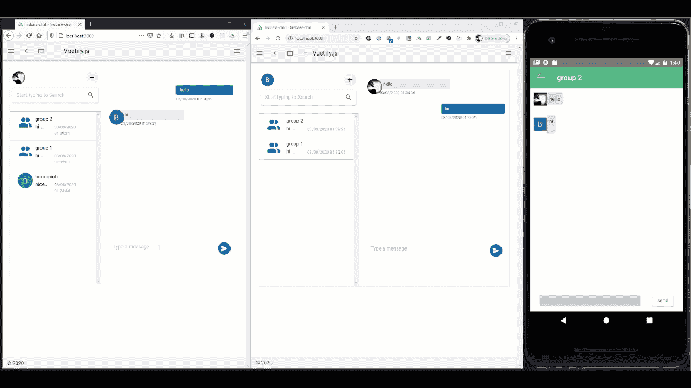

群聊

有关它的更多详细信息，请访问:

[](https://github.com/bachhm-dev/nuxt-advance-chat) [## bachm-dev/nuxt-advance-chat

### 此时您不能执行该操作。您已使用另一个标签页或窗口登录。您已在另一个选项卡中注销，或者…

github.com](https://github.com/bachhm-dev/nuxt-advance-chat) 

# 结论

有一个聊天数据库的结构，我认为对于每个想研究 Firestore 或聊天数据库结构的人来说，这很容易理解。感谢阅读，如果我有任何错误，欢迎反馈。