# 结构化日志记录和 Azure 日志分析

> 原文：<https://levelup.gitconnected.com/structured-logging-and-azure-log-analytics-416feda20970>

通过正确的日志记录，故障排除变得更加容易！


图片来自 [Unsplash](https://unsplash.com/photos/eApu3K8gix8)

我在代码(旧的和新的)中经常遇到的一件事就是糟糕的日志记录。日志:

*   是不存在的
*   无处不在(其中 90%是无用的)
*   是非结构化的(很难找到具体的东西)
*   太冗长了

如果你不得不尝试仅仅使用这些日志来解决问题*…你就不走运了。*

可以理解为什么会这样——作为开发人员，我们通常关注可靠的原则、干净的架构、微服务模式等。等等。

没有真正完善日志记录的权威指南。

因此，我想分享一些关于如何写日志的技巧——也许它们并不完美(我自己也不确定完美的日志是什么样子),但至少它们会让你的故障排除生活变得更容易。

我在这篇文章中使用的例子将特别关注通过 Serilog 生成的日志，以及它们如何出现在 Azure Log Analytics 中。

# 入门指南

## 创建日志分析工作区

微软在这方面已经有了很好的文档，所以我不会在这里重写说明，我只提供一个链接:

[](https://docs.microsoft.com/en-us/azure/azure-monitor/logs/quick-create-workspace#:~:text=%20Create%20a%20Log%20Analytics%20workspace%20in%20the,collection%20of%20monitoring%20telemetry%2C%20run%20log...%20More%20) [## 在 Azure 门户- Azure Monitor 中创建日志分析工作区

### 使用日志分析工作区菜单来创建使用 Azure 门户的日志分析工作区。日志分析…

docs.microsoft.com](https://docs.microsoft.com/en-us/azure/azure-monitor/logs/quick-create-workspace#:~:text=%20Create%20a%20Log%20Analytics%20workspace%20in%20the,collection%20of%20monitoring%20telemetry%2C%20run%20log...%20More%20) 

设置好日志分析工作空间后，您需要获得工作空间 ID 和密钥(主密钥或次密钥)。您可以从 Azure Portal 的*代理管理*部分获得此信息:

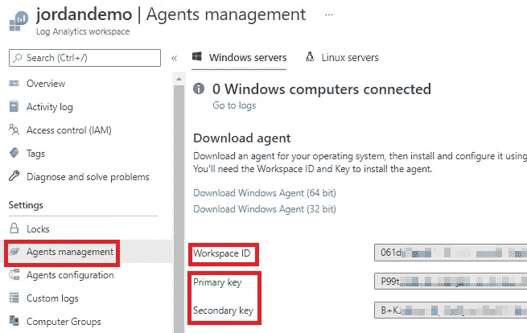

## 将 ASP.NET 核心连接到日志分析

我们需要安装 2 个软件包:

*   Serilog。AspNetCore
*   Serilog。水槽。azure 分析

```
Install-Package Serilog.AspNetCore
Install-Package Serilog.Sinks.AzureAnalytics
```

然后，您可以按照 GitHub repo 中各个包的说明将 ASP.NET 核心连接到日志分析:

*   [https://github.com/serilog/serilog-aspnetcore](https://github.com/serilog/serilog-aspnetcore)
*   [https://github . com/saleem-Mirza/seri log-sinks-azure-analytics](https://github.com/saleem-mirza/serilog-sinks-azure-analytics)

您的`program.cs`文件应该如下所示:

```
// Program.cs
public class Program
{
    public static void Main(string[] args)
    {
        var workspaceId = "[your workspace id]";
        var primaryKey = "[your primary key]";
        Log.Logger = new LoggerConfiguration()
            .MinimumLevel.Information()
            .MinimumLevel.Override("Microsoft", LogEventLevel.Error)
            .Enrich.FromLogContext()
            .WriteTo.AzureAnalytics(workspaceId, primaryKey, "myapp")
            .WriteTo.Console()
            .CreateLogger();
        CreateHostBuilder(args).Build().Run();
    }public static IHostBuilder CreateHostBuilder(string[] args) =>
        Host.CreateDefaultBuilder(args)
            .UseSerilog()
            .ConfigureWebHostDefaults(webBuilder =>
            {
                webBuilder.UseStartup<Startup>();
            });
}
```

# 提示 1-过滤掉微软日志

你知道当你启动一个 ASP.NET 核心应用程序时，你在控制台看到的默认内容吗？

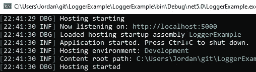

如果您不过滤掉它们，它们也会进入日志分析:

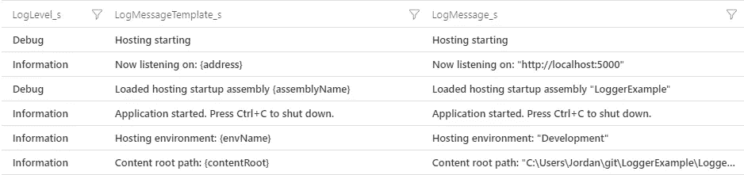

您可以在代码中通过将`.MinimumLevel.Override(“Microsoft”, LogEventLevel.Error)`添加到您的 Serilog 配置中来做到这一点:

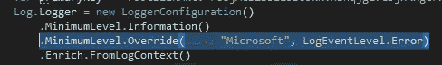

当然，除非你出于某种原因觉得这些条目很有用…

# 技巧 2——了解你的日志级别

这与其说是一个提示，不如说是一个观察。

Serilog 有以下日志级别:

*   冗长的
*   调试
*   信息
*   警告
*   错误
*   致命的

您指定的日志级别将在日志分析的 LogLevel_s 列中捕获。

```
_logger.LogDebug("This is debug");
_logger.LogTrace("This is trace");
_logger.LogWarning("This is warning");
_logger.LogInformation("This is informational");
_logger.LogError("This is error");
_logger.LogCritical("This is critical");
```

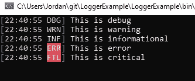

控制台中的日志级别

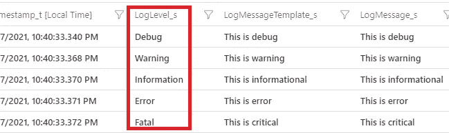

日志分析中的日志级别

# 提示#3 -结构化日志消息属性在日志分析中有自己的列

如下例所示，在日志消息中指定`{Guid}`会在日志分析中产生一个`LogProperties_Guid_g`列。

```
_logger.LogInformation("Get operation started **{Guid}**", Guid.NewGuid());
```

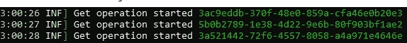

在控制台中

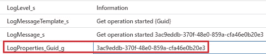

在日志分析中

# 技巧 4——当您不想在日志消息中包含附加信息时，使用作用域向日志中添加附加信息

如果您将所有需要的信息都放入日志消息中，那么生成的日志消息会变得非常冗长(不足为奇)。

相反，保持您的消息简短，并将您想要的任何附加信息放在日志上下文中。这可以使用`.BeginScope`方法来完成:

```
using (_logger.BeginScope(new Dictionary<string, object>
{
    ["CustomerNumber"] = "123456",
    ["Status"] = "Locked",
    ["Reason"] = "IdentityValidationFailed"
}))
{
    _logger.LogInformation(new EventId(10, "AccountStateChanged"), "Customer account locked");
}
```

每个指定的上下文属性将在日志分析中获得自己的列。

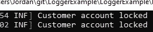

日志上下文不会显示在控制台中

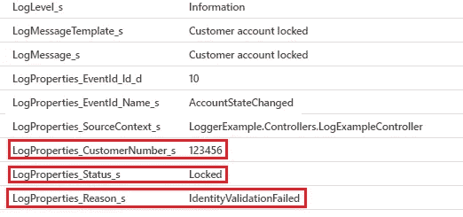

但是它确实在日志分析中被捕获

在字典中指定上下文属性的另一种方法是为每个属性调用`BeginScope`，如下所示:

```
using (_logger.BeginScope("{CustomerNumber}", 456789))
using (_logger.BeginScope("{Status}", "PasswordReset"))
using (_logger.BeginScope("{Reason}", "RequestedByUser"))
{
    _logger.LogInformation(new EventId(10, "AccountStateChanged"), "Account Reset");
}
```

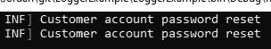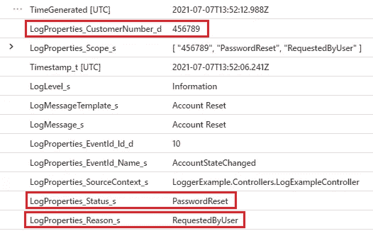

# 提示#5 -事件 id 在日志分析中被实现为日志上下文属性

当您在日志中指定 EventId 时，它与指定 LogContext 属性非常相似。事件 Id 和名称在日志分析中都有自己的列。

```
using (_logger.BeginScope(new Dictionary<string, object>
{
    ["CustomerNumber"] = "123456",
    ["Status"] = "Locked",
    ["Reason"] = "IdentityValidationFailed"
}))
{
    _logger.LogInformation(**new EventId(10, "AccountStateChanged")**, "Customer account locked");
}
```

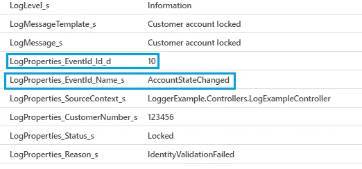

# 技巧 6——如果您想捕获请求，请使用 SerilogRequestLogging

如果您确实想捕获关于进入您的应用程序的每个请求的日志，`UseSerilogRequestLogging`确保您也能获得细节，比如响应代码和服务请求所花费的时间。

```
public void Configure(IApplicationBuilder app, IWebHostEnvironment env)
{
    if (env.IsDevelopment())
    {
        app.UseDeveloperExceptionPage();
        app.UseSwagger();
        app.UseSwaggerUI(c => c.SwaggerEndpoint("/swagger/v1/swagger.json", "LoggerExample v1"));
    }
 **app.UseSerilogRequestLogging();**
    app.UseRouting();
...
...
```

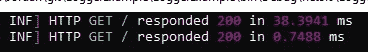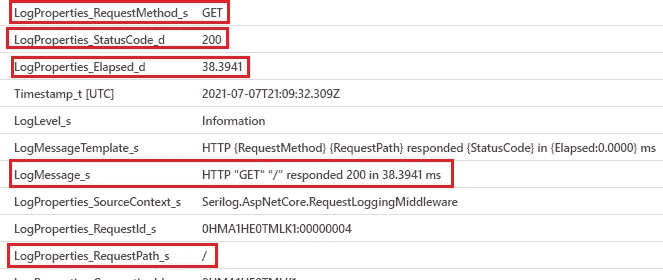

# 提示#7 -指定一个全局丰富器属性意味着日志分析中的每个日志条目都将该属性作为一列

同样，这与其说是一个提示，不如说是一个观察。

如果使用`Enrich.WithProperty`方法在串行配置中指定全局浓缩…

```
Log.Logger = new LoggerConfiguration()
    .MinimumLevel.Debug()
    .MinimumLevel.Override("Microsoft", LogEventLevel.Error)
    .Enrich.FromLogContext()
    **.Enrich.WithProperty("Version", "1.0.0")**
    .WriteTo.AzureAnalytics(workspaceId, primaryKey, "example4")
    .WriteTo.Console()
    .CreateLogger();
CreateHostBuilder(args).Build().Run();
```

您编写的每个日志都会在日志分析中包含该列:

```
_logger.LogInformation(new EventId(1,"GetProcessed"), "Something happened");
```

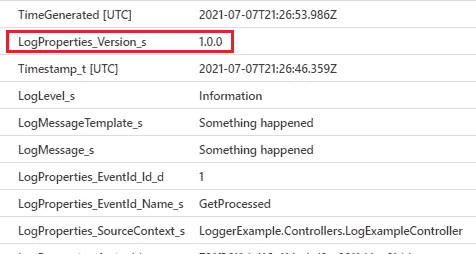

# 结论

我认为从索引器的角度考虑日志记录非常有用——也就是说，您希望日志如何首先出现在日志分析中——然后编写日志来实现它。

不幸的是，我认识的大多数开发人员(包括我自己)通常做相反的事情——我们编写日志代码，然后希望一旦日志被索引，它就可以使用。

希望这篇文章能让你更好地理解日志分析中的结构日志，并帮助你改进你自己的代码。

感谢阅读！