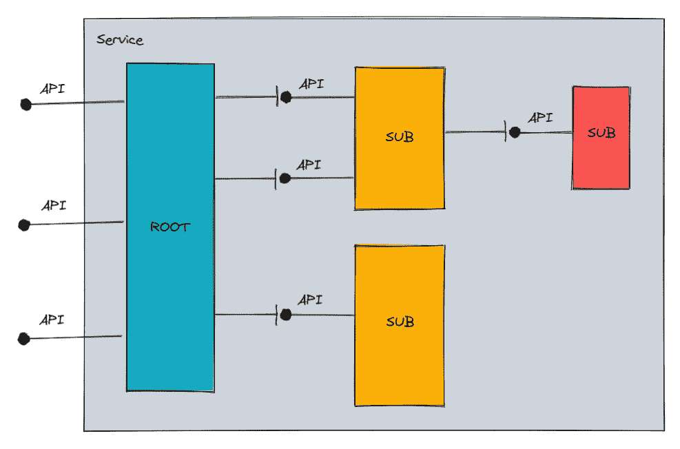
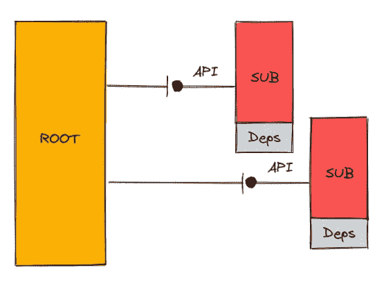
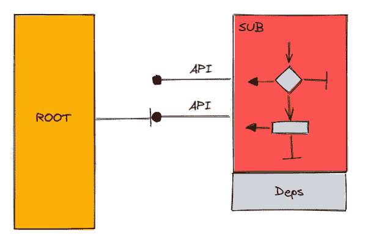
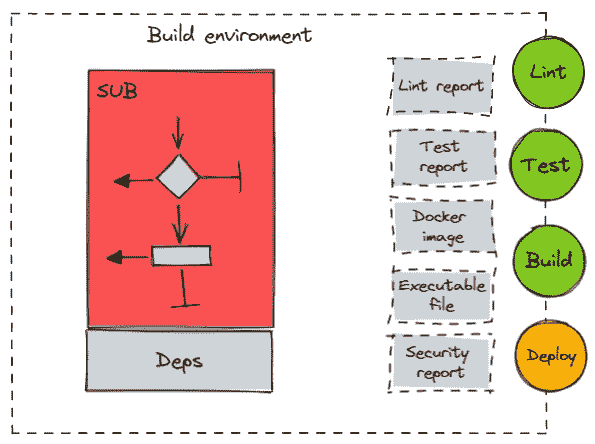
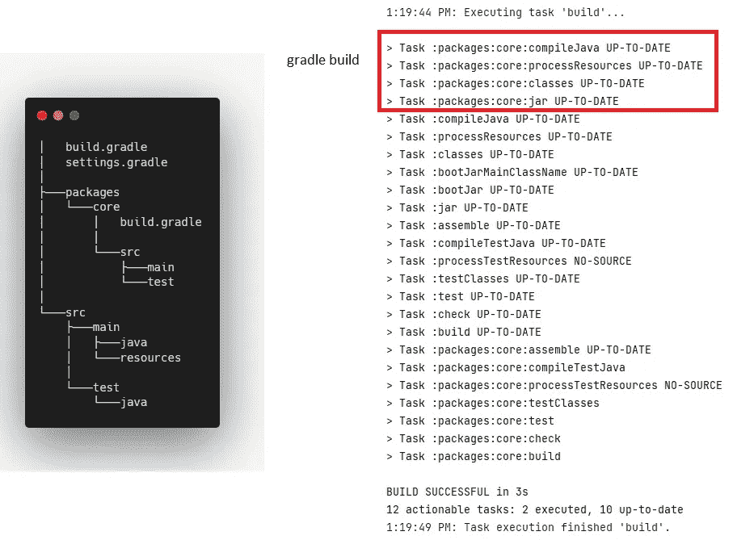
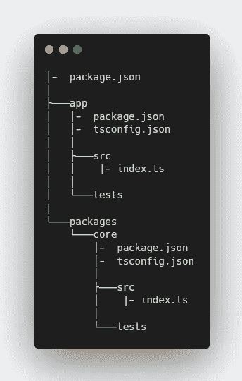
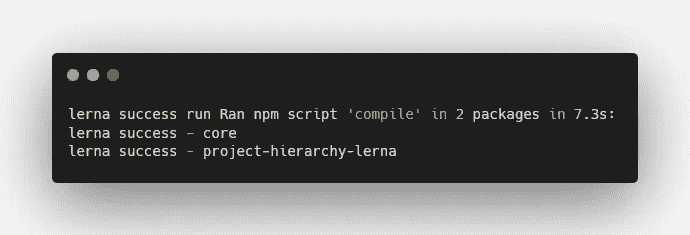

# 构建复杂的项目

> 原文：<https://levelup.gitconnected.com/structuring-complex-projects-5a4cb3b80fe5>

> "简单是可靠的先决条件."
> **埃德格·w·迪克斯特拉**


照片由[哈桑·阿尔马西](https://unsplash.com/@hasanalmasi?utm_source=medium&utm_medium=referral)在 [Unsplash](https://unsplash.com?utm_source=medium&utm_medium=referral) 拍摄

我们都在观察一个范式的转变，使用单个存储库( *monorepos* )，而不是单独管理许多独立的 git 存储库。

我认为这种转变是完全单一的产品设计(当所有连接的部分都紧密链接到根项目时)和完全分布式的产品设计(当连接的部分代表架构量子时，所以可以从设计和部署的角度独立共存)之间的一种妥协。这两个极端都有显著的缺点，会减缓产品开发。

Monorepos 解决了其中最关键的问题:

*   连接的组件仍然是一个自给自足的架构量子，可以在根项目之外重用
*   连接组件被设计为使用 its 的项目的一部分，但不是在真空中，因此最终的采用要顺利得多

我在[这篇文章](https://medium.com/codex/what-i-was-doing-wrong-dependency-management-and-monorepo-816c698ab9f)中分享了我过去将现有项目迁移为 monorepo 的经验，以及所有获得的好处。

作为迁移的一部分，我发现了另一个有趣的用例，我想在这篇文章中分享——支持高效的分层项目结构。

# 遵守共同封闭原则

比起 Node/JS/TypeScript，我更关注 JAVA/Spring/Gradle 项目——我已经在脑海中描绘了一个大项目需要如何构建以保持高度的可支持性和可管理性架构特征:

*   **根项目只是一个由子模块**提供大量服务的外观



模块层次结构

*   **子模块封装了所有需要的依赖关系，这些依赖关系没有暴露在**之外



封装的依赖项

*   **子模块是一个自给自足的模块，通过隐藏其内部实现来公开高级 API**



隐藏复杂性

*   **子项目是独立管理的，并且有一整套必需的任务和目标来产生一个可构建或可部署的工件**



沙盒开发和推广

# JAVA 和 Gradle

Gradle 构建自动化工具对多项目配置有基本的支持，因此它会基于依赖项配置自动构建一个完整的构建链。

因此，运行`gradle build`命令将产生下一个结果——构建引擎将分析依赖关系树，并根据引用顺序在每个依赖关系中执行构建任务。



项目配置非常简单:

`settings.gradle`对于根项目应该描述所有链接的依赖关系

```
rootProject.name = 'gradle-hierarchy-example'
include ':packages:core'
```

`build.gradle`对于根项目应描述联动类型，如

```
dependencies **{** implementation project(":packages:core")
    // other dependencies
**}**
```

# JAVA 和 Maven

[Maven](https://maven.apache.org/) 构建自动化工具支持类似的多项目范式，唯一相反的父子识别模型——子项目知道它的父引用(而 Gradle 在父配置中定义所有子项目的链接)。

子 POM 设置文件需要声明父引用:

```
<project> <parent>
    <artifactId>project-hierarchy-maven</artifactId>
    <groupId>com.example</groupId>
    <version>0.0.1-SNAPSHOT</version>
  </parent>

  ...</project>
```

打包父项目时，所有必需的依赖项都将被识别并适当地构建

```
[INFO] Reactor Summary:
[INFO] project-hierarchy-maven 0.0.1-SNAPSHOT .. SUCCESS [ 13.302 s]
[INFO] core 1.0-SNAPSHOT ....................... SUCCESS [ 43.760 s]
[INFO] -------------------------------------------------------------
[INFO] BUILD SUCCESS
```

# 诺杰斯和 NPM

在 JavaScript 生态系统中，多项目解决方案是一个全新的范例，传统的构建工具还不能支持它。

但是幸运的是，从节点包管理器(NPM)的版本 7 开始，通过在`package.json`项目配置文件中引入一个额外的部分— `workspaces`,增加了这种支持

> **工作区**是一个通用术语，指的是 npm cli 中的一组功能，这些功能支持从单个顶级根包中管理本地文件系统中的多个包。

正如它在描述中所说的，这个新的配置允许描述根应用程序应该知道的项目依赖关系(类似于 Gradle 如何定义它的依赖关系)。

作为一个例子，让我们回顾一下这个项目，它有两个子模块:`app`和`core`，其中`app`依赖于`core`项目。



要添加对多项目行为的支持，我们所需要的就是扩展包配置，使其链接到子项目。

```
{
  "name": "npm-hierarchy",
  "version": "0.0.1", "workspaces": [
    "packages/**",
    "app"
  ],
  "dependencies": {
    . . .
  }
}
```

所有的子包可能已经定义了适合它们范围的任务，然后从根项目中一次运行所有的任务。

```
// this command will run "test" command in all sub-projects
npm run test --workspaces
```

如果一个子对象在其`project.json`文件中引用另一个子对象，将获得正确的任务执行顺序。

# NodeJS 和 LernaJS

[LernaJS](https://lerna.js.org/) 是管理多回购解决方案中模块的下一步。它提供了一个平滑的机制来管理和协调子模块的生命周期。它是 NPM 工作空间的改进版本，增加了缓存执行结果、排序和任务配置等功能。

因此，以正确的顺序运行所有的子任务集不需要引用工作区，根任务可以被配置为这样做，例如

```
lerna run compile
```

因此，LernaJS 构建工具将分析依赖关系树，还将为每个定义了“编译”任务的项目调用该任务。



执行任务顺序

[](https://medium.com/codex/what-i-was-doing-wrong-dependency-management-and-monorepo-816c698ab9f) [## 我做错了什么—依赖管理和 monorepo

### 在分布式架构中支持多重依赖是一个巨大的挑战，尤其是当康威定律…

medium.com](https://medium.com/codex/what-i-was-doing-wrong-dependency-management-and-monorepo-816c698ab9f) [](https://medium.com/codex/what-i-was-doing-wrong-managing-micro-services-common-dependencies-7110e5ebbc2f) [## 我做错了什么——管理微服务的公共依赖性

### 我个人的一系列发现，设计关注，时间浪费活动，模式不适用性，以及其他问题…

medium.com](https://medium.com/codex/what-i-was-doing-wrong-managing-micro-services-common-dependencies-7110e5ebbc2f) 

# 分级编码

感谢您成为我们社区的一员！更多内容见[级编码出版物](https://levelup.gitconnected.com/)。
跟随:[推特](https://twitter.com/gitconnected)，[领英](https://www.linkedin.com/company/gitconnected)，[通迅](https://newsletter.levelup.dev/)
**升一级正在改造理工大招聘➡️** [**加入我们的人才集体**](https://jobs.levelup.dev/talent/welcome?referral=true)