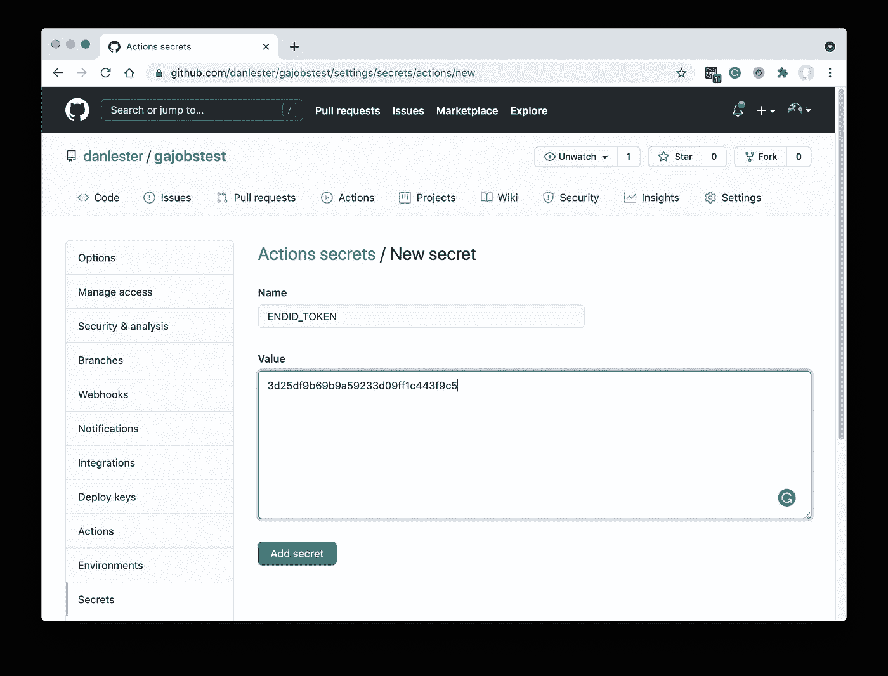
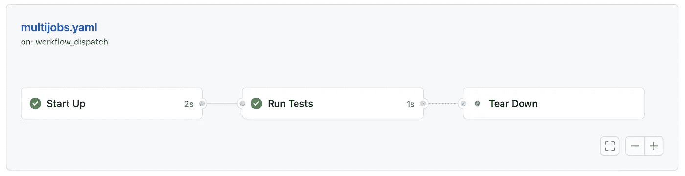
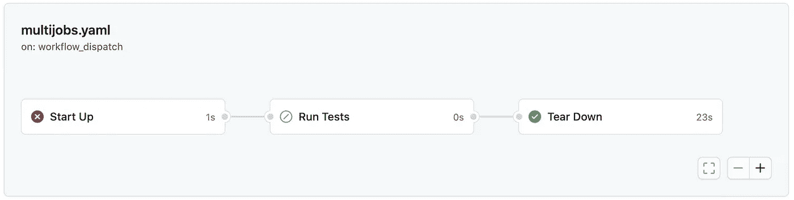

# 安全地构造 GitHub 动作

> 原文：<https://levelup.gitconnected.com/structuring-github-actions-safely-5309e5ee54de>

## 如何设计有开始、中间和结束的 GitHub Actions 工作流，以便您可以安全地拆除您的环境并准确地通知您的团队。

GitHub Actions 允许你通过在你的 git 存储库中包含一个简单的 YAML 文件来说明你想执行什么和什么时候执行，从而自动化任何软件工作流。如果你是新手，看看这里的。

最近，我的团队构建了一个 GitHub 工作流来测试我们的软件在云上的部署——在 Amazon Web Services 上建立一个环境，运行一些测试，然后再次将其拆除。一开始，这是一项包含一系列步骤的工作。最后，我们使用了一个`if: failure()` [状态检查函数](https://docs.github.com/en/actions/reference/context-and-expression-syntax-for-github-actions#job-status-check-functions)来确保最后一个步骤总是在任何先前的步骤失败后运行——并且最后一个步骤发送了一个 Slack 通知，让我们知道出现了错误。

这似乎行得通，但是假设在某个测试步骤中发生了故障。在这种情况下，我们直接跳到发送(正确的)故障通知，但是跳过了所有的拆卸步骤。所以资源仍然在云上，直到有人收到通知并手动停止 AWS 上的一切。


照片由[郭佳欣·阿维蒂斯扬](https://unsplash.com/@kar111?utm_source=medium&utm_medium=referral)在 [Unsplash](https://unsplash.com?utm_source=medium&utm_medium=referral) 上拍摄

最后，我们通过将一长串步骤分成三个独立的“工作”来重构工作流。这给出了一个逻辑上的划分，但是在发送成功/失败通知时，却出现了一些意想不到的问题。

提醒一下，作业是 GitHub 操作工作流中步骤的高级集合。默认情况下，作业可以并行运行，并且各个作业不共享同一个工作区或虚拟机，因此您无法在作业之间自动共享状态(相比之下，所有“步骤”都在与其同级相同的环境中运行)。

将工作流分成多个作业是否有意义取决于您正在做什么，但是对于我们的示例来说，重要的是要知道在作业之间建立依赖树是可能的。因此，我们可以运行作业 1(设置环境)，然后运行作业 2(运行测试)，最后运行作业 3(拆除环境并发送通知)。

# 通知

在我的例子中，我使用[market place action Slack Templates](https://github.com/marketplace/actions/slack-templates)向 Slack 发送通知，但是你可以使用任意数量的免费 GitHub Actions 直接向你选择的 Slack 频道、微软团队或任何你想使用的东西发送通知。

无论哪种方式，您都需要某种形式的身份验证令牌来触发您的通知，并且您应该将其保存为组织或存储库机密:



在 GitHub repo 中将 token 设置为秘密(图片由作者提供)

# 序列中的作业

这是我第一次尝试将工作流分成三个不同的任务。事实上，在我真正的工作流程中，中间的任务使用了不同于其他两个任务的运行器(不是 *ubuntu-latest* ),所以这个*有*在一个单独的任务中。在这个例子中，我用`exit 0`模拟主要步骤——如果我想假装该步骤失败，例如由于测试失败，可以很容易地将它改为`exit 1`。默认情况下，任何非零退出代码都将停止工作流。

```
name: "Test Multiple Jobs"on:
  workflow_dispatch:

jobs:
  startupjob:
    name: Start Up
    steps:
      - name: Set Everything Up
        run: exit 0 testsjob:
    name: Run Tests
    needs: startupjob
    steps:
      - name: Run the test suite
        run: exit 0 teardownjob:
    name: Tear Down
    needs: testsjob
    if: always()
    steps:
      - name: Tear Down
        run: exit 0

      - name: Notify via Slack Templates
        uses: ScribeMD/slack-templates@0.6.7
        if: always()
        with:
          bot-token: ${{ secrets.SLACK_TOKEN }}
          channel-id: ${{ secrets.SLACK_CHANNEL_ID }}
          template: result
```

在这个例子中，我使用了`on: workflow_dispatch`，这意味着它是通过 GitHub 的网站或 API 手动触发的，但也许你的工作流将是一个`on: push`事件或其他什么。

默认情况下，GitHub 可能会选择并行运行多个作业，所以我们使用`needs`关键字来建立依赖树。

第一个作业(startupjob)没有依赖项，但是第二个作业(testsjob)有一个`needs: startupjob`条目，这意味着它需要 startupjob 完成才能运行。

最后，teardownjob 有`needs: testsjob`来确保它只在测试完成后运行。所以我们有一个这样的线性依赖图:



串行任务依赖关系图(图片由作者提供)

# 总是

你会注意到在第三个“拆卸”作业中有两行`if: always()`。他们在不同的层次工作。

第一个意味着整个拆卸作业应该始终运行。特别是如果第二个作业(测试)失败了——如果我们测试任何有价值的东西，这种情况很可能偶尔发生——我们仍然希望拆除环境以节省资源，并确保在下次需要时重置状态。

第二个`if: always()`适用于作业内的步骤范围。这意味着，在拆卸作业中，即使拆卸本身失败，我们仍然希望发送通知。

明确地说，仅仅第二个`if: always()`不足以确保通知步骤总是运行。它仅适用于拆卸作业。如果没有作业级别`if: always()`，我们会发现早期作业中的失败会提前完成整个工作流，并且 teardownjob 会被跳过，尽管其中一个步骤旨在运行' *always'* 。

因此，在正确的设置中(有两个 *always* 条目，一个用于拆卸作业，一个用于通知步骤),我们可以模拟 startupjob 中的失败(例如，更改为`exit 1`)并看到以下状态:



不同作业的失败、跳过和成功结果(图片由作者提供)

这很好——拆除仍然运行以重置我们的环境(并且它应该以这样一种方式编码，即它可以处理启动作业没有完全运行的情况)。

但是在我们如何解释通知的状态方面有一个复杂的问题。

# 工作状态忘记过去

通过`status: ${{ job.status }}`传递给 Slack 通知动作感觉是正确的，在一切都按计划进行或者在拆卸工作的前一步发生故障的情况下，它将是正确的。

但如果你看一下上面的工作依赖图，你会看到“启动”旁边有一个大的红叉，“拆除”旁边有一个大的绿勾。

请记住，`job`只是当前拆卸作业的上下文，而不是整个工作流的上下文，因此在整个拆卸作业中,`job.status`实际上等于`success`。然后传递给 Slack 通知的状态是`success`,即使我们的启动或测试作业失败了——在这两种情况下，我们都希望记录失败，以确保有人看到。

让我们仔细看看所需的逻辑。如果`job.status`不等于`success`(意味着当前拆除作业本身的早期失败)或早期步骤失败，我们希望通知失败。

您实际上不能直接访问其他作业的状态*，除非*当前作业直接依赖于那些作业。在这种情况下，您可以使用`[needs](https://docs.github.com/en/actions/reference/context-and-expression-syntax-for-github-actions#needs-context)` [上下文](https://docs.github.com/en/actions/reference/context-and-expression-syntax-for-github-actions#needs-context)来访问相关作业(记得我们在 teardownjob 中将`needs: testsjob`指定为一个字段)。

因此`needs.testsjob`提供了对前一个作业的访问，特别是`needs.testsjob.result`将包含字符串`success`、`failure`、`cancelled`或`skipped`。

我的结论是使用这个表达式来确定要在我们的时差通知中显示的总体工作流结果:

```
${{ job.status == 'success' && needs.testsjob.result == 'success' }}
```

## 回到起点

够了吗？我们不也需要访问第一个作业“startupjob”的结果吗？

事实证明，只要我们维护线性依赖树，我们就不需要。这是因为，如果 startupjob 失败，它会导致整个 testsjob 被跳过，并且`needs.testsjob.result`等于`skipped`(所以不等于`success`)。

这是最终的工作流文件，包括发送时差通知的正确状态检查:

```
name: "Test Multiple Jobs"on:
  workflow_dispatch:

jobs:
  startupjob:
    name: Start Up
    steps:
      - name: Set Everything Up
        run: exit 0 testsjob:
    name: Run Tests
    needs: startupjob
    steps:
      - name: Run the test suite
        run: exit 0 teardownjob:
    name: Tear Down
    needs: testsjob
    if: always()
    steps:
      - name: Tear Down
        run: exit 0

      - name: Notify via Slack
        uses: ScribeMD/slack-templates@0.6.7
        if: always()
        with:
          bot-token: ${{ secrets.SLACK_TOKEN }}
          channel-id: ${{ secrets.SLACK_CHANNEL_ID }}
          template: result
          results: "${{ job.status }} ${{ join(needs.*.result, ' ') }}"
```

(注意最后的`results`条目应该都在一行上——它在上面换行)

我们现在可以在时差通知中看到正确的通知。

# 摘要

本文展示了如何在独立作业的线性依赖图中设计 GitHub 动作工作流。

我们在最后一个作业中使用了`if: always()`,以确保它即使在早期的设置和核心测试作业失败时也能运行，这意味着我们的云环境在任何情况下都可以正确地拆除。

然而，这使得用于确定是否通过我们的松散集成来通知“成功”或“失败”的表达式变得复杂，并且我们必须理解我们的精确依赖树，以便创建准确的表达式。

我们使用公共动作 [Slack 模板](https://github.com/marketplace/actions/slack-templates)将通知处理成 Slack。

如果您确实需要在 GitHub Actions 工作流作业之间共享状态，[这里有一个极好的可用选项摘要](/github-actions-how-to-share-data-between-jobs-fc1547defc3e)。

如果不同的工作流结构或状态表达式对您的特定工作流有意义，请告诉我们！

# Endid

为了让 Slack 通知变得更容易，看一下 [Endid，这是我用来监控 Github 动作的 Slack 应用](https://endid.app/)。这提供了一个即时安装来监控所有来自 repos 的 GitHub 操作，所以你根本不需要担心添加繁琐的通知代码到你的工作流程中！

此外，它还提供智能监控，只在工作流突然失败时发送通知，或者在修复后报告成功。