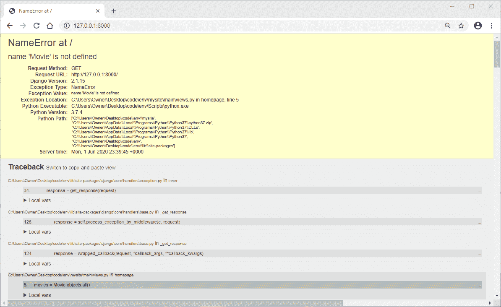

# 停留在 Django 调试页面？这里有 13 种解决方案

> 原文：<https://levelup.gitconnected.com/stuck-on-the-django-debug-page-here-are-13-solutions-1dc99269463a>



让我们面对现实吧，当第一次学习使用 web 框架时，刷新浏览器窗口并得到 Django 黄页错误可能会令人沮丧。

更糟糕的是 CLI 或终端中的一个错误，它似乎没有提供关于如何解决该问题的洞察力。

我们总是建议您查看异常类型、值和位置以及回溯，但是在第一次学习编码时，并不是每个错误页面都容易阅读。

学习阅读这些错误并快速识别解决方案需要练习，但在开始时，可能需要几个小时专门搜索错误并搜索堆栈溢出问题，以理解您忘记添加的导致错误的一行代码。

所以我们决定分解你在学习 Django 和使用普通 Django 包[Django-crisp-forms](https://www.ordinarycoders.com/blog/article/django-python-packages)时必然会遇到的常见错误。

# **Django 初始安装和配置期间可能出现的错误**

1.终端:`*Can't open file 'manage.py': [Errno 2] No such file or directory*`

如果您试图创建一个 Django 应用程序，但是忘记进入项目文件夹，在本例中是 *mysite* ，您将得到一个错误消息，指出没有 *manage.py* 文件。这是因为您只能在包含 *manage.py* 的项目文件夹中运行管理命令。

要解决这个问题，进入项目文件夹 *mysite* 文件夹，然后再次运行`startapp`命令。

*macOS 终端*

```
(env)User-Macbook:env user$ django-admin startproject mysite(env)User-Macbook:env user$ cd mysite(env)User-Macbook:mysite user$ python3 manage.py startapp main
```

*Windows 命令提示符*

```
(env)C:\Users\Owner\desktop\env> django-admin startproject mysite(env)C:\Users\Owner\desktop\env> cd mysite(env)C:\Users\Owner\desktop\env\mysite> py manage.py startapp main
```

2.浏览器窗口:`*Django rocket page "The install worked successfully! Congratulations!"* *even after adding configurations*`

如果您已经编辑了 Django 项目，但仍然看到 Django rocket 页面，则说明您没有正确配置 URL 文件。

Django 文档表明您的项目包含两个 *urls.py* 文件。

默认情况下，第一个文件位于项目文件夹中，而另一个文件需要在应用程序文件夹中创建。

这两个 URL 文件应该如下所示:

*env>my site>main>(新文件)urls.py*

```
from django.urls import path
from . import viewsapp_name = "main" urlpatterns = [
    path("", views.homepage, name="homepage"),
]
```

您需要在应用程序文件夹中创建一个 *urls.py* 文件，并指定应用程序的名称，以及一个模板的路径，例如`path(" ", views.homepage, name="homepage")`。

*env>my site>my site>URLs . py*

```
"""mysite URL ConfigurationThe `urlpatterns` list routes URLs to views. For more information please see:
    https://docs.djangoproject.com/en/2.1/topics/http/urls/
Examples:
Function views
    1\. Add an import:  from my_app import views
    2\. Add a URL to urlpatterns:  path('', views.home, name='home')
Class-based views
    1\. Add an import:  from other_app.views import Home
    2\. Add a URL to urlpatterns:  path('', Home.as_view(), name='home')
Including another URLconf
    1\. Import the include() function: from django.urls import include, path
    2\. Add a URL to urlpatterns:  path('blog/', include('blog.urls'))
"""
from django.contrib import admin
from django.urls import path, include  #add includeurlpatterns = [
    path('admin/', admin.site.urls),
    path('', include ('main.urls')),   #add this
]
```

然后在现有的 URLs 文件中，*my site*>*URLs . py，*你需要添加`path(' ', include ('main.urls'))`，将这个文件连接到 *main > urls.py* 。

正确配置这两个文件后，错误将会得到解决。

3.浏览器窗口&终端:`*"This site can't be reached"* --` `*NameError: name 'include' is not defined*`

NameError 表示您正在调用一个未定义的名称。

*env>my site>my site>URLs . py*

```
from django.contrib import admin
from django.urls import path, include  <----urlpatterns = [
    path('admin/', admin.site.urls),
    path('', include ('main.urls')),
]
```

要解决这个特定的错误，您需要转到项目的 URL 文件，在本例中是 *mysite > urls.py* 并从文件顶部的`django.urls`导入`include`。

4.端子:`*AttributeError: model 'main.views' has no attribute 'homepage'*`

接下来，这个 AttributeError 表示您还没有在项目中添加一个将 HTML 模板连接到 URL 路径的视图函数或类。

*env>my site>my site>views . py*

```
from django.shortcuts import render# Create your views here.
def homepage(request):
	return render(request = request, template_name="main/home.html")
```

如果你想写一个基于函数的视图，将你的函数定义为`homepage`，与在 *urls.py* 路径中指定的视图函数相同。然后，像任何其他 Python 函数一样，您需要添加一个 return 语句来返回 GET 请求和您希望呈现的模板的名称。

5.浏览器窗口:`*TemplateDoesNotExist at/ main/home.html*`

如果您忘记将应用程序添加到您的设置中的已安装应用程序列表，或者您没有创建您在视图中引用的模板文件，您将会收到此错误。在本例中，我们在尚未创建的视图函数中调用了一个*home.html*文件。

*env>my site>main>(新文件夹)templates >(新文件夹)main >(新文件)home.html*

```
<p>Hello world!</p>
```

如果你还没有，在你的应用程序中用*模板>主*文件夹创建一个新的文件夹结构，在这里是*主*。然后创建一个 HTML 模板文件，与视图函数中调用的文件相同。添加一些 HTML，以便当页面呈现时，您可以看到它已正确连接。

作为参考，我们从 Django 文档中提取了这个文件夹结构。

现在，如果你有你的 HTML 模板，但仍然得到这个错误，你需要确保你的应用程序被添加到设置文件中的`INSTALLED_APPS`列表。

*env>my site>my site>settings . py*

```
INSTALLED_APPS = [
    'main.apps.MainConfig',   <-----
    'django.contrib.admin',
    'django.contrib.auth',
    'django.contrib.contenttypes',
    'django.contrib.sessions',
    'django.contrib.messages',
    'django.contrib.staticfiles',
]
```

将`'main.apps.MainConfig'`添加到已安装应用列表中。顺序并不重要。

6.终端:`*You have 17 unapplied migration(s). Your project may not work properly until you apply the migrations for app(s): admin, auth, contenttypes, sessions.*`

当您使用命令 python3 manage.py runserver 或 py manage.py runserver for Windows 运行服务器时，会出现一条消息，指出存在可能会影响项目功能的未应用的迁移。

*macOS 终端*

```
(env)User-Macbook:mysite user$ python3 manage.py migrate
```

*Windows 命令提示符*

```
(env)C:\Users\Owner\desktop\env\mysite> py manage.py migrate
```

要进行初始迁移，在 mac 上运行命令`python3 manage.py migrate`，在 Windows 上运行命令`py manage.py migrate`。

# **处理包装时**

安装包是使用 Django web 框架和根据需要定制项目的主要部分。最常用的一个包是[django-crisp-forms](https://www.ordinarycoders.com/blog/article/render-forms-with-django-crispy-forms)，这是一个 Python 包，旨在为 Django 表单快速添加样式。

我们选择使用这个包作为示例，因为它不仅有与大多数 Python 包相似的安装过程，而且还有一些不太常见的配置，这些配置可能会导致一些令人困惑的错误。

7.浏览器窗口:`*TemplateSyntaxError at/ Invalid filter: 'crispy'*`

如果您忘记加载 HTML 模板顶部的 crispy form 标签，但是在表单上调用 crispy for 过滤器，您将得到这个错误。

*env>my site>main>templates>main>home.html*

```


		<form method="post">
        
            {{form|crispy}}
            <button type="submit">Submit</button>
        </form>
```

在 HTML 模板的顶部包含 django-crisp-form 标签。

8.浏览器窗口:`*TemplateSyntaxError at/ Invalid filter:'crispy'*`

这是一个比较棘手的错误，因为它与添加到表单中的实际过滤器没有太大关系。

当您在结束百分号和脆形标签的括号之间有一个空格时，就会出现错误，比如:`{% load crispy_forms_tags % }`。

环境>我的网站>主>模板>主>home.html

```


		<form method="post">
        
            {{form|crispy}}
            <button type="submit">Submit</button>
        </form>
```

老实说，如果你是使用 crisp-forms 或 Jinja 的新手，这是最难解决的错误之一。

你只需要确保在实际的 Jinja 标签``中没有空格。但是标签和变量之间的空间是可以的。

9.浏览器窗口:`*TemplateSyntaxError at/ 'crispy_form_tags' is not registered tag library. Must be on of:*`

`*admin_list*`

`*admin_modify*`

`*admin_urls*`

`*cache*`

`*crispy_forms_field*`

`*crispy_forms_filters*`

`*crispy_forms_tags*`

…

当您拼错加载在文件顶部的标记时，会出现此错误。正如你所看到的，下面列出了可用的标签，其中一个是正确的标签`crispy_forms_tags`。

*env>my site>main>templates>main>home.html*

```


		<form method="post">
        
            {{form|crispy}}
            <button type="submit">Submit</button>
        </form>
```

小心，并确保您拼写正确的过滤器和标签。避免这种错误的一个好方法是直接从文档中复制并粘贴标签。

如果你确定你已经正确地拼写了标签，但是仍然得到这个错误，确保你已经在设置文件中把`crispy_forms`添加到`INSTALLED_APPS`列表中。

*env>my site>my site>settings . py*

```
INSTALLED_APPS = [
    'main.apps.MainConfig',
    'django.contrib.admin',
    'django.contrib.auth',
    'django.contrib.contenttypes',
    'django.contrib.sessions',
    'django.contrib.messages',
    'django.contrib.staticfiles',
    'crispy_forms',               <----
]
```

同样，要小心拼写错误。通常你在使用软件包时会遇到一些拼写错误。

10.终端:`*OSError: [WinError 123] The filename, directory name, or volume label syntax is incorrect: '<frozen importlib._bootstrap>'*`

当您拼错 INSTALLED_APP `crispy_forms`时会出现此错误。

*env>my site>my site>settings . py*

```
INSTALLED_APPS = [
    'main.apps.MainConfig',
    'django.contrib.admin',
    'django.contrib.auth',
    'django.contrib.contenttypes',
    'django.contrib.sessions',
    'django.contrib.messages',
    'django.contrib.staticfiles',
    'crispy_forms',               <----
]
```

您需要注意已安装应用程序的确切拼写和格式，或者直接从文档中复制它，以避免此错误。

11.浏览器窗口&终端:`*No errors*` *但是* *表单不脆！*

如果您认为已经完成了所有必要的配置更改，但是表单仍然不够清晰，那么您可能忘记了正确添加模板包。

除了已安装的应用程序之外，一些软件包还具有需要添加到设置文件中的模板包或配置设置。

*env>my site>my site>settings . py*

```
INSTALLED_APPS = [
    'main.apps.MainConfig',
    'django.contrib.admin',
    'django.contrib.auth',
    'django.contrib.contenttypes',
    'django.contrib.sessions',
    'django.contrib.messages',
    'django.contrib.staticfiles',
    'crispy_forms',
]CRISPY_TEMPLATE_PACK = 'uni-form'
```

对于 django-crisp-forms，有一个模板包需要添加到 *settings.py* 文件中。默认模板设置需要使用 [uni-form](https://www.ordinarycoders.com/blog/article/render-forms-with-django-crispy-forms) 。如果您正在使用 Bootstrap， [bootstrap4](https://www.ordinarycoders.com/blog/article/render-a-django-form-with-bootstrap) 是您需要添加的模板包的名称。

12.浏览器窗口:`*TemplateDoesNotExist at/ uni-form/uni_form.html*`

如果你在 Django 项目中使用了引导 CSS 框架，你需要调用正确的 crispy 模板包，否则你会得到这个错误。

*env>my site>my site>settings . py*

```
INSTALLED_APPS = [
    'main.apps.MainConfig',
    'django.contrib.admin',
    'django.contrib.auth',
    'django.contrib.contenttypes',
    'django.contrib.sessions',
    'django.contrib.messages',
    'django.contrib.staticfiles',
    'crispy_forms',
]CRISPY_TEMPLATE_PACK = 'bootstrap4'
```

这个包全是小写的。

# **在 Python 文件中工作时**

我们将讨论的最后一个错误是使用 Python 文件时出现的错误。

鉴于 Python 所需的格式样式和缩进级别，这些是迄今为止最令人沮丧的错误。

13.终端: `*IndentationError: unindent does not match any outer indentation level*`

缩进错误似乎总是出现在 *views.py* 文件中，因为它可以说是 Django 项目中编辑最频繁的 Python 文件。

`*env > mysite > mysite > views.py*`

```
from django.shortcuts import render
from .forms import ContactForm# Create your views here.
def homepage(request):
	 form = ContactForm ()
	return render(request = request, template_name="main/home.html", context={'form':form})
```

如果你看上面的例子，这段代码会给你一个缩进错误。

起初可能很难发现，但错误正在发生，因为第二行与函数中的其他代码稍微向内间隔了一点。

现在，如果你在 Sublime 文本编辑器中，处理这个错误的最好方法是高亮显示整个代码，然后点击*编辑>行>重新进入*。不幸的是，如果您的代码编辑器没有重新嵌入特性，您可能需要自己一行一行地重新嵌入代码。

但是为了避免这种错误，请确保只使用 Tab 和 Enter 键，而不要使用空格键。

所以总的来说，如果你想避免这些错误，你只需要遵循文档，不犯任何拼写错误，只使用 Tab 和 Enter 键。

就是这样。

但是当然，事情没那么简单。

很难避免拼写错误，没有人真的想仔细检查文档的每一页。

所以你唯一能做的就是不断练习和阅读回溯，直到那些 Django“黄页”只不过是温和的提醒。

*原载于*[*https://www.ordinarycoders.com*](https://www.ordinarycoders.com/blog/article/errors-in-django)*。*