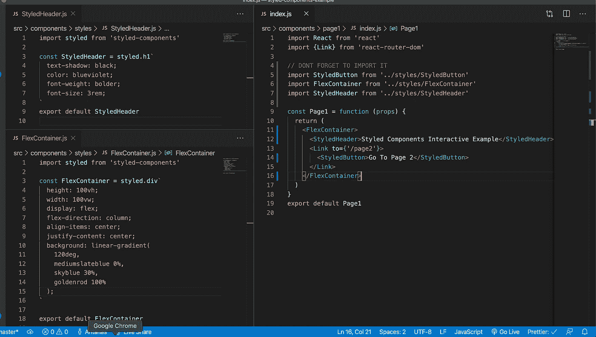

# 样式组件——用 React 和 Javascript 编写您的 CSS

> 原文：<https://levelup.gitconnected.com/styled-components-do-your-css-in-react-and-javascript-c34d00e45796>

React Powered 样式使设计可重用组件变得轻而易举。


约书亚·阿拉贡在 [Unsplash](https://unsplash.com?utm_source=medium&utm_medium=referral) 上拍摄的照片

我最近在为我的一个 React 项目开发一个新特性，无意中发现了一个使用 CSS 包样式组件的简短教程。Styled Components 是 React 的一个 Javascript 样式表(JSS)引擎，具有强大而直观的工具来制作很酷的动画、过渡和可重用的组件。

我立刻意识到这种方法有一些真正的力量。这意味着您可以在 Javascript 文件中声明您的 CSS，这意味着您可以通过将不同的样式文件分开来分离关注点，这对于重用样式和保持代码整洁肯定是有用的。

但是你可能在想，这和其他 100 个 CSS 框架有什么不同呢？的确，你可以使用 css 编译器，为不同的元素创建不同的 CSS 文件。的确，你可以使用 SASS 或更少的东西来组织你的 CSS。或者你可以使用 Bootstrap、SemanticUI、布尔玛或者任何以前做过这项工作的样式库。但是如果你想建立你自己的风格，并且创建你自己的可重用的风格化组件，一个最好和最干净的方法就是风格化组件。

样式化组件是用内联 CSS 编译的 React 组件。这种方法的一个很大的优点是，您可以用 Javascript 构建样式，然后将其提供给编译器。这意味着您可以插入属性、函数或值 CSS 变量。这使得代码更加简洁，在可重用、可打包的组件中尤其有用。

下面是样式化组件实现的几个例子。

我创建了一个起点，包含两个页面，分别是 create-react-app、react-router 和基本布局。您可以使用以下终端命令从 github 克隆。您将需要一个节点环境和一个代码编辑器。

```
git clone https://github.com/APTricou/styled-components-example.git
cd styled-components-example
git checkout startingpoint
npm install
npm start
```

启动应用程序后，在代码编辑器中打开它。进入 src > components > page1 > index.js。您将看到我们的主登录页面的结构，其中有一个容器、一个标题、一个链接和一个 div，每个都有一个类名。在大型项目中，这可能会变得很乏味，因为您可能需要在全局名称空间中处理样式。打开 src > index.css 下的 index.css 文件。


第 1 页和它的 CSS 类并排

你看到的是一些特定的 CSS，和一些通用的类名。让我们制作第一个样式组件。首先我们需要安装库。在您的终端项目的根目录中:

```
npm install styled-components
```

现在在 src > components 中创建一个名为 styles 的新文件夹。在该文件夹中创建一个名为 StyledButton.js 的文件，然后将以下代码放入其中:

```
import styled from 'styled-components'const StyledButton = styled.div`` //CSS goes hereexport default StyledButton
```

现在将我们的 CSS 从 index.css 类 styled-button 直接复制粘贴到模板文本中。您已经创建了您的第一个样式组件！回到 Page1 的索引文件，用新样式的按钮替换代表按钮的 div。


您的按钮现在运行在它自己编译的 CSS 上。styled-components 使用的 CSS 预处理程序是 stylis。它在组件挂载时就地编译 CSS。

您可以对标题和容器执行相同的操作。最后的文件应该是这样的:



更多样式的组件

已经进口了很多了。我们可以将这些项目合并成一个索引文件。一旦你这样做了，你就可以创建一个样式库了！如果您需要如何做的参考，请转到 src > components > index.js。

接下来让我们看看第 2 页。内联式道具？样式组件也需要这些。


带有样式对象输入的样式化组件

现在我们可以进入一些逻辑。因为我们是在 React 组件中编写，所以我们可以在 CSS 中插入状态。它将解释各种可能的状态，并在编译器中为每个状态创建不同的 CSS 类。

让我们这样做，当你点击消息框时，它会浮动到屏幕的右侧，并允许我们更有效地使用左侧。

将有状态布尔值传递给名为 right 的 MessageBox。我们将能够在我们的 CSS 模板中使用它。给 MessageBox 一个 onClick 侦听器来切换状态。然后在“right”CSS 属性中插入一个回调，根据 right 是真还是假返回一个不同的值。您还可以添加过渡属性。您的代码应该如下所示:


将状态插入 CSS。您也可以在模板文本中这样做。

访问 CSS 状态中的属性的方法是通过回调。编译器将道具传递给回调函数，这就是我们如何将条件信息传递给样式。

现在当你转到第 2 页时，点击消息框应该会在屏幕的右边显示出来。还有许多其他方法可以考虑改变风格。您可以隐藏组件，直到其他一些状态变得真实，通过使用 [ThemeProvider](https://styled-components.com/docs/advanced#theming) 将主题颜色传递给它们以创建深色和浅色主题，给它们默认的道具以便它们在没有上下文的情况下运行，使用嵌套来设计子组件的样式，以及更多的调整和优化。

对于这最后一节，让我们创建一个有趣的样式组件。采用以下代码，并更新或创建适当的文件。或者，您可以切换到“分支最终”来查看最终结果。

```
// Page2.js
import React, {useState, useEffect} from 'react'
import {Page2Container, MessageBox, CoolBackground, BeatBar} from '../styles'const Page2 = function (props) {
const [right, setRight] = useState(false)
const [heights, setHeights] = useState(new Array(15).fill(0))
function randomHeight() {return Math.ceil(Math.random() * 100)}
useEffect(() => {
setInterval(() => setHeights(heights.map((x) => randomHeight())), 300)
}, [])return (<Page2Container>
  <MessageBox right={right} onClick={() => setRight(true)
    <h1>Welcome to Page 2</h1>
    <h3>Let's make a Cool Animation</h3>
  </MessageBox>
  <CoolBackground right={right}>
    {heights.map((height, index) => (
      <BeatBar key={index} height={height} />
    ))}
  </CoolBackground>
</Page2Container>
)}export default Page2
```

在样式组件文件中:

```
// CoolBackground.js in styles folderimport styled from 'styled-components'
const CoolBackground = styled.div`
  width: 50%;
  height: 90vh;
  margin-top: 5vh;
  margin-left: 5vw;
  background: transparent;
  display: ${(props) => (props.right ? 'flex' : 'none')};
  flex-direction: row;
  justify-content: center;
  align-items: flex-end;
  opacity: ${(props) => (props.right ? 1 : 0)};
  transition: 1s all ease;

  h1 {
    text-transform: uppercase;
    color: black;
  }
`
export default CoolBackground// BeatBar.js file in styles folderimport styled from 'styled-components'const BeatBar = styled.div`
background-color: rgb(${(props) => (props.height * 255) / 100}, 100, 100);
margin: 0.1rem;
height: ${(props) => props.height}%;
width: 3rem;
transition: 0.3s all ease-in-out;
opacity: ${(props) => 0.5 + props.height / 200};
border-radius: 1rem;
`
export default BeatBar// index.js in styles folderexport {default as StyledButton} from './StyledButton'
export {default as FlexContainer} from './FlexContainer'
export {default as StyledHeader} from './StyledHeader'
export {default as Page2Container} from './Page2Container'
export {default as MessageBox} from './MessageBox'
export {default as CoolBackground} from './CoolBackground'
export {default as BeatBar} from './BeatBar'
```

现在，当您转到应用程序的第 2 页时，您应该会看到类似这样的动画:


第 2 页已完成

就是这样！用 CSS 和 React 探索的方向有很多。

这是一个带有样式化组件的 CSS 的快速概述和教程。Styled-components 是一个用于 React 的 Javascript CSS 编译器，它允许您编写模块化的 CSS 代码，并轻松、干净地向组件提供有状态转换。如果你想探索更多的风格组件，你可以查看他们的文档。