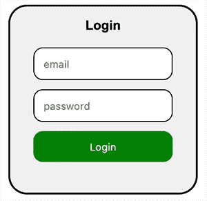
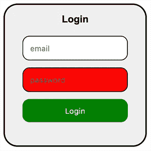

# 风格组件——三步走的基本要素

> 原文：<https://levelup.gitconnected.com/styled-components-essentials-in-three-steps-a61fb9372ded>


照片由[你好我是尼克·🇬🇧](https://unsplash.com/@helloimnik?utm_source=unsplash&utm_medium=referral&utm_content=creditCopyText)在 [Unsplash](https://unsplash.com/search/photos/lego-part?utm_source=unsplash&utm_medium=referral&utm_content=creditCopyText)

我喜欢 React 和样式组件。这就像用乐高积木把东西建成更大更完整的东西。

样式化的组件非常棒，是 React 的完美匹配。他们真的是。而且它们也很容易理解…真的。在这篇文章中，我将把你需要知道的入门知识分成三个部分。没有深入的技术和简单的解释。如果你知道这三件事，你就知道如何在你的项目中毫无争议地使用样式组件。

这三件事是:

1.  **如何创建和使用样式化组件。**
2.  **如何用 props 有条件地修改你的 CSS**
3.  **如何打造全局造型？**

我现在将一个一个地检查它们。

# 1.如何创建和使用样式化组件

我就直入主题了。首先，您必须在项目中安装样式化的组件。键入以下命令:

```
npm i styled-components
```

现在你可以走了。您可以在项目中使用样式化的组件。下面是一些代码，我会在下面解释。好好看看，继续读下面的代码。

上面的代码将创建一个名为 Login 的组件，如下所示:



Login.js 组件中的登录表单

没什么特别的，没什么特别的。只是一个登录组件，帮助我们更好地理解样式组件。好的…在上面的代码中你会注意到的第一件事是，我们必须以某种方式告诉 React 我们想要使用样式化的组件。我们通过像这样导入它来做到这一点:

```
import styled from “styled-components”;
```

现在我们已经导入了一个名为`styled`的对象，我们可以用它来设计样式或组件。这个对象有不同的属性，你可以根据你想要的样式来使用。如果它是一个 div，就像在我们的例子中一样，您只需访问`styled`对象上的 div 属性。像这样:`styled.div`

如果你想设计一个按钮，你可以简单的输入`styled.button`来代替。或者如果是 h2 标签，你可以输入`styled.h2` …你明白了！

这些属性保存着可以用*标记的模板文字*调用的函数。这意味着我们可以使用反勾号将数据发送给这些函数，然后将 CSS 放在这些反勾号之间(````)。您还可以创建一个 const 来保存样式化的组件。因此，如果我们想为我们的登录组件创建一个样式化的组件，我们只需编写以下代码:

简而言之；要为带有样式化组件的 div 元素创建样式，只需使用以下语法:

```
const SomeName = styled.div` CSS code goes here … `;
```

那么你可以把它当作一个普通的组件来使用:

```
<SomeName> Your other code here … </SomeName>
```

您可以根据需要创建任意数量的样式组件。在上面的例子中，我创建了两个样式化的组件；一个叫`StyledLogin` 一个叫`StyledInput` **。**

关于创建标准样式组件的另一件事是嵌套部分。样式组件能够嵌套样式，就像你在 SASS 中所做的那样。你可以在上面的代码中看到，我已经为 **h2** 和**按钮**元素嵌套了我的样式。这在很多方面都很棒！这将使你的代码更加结构化和整洁。您可以很容易地看到什么样式属于什么组件。您还将样式隔离到仅该组件，这意味着应用程序中的其他 **h2** 和**按钮**元素不会受到影响。

因此，当有意义时，使用嵌套来设计元素。但这并不总是有意义的。您不必为每个小元素创建一个全新样式的组件。这时像这样的筑巢就派上用场了。

还剩一个…两个。

# **2。如何用道具有条件地修改自己的 CSS？**

风格化组件可以接收道具。就像一个普通的组件。通过向你的样式组件传递道具，你可以做一些有条件的 CSS 样式。Smooooooth …🏄‍♂️

假设我们想根据用户是否输入了错误的密码来改变密码输入字段的颜色。

好的，我意识到这是一个非常简单的解决方案，在这种情况下，不仅仅是一个简单的道具。但是为了这篇教程文章，姑且这么说吧。

如果我们有一个名为`correct` 的道具被设置为 false，我们将文本框改为红色。让我们看看下面的代码。为了节省空间，我有意省略了整个登录组件的样式代码。所以让我们假设它就在那里，和上面的一样。

这会给我们这个结果:



首先看一下`Login`组件。还有那个`StyledInput`组件。我已经创建了一个名为`correct`的道具，并将`true`和`false`传递给两个不同的组件。获得*真值*的将显示为红色。要在样式化组件 CSS 中访问该属性值，可以使用以下代码:

```
background: ${prop => prop.correct ? ‘white’ : ‘red’};
```

你只需在一个箭头函数中创建一个三元运算符，用`${}`包围，告诉这个样式化的组件如果`prop.correct` 是`false`就选择白色。如果`prop.correct`是`true`，则使用红色。就这么简单！

你可以用任何你想要的 CSS 属性做到这一点！✌️And:这就是你如何在样式化的组件中用道具做条件 CSS。

完成两个…还剩一个。

# **3。如何打造全局造型？**

使用样式化组件需要知道的最后一件重要事情是创建全局样式。

全局样式是通过使用样式化组件库中用于此目的的特殊函数来实现的。它叫做`createGlobalStyle` 你这样导入 **:**

```
import { createGlobalStyle } from ‘styled-components’;
```

然后，您可以创建一个全局样式的组件，如下所示:

您只需将全局样式组件放在应用程序的顶层。然后，它会在你的应用程序中使用该样式。在这种情况下，我假设顶层组件名为`App`。你也可以在全局样式的组件中使用 props 和做一些条件 CSS。就像常规样式的组件一样。

# 结论

就是这样！关于样式化组件还有更多，但是我认为这确实是使用样式化组件需要知道的要点。如果你有兴趣了解更多，我强烈建议你去 https://www.styled-components.com/docs/网站阅读那里的文件。

另外，感谢你阅读这篇文章。我是一名来自瑞典的开发人员，热爱教学和编码。我还在网上开设了 React 和 Gatsby 课程。你可以在 Udemy 上找到我。只需搜索托马斯·魏本法尔克或在推特上帮我联系一下**@魏本法尔克**

我也有一个 Youtube 频道是我教的免费东西，看看这里的[](https://www.youtube.com/channel/UCnnnWy4UTYN258FfVGeXBbg)