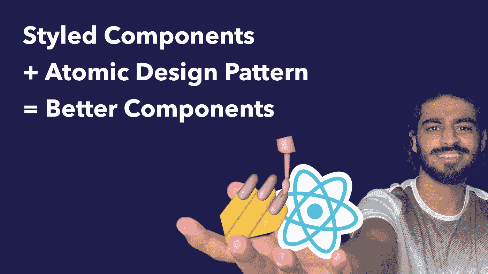
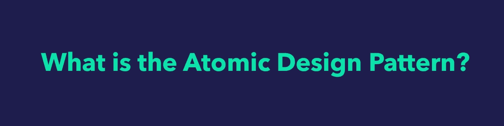
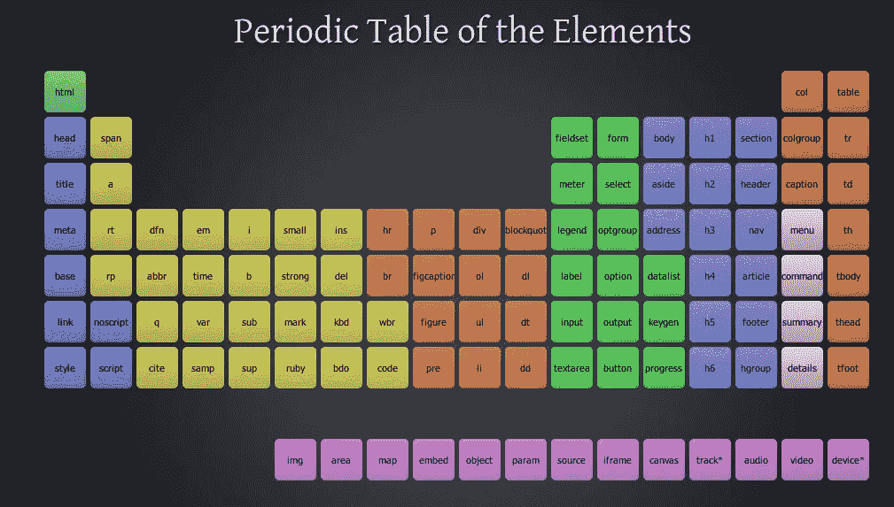
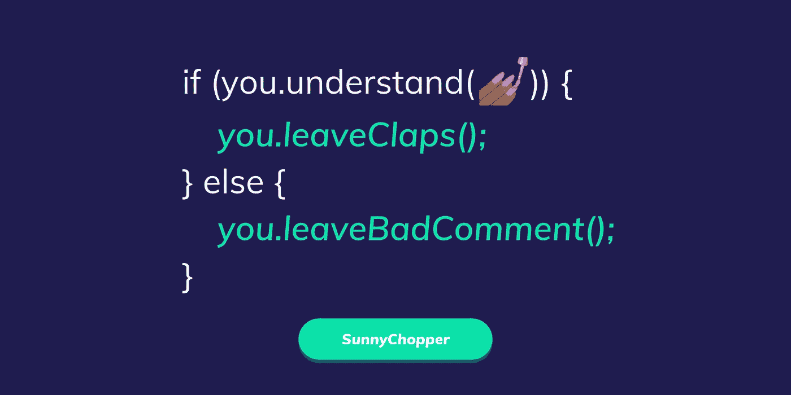

# React 中的样式化组件——使用原子设计模式快速开发新组件

> 原文：<https://levelup.gitconnected.com/styled-components-in-react-using-the-atomic-design-pattern-to-quickly-develop-new-components-d7fe65c81369>



作为一名前端开发人员，我们有很多选择来决定如何设计组件的样式。然而，一些选择，如使用 CSS 文件或内联样式，正在成为过去。

样式组件的未来趋势是 CSS-in-JS。什么是 CSS-in-JS？简单来说，这是一种在 JavaScript 文件中编写 CSS 代码的方式。Styled Components 是目前互联网上领先的 CSS-in-JS 库。

此外，Airbnb、Lyft 和谷歌等公司使用了风格化组件。为什么这很重要？这意味着 Styled Components 拥有活跃的贡献者基础和繁荣的社区。我只是 Styled Components 社区中的一员。

然而，这篇文章并不是“风格化组件的介绍”，而是关于你如何以一种聪明的方式使用一种技术，比如风格化组件。这篇文章的目标是回答“我如何才能充分发挥样式化组件的潜力？”

所以让我们开始吧。



让我们回到你的高中化学课。我们知道，宇宙中所有的物体，无论多么复杂，都是由原子构成的。无论这些物体是否有生命，一切都是利用这些原子从“地面”开始建造的。

原子与其他原子结合产生分子。分子聚集在一起，创造出更复杂的有机体，如细胞。有机体聚集在一起创造出更复杂的结构。你看到模式了吗？

您从最基本的构建块原子开始，并开始从它开发更复杂的结构。

这听起来非常像我们构建 React 组件的方式。我们采用 HTML 的构建块，例如一个`<div>`，并将它们与 HTML 的其他构建块配对，以创建更复杂的结构。

这就是原子设计模式背后的思想。但是，如何以一种智能和可控的方式将组件分解成最基本的元素呢？这就是这个方便的元素周期表派上用场的地方。


不，我们不会讨论什么是氢和氦，但是，我们会讨论任何 HTML 页面的基本构件是什么。

在研究这个话题的时候，我看到了一张非常有用的图片，你会想把它保存到你的电脑上。说真的，这很有帮助。就 HTML 元素而言，它本质上是一个“元素周期表”。



这些都是您可以使用样式化组件构建和应用样式的可能“原子”。例如，使用样式化的组件，你可以给任何将在你的网站上使用的`<table>`或``一个基本样式。

此外，您可以使您的原子“动态”和完全可定制，同时通过利用您可以将道具传递给样式化组件的事实来维护基本设计。不仅如此，您还可以将属性传递给样式化的组件。如果必须定义某些属性，例如图像中的`src`，这可能会很有帮助。下面是一个应用于``元素的例子:

```
import styled, { css } from 'styled-components';const **Image** = styled.img.attrs((props) => ({
    src: props.src
}))`
    width: 100%;
    height: auto;
    border-radius: 8px;

    ${props => (props.shadow != undefined) && css`
        box-shadow: 0px 4px 8px 0px rgba(42, 42, 42,0.25);
    `} ${props => (props.circle != undefined) && css`
        border-radius: 50%;
    `} 
`;
```

这是一个相当简单的例子，然而，现在无论何时你在构建更复杂的“分子”(下面会有更多)，你都可以选择如何配置你的`<Image>`风格的组件。例如，如果你想让你的图像在某个地方有一个阴影，只需给你的样式组件传递`shadow`道具，你的图像就会有一个阴影。

```
const SomeComponent = () => {
    return (
        <**Image** src="..." shadow />
    );
}
```


假设您想要控制您的`<Image>`风格的组件在不同屏幕尺寸上的外观，这就是整个 CSS-in-JS 范例真正的亮点。你可以简单地传入一个返回 CSS 的函数。

因此，举例来说，如果我们想在移动设备上添加样式化`<Image>`组件的选项，只需向它传递一个 prop，您就可以像这样构建您的样式化组件:

```
import styled, { css } from 'styled-components';const **gimmeMobileStyles** = (mobileStyles) => {
    var styles = '@media only screen and (max-width: 480px) {';

    mobileStyles.forEach((style) => {
        styles += style;
    }); styles += '}';

    return css`${styles}`;
};const **Image** = styled.img.attrs((props) => ({
    src: props.src
}))`
    width: 100%;
    height: auto;
    border-radius: 8px;

    ${props => (props.shadow != undefined) && css`
        box-shadow: 0px 4px 8px 0px rgba(42, 42, 42,0.25);
    `} ${props => (props.circle != undefined) && css`
        border-radius: 50%;
    `} ${props => (props.mobileStyles != undefined) && 
        gimmeMobileStyles(props.mobileStyles)
    }
}`;
```

现在，无论何时你想让你的`<Image>`组件在移动设备上有不同的风格，你可以传入一组 CSS 规则，它们将通过媒体查询应用到你的组件。

这只是一个移动样式的例子，你可以传入一个道具来在平板电脑，小型笔记本电脑，大型桌面屏幕上进行样式设计，所有这些都是通过一组 CSS 规则传入的。


因为原子意味着在整个应用程序中可以反复使用，所以您可以开始将某些原子组合到同一个文件中，然后简单地导出它们。

您的文件结构可能如下所示:

```
components
|__ atoms
    |__ typography.js
    |__ tables.js
    |__ ...
```

先睹为快`typography.js`:

```
// components/atoms/typography.jsimport styled from 'styled-components';const gimmeMobileStyles = () => { ... };export const HeaderOne = styled.h1`...`;
export const HeaderTwo = styled.h2`...`;
export const HeaderThree = styled.h3`...';
...
```

现在你已经把所有的基于排版的原子都放在一个文件里了，这使得访问变得快速和容易。如果您正在处理一个需要您的样式化`h1`的组件，您可以简单地用下面的 import 语句导入它:`import { HeaderOne } from 'components/atoms/typography.js';`


从这里，我们可以用原子来制造分子。有了这些分子，我们可以建造有机体等等。让我们走过每一步。


现在你已经定义并设计好了所有的原子，是时候开始用这些原子建造更令人兴奋的结构了。一般来说，在化学中，通常几个原子聚在一起形成一个“分子”，如 H2O。

以同样的方式，通过把一些原子放在一起，你可以开始创造更有趣的成分，这些成分被称为“分子”

例如，我们可以将一个样式化的`<Label>`和一个样式化的`<Input>`组件组合在一起，创建一个`<FormInput>`样式的组件。


通过拼接不同的分子，你可以开始创造有机体。这是事情开始变得真正有趣的地方。就像在生物学中一样，简单的生物体通常只有一个目的。

例如，我们可以使用多个`<FormInput>`组件来创建一个`<SignupForm>`组件。这个机构的目的是帮助用户注册。有了这种有机体应该只有一个目的的心态，你可以更聪明地定义你的有机体。


想知道是什么让一个蚁群能够完成非同寻常的任务，比如与其他蚁群展开战争？毕竟，一只蚂蚁自己做不了多少事情。那么一群相当没用的蚂蚁怎么能走到一起做点有用的事情呢？

他们能够做到这一点是因为一种叫做涌现理论的东西。它本质上是说“整体的总和大于单个部分的总和。”如果您不太明白这一点，下面是应用于我们的 ant 示例的数学格式的相同语句:

```
(*capability of whole colony*) **>** (*capability of ant 1*) + (*capability of ant 2*) + ...
```

同样的理论可以应用于我们的反应有机体。每个有机体实际上只能做一件事，然而，通过将它们放在一起，它们可以开始创建复杂的用户界面。

例如，将一个`<BlogBody>`有机体放在一个`<Sidebar>`有机体旁边，你就开始创建任何博客页面的内容。

另一个常见的例子是导航条。你通常会有一个`<Logo>`组件，一些`<NavLink>`组件，可能还有一个`<SearchBar>`组件。通过将这些有机体放在一起，您已经创建了一个`<Navbar>`组件。

知道你是否正在处理一个布局的一个很好的经验法则是看看你写了多少“定位”和“调整大小”的 CSS 规则和“像素样式”的 CSS 规则。例如，如果你主要使用`position`、`display`、`flex`、`width`或`height`这样的样式，你很可能正在处理一个布局。


原子设计模式的最后一步是获取布局并排列它们，以便创建一个完整的页面。这可能是一个相当简单的步骤，然而，当你只需要写几行 JSX 就可以创建一个完整的页面时，你所获得的满足感是无价的。

例如，我们可以有以下布局:`<Navbar>, <BlogPost> and <Footer>`。通过将它们按顺序排列，我们可以完成一个完整的博客帖子页面。说真的，你的 JSX 将会是下面这个样子:

```
return (
    <BaseHTML>
        <Navbar some_props />
        <BlogPost some_props />
        <Footer some_props />
    </BaseHTML>
);
```

**注意:**如果你看一下元素周期表，你会注意到左上角有一个`<html>`标记。你想在任何页面上使用的基本样式就是上面的`<BaseHTML>`组件。


我们必须记住，样式化组件归根结底只是一个工具。它不会自动解决你的造型问题。你仍然需要知道如何正确使用这个工具。这就是原子设计模式可以发挥作用的地方。

原子设计模式中每个级别的快速总结，以及它们如何依赖于它下面的级别来完成事情:

1.  **Atoms** :任何 HTML 页面最基本的构建块。
2.  **分子**:由几个不同的*原子*组成的成分。
3.  **生物体:**多个*分子*为了一个单一的目的放在一起。
4.  **布局** : *有机体*放在一起创建复杂的用户界面。
5.  **页面** : *布局*排列成一整页。

最后，一个可以与样式化组件和原子设计模式相结合的工具叫做 Storybook。它帮助你以一种隔离的方式开发、组织、文档化和测试组件，这对于坚持原子设计模式是完美的。如果你真的想升级你的前端架构，在这里学习 Storybook 以及如何将它添加到你的 React 项目中。

## 还有问题吗？

如果你对样式组件或原子设计模式有任何疑问，请随时通过[电子邮件](mailto:ishy.singh@gmail.com)或 [Twitter](https://www.twitter.com/sunnychopper) 联系我。

