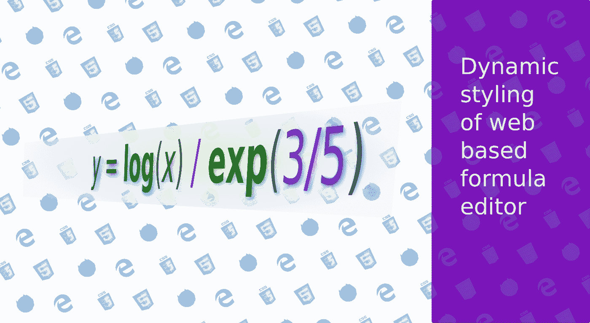
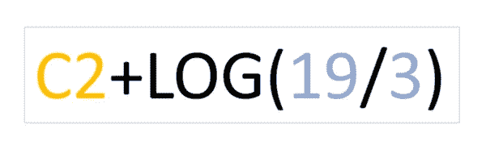
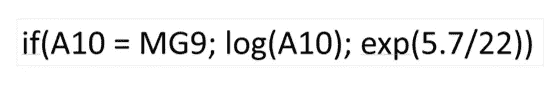

# 在网页中设计类似电子表格的公式编辑器

> 原文：<https://levelup.gitconnected.com/styling-a-spreadsheet-like-formula-editor-in-a-web-page-c63cba8bfb1c>



从枯燥到生动的格式，因为你键入它！

你用过 Google Sheets 吗？您可能已经注意到，当您编辑包含公式的单元格时，Sheets 会以一种特定的格式显示各种组件:



数字常量、函数和单元格地址都有特定的样式

床单的作用不止于此。它会发现语法错误(比如函数中有太多的右括号或额外的参数)，当然也会执行实际的计算。

在本文中，我们将使用 JavaScript 和 CSS 在网页中重现类似的行为，除了计算步骤。完整代码可在 github 获得。为了简洁起见，我们将只提及其中的一些部分。

# 公式语法

在这个练习中，我们将使用有限的公式语法。具体而言，每个元素的传统含义如下:

*   格式为 **ZZ999** 的单元格地址，最多包含两个字母和三个数字:A1、B22、FG4、WA901
*   数字，可选前导符号和可选小数部分:94，-78.02，. 00009 等。
*   四个算术运算符: **+** ， **-** ， ***** ， **/**
*   字符串或文本常量，任何用双引号括起来的东西:“柏林”、“900”、“饶了我吧”。这样我们就避免了电子表格中典型的最初的 **+** 或 **=** 。
*   关系运算符: **=** ， **<** ， **< =** ， **>** ， **> =** ，**！=**
*   二元逻辑运算符:**与**、**或**、**异或**。
*   一元逻辑运算符:**非**。
*   只有 4 个函数，其中两个有一个参数( **exp** ， **log** )，一个有两个参数( **index** ，查找一个字符串常量在另一个字符串中的位置)，一个有三个参数: **if**
*   分号:**；**这将用于分隔函数中的自变量
*   括号，左括号和右括号，用于括起函数参数并改变运算符的自然优先级。
*   空白和制表符将被识别，但被赋予空的语法值。

这是非常基本的，但是您可以将相同的原则应用于更复杂的语法。根据这些规则，有效的、无样式的公式可以是:



一个有效的，统一风格的公式

# 符号化

如果我们想对数字、函数和字符串应用不同的风格，我们需要识别各个项目。将一个长的或短的公式转换成单独的记号叫做——是的，记号化。上述公式将在标记列表中进行标记化后进行转换:

```
function if - left parenthesis - cell A10 - equals - cell MG9 - semicolon - function log - left parenthesis; cell A10; semicolon - right parenthesis - semicolon - function exp - left parenthesis - number 5.7 - operator division - number 22 - right parenthesis - right parenthesis
```

一些标记完全由其类定义——左括号就是左括号。然而，其他一些标记是由它的类*和*的值定义的，特别是数字和字符串常量。为此，我们定义了一个只有令牌类型和值的*令牌*类，该值可能为空。

在表征公式的各种方法中，我们将求助于正则表达式。对于正则表达式，要么你知道并使用它们，要么你不知道，它们会吓到你。你可以在 <span id="#chunk-1" class="op-class">/</span>
<span id="#chunk-2" class="num-class">3</span>
</div>

每个令牌都有我们想要的自定义样式。如果我们只添加或删除一个字符，整个公式将被重新格式化。这是你在 github 上找到的 CSS 的样子:


光标在右边时，A22/3 会是什么样子

这允许我们在键入和更正公式时重新格式化公式，提供非常动态的用户体验。见下文:

在我们键入公式时格式化公式

# 光标位置

我们需要尊重重新格式化后的光标位置。在格式化之前，我们将当前光标位置存储在`getCaretPosition`中。在对我们的公式进行样式化之后，我们在`restoreCaretPosition`中恢复那个值，如果整个长度减少了，可能会减少它。然后，我们遍历被光标位置完全覆盖的各种 HTML 块，并在最后一个完全或部分覆盖的块的中间设置选择。

# 语法呢？

我们所做的还不够。我们希望向客户报告语法错误。像这样的一行


公式不正确

有两个语法错误:`log`不能有两个参数，`exp`后跟一个数字。我们应该能够发现这些错误，并以某种方式将它们可视化。

要做到这一点，我们需要建立对应于这个公式的语法树，然后检查这样的树是否与语言的规则兼容。我们将在下一篇文章中解决这个问题。

# 结论

以 regex 为主要工具的优秀的旧式词法分析和以 CSS 为形式的现代 HTML5、JavaScript 的结合帮助我们产生了一个看起来很好的、随用随取的公式编辑器。然而，我们需要添加更多的功能来捕捉任何语法错误。目前你可以在 [github](https://github.com/angelnew/formulaeditor.git) 中播放并微调编辑器。

[](https://gitconnected.com/learn/javascript) [## 学习 JavaScript -最佳 JavaScript 教程(2019) | gitconnected

### 50 大 JavaScript 教程-免费学习 JavaScript。课程由开发人员提交并投票，从而实现…

gitconnected.com](https://gitconnected.com/learn/javascript)