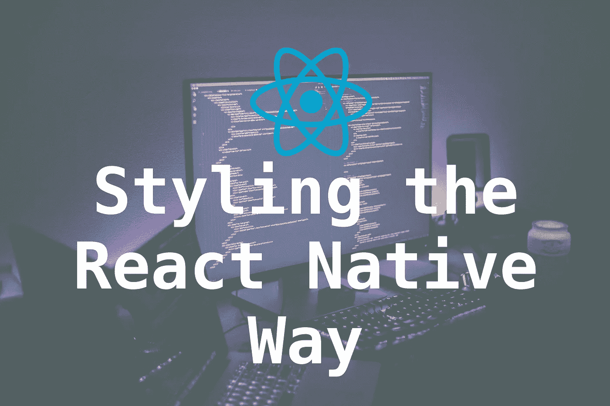
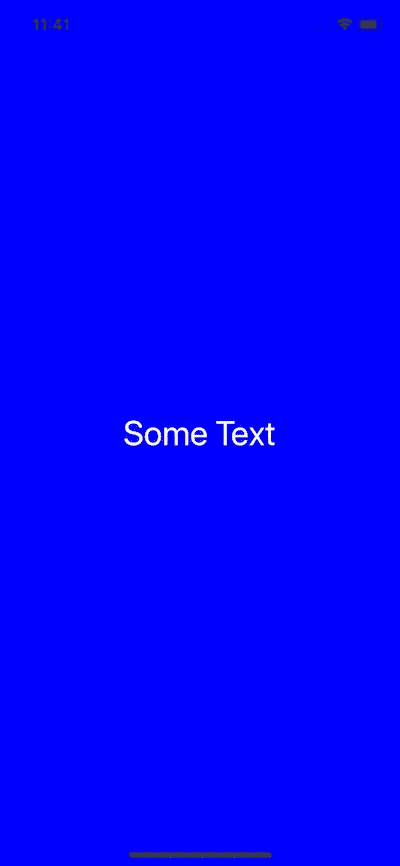
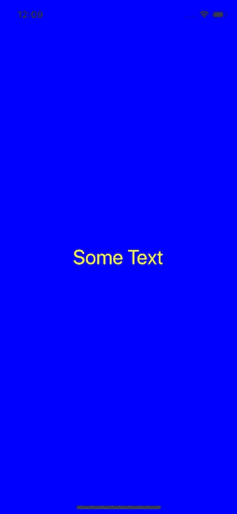
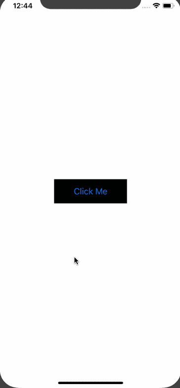

# 以本机方式设计 React

> 原文：<https://levelup.gitconnected.com/styling-the-react-native-way-3cc6d3ef52d0>

*信用*:Unslpash——布莱克·康纳利

React Native 附带了许多内置组件，您可以使用它们来设计跨平台应用程序。设计好移动应用程序是至关重要的。对于一个手机应用程序来说，拥有令人愉悦的设计和良好的色彩运用是多么重要，这一点我怎么强调都不为过。如果没有一个完美的用户界面，潜在用户会因为手机应用缺乏设计而反感。React Native 使用普通 JavaScript 来样式化。在本教程中，您将通过获得一些实践经验和学习技巧来探索不同的 React 本机应用程序风格化方法。

# 介绍

React Native 使用 JavaScript 来进行样式化，如果你对 web 的 CSS 有一些经验，你就会知道对一个组件进行样式化只不过是通过使用适当的样式化语法来编写代码。如果你不知道 CSS 是什么，我建议你就此打住，因为阅读这篇教程对你没有任何好处。你需要了解一点 CSS 来继续阅读下面的教程。如果你明白`backgroundColor: 'blue’`的意思，那么你就可以开始了。

React Native 提供了许多内置组件，每个组件都有自己特定的风格。这些特定的样式可能适用于其他组件，也可能不适用。例如，`Text`组件支持`fontWeight`，而`View`组件不支持。但是，有些风格是相似的，但不完全相同。`View`支撑`shadowColor`，而`Text`支撑`textShadowColor`。最后，你必须注意到有一些特定于平台的风格，比如`shadowPropTypesIOS`。

# 对 React 本机应用程序进行样式化的不同方法

向 React 本机组件添加样式有多种方式。第一个是**直列造型**。请参见下面的示例。

上述代码片段的结果如下。

在我之前关于[**2019 年 React Native 入门**](https://hackernoon.com/getting-started-with-react-native-in-2019-build-your-first-app-a41ebc0617e2) 关于`StyleSheet`对象的文章中。这是第二条路。

 [## 2019 年 React Native 入门:打造你的第一款应用

### 了解如何使用重要的基本概念构建您的第一个 React 原生应用程序，并从这里开始学习！

levelup.gitconnected.com](/getting-started-with-react-native-in-2019-build-your-first-app-a41ebc0617e2) 

通过导入和使用`StyleSheet`，您可以创建一个样式对象并单独引用每个样式。这将样式从 render 方法中分离出来，并帮助您组织代码。此外，它促进了跨组件重用样式。

这段代码在移动设备上呈现时会有相同的效果。这里唯一改变的是用`StyleSheet`对象分离组件`App`中的样式。它像上面一样接受一个 JavaScript 对象，并从中返回一个新的`Stylesheet`对象。像 web 开发一样，React Native 中没有类或 id。**创建一个新的样式对象你使用** `**StyleSheet.create()**` **方法。此方法**的另一个优点是，每次创建新的样式对象时，`StyleSheet`有助于创建带有 ID 的样式对象，该 ID 进一步用于引用，而不是一次又一次地呈现整个组件。

# 样式的封装

在 React Native 中，样式的范围是组件，而不是整个应用程序。我们已经看到了一种定义 React 本地社区常用的样式的首选方法。还有另一种定义样式的方法，以这样一种方式组织您的应用程序代码，以便在重构时或者当应用程序开始变得庞大时，更容易跟踪它们。在第二种方法中，您在一个单独的文件中声明与组件相关的所有样式。然后将样式文件导入组件文件中。这里给你举个例子。在`App.js`旁边创建一个名为`AppStyles.js`的新文件。

下一步是将这个文件导入到`App.js`中。

演示运行并产生与之前相同的结果。这种在组件文件之外的文件中分离样式的做法有其自身的优势。它增加了其他样式对象的可重用性。

# 使用数组传递样式

在内联样式中，您一定已经观察到它只是一个以`style` prop 开始的对象，并且一个对象是通过键值对传递的。类似地，您可以使用一个包含多个键值对的数组作为`style`属性的值。

以下是上述代码片段的结果。

请注意，当有重复的`color`属性时，传入的最后一个样式会覆盖先前的样式。

# 构建应用程序:暗/亮主题

在本节中，您将构建一个名为**亮/暗模式**切换的简单应用程序。它包含一个按钮，按钮上有一些文本，它自己有一个深色背景和一个浅色背景。当用户点击按钮时，应用程序的背景会变为深色模式，按钮上的文本会变为浅色模式。

首先，让我们为它定义样式。打开`AppStyles.js`外部造型文件。

这里发生了很多事情。首先，在单个`Colors`对象中定义了两个不同的颜色变量。然后，有两个不同的容器对象，一个用于背景，一个用于按钮。然后在样式表对象中重用这两个容器对象，`lightStyles`和`darkStyles`。类似地，为了定义背景颜色，我们重用了 color 对象，这样我们就不必将每种颜色的值写两次。

最后，有一个基于布尔值返回主题的导出函数。黑暗主题的值`darkStyles`被返回，如果它的真实否则光明主题被返回。

文件`AppStyles.js`是 React 本地应用中结构化样式的清晰表示。然后，该文件被导入到包含以下内容的`App.js`中。

通过定义状态，你可以声明暗主题的默认值为假，比如它允许亮主题作为默认值。`toggleTheme`是相应地反转黑暗主题的布尔值的方法。接下来，在`render()`中，您将从状态中传递黑暗主题的当前值。然后，这个函数用于根据布尔值应用正确的主题或样式集。

您可以在下面的操作中看到这一点。

*您可以在下面的 Github 资源库中找到这个例子的完整代码👇*

 [## amandeepmittal/react-native-工作区

### ⚛️ + 📱对本土事物做出反应。通过在…上创建帐户，为 amandeepmittal/react-native-workspace 开发做出贡献

github.com](https://github.com/amandeepmittal/react-native-workspace/tree/master/02-themeApp) 

我经常写关于 web 技术的文章，但是我主要关心的是在 React Native 上提供内容。你可以在 Medium 上关注我，也可以**在这里订阅我的** [**每周简讯** b](https://tinyletter.com/amanhimself) elow 直接在你的收件箱里接收**我所有的教程**📧