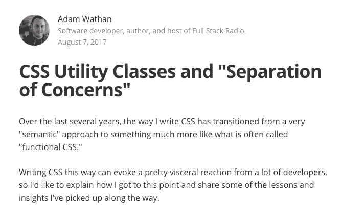
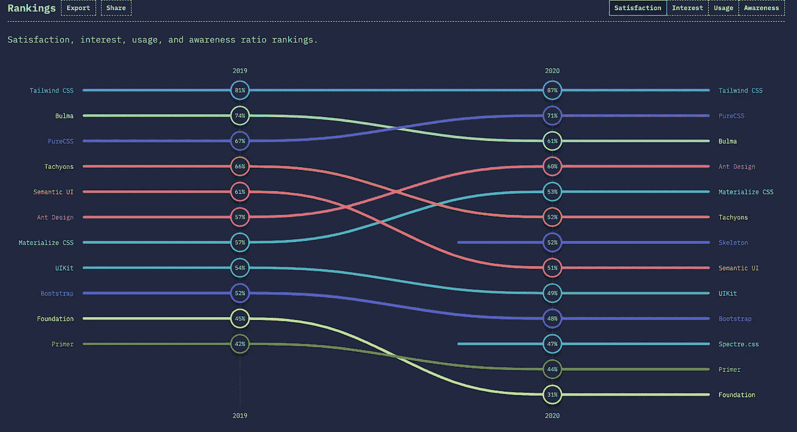
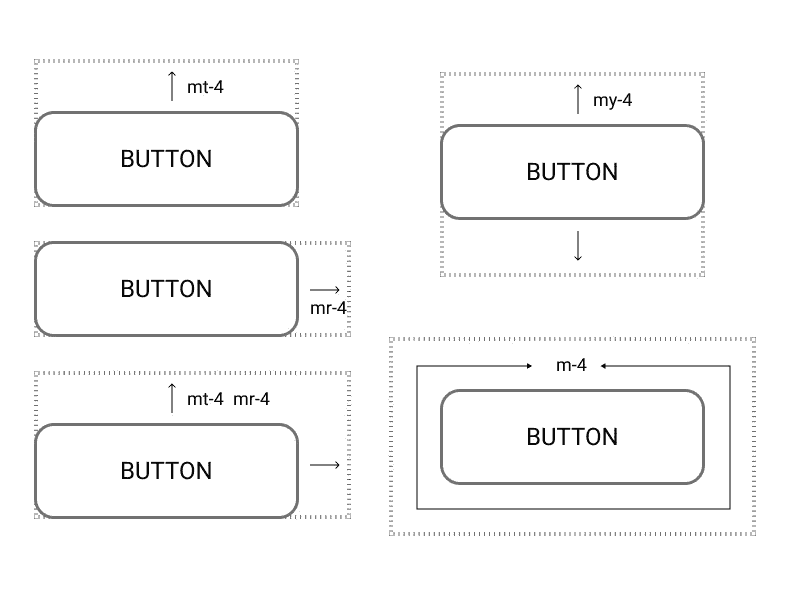
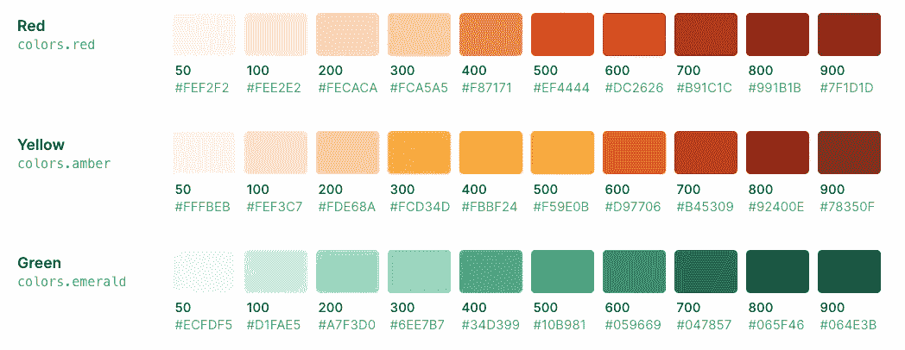
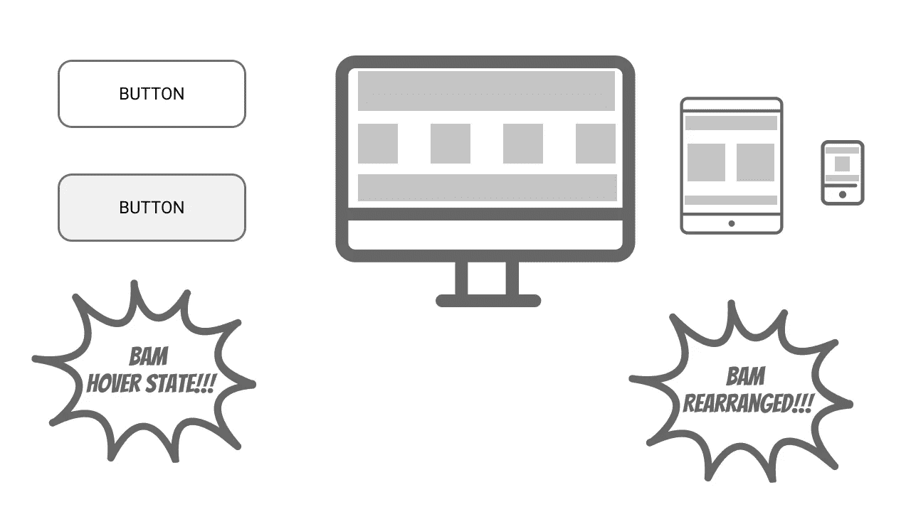

# 顺风造型:第二部分

> 原文：<https://levelup.gitconnected.com/styling-with-tailwind-95c85288be27>

## 学习拥抱实用 CSS 的 WTF


现在我们开始清晰地看到(以及闻到和尝到)。照片由[熊伟·丰特斯](https://unsplash.com/@fontesvitor?utm_source=unsplash&utm_medium=referral&utm_content=creditCopyText)在 [Unsplash](https://unsplash.com/s/photos/happy-bulldog?utm_source=unsplash&utm_medium=referral&utm_content=creditCopyText) 上拍摄

[*第 1 部分是一个简短的“CSS 历史”和一个基于 CSS*](https://mrmarionoble.medium.com/styling-with-tailwind-a835c10fe9a0) *实用程序的概述。第 2 部分讨论了顺风本身。*

# 为什么顺风

好吧，如果你读了第一部分，那是一段冗长的“历史”,但是我们已经找到了症结所在。如果你没看，它就在这里。

为了阅读它或快速滚动过去，拍拍自己的背。耶！哦不，没看？ [*这里复习第一部分。*](https://mrmarionoble.medium.com/styling-with-tailwind-a835c10fe9a0)

## 回顾一下之前的内容

所以我的朋友给我发了一个顺风的链接，告诉我这是蜜蜂的膝盖。我说这是什么垃圾！


```
<div class="py-8 text-base leading-6 space-y-4 text-gray-700 sm:text-lg sm:leading-7">
```

## 转向对顺风的崇拜

不过，他也给我发了这篇文章(也可能是我发现的，我不知道):

[CSS 实用程序类和“关注点分离”](https://adamwathan.me/css-utility-classes-and-separation-of-concerns/)由 Tailwind 的创建者 Adam Wathan 编写。



开创性的顺风文章——adamwathan . me

在阅读这篇文章时，我很难反驳他的观点，我的个人经历与他的非常吻合。

朋友说，你就试试吧。我在几个项目上试过。

过去的几年，我从未回头。

> 现在，每当我必须编写和构建“普通 CSS”时，我都会对自己说，“WTF！”。

## 它与其他实用程序框架的不同之处是什么？

*   更好的命名约定。不过这是主观的。
*   非常容易定制。它已经变得越来越重的开发和设计师不友好的 imho 虽然。
*   内置清除功能，可自动对文件大小进行树抖动/修剪。
*   很棒的文档。
*   最重要的是… **应用功能。**

## @apply 的奇妙之处

对于其他实用程序系统，您必须要么将您的实用程序放入 html 标记，要么根本不放入。我肯定有办法解决这个问题，但这就是心态。

利用 Tailwind，你可以在普通的 CSS 中编写实用程序。

```
button {[@apply](http://twitter.com/apply) rounded border-2 border-indigo-600 bg-indigo-200;
 font-size: 1.5rem;}.button-primary {[@apply](http://twitter.com/apply) bg-indigo-500;}
```

你也可以使用你的旧 css 或者当时没有被 Tailwind 覆盖的样式，比如过渡。

**然后在你的 html 中使用它…**

```
<a href="./special-page" class="button button-primary">My button</a>
```

嘿，那看起来像我的旧 CSS！

是的，确实如此。


有时候，我们都需要一点点帮助——来自 [Pexels](https://www.pexels.com/photo/father-teaching-his-son-how-to-ride-a-bike-5792901/?utm_content=attributionCopyText&utm_medium=referral&utm_source=pexels) 的 Yan kru kov[摄影](https://www.pexels.com/@yankrukov?utm_content=attributionCopyText&utm_medium=referral&utm_source=pexels)

这使得 Tailwind 和基于实用程序的方法更加实用，并且更容易向怀疑的团队成员推销，因为您可以更容易地从旧的 css 过渡到新的方法。

Tailwind 让人们**在他们的常规 css 中利用工具类，这使他们能够重构他们的旧 CSS 名称，但也利用那些外部 CSS 文件中的组合**和/或在适当的情况下直接在 HTML 标签上这样做。

如果他们觉得有一个需要经常重用的通用样式，比如按钮/链接，他们可以用老方法在上面放一个自定义类。

> 现在有[更好的方式](https://tailwindcss.com/docs/extracting-components)在顺风配置中添加类似的东西，比如使用插件或添加实用程序，但这使得更容易快速采用。

虽然这种方法仍然会导致使用标准 CSS 方法的一些问题，但是如果您只创建定制的组合类，那么您应该有更一致的样式(例如，pt-4 总是 padding-top: 1rem，而不是当前团队成员认为正确的任何填充)。

## 变体也很酷

Tailwind 还使您能够编写他们称之为变体的东西，这使您能够针对各种事件或设备大小状态。它们基本上是伪元素，如 hover 和 focus，以及在 html 本身中以不同大小应用的样式。

```
<a href="./special-page" class="button button-primary hover:bg-red-300 focus:border-gray-600 md:w-16">My button</a>
```

**这使得在 HTML 中推理状态变得更加容易**如果你想要在悬停上有一个特殊的效果或者添加一个样式到一个断点，比如 MD(medium-768 px 及以上)。顺风首先是移动的，所以所有的风格都反映了这一点，除非在断点内改变。

**通过在意识形态上的灵活性和添加许多方便的小功能，** [Tailwind 正在超越它的竞争对手](https://2020.stateofcss.com/en-US/technologies/css-frameworks/)(尽管 Bootstrap 仍然是最常用的)，它可能会成为统治所有这些的 CSS 框架。



在 2020 年的调查中,《顺风》位居满意度排行榜首位——图片 StateofCSS.com

## 我一直在用过去式，为什么？

这并不是因为顺风顺水已经过去了，而是因为几年前我就在解决这个问题。自从我第一次使用 1.0 之前的版本以来，它变得更加健壮了。现在它已经升级到了 2.0，并且在撰写本文时还在变化。

> 顺便说一下，我可能是顺风助推器。实际上，在有些情况下，我认为这不是一个很好的选择，或者不是最佳选择。我将在稍后讨论这些问题。顺便说一句，我现在和顺风没有任何关系，虽然我可能会看看是否能在某个时候有所贡献。

# 它是如何工作的？

虽然我不能面面俱到，但我会尝试给出主要观点的一个简短的概念性概述。想要更多吗？[查看非常全面的文档。](https://tailwindcss.com/docs)

> 警告:我们正在进入前方的“杂草”中。


该变脏了！—[卢瑟·m·e·博特里尔](https://unsplash.com/@luthermeb?utm_source=unsplash&utm_medium=referral&utm_content=creditCopyText)在 [Unsplash](https://unsplash.com/s/photos/off-roading?utm_source=unsplash&utm_medium=referral&utm_content=creditCopyText) 上的照片

## 基本的一对一实用程序属性

通常，实际 css 属性的某些版本会被写成如下形式:

```
<span class="text-base">Some phrase</span>
```

碱基通常是 1，通常翻译成 16px。

这也可能是多个属性的简化版本，如**转换**实用程序类。这就是最终生成的 CSS 中的内容。

```
transition-property: background-color, border-color, color, fill, stroke, opacity, box-shadow, transform;transition-timing-function: cubic-bezier(0.4, 0, 0.2, 1);transition-duration: 150ms;
```

## 应用于边和轴

通常，实际 css 属性的一些版本会像 font-size: 1rem 的 text-base 那样写出。这也可能是多个属性(如转换)的简化版本

对于通常有“四条边”的属性，比如页边距，你可以使用一个缩写。



公用事业公司不会把你从利润崩溃中拯救出来。所以，要小心。

因此，对于填充或边距，您可以使用 m **t 填充顶部**，mb、mr、ml 填充底部、右侧和左侧。填充顶部将是 pt。**在属性后，添加度量单位，如 mb-4 或 mb-8。**这些单位有一个默认值和标度，通常相当于每个标度单位 1 雷姆。

4 是如果你希望所有的边都应用相同的 4 间距，你可以使用 p-4。

您也可以仅在特定轴上应用样式。Py-4 会在顶部和底部增加一个单元。Px-4 将其添加到 x 轴的任一侧。

如果 py-2 和 py-4 被用在同一个元素上，那么在源 CSS 中最后一个元素“胜出”。在这方面，Tailwind 版与 1.0 版有所不同。

## 其他测量值

一些测量不使用精确值，而是更具描述性，例如:

Sm、md、lrg、xl 用于混合使用单位和描述的边框或字体大小(例如 text-4xl)。

对于**跟踪**又名字母间距:跟踪紧密、跟踪紧密、跟踪正常等。

对于颜色，它通常使用以百为单位的度量单位:文本-红色-700，背景-红色-800。



以十为单位的不透明度，基于 0-100 的范围:不透明度-50，不透明度-80

有时你也会在处理宽度和高度时看到满的，最小的，最大的，以及像负边距这样的负数。例如，-my-32 表示 y 轴上 32 个单位的负边距。

## 变体伪类

变体基于悬停等状态，或者应用于某些响应断点，并在属性前使用冒号。

**州**

```
<input class="bg-blue border-gray focus:bg-white hover:bg-black focus:border-white hover:border-black">
```

**反应灵敏**

```
<div class="text-center sm:text-left md:text-right"></div>
```

由于顺风首先是可移动的， **sm** 应用于 640px 及以上， **md** 应用于 768px 及以上，等等。

所有默认值都可以在配置文件中被覆盖、扩展或删除。你也可以添加你自己的。稍后会有更多相关信息…



变种的力量。少在 HTML 和 CSS 之间来回翻箱倒柜。

您不必将变体堆叠在非变体样式之后，但是这有助于组织和可视化什么是“默认”和什么是变化。

响应类和状态类可以“堆叠”。

还有运动安全、运动减少和黑暗模式变体。

## 提取类

如前所述，当你想反复重用一个类时，**用@apply 提取它。**我们之前已经讨论过了，太棒了！您也可以在配置文件中使用插件或新的实用程序类来添加它。

## 其他好吃的


由 [Sandi Mager](https://unsplash.com/@sandimagerart?utm_source=unsplash&utm_medium=referral&utm_content=creditCopyText) 在 [Unsplash](https://unsplash.com/s/photos/eating-cookies?utm_source=unsplash&utm_medium=referral&utm_content=creditCopyText) 上拍摄

*   网格(更容易推理)
*   渐变(这些现在是快照)
*   过渡和动画(好的标准选项)
*   黑暗模式(这很流行)
*   环代替阴影(奇数焦点和阴影样式的替代)
*   转换 GPU(更高性能的转换)
*   SVG 样式(简单的描边和填充样式)
*   屏幕阅读器样式(屏幕阅读器友好处理)

# 开始吧

我故意把这个放在要点之后，以便先解释一下 Tailwind，而不是让人们对构建过程感到焦虑。

我要说的是，对于以前没有做过类似事情并且没有开发人员帮助的团队来说，构建过程是一个潜在的绊脚石。

Tailwind 也有一个基于 CDN 的版本，适合那些不想到处乱搞并想快速原型化的人。所以你需要做的就是像 jQuery 一样把它放到网页上。但是，您不能自定义颜色、属性等等，也不能使用@apply。

他们还有一个游乐场,可以利用完整的顺风装置四处玩耍！

## 初始设置过程

顺风使用一个 [npm](https://www.npmjs.com/) 安装和 [PostCSS](https://postcss.org/) 版本 8。如果你使用 [autoprefixer](https://www.npmjs.com/package/autoprefixer) ，你就是在使用 PostCSS。

Vue，React，Next，Nuxt，Laravel 等都有[特殊构建](https://tailwindcss.com/docs/installation)。其中一些不支持 PostCSS 8，所以现在有一个兼容模式。

当前版本不支持 IE，但以前的版本支持。如果这是个问题，看看这些。

你甚至可以使用像 SASS 这样的预处理器，如果他们有 VS 代码的智能感知扩展的话。

## 配置

顺风非常灵活，可以让你很好地调整任何东西，添加甚至删除它。


放东西进去，移动东西——来自 [Pexels](https://www.pexels.com/photo/adorable-kid-playing-with-wooden-construction-blocks-3933022/?utm_content=attributionCopyText&utm_medium=referral&utm_source=pexels) 的 [Tatiana Syrikova](https://www.pexels.com/@tatianasyrikova?utm_content=attributionCopyText&utm_medium=referral&utm_source=pexels) 摄影

```
// Example `tailwind.config.js` fileconst colors = require('tailwindcss/colors')module.exports = {
  theme: {
    colors: {
      gray: colors.coolGray,
      blue: colors.lightBlue,
      red: colors.rose,
      pink: colors.fuchsia,
    },
    fontFamily: {
      sans: ['Graphik', 'sans-serif'],
      serif: ['Merriweather', 'serif'],
    },
    extend: {
      spacing: {
        '128': '32rem',
        '144': '36rem',
      },
      borderRadius: {
        '4xl': '2rem',
      }
    }
  },
  variants: {
    extend: {
      borderColor: ['focus-visible'],
      opacity: ['disabled'],
    }
  }
}
```

例如，在**主题**部分“类别”中的属性将替换默认属性和值。如果您**扩展**一个类别，该值将被添加。

您还可以添加自定义插件和导入预置。

## 导入顺风的样式

它带有一些基本的规范化和默认值，这些可以在生成的 css 或 npm 模块中查看。

它们遵循以下结构:

```
@tailwind base;
@tailwind components;
@tailwind utilities;@layer base {
  h1 {
    @apply text-2xl;
  }
  h2 {
    @apply text-xl;
  }
}
```

作为配置选项的替代，如果您想要使用或添加您自己的，您现在可以添加到一个特定的层或添加一些常规的 css。

除了常规、基本、组件和实用程序之外，您还可以添加一个**屏幕**功能来调整断点。

## 使最佳化

许多人抱怨说，Tailwind 生成了一个巨大的 CSS 文件(~3MB)。如果你不使用 PurgeCSS 来“动摇”使用过的样式以减少文件大小，这是完全正确的。这通常会降低到 15K。过去，要做到这一点，您必须进行一些特殊的清除配置。现在，它是内置的！

摆脱文件大小！

```
// tailwind.config.jsmodule.exports = {
  purge: [
    './src/**/*.html',
    './src/**/*.vue',
    './src/**/*.jsx',
  ],
  theme: {},
  variants: {},
  plugins: [],
}
```

清除通常最好设置为在生产构建中完成，而不是在开发构建中。

您可以更详细地调整这一点，或者使用文档中概述的其他方法进行删减。

## 点燃它

如果你用的是 CDN 版本，没什么可做的。

如果你使用 npm 或 yarn 构建，你通常会使用你通常使用的任何构建过程，比如 npm start 或 npm run dev。

# 何时不使用顺风

虽然我显然认为 Tailwind 很棒，并且已经详细说明了它的许多优点，但在某些情况下，我认为它并不太好用，或者根本不应该使用。


有时候我们不应该做一些事情。

## 基于非组件的网站或应用

您仍然可以使用 Tailwind，特别是在使用@apply 时，但是如果您只是在页眉、侧边栏、页脚等地方使用一些部分/服务器包含，可能就不值得了；特别是如果你想一遍又一遍地使用这些工具。不过，进行查找和替换是可能的，而且实际上可能比在传统 CSS 结构中寻找样式问题更容易。

## 你有一个广泛的遗留 CSS 框架

可能不值得对当前的设置进行部分或整体的重构。这样做可能会带来更多的麻烦，得不偿失。然而，如果你已经在 CSS 的地狱里，如果每个人都在船上的话，也许去做吧。我会先用一个空白的项目/网站/应用程序进行测试，看看你会喜欢它。@apply 使得这种方法至少是可行的。

## 经常需要主题/皮肤

尽管 Tailwind 有一些很好的主题化功能，但是如果您使用一个常规的非组件 MVC 站点，并且需要对彼此完全不同的版本进行皮肤处理，比如从许多 card 部分中调整 pt-8，或者剥离 indigo-700，这可能比仅仅改变一般“card”类的填充或颜色更加困难。也就是说，如果你提前做好计划，并尝试不可知或者在你的外部 CSS 中使用组合方法，这可能不是问题。

# 停业清理

*花了点时间，是吧？*

## TLDR；

一段时间以来，我们一直在尝试许多方法来设计网站和应用程序。这些通常很难维护和扩展，尤其是随着时间的推移和人员的增多。命名结构/约定、CSS 框架和设计系统可能会变得相当笨拙，被忽视，并且经常比它们的价值更麻烦。

实用程序使样式能够被组合、简化，并作为属性和它们的值之间的标记。它们与 React、Vue、Angular 等基于组件的系统配合使用效果最佳。尽管它们也可以与 MVC 系统一起工作。

用传统风格改造这种方法很有挑战性，但 Tailwind 的@apply 对这种转变很有帮助。它还具有良好的命名约定、使用变量的状态管理和文件大小缓解。

## 基于顺风的公用事业方法意味着:

*   每个人都在同一个页面/元素上，所以变化是有范围的。
*   随着时间的推移，减少(如果不是消除)CSS 膨胀和蔓延。
*   更好的定制和更少的框架冲突。
*   不需要特殊的文件结构、名称或命名约定。
*   几乎不需要想出好的语义名称(或创造坏的名称)。
*   作文多，传承少。
*   通过中介实现总体上更加一致的方法。
*   能够利用你现在拥有的 CSS。
*   更快的原型制作
*   使用变体轻松管理元素状态。
*   更少的样式冲突和调试时间(如果有的话)。
*   创建设计系统的良好基础。

## 学点新花样，找点乐子！

即使您觉得这种方法不适合您，也值得了解一下，因为这将是团队可能采用的最主要的现代解决方案之一。

尝试基于实用的顺风造型！