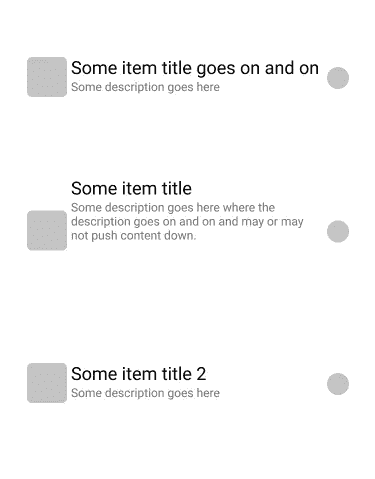
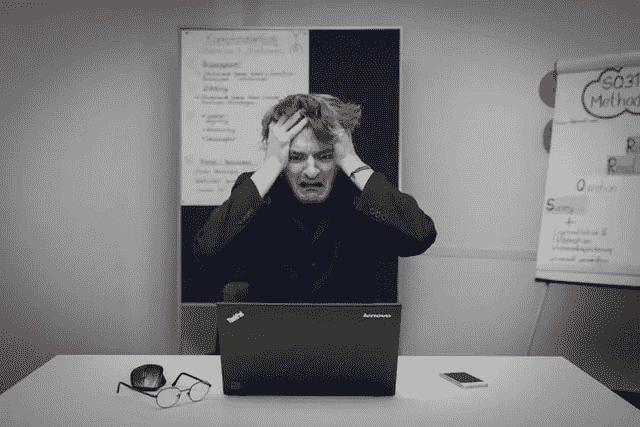
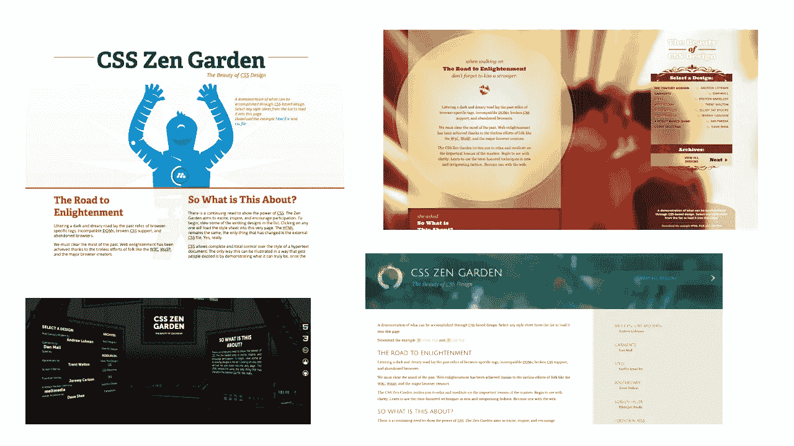
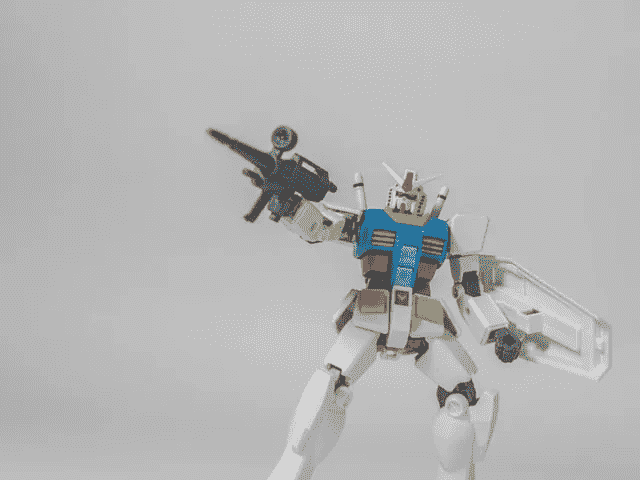
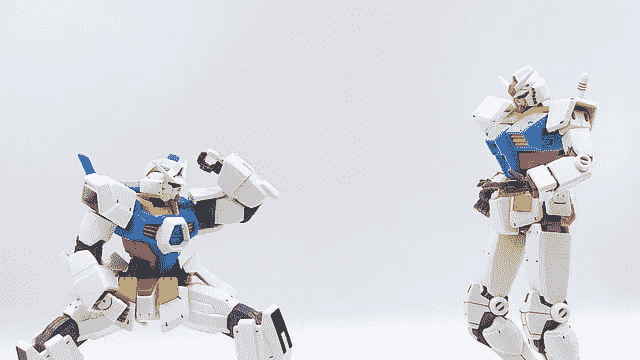
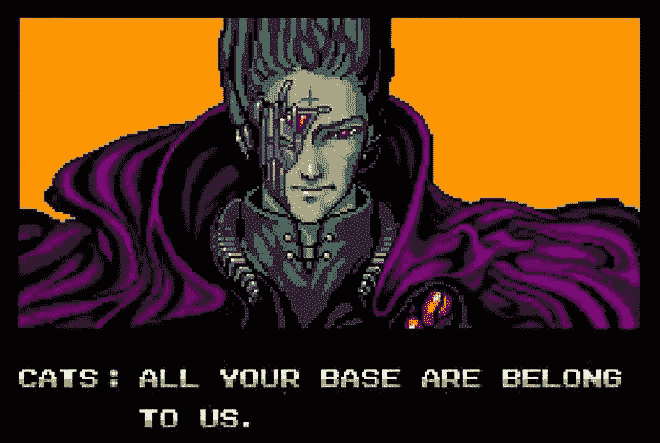
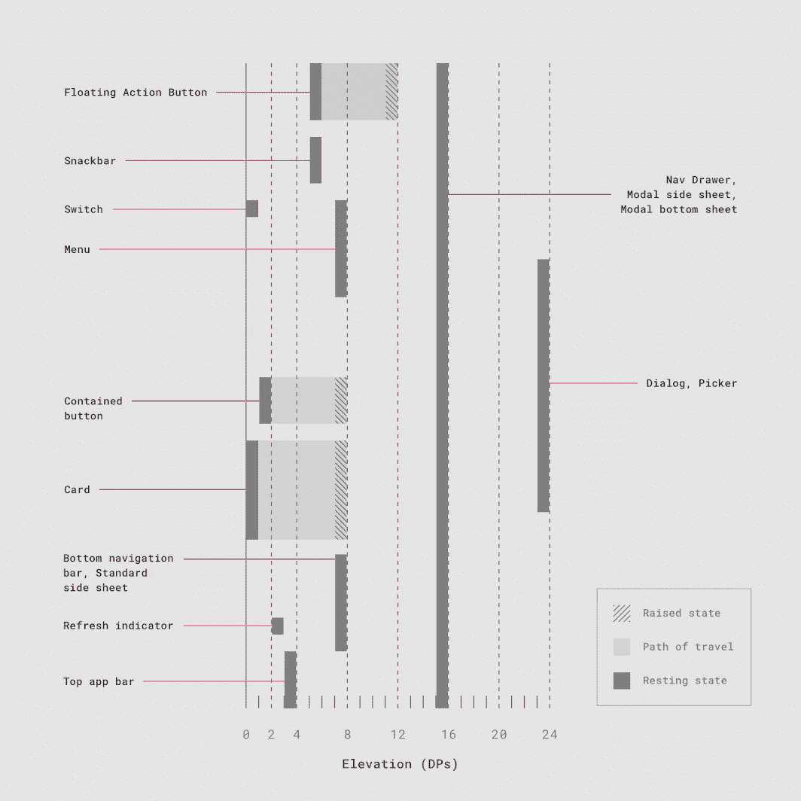
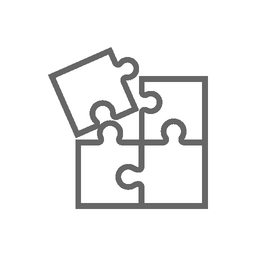
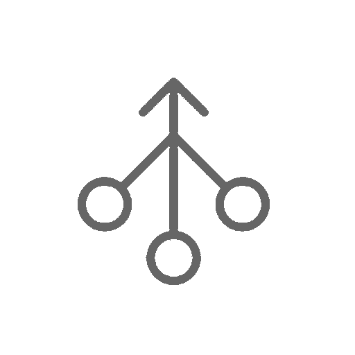
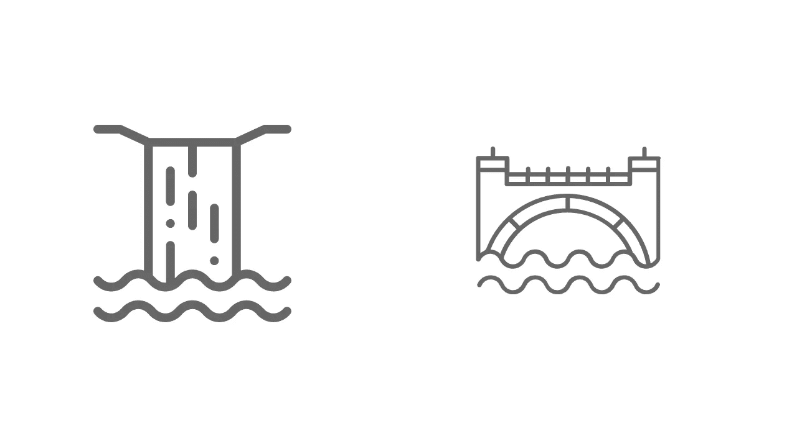

# 顺风造型:第 1 部分

> 原文：<https://levelup.gitconnected.com/styling-with-tailwind-a835c10fe9a0>

## 学习拥抱实用 CSS 的 WTF


Googly eyes 不是 CSS 属性，但也许它们应该是。简·阿尔蒙在 [Unsplash](https://unsplash.com/s/photos/googly-eyes?utm_source=unsplash&utm_medium=referral&utm_content=creditCopyText) 上的照片

*第一部分是一个简短的“CSS 历史”和基于实用的 CSS 概述。* [*Part 2 进入顺风本身。*](https://mrmarionoble.medium.com/styling-with-tailwind-95c85288be27)

# 细节决定成败

在过去的几年里，我一直在寻找各种方法来帮助设计师和开发者更好地合作。我还想让设计师能够对正在创造的实际结果有更多的控制。

*见我在* [*上的帖子低码给设计师*](https://uxdesign.cc/low-code-for-designers-316ec7e78d1) *。*

太多的时候，设计者坚持告诉开发者标题不太正确，底部需要 16px 或 1rem/1em 的空间，开发者变得不耐烦了。



这个布局有问题…

然后，把那些对话乘以 100。是的，像 [Figma](https://www.figma.com/) 、 [Sketch](https://www.sketch.com/) 和 [Zeplin](http://Zeplin) 这样的工具确实允许一些 CSS 的“代码”检查和导出，但是当设计在不同的场景和设备布局变化下随着时间的推移而发展时，这通常是不够的。

或者，可能是设计者(不是我，从来不是我)在拿咖啡时不小心按了箭头键，现在表单字段与所有其他字段都不同，他/她/ze 直到生产时才注意到。开发人员现在不高兴了，因为他们需要弄清楚什么是对的，什么是错的。

你可以让它工作，但是很难。

# 有人告诉我顺风的事

我的一个 UX 设计师朋友告诉我关于顺风 CSS 的事情，他喜欢在里面做原型。

> 我看了一眼，说:“WTF！！!"。而且不是好的方面。



照片上的人被吓呆了，我也是——照片由塞巴斯蒂安·赫尔曼在 [Unsplash](https://unsplash.com/s/photos/shock?utm_source=unsplash&utm_medium=referral&utm_content=creditCopyText) 上拍摄

## 顺风社的 CSS

```
<div class="py-8 text-base leading-6 space-y-4 text-gray-700 sm:text-lg sm:leading-7">
```

*完全混乱的 CSS 类。谁会认为这是个好主意？*

一个 HTML 标签上有太多的类。与常规方式相比，这似乎有些尴尬和不干净。这通常包括确保你有一些好的语义，HTML 标记。当然，这种方法已经在 Bootstrap、Foundation 和布尔玛(例如右浮动、sr-only 等)等框架中小规模出现。)但程度不如上面的例子。稍后将详细介绍这些内容…

## 我的定制 CSS

```
<div class="container main-container">
  <header class="main-header">
    <h1>My Header</h1>
  </header>
  <main class="main-content">
    <h2>Page Title</h2>
    <p>Awesome content starts here</p>
  </main>
  <footer class="main-footer">
    <sub>copyright Best Org 2021</sub>
  </footer>
</div>
```

嗯嗯……太漂亮了。如此干净。所有东西都贴上了漂亮的标签。

有了我漂亮、干净、语义化的 HTML，我就可以用漂亮、干净的 CSS 来定位它。

```
.container.main-container { min-width: 600px;}.main-header { min-width: 400px;}
```

比顺风垃圾更容易理解。


感觉温暖而模糊——照片由[麦克·范·登博斯](https://unsplash.com/@mike_van_den_bos?utm_source=unsplash&utm_medium=referral&utm_content=creditCopyText)在 [Unsplash](https://unsplash.com/s/photos/cat-sun?utm_source=unsplash&utm_medium=referral&utm_content=creditCopyText) 上拍摄

# 隔离而平等的

这个想法通常是创建一个良好的[关注点分离](https://en.wikipedia.org/wiki/Separation_of_concerns)，其中**样式** (CSS)与**结构** (HTML)完全分离，可能还有**内容**(与我们正在使用的 [CMS](https://en.wikipedia.org/wiki/Content_management_system) 集成)加上**交互** (JS 或其他)。

据推测，这样一来，如果客户/利益相关者决定完全改变网站的外观和感觉，这并不重要。我们可以在几分钟内完成！仅仅做一个查找，替换或者改变一些 CSS 变量。

如果我能生成带有 [SASS](http://sass-lang.com/) 或 [LESS](http://lesscss.org/) 的 CSS，这种方法就更好了。

> 瞧！网站完全改变了。谁知道品牌重塑会这么容易？

> 见 [CSS 禅园](http://www.csszengarden.com/)本练习的原始祖师爷式表达。你不能接触 HTML，只能接触 CSS。我甚至很久以前就买了他们的书。



CSS 禅宗花园的各种版本

# 造型的简短历史和其中的挑战

*对于那些熟悉过去十年的方法、在 CSS 方面有坚实背景并且熟悉 CSS 在规模上令人讨厌的挑战的人来说，可以随意跳到下面的进入实用程序部分。*

当基于表格的内嵌风格盛行时，Zen Garden 出现了，人们说，“哇，现在有更好的方法了。”

餐桌设计的“乐趣”:

```
<table border="10"
       style="background-color: aqua; border-color: red;">
```

> 我们不说上面令人厌恶的表格内联样式。我们试图永远忘记它。
> 
> 我们也不会谈论[切片和骰子](https://helpx.adobe.com/photoshop/using/slicing-web-pages.html)的方法，即创建网站作为图像，然后使片段成为可点击的热点。奇怪的是，随着[视觉](https://www.invisionapp.com/)原型的出现，这又以另一种形式复活了。Flash 很有趣，就像印刷设计一样，因为你把东西放在哪里，它们就放在哪里。史蒂夫·乔布斯终结了它。一些人认为它过于臃肿，应该痛苦地死去。其他人哀悼它的损失…

现在我们可以这样做了！：

```
.my-special-table {
  background-color: aqua;
  border-color: red;
}
```

总的来说，人们很高兴。

除了[浮动](https://developer.mozilla.org/en-US/docs/Web/CSS/float)。那些是困难的，经常是混乱的，麻烦的，并且需要定期清理。彩车中的彩车？他们就像 CSS 的詹姆斯·迪恩。麻烦。活得快，死得勤。

## 现实世界侵蚀

这种方法很棒，直到你的网站或应用开始变得越来越大。

一个客户/利益相关者想要在你的完美结构(和语义)的 html 中加入新的特性。


不…!照片由 [Tranmautritam](https://www.pexels.com/@tranmautritam?utm_content=attributionCopyText&utm_medium=referral&utm_source=pexels) 从[像素](https://www.pexels.com/photo/photo-of-gray-and-white-tabby-kitten-sitting-on-sofa-2194261/?utm_content=attributionCopyText&utm_medium=referral&utm_source=pexels)拍摄

现在你必须重新排列(并且经常重命名)元素。

哎呦！因为 CSS 级联，你的样式没有“流”下来，你需要修复它。

> **Grrrrr…**

## 疯狂的堕落开始了

随着时间的推移，会添加更多的 HTML 和 CSS。也许您正在使用类似 jQuery 的东西来添加和更改 CSS 类、id，甚至动态添加 HTML 片段。你感到原力受到干扰，这表明事情有点失控。你忽略它，继续前进…

**那个漂亮的、分离的 CSS 开始变得越来越大。**在某些情况下增加到数千行。你不得不在没有真正检查的情况下快速添加一些新的样式，这可能会破坏一些传统浏览器中的一些布局项目。你以后会解决的…现在，你必须在最后期限前让它工作。

你很想用！重要的是要绕过追踪为什么你的部分没有适当的空白。它只是“暂时”在那里。

**不要。就说不…我们再说一遍不。**

> 有一句名言，“计算机科学只有两个硬东西:缓存失效和事物命名。”— [菲尔·卡尔顿](https://skeptics.stackexchange.com/questions/19836/has-phil-karlton-ever-said-there-are-only-two-hard-things-in-computer-science)

您越来越发现自己需要在 id、标签、类选择器或命名元素方面更加具体，以便覆盖冲突或应用于单独的布局和部分。

## “地狱是别人。”让-保罗·萨特

我在报价名单上！


你有时会觉得自己生活在耶罗尼米斯·博斯的画中吗？

如果你与许多团队成员合作，**问题现在可能呈指数增长**，因为他们的 HTML 和 CSS 可能对你的有意想不到的副作用，反之亦然。

有人不小心编了一个和你一样的课。或者，他们把我们的 CSS 所依赖的 HTML 移动或者重命名了。或者误改了 CSS 顺序。除了鲍勃。鲍勃总是想把你的东西弄乱。/jk

> “Omg，我刚刚打开了 Bob 前几天做的 CSS。那个#！&*^'r 刚刚补充道！所有地方都很重要…什么！*%&*!"

如果 Zeus 动态地添加东西，重新排列 CSS 顺序，或者插件用你使用的相同的 id 或类向头部注入样式，Zeus 会帮助你。

> 可能会很乱。

## 首字母缩略词拯救世界！

解决混乱的办法是什么？

> **组织。**

BEM，OOCSS，SMACCS 到了。我称它们为首字母缩写词。他们试图通过应用命名约定和/或将 CSS 分解成某种系统来给混乱添加一些秩序。你仍然可以“推出你自己的”定制 CSS，但是**他们提供了一些惯例和标准来帮助控制不断增长的样式的混乱**。

首字母缩略词可能不会像玛丽·近藤组织东西那样带来快乐，但它们确实有帮助。

[BEM](https://en.bem.info/methodology/) 代表块、元素、修饰符，由 [Yandex](https://yandex.com/) 推广。一般看起来是这样的。

```
<!-- `search-form` block -->
<form class="search-form">
    <!-- `input` element in the `search-form` block -->
    <input class="search-form__input">

    <!-- `button` element in the `search-form` block -->
    <button class="search-form__button search-form__button_disabled">Search</button>
</form>
```

> *感受下划线的力量*

第一个术语是块，通常描述独立组件。第二个术语是特定元素的用途。第三个通常描述修饰状态、外观或行为。他们使用双下划线和单下划线以及分隔符的命名约定，尽管我也见过连字符的使用。只要你的团队始终如一就好。还有很多事情要做，但这些都是基本的。

[SMACSS](http://smacss.com/) (也称为 CSS 的可伸缩和模块化架构)更像是一种根据*基本样式、布局、模块、状态*等来划分 CSS 的方法。甚至还有一本书！

OOCSS (面向对象的 CSS)并不是 OOP(面向对象编程)的真正应用，而是试图将结构化 CSS 从主题化 CSS 中分离出来；比如宽度、填充、排版和颜色。因此，它使用了更多的细粒度类，更类似于 Tailwind 和其他基于实用类的框架所采用的方法。

以上描述过于简单，但希望能让你了解它们是如何工作的。

## 希望即插即用

尽管缩写方法很棒并且被广泛采用，但是人们发现自己一遍又一遍地做着相同的功能元素(卡片列表、旋转木马、导航、表单等)。)但是每个团队或项目都有自己的实现方式和命名方式。我是否提到过您在扩展和应对变化方面仍然存在问题？

如果你能挑选一些功能，然后把它们放到某种……我不知道……预制的系统中，这不是很好吗？

# 进入 Twitter 的 Bootstrap CSS 框架。

**强大、轻松、固执己见。**



有正确的方法、错误的方法和引导方法——照片由 [Jason Ng](https://unsplash.com/@jason_ng?utm_source=unsplash&utm_medium=referral&utm_content=creditCopyText) 在 [Unsplash](https://unsplash.com/s/photos/godzilla-toy?utm_source=unsplash&utm_medium=referral&utm_content=creditCopyText) 上拍摄

它不只是组织你的 CSS，它给了你一整套“零件”来组装你的网站或 web app。似乎一夜之间，它就被每个人和他们邻居的狗所采用，用来快速生产东西。它是由 LESS 和后来的 SASS 驱动的。它有一个自定义主题，你可以在那里下载你想要的功能。它还集成了基于 jQuery 的交互性，可用于许多常见场景，如标签页等。

> 有什么不喜欢的？

这很棒… **直到你需要做一些更定制的东西，这样你的网站才不会看起来像其他百万个基于 Bootstrap 的网站/应用。突然间，你发现自己*在和框架*战斗。通常需要特殊的覆盖，并且您的命名约定需要与引导方式相匹配，或者至少不冲突。**



准备，开始，战斗！—[Jeffery Ho](https://unsplash.com/@jefferyho?utm_source=unsplash&utm_medium=referral&utm_content=creditCopyText)在 [Unsplash](https://unsplash.com/s/photos/godzilla-toy?utm_source=unsplash&utm_medium=referral&utm_content=creditCopyText) 上拍照

其他框架如 [Foundation](https://get.foundation/) (基于 SASS，表面上更灵活)，以及 [Semantic](https://semantic-ui.com/) (酷但文件大)。

最新的热门词条是[布尔玛](https://bulma.io/)和 [UIkit](https://getuikit.com/) 。我也喜欢[纸质 CSS](https://www.getpapercss.com/) (用于高保真原型制作)和[野餐](https://picnicss.com/)。也有轻量级的框架不像[纯 CSS](https://purecss.io/) 、[毫克](https://milligram.io/)等那样固执己见。

> 公平地说，Bootstrap 和其他框架一直在不断发展和改进。因为它们非常有名，使用框架通常是快速启动和运行数字产品的一个很好的起点，而且文档已经存在。

然而，**虽然这些框架为您的风格和结构带来了一定程度的组织和约定，但在定制和扩展它们所提供的功能方面，您仍然需要做出一定程度的权衡。一旦你致力于一个功能更加全面的框架，就很难再移植到别的框架上，否则你会陷入和以前一样的境地，使用那些不那么固执己见的框架。也就是说，Bootstrap 也作为事实上的[设计系统](https://uxdesign.cc/everything-you-need-to-know-about-design-systems-54b109851969)影响了世界，直到……**

# **进入材料设计。**

## **真正的设计系统。**



很难夸大谷歌的[材料设计](https://material.io/)指南对现代应用程序风格的影响。它目前正在进行第二次重大修订，是一个全面深入的、公开的关于大量设计模式及其背后的基本原理的论文。**许多公司以前都有自己的网站，但不是任何人都可以查看和使用的。**

> 哦，是的，它有如此多的阴影变化。这是个很酷的主意。你并不总是想要阴影。



材料设计的标高指南。啊。—图片—Google.com

因为像 Gmail 这样基于 Android 和 Google 的服务无处不在，大多数 CSS 框架都遵循了模仿大部分内容的主题，包括一个恰当地叫做[materializeecss](https://materializecss.com/)的主题。这并不是说[苹果的 HIG](https://developer.apple.com/design/human-interface-guidelines/) 和[微软的流畅](https://www.microsoft.com/design/fluent/#/)系统在他们各自的生态系统中没有影响，而是谷歌的已经传播得更广。

> 现在有一些使用[野兽派设计](https://www.nngroup.com/articles/brutalism-antidesign/)的抵制，这基本上是“无论如何”,尽管传统上不是这样。它甚至有自己的框架,这看起来有些违背直觉，但没关系…

最初采用这些设计系统惯例非常方便，但并不是所有的建议都适合或易于定制/构建。

> 说到设计系统，布拉德·弗罗斯特的[原子设计方法](https://bradfrost.com/blog/post/atomic-web-design/)非常具有开创性，非常值得研究。它早于上述框架，并且毫无疑问影响了它们。

好吧，引用/旁白太多了。抱歉。

## 够好了，但还不够

因此，组织上的**惯例、框架和设计系统确实有助于控制混乱，但仍然经常无法大规模解决许多问题。随着使用 JavaScript 框架的基于组件的应用程序的兴起，如 Angular、React、Vue 以及最近的 Svelte，企业和开发团队希望在保持一致性和模块化的同时，能够更加灵活地进行定制。**

# **输入公用设施**

## 作文



基于实用程序的方法意味着您创建描述 HTML 标记本身的属性的类。

```
<nav class="flex flex-col">
  <ul>
   <li>My sidebar nav item</li>
   <li>My sidebar nav item</li>
   <li>My sidebar nav item</li>
  </ul>
</nav>
```

例如，导航上的 flex flex-col 意味着您正在使用元素本身上的 CSS 属性和值显示:flex 和 flex-direction:列。你不需要想出一个描述性的名字。然后将 CSS 应用于描述性类。

更重要的是，你和你的团队成员不需要追捕。一些外部 CSS 中的 main-nav 或在。main-nav 类来弄清楚它是什么，或者查找是否有任何样式被应用到导航中。

更糟糕的是，您可能需要查看是否通过特殊性加权(如#main-header)应用了特定的覆盖。主导航{ display:block }或！重要的应用于。主导航。

所有的造型都在那里。

## 短暂



“好吧，”你说，“但是这和仅仅用传统的方式在元素上使用内联 CSS 有什么不同？”

例如:

```
<nav style="display: flex; flex-direction:column">
```

当你谈论的只是改变属性时，这并没有什么不同，像 React 这样的框架中的一些早期用法提倡在 JavaScript 中编写样式时使用“返回到内联”的方法。然而，**使用实用程序允许您以一种快速的、粒度的方式轻松地添加多个相关属性**，就像添加一个过渡一样。

所以导航可能是:

```
<nav class="transition">Some list of links goes here</nav>
```

但是这个阶层是由:

```
.transition {
  transition-property: background-color, border-color, color, fill,     stroke, opacity, box-shadow, transform; transition-timing-function: cubic-bezier(0.4, 0, 0.2, 1); transition-duration: 150ms;
}
```

你不会想把所有这些都放在一个内联样式上！

## 调解


调解不要与冥想混淆。虽然你可以冥想调解…

更重要的是，它允许你**在实际值之间构建类，同时仍然保留一些意义**。

让我们更深入地探讨一下中介:

```
<nav class="text-blue-300 text-lg w-32>Some list of links goes here</nav>
```

我们可以很容易地用传统的内联方式描述文本和宽度:

```
<nav class="color: #1500ff; font-size: 3rem; width: 8rem">
```

然而，如果我们想快速定义一种不同的蓝色，或者以匹配相应文本大小的方式改变文本，或者设置不同的宽度，那么第二种方法可能会很困难。团队成员可能也很难记住使用的字体大小等等。

对于实用程序，它是相对快速和一致的。

因此，虽然我们仍在使用级联，但它受到很大的限制，并且处于扁平化的层次结构中。许多类本质上充当了[设计符号](https://www.lightningdesignsystem.com/design-tokens/)，调解/别名值和属性以保持灵活性，同时鼓励一致性。



少一些瀑布，多一些桥

如果团队决定 text-lg 应该全面改变，或者相对于 text-sm 或 text-xl 进行改变，那么这是一个深思熟虑的决定，而不是心血来潮。

> 符号化可以是建立一个[设计系统](https://www.lightningdesignsystem.com/)的开始。它还可以导致更快的原型开发，因为您不需要马上担心命名问题，并且可以快速调整基本令牌。

## 这种方法的一些问题

**命名依然艰难。鉴于命名通常很困难，实用程序类的名称需要既直观、一致又灵活。您不需要自己设置，但是实用程序框架可能会使用很难记住的晦涩的名称。**

**大文件尺寸。为了组合实用程序，你经常需要很多 CSS 来覆盖你的样式选项。这意味着 CSS 文件很大，除非你手动或自动的“修剪”你的样式，这样你就只有你实际使用的样式了。**

重构可能具有挑战性。你还面临着这样的前景:需要为已经有大量样式的项目完全重构 CSS 和 HTML。这使得实用方法几乎不切实际，除非你从零开始，因为你不知道什么可能会坏。这也是一项繁重的体力劳动，你可能会以两败俱伤而告终。

**重复。**您可能有许多重复的元素，需要对它们应用实用程序，有时会产生较高的维护开销。

**是的，但是……**

尽管如此，人们仍然对传统的做事方式和处理类冲突、CSS 冗余、命名等感到沮丧。因此，无论如何，重构仍然是可取的。

# 效用框架演变

正在尝试新的方法，但这是一项正在进行的工作

虽然像 Bootstrap 和 Foundation 这样的框架已经有了一些实用的特性(例如，浮动、可见/不可见等)。)在许多情况下，人们仍然必须创建自己的类和约定。这是一切痛苦和折磨(开始时有一些喜悦)的正常业务。

## 各种纯实用框架弹出。

其中最主要的是超光速粒子和 T2 粒子。

基于超光速粒子效用的方法是什么样的？

```
<a class="db center mw5 black link dim"
   title="Frank Ocean's Blonde on Apple Music"
   href="[https://geo.itunes.apple.com/us/album/blonde/id1146195596?at=1l3vqFJ&mt=1&app=music](https://geo.itunes.apple.com/us/album/blonde/id1146195596?at=1l3vqFJ&mt=1&app=music)">
```

db 代表 display-block，center 是不言自明的，mw5 表示最大宽度 5，b-black-10 是一个类似 BEM 的结构类，用于应用边界 RGBA 颜色，dim 是不透明度和动画的组合…你明白了吧。

## 组成，但有时髦的命名

这可能有点难理解，但是如果你花足够长的时间去理解它，你会记住的。贝斯稍微好一点。

这种方法有一些缺点。《T4》中的名字通常有点不靠谱，也不太好描述。文件大小也有变得非常大的趋势(但是可以根据需要进行裁剪)。

## 仍然难以集成到遗留工作中

如前所述，花时间重构可能不值得。

## Fanatiscm

意识形态也很重要。喜欢这种方法的人觉得**要么需要完全基于实用，要么需要传统**。在某种程度上，这是可以理解的。你有增加复杂性的危险，却没有什么好处。没有中间立场。

## 系统挑战

相对于其他 CSS 方法，基于预组件 MVC 的系统使得这种**重复更加难以维护**。

只有当组件系统变得更加典型时，这才变得更加容易和枯燥。

> 更新:这些效用框架已经有了很大的改进(包括引导)并赶上来了，但这更多的是关于解决顺风前的生态系统状态。

# 然后顺风来了…

在[顺风造型的第二部分](https://mrmarionoble.medium.com/styling-with-tailwind-95c85288be27)中阅读更多关于顺风摇摆的原因及其工作原理。