# R 和 Python 在通过决策树建模数据方面的风格差异

> 原文：<https://levelup.gitconnected.com/stylistic-differences-between-r-and-python-in-modelling-data-through-decision-trees-ea6f7c98e6e8>

## 数据科学文体学

## 如何用 R 和 Python **开发一个决策树，为**的每个内部节点表示一个属性“测试”，为每个分支表示测试结果，为每个叶节点表示一个类标签。


在 [**准备好数据框架**](https://medium.com/swlh/stylistic-differences-between-r-and-python-for-data-preparation-bfda6ebd15aa)[**探索了一些关键关系**](https://medium.com/analytics-vidhya/stylistic-differences-between-r-and-python-for-exploratory-data-analysis-1c5195162b8a)****[**建立数据框架**](/stylistic-differences-between-r-and-python-in-setting-up-the-dataframe-pre-modelling-6c5ec0195901)**下一步就是数据建模。这可能是数据科学方法中最具决定性的方面，因为有各种各样的方法和算法来为大型数据集建模。******

> ********算法**:在有限的步骤中解决一个数学问题(如寻找最大公约数)的过程，经常需要重复运算******

****最简单的数据建模方法之一是决策树，它由一组连接到向下延伸的分支的决策节点组成。起点是根节点，终点是叶节点。该算法在决策节点测试变量，分析每个可能的结果，并导致最佳分裂，产生新的分支。该分支可能通向另一个决策节点或终止于叶节点。****

****决策树的最终目的是创建一组尽可能精确的叶节点，其中特定叶节点中的每条记录都具有相同的分类。通过*决策*的序列，该树提供了一组具有最高可能置信度的分类分配。然而，选择一种在各种属性之间产生尽可能多的分类一致性的算法是至关重要的。重要的是，算法应该在训练数据集上进行测试，因此下面的部分将隐含地提到这一点。****

# ****1.分类和回归树****

****数据科学中最常用的决策树算法是分类和回归树(CART)。这是由一系列的问题和答案组成的。这些问题的结果是一个树状结构，其中末端是终端节点，在这一点上没有更多的问题。其主要特点是:****

******1。**根据基尼系数
**2，基于一个变量的值在节点上分割数据的规则。**决定分支何时终止于叶节点
**的停止规则 3。**对每个终端叶节点中的目标变量的预测****

****CART 方法生成的决策树是**二进制**，这意味着对于每个决策节点，它们正好包含两个分支。CART 是一种递归算法，它将训练数据集划分为具有相似目标属性值的子集。CART 算法通过对每个决策节点的所有变量和所有可能的分裂值进行综合搜索来增长树，目的是根据 **GINI 指数**选择最优的一个。****

> ******基尼指数**衡量随机选择时，特定变量在特定节点内被分类的程度或概率。如果所有的元素都属于一个类，那么可以定义为**纯**。基尼指数的程度在 0 和 1 之间变化，其中 0 表示所有元素都属于某一个类别，或者只存在一个类别，1 表示元素随机分布在各个类别中。****

****GINI 指数的计算方法是从 1 中减去每类概率的平方和。它倾向于较大的分区，并选择具有较低基尼指数的特征进行分割。当所有元素都属于某个类或者值接近零时，1 表示元素随机分布在各个类中。****

****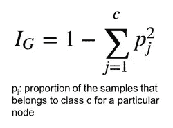****

****此外，CART 还可能需要选择一种修剪技术，如称为 [**成本复杂性修剪**](http://mlwiki.org/index.php/Cost-Complexity_Pruning) 的技术，以从决策树中删除冗余分支，从而提高其准确性。Python 和 R 都允许限制节点的数量，因此提供了一种直接的方法来确定输出中的分支和节点的数量。****

> ******修剪**是机器学习中的一种技术，它通过删除树中对实例分类没有什么帮助的部分来减少决策树的大小。修剪的双重目标是降低最终分类器的复杂性，以及通过减少过度拟合和移除可能基于错误数据的分类器部分来获得更好的预测准确性。****

# ****2.Python 中的 CART 算法****

****在 **Python 中，**创建决策树的起点是上传相关的库，这些库允许按照迄今为止所阐述的概念进行计算。****

```
**import pandas as pd
import numpy as np
from sklearn import preprocessing
import cv2
import matplotlib.pyplot as plt
import statsmodels.tools.tools as stattools
from sklearn.tree import DecisionTreeClassifier, export_graphviz**
```

****其次，可以通过混合了分类预测值和数值预测值以及分类目标变量的数据集进行分析。在将在 **Python** 中展示的例子中，数据集的创建遵循了与前一篇博客中类似的方法。对于这个模型，我们将使用随机生成的变量来模拟分析，以描述一个数据集，该数据集记录了人道主义危机在财务方面的影响。预测因素将是休克的类型及其持续时间，而目标变量将是给予的援助数量。****

```
**df = pd.DataFrame(np.random.randint(0,1000,size=(1000,1)), columns= ['IncomeLoss'])df["DurationMonths"] = np.random.randint(0, 12, df.shape[0])Type_Shock = (['Draught','Floods','Famine'])
df["Type_Shock"] = np.random.choice(Type_Shock, size=len(df))df["AidMillion"] = np.random.randint(0, 1000, df.shape[0])
category = pd.cut(df.AidMillion,bins=[0,500,1000],labels=['Below_500_Mill','Above_500_Mill'])df.insert(2,'Aid_Given',category)**
```

****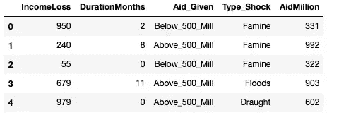****

****一旦在 **Python** 中定义了数据帧，我们将不得不隔离相关的变量。在这种情况下，y 是分为两个属性的目标变量(高于 5 亿的 aid 和低于 5 亿的 aid ),需要一个`LabelEncoder`命令用于决策树。然后，需要将分类属性转换为数字形式的数组，并与数字预测值连接，在本例中，数字预测值是电击的持续时间。****

```
**y=df[['Aid_Given']]
le = preprocessing.LabelEncoder()
y= le.fit_transform(y.astype(str))type_disaster= np.array(df['TypeShock'])(type_category, type_category_dict)= stattools.categorical(type_disaster, drop=True, dictnames=True)type_disaster_pd=pd.DataFrame(type_category)X= pd.concat((df[['DurationMonths']], type_disaster_pd), axis=1)**
```

****然后通过`DecisionTreeClassifier`命令在 **Python** 中创建 CART 决策树，该命令根据 Gini 标准组织所有数据，并根据预测值(本例中为 4 个)确定适合目标变量分类的叶节点数量。****

```
**X_names=[“DurationMonths”, “Draught”, “Floods”, “Famine”]
y_names=[“Below_500_Mill”, “Above_500_Mill”]cart01=DecisionTreeClassifier(criterion=”gini”, max_leaf_nodes=7).fit(X,y)**
```

****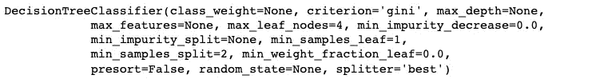****

****一旦模型最终确定，Python 中的以下片段可以帮助在 *Jupyter* 笔记本中可视化决策树。graphviz 的默认导出功能在。点和转换成 png 需要一个特定的命令:*！dot-Tpng****nametree . dot****-o****nametree.png。*******

```
**%matplotlib inline
export_graphviz(cart01, out_file= "decision_tree_CART.dot", feature_names=X_names, class_names=y_names)! dot -Tpng decision_tree_CART.dot -o decision_tree_CART.png
img = cv2.imread('decision_tree_CART.png')
plt.figure(figsize = (15, 15))
plt.imshow(img)**
```

****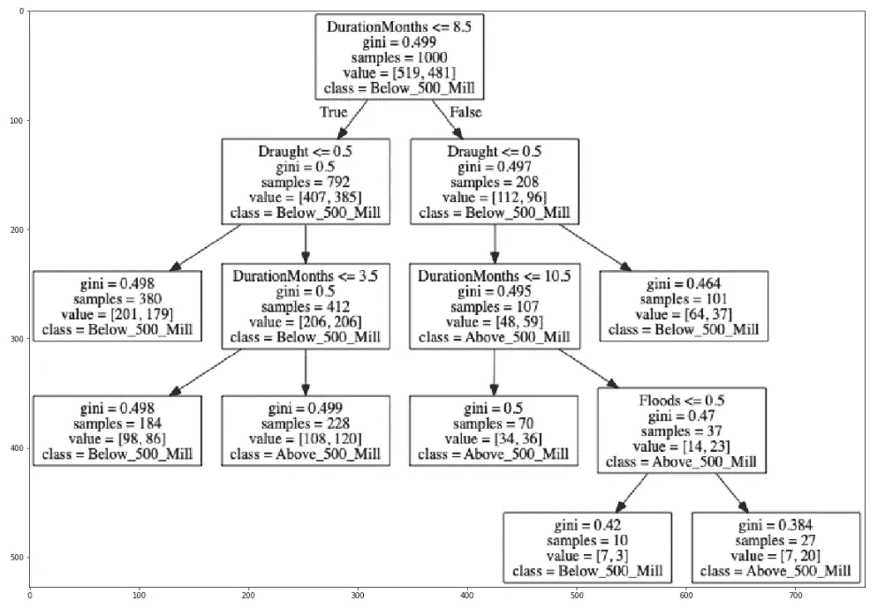****

****从输出中可以看到的输出可以通过以下方式读取。各种**预测器**(分类和数字)是每个决策节点中的第一个概念，分界点分为二进制真和假。基尼值提供了要在节点中分类特定目标值的概率的度量，在这种情况下，大多数**基尼系数**大约为 0.5，因为数据集是随机生成的，但是随着决策向下进行，基尼系数下降。**值**范围显示了值的分割如何在两个类别(高于和低于 5 亿)之间进行，并进一步指定了哪个**类别**是该节点中相对于目标变量的主导类别。****

****作为最后一步，我们的目标是根据通过 CART 获得的分类模型，获得数据集中每个变量的 aid 分类。`predict`命令在 **Python** 中以数组的形式生成相关输出。该值列表可在以后用于查看它是否明显偏离测试数据帧。****

```
**predAidCART= cart01.predict(X)**
```

****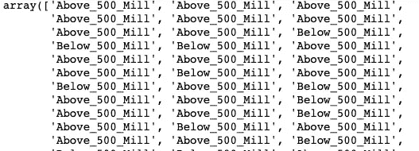****

# ****3.R 中的 CART 算法****

****在 **R** 中，相同的起点是上传我们想要生成的决策树的相关库，在本例中是`rpart`。****

```
**library(rpart)
library(rpart.plot)**
```

****为了在 **R** 中进行类似的分析，我们还需要依赖具有相同结构(数值/分类预测值)和目标变量的数据集。在这种情况下，建议的数据集是对之前使用的数据集的精确重建，尽管通过随机化我们会得到不同的结果。****

```
**df <- data.frame(replicate(1,sample(0:1000, 1000, rep=TRUE)))
colnames(df) <- c("IncomeLoss")
df$DurationMonths <- sample(0:12, dim(df), rep=TRUE)
df$Type <- sample(c('Draught','Floods','Famine'), size = nrow(df), replace = TRUE)
df$Location <- sample(c('Urban','Rural'), size = nrow(df), replace = TRUE)
df$AidMillion <- sample(0:1000, dim(df), rep=TRUE)
df$Aid_Given <- ifelse(df$AidMillion <= 500, "Above_500_Mill", "Below_500_Mill")**
```

****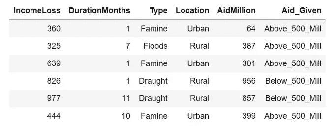****

******R** 中的第二步是分解分类变量(预测变量和目标变量),然后使用`rpart`算法(递归分割和回归树)根据指定的方法`class`建立决策序列，该序列将根据目标变量的性质(在本例中为分类变量)而变化。该方法旨在评估分类中的分割是否是基于基尼标准的最佳分割。与前一种情况不同，绘图是一个简单的片段。****

```
**df$Type <- factor(df$Type)
df$Aid_Given <- factor(df$Aid_Given)cart01 <- rpart(formula= Aid_Given ~ Type + DurationMonths, data=df, method='class')rpart.plot(cart01, type=4, extra=3)**
```

****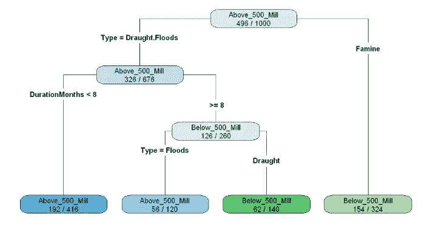****

****同样，分支的左侧指示分类是否正确，而右侧指示相反的情况。尽管在 **R** 中的可视化输出比 Python 中的版本包含的信息更少，但在试图解释决策之间的逻辑时，它似乎更容易理解。更清晰的分类和数值预测提供了一个更容易解释的分类。根据目标变量的性质，还有其他选项，因此代码版本只适用于分类变量。****

****在生成具有实际值的决策树之后， **R** 还允许开发预测值列表。在生成包含用于决策树的预测变量的数据帧后，需要命令`predict`来生成根据 CART 模型分类的目标值列表。稍后可以将它们与测试数据集进行匹配。****

```
**X<-data.frame(Type=df$Type, DurationMonths= df$DurationMonths)predAidCART <- predict(object= cart01, newdata=X, type="class")
head(predAidCART)**
```

****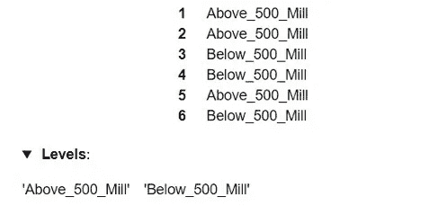****

# ****4.决策树的 C5.0 算法****

****另一种生成决策树的算法是 C5.0，与 CART 不同，它不局限于二叉分裂。该算法使用信息增益或熵减少的概念来选择最佳分裂。****

> ****信息增益通过根据随机变量的给定值分割数据集来测量**熵**的减少。更大的信息增益意味着更低的熵，因此更少的惊奇。低概率事件有更多的信息，高概率事件有更少的信息。熵对随机变量中的**信息位**进行量化，换句话说就是它的概率分布。****

****C5.0 使用**熵**的概念来测量纯度。数据样本的熵表示类别值的混合程度；最小值 0 表示样本完全同质，而 1 表示最大无序量。熵的定义可以在下面的等式中指定，对于给定的数据段，术语 *c* 指的是不同类级别的数量，而 p 指的是落入 cass 级别 I 的值的比例****

****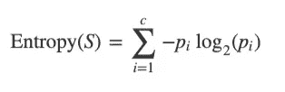****

****因此，C.50 算法被用于属性选择测量，该测量可以通过信息增益来构建决策树，该信息增益通过增加根据候选分裂对数据集进行划分所产生的信息来减少熵。在这种情况下，修剪技术将是二项式置信限，以在不损失准确性的情况下减小树的大小。****

> ****当数据是二分的(例如 0 或 1，是或否)时，使用二项式置信区间。二项式置信区间提供了具有特定置信水平的特定结果比例(例如成功率)的区间。****

****转到 **Python** 中的代码，通过在`DecisionTreeClassifier`命令中进行快速更改，将标准从基尼转换为熵，同时使用 CART 中使用的相同代码片段，可以轻松生成 C5.0 决策树。****

```
**cart02=DecisionTreeClassifier(criterion=”entropy”, max_leaf_nodes=4).fit(X,y)%matplotlib inline
export_graphviz(cart02, out_file= "decision_tree_C50.dot", feature_names=X_names, class_names=y_names)! dot -Tpng decision_tree_C50.dot -o decision_tree_C50.png
img = cv2.imread('decision_tree_CART.png')
plt.figure(figsize = (10, 10))
plt.imshow(img)**
```

****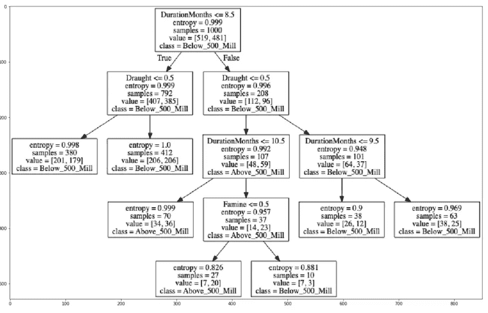****

****视觉输出的结果遵循与基尼系数生成的树相似的路径，尽管分界点的分布有所变化(例如，在第 3 级，数值预测值的分界点明显不同)。一般来说，基尼系数和信息增益熵是一样的，它们可以互换使用。如果有选择的话，基尼系数会更低，因为它不需要对数计算，而对数计算可能会更复杂。****

******R** 中的 C5.0 树虽然代表相同的逻辑，但产生了非常不同的视觉输出。公式中的不同之处在于使用了不同的命令`C.50`和叶节点中最小记录数的定义(在这种情况下，值为 50)。****

```
**C50 <- C5.0(formula= Aid_Given ~ DurationMonths + Type, data=df, control= C5.0Control(minCases=50))plot (C50)**
```

****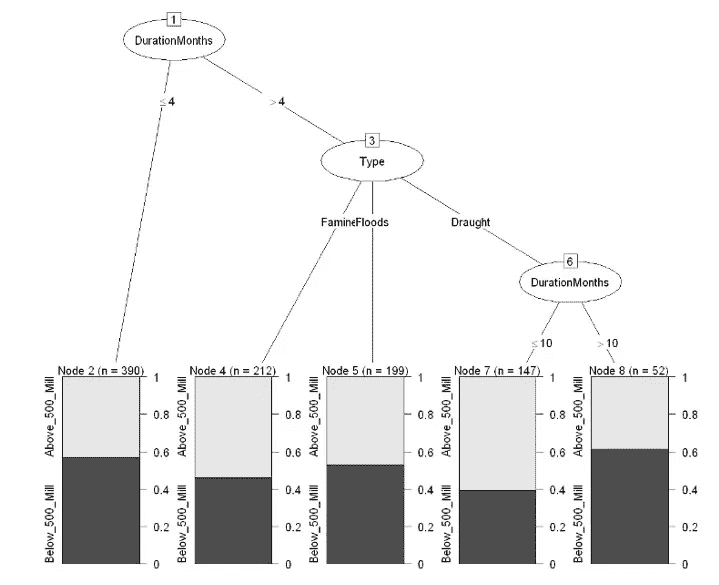****

****这个版本的视觉输出很有见地。例如，该树表明，在节点 7，如果危机持续时间小于 6 个月，则分类目标变量(给予的援助)的大部分类别条目在 5 亿以上，而当持续时间大于 10 个月时则相反，如节点 8 所述。条目以某种一致性分布在各个叶节点上，直到节点 7，而在某些情况下，第一个叶节点可能包含更多的条目。这种解释与现实生活中的案例场景无关，但可以帮助你适应这种视觉输出。****

# ****4.随机森林****

****CART 和 C.50 对所有记录生成一个决策树。然而，还有另一种使用多棵树的方法，其中在确定每个记录的最终分类时考虑每个树的输出。**随机森林**是一种监督学习算法，它建立在一系列决策树的基础上，并将每个记录的树分类组合成一个最终分类，这是集成方法的一个例子。换句话说，这是一种建模技术，它将多个模型的输出考虑在内，以得出最终答案。****

****随机森林算法首先通过从初始数据集中随机抽取样本来构建每个决策树，以便每个树可以基于不同的记录集进行构建。对于树的每个节点，选择预测变量的子集进行考虑。一旦生成了不同的树，数据集中的每条记录都会被每棵树分类并投票。具有最流行类别(或**票数**)的值被认为是用于预测的最终分类。****

****在 **Python** 中，随机森林的构建需要一个转换成一维数组的响应变量。`ravel`命令可以创建这样的格式。然后，`RandomForestClassifier`可用于指定算法的参数，n_estimators 输入指定在标准下要考虑的树的数量(可以是`gini`或`entropy`)。要通过算法查看最终分类，我们可以像以前一样使用 predict 命令。****

```
**from sklearn.ensemble import RandomForestClassifier
import numpy as nprfy= np.ravel(y)rf01= RandomForestClassifier (n_estimators=100, criterion="gini").fit(X, rfy)rf01.predict(X)**
```

****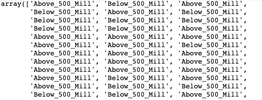****

****在 R 中，库`randomForest`允许我们建立一个模型，遵循与之前用来创建决策树的代码相似的代码。ntree 的规范是在我们的模型中校准精度水平与数据集大小之间的平衡的重要规范。输出保存在 rf01 中，标签为预测，为数据集中的每个条目存储一条记录。****

```
**library(randomForest)rf01 <- randomForest(formula= Aid_Given ~ DurationMonths+Type, data=df, ntree=100, type="classification")head(rf01$predicted)**
```

****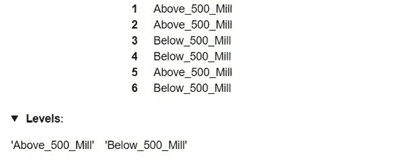****

# ****在这种建模方法之后，下一篇博客将解释建模数据的其他方法。这将是下一篇博客的特色！敬请期待****