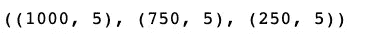
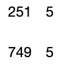
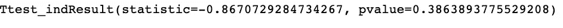
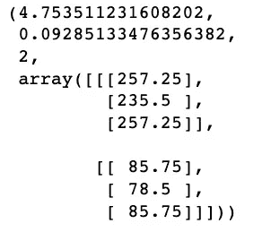
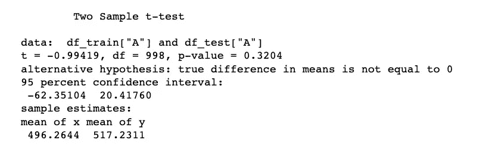
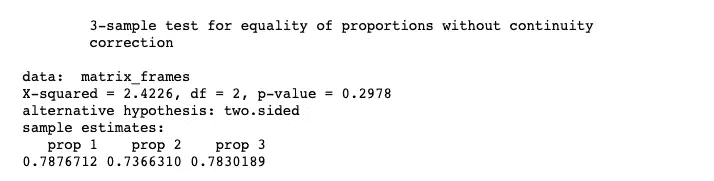
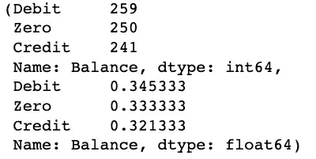
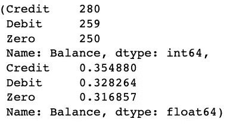
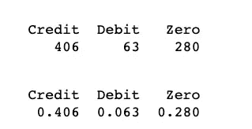
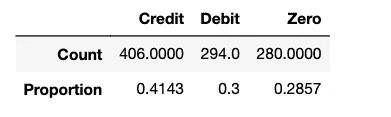

# R 和 Python 在建立数据帧预建模方面的风格差异

> 原文：<https://levelup.gitconnected.com/stylistic-differences-between-r-and-python-in-setting-up-the-dataframe-pre-modelling-6c5ec0195901>

## 数据科学文体学


在 [**准备好数据框架**](https://medium.com/swlh/stylistic-differences-between-r-and-python-for-data-preparation-bfda6ebd15aa) 和 [**以可视化形式探索变量之间的一些关键关系**](https://medium.com/analytics-vidhya/stylistic-differences-between-r-and-python-for-exploratory-data-analysis-1c5195162b8a) 之后，下一阶段将需要在数据建模之前采取一些关键步骤。这些包括:1)划分数据，2)验证数据划分，3)平衡数据，以及 4)基线模型性能。这些任务的结合使我们能够以最佳和更准确的方式进行数据建模。

# 1.数据科学中划分的意义

本系列博客中提出的方法并不依赖于统计推断作为从样本人群中进行概括的手段。在建议的方法中避免这种做法的原因是双重的:1)统计显著性可能不对应于实际显著性或被理论基础所证实；2)具有先验假设可能导致确认偏差，而不是在数据中搜索可操作的结果。

由于缺乏先验假设，对数据进行划分的需要降低了随机变化产生虚假结果的风险，而不是通过**数据挖掘产生的真实结果。**该术语描述了一种误用数据分析的行为，即通过执行许多统计测试来寻找模式，并只报告那些返回的重要数据，这增加并低估了假阳性的风险**。**这种风险是真实存在的，当数据挖掘被用来发现模式，而没有首先设计一个特定的假设来帮助探索潜在的因果关系。

**交叉验证**的过程是一个具体的解决方案，以确保结果对一个独立且不可见的数据框架更具普遍性。在双重交叉验证中，使用随机分配将数据划分为两个独立的空间:一个**训练**和一个**测试**数据集。当模型从训练数据集中学习数据中的模式和趋势时，目标变量被暂时从测试数据集中移除。然后，将该模型应用于测试集，并通过评估总误差率，对照原始目标值评估预测值。每个分区的大小将根据数据帧的复杂程度而变化，通常在作为训练数据集一部分的条目的 50%到 75%之间。

# 2.划分数据

在 **Python 中，**随机数据集的创建，如下面的代码片段所示，与前面的例子一致，可以支持读者更容易地应用代码。与前面的例子不同，df 现在更大了。

```
df = pd.DataFrame(np.random.randint(0,1000,size=(1000, 3)), columns= ('A','B','C'))
Place = (['London','Delhi','Rome'])
df["Place"] = np.random.choice(Place, size=len(df))
Balance = (["Credit", "Debit","Zero"])
df["Balance"] = np.random.choice(Balance, size=len(df))
```

在 **Python** 中，划分数据的起点需要上传相关的库，使用`train_test_split`命令指定测试数据集的大小，并使用`random_state`输入为随机生成器设置一个种子，这样您的训练测试分割总是确定的。如果在运行期间重复结果，则重复相同的种子。

```
import pandas as pd
from sklearn.model_selection import train_test_split
import randomdf_train,df_test= train_test_split(df, test_size=0.25, random_state=8)df.shape, df_train.shape, df_test.shape
```



在 **R** 中，过程颇为相似。在定义了一个更大的数据集并建立了之前博客中建议的关键变量之后，分区的起点似乎非常相似。

```
df <- data.frame(replicate(3,sample(0:1000, 1000, rep=TRUE)))
colnames(df) <- c(“A”,”B”,”C”)
df$Place <- sample(c(“London”, “Delhi”,”Rome”), size = nrow(df), prob = c(0.76, 0.14,0.1), replace = TRUE)
df$Balance <- sample(c(“Credit”, “Debit”,”Zero”), size = nrow(df), prob = c(0.70, 0.1,0.45), replace = TRUE)
```

**R** 中分区的起点是设置种子，该种子也需要在额外的运行中用作常数，以获得相同的结果。然后，通过定义数据帧的长度，并使用命令`runif()`在 0 和 1 之间随机抽取一个数字，并以相等的概率将每个数字映射到数据帧中的各个条目，从而进行划分。`runif`中的条件将把真和假与低于或高于用于随机化的阈值相关联。数据帧的子集将根据来自命令`runif`的布尔条件收集记录。

```
set.seed(8)
n<- dim(df)[1]
train_df<-runif(n)<0.75
df_train<- df[train_df, ]
df_test<- df[!train_df, ]
dim(df_test); dim(df_train)
```



# 2.验证分区

分区的验证将需要一组额外的检查，以确保数据集之间不会偏离太多。为此，需要对变量样本进行进一步测试。根据变量类型，一些统计测试可能是有益的:双样本 t-检验数值变量的均值差异，或`stats.chisquare`验证分类变量的分布是否相同。

在 **Python** 中，生成的数据样本上的`t-test` 打印每个样本的两个数值变量的统计数据和 p 值。在这种情况下，t 统计的解释表明样本均值在 95%的置信水平下是相同的，因为 p 值**未能拒绝 H0，**换句话说，两个分布之间的均值是相似的。

```
ttest_ind(df_train['B'],df_test['B'],equal_var = False)
```



卡方拟合优度测试类似于 **Python** 中分类变量的单向 t 测试:它测试样本分类数据的分布是否与预期分布相匹配。命令`stats.chi2_contingency` 计算列联表 TrainPlace_array 中观测频率独立性假设检验的卡方统计量和 p 值。如果 p 值高于 5%的阈值(如本例)，我们不能拒绝零假设，两个分布是独立的，这也意味着两个变量没有关联或彼此相连。相反的结果显示出`Place_train`和`Place_test`之间更强的频率关联，这在分割期间将是理想的。

```
Place_train = pd.crosstab(index=df_train['Place'], columns="count")
Place_test = pd.crosstab(index=df_test['Place'], columns="count")Train_array = np.asarray(Place_train)
Place_array = np.asarray(Place_test)
TrainPlace_array = np.array([Train_array, Place_array])
stats.chi2_contingency(TrainPlace_array)
```



```
t.test(df_train['A'], df_test['A'], var.equal = TRUE)
```



衡量之间的比例有多接近，可用于检验几个组中的比例(成功的概率)是否相同，或者它们是否等于某些给定值。在输出中，`prop1`、`prop2`和`prop3`是两个样本中三组分类属性相等的概率。p 值高于 5%，这表明两个数据集(训练、测试)之间所研究特征(地点)的比例没有显著差异。

```
t= table(df_train$Place)
t1= table(df_test$Place)matrix_frames<-merge(t,t1,by=”Var1")
matrix_frames<-matrix_frames[,-1]
matrix_frames<-data.matrix(matrix_frames, rownames.force = NA)
prop.test(matrix_frames)
```



# 3.平衡训练数据集

在一些分类模型中，目标变量类之一的相对频率比其他类低得多。如前所述，检查相关变量的频率分布有助于识别可能需要重新平衡的变量。只有训练数据集应该重新平衡，而测试数据集应该保留，因为它需要保持证据的类世界表示。

重新平衡数据帧的第一步是观察数据集的值计数，以确定要调整哪个分类属性。在 **Python** 中，这是通过`value_count`函数完成的，该函数也可以除以数据帧的整个长度，以观察每个数据帧的相对频率。

```
df_train['Balance'].value_counts(), df_train['Balance'].value_counts()/len(df_train)
```



从这个初步的概述中，我们需要确定我们需要在多大程度上对数据帧中的选定变量进行重新采样。在这种情况下，我决定将信用记录的百分比从 32%提高到 35%。用于确定需要多少具有此特征的记录的计算是以下公式的结果:(目标% *训练数据集的大小-要修改的变量的频率计数)/1-目标%。要添加到训练数据集中的信用记录的数量是 39，并且命令`to_resample.sample`和`pd.concat`导致具有 35%信用记录的重新平衡的训练数据集。

```
x=(0.35*750–241)/0.55to_resample=df_train.loc[df_train['Balance']=='Credit']
our_resample=to_resample.sample(n=39, replace=True)
df_train_rebalance= pd.concat([df_train, our_resample])df_train_rebalance['Balance'].value_counts(),
df_train_rebalance['Balance'].value_counts()/len(df_train_rebalance)
```



在 **R** 中，重新平衡的起点与前面的例子类似。我们需要以表格的形式研究绝对和相对频率。

```
table(df_train$Balance);table(df_train$Balance)/n
```



R 中数据帧的重新平衡还需要选择一个分类属性(Debit)和一个反映该分布中目标百分比的大小值(在本例中为 6%到 30%)。重新平衡的数据帧是通过命令 sample 和 rbind 创建的，而显示结果的表格需要更多代码，并且需要指定每个标签。

```
to.resample<-which(df_train$Balance=='Debit')
x=(0.3*750-63)/0.7our.resample<-sample(x=to.resample, size=231, replace=TRUE)
our.resample<-df_train[our.resample,]
df_train_rebalanced<- rbind(df_train, our.resample)t.v1<- table(df_train_rebalanced$Balance)
t.v2<-rbind(t.v1, round(prop.table(t.v1),4))
colnames(t.v2)<-c('Credit','Debit','Zero')
rownames(t.v2)<-c('Count','Proportion')
t.v2
```



达到此阶段后，在评估模型性能之前，我们应该根据某个基线模型校准结果，该基线模型基于数据框架特定用途所需的精度级别。对于回归来说，在许多情况下，估计值和平均响应之间的比较是不够的。有必要了解预测器中包含的大量信息，以及主题专家认为的最佳预测误差。这就是为什么强大的数据科学方法还需要相关的技术专业知识。

# 在此之后，建议的数据科学方法的下一阶段是建模阶段。这个在下一篇博客解释！