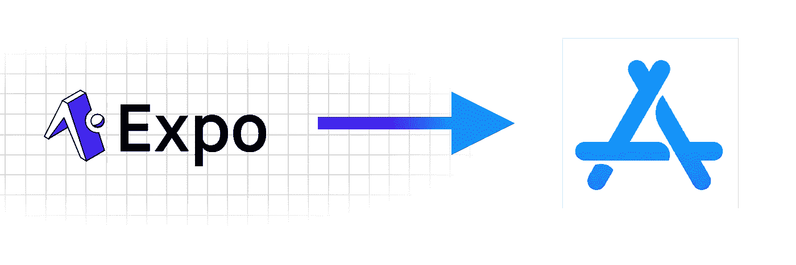
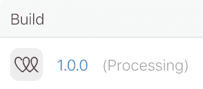
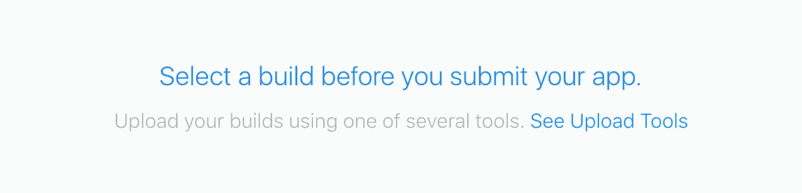

# 向 Apple App Store 提交 Expo 应用程序

> 原文：<https://levelup.gitconnected.com/submitting-an-expo-app-to-apple-app-store-f1165c5a85d4>



经过数周的设计、开发和测试，我该向苹果应用商店提交我的第一个应用了。我使用 Expo / React Native 进行开发，发现提交过程有点复杂。我整理了这个一步一步的指南，带你通过提交过程。请注意，您需要使用 iOS 操作系统向 Apple store 提交应用程序。

第一步是在 [App Store Connect](https://appstoreconnect.apple.com/login) 上创建一个新应用。请确保使用与您的 Apple Developer 帐户关联的 Apple ID 登录。导航到我的应用程序，然后单击蓝色加号创建一个新应用程序。


填写你的应用名称和主要语言。您的 SKU 可以是您的应用程序的任何标识符，如 MyApp123。如果您还没有，您将不得不[注册一个新的捆绑包 ID](https://developer.apple.com/account/resources/identifiers/bundleId/add/) 。这将为您提供捆绑包 ID，以便添加到您的新应用提交中。点击“创建”后，您可以填写应用的相关详细信息，包括屏幕截图、您的应用商店描述和年龄分级。

现在，您的应用程序已在 App Store Connect 上设置完毕，您可以开始准备提交应用程序代码了。确保将您在 App Store Connect 中生成的捆绑包 ID 添加到您的 app.json 文件中，如下所示:

一旦您有了自己的包 ID，请确保将它添加到您的 app.json 文件中。

```
"ios": {"bundleIdentifier": "bundleIdGenerated","buildNumber": "1.0.0",}
```

现在，您的应用程序已在 App Store Connect 上设置完毕，您可以开始准备提交应用程序代码了。首先，导航到您的项目目录，构建您的提交文件。若要生成，请运行命令

```
expo build:ios
```

等待您的构建完成。完成后，您将看到一个. ipa 文件的 url 单击此链接或复制粘贴到您的浏览器中以下载。ipa 文件。

一旦你有了。ipa 文件，打开 Transporter app。如果你还没有 Transporter 应用，你可以从 app store 免费下载。使用您用于 Apple 开发者帐户的 Apple ID 登录，并上传您的。ipa 文件。点击蓝色交付按钮，交付至 App Store Connect。

传输器完成上传后，会显示已发送


回到 App Store Connect —现在还不是点击提交的时候！导航至活动>所有构件。在这里，您将看到您刚刚使用 Transporter 提交的构建。



如果你的 app 说正在处理，不用担心！这完全正常。根据应用提交流量，这可能需要几分钟到几个小时。如果你想在构建完成时收到通知，你可以看看这个 [watchbuild](https://github.com/fastlane/watchbuild) 工具(自述文件中的详细说明)，或者你可以不时回来查看，让你的应用完成处理。

处理完成后，返回 App Store >准备提交。您的构建现在会说:



选择您的构建，保存，并提交审查！最后一步是回答一系列法律问题。如果您使用 Expo 构建您的应用程序，请确保选择“是”作为广告标识符(更多关于原因的信息请点击[这里](https://segment.com/docs/connections/sources/catalog/libraries/mobile/ios/quickstart/#step-5-submitting-to-the-app-store))。

恭喜你！现在你可以高枕无忧，等待苹果公司对你的应用进行审查。希望这在提交 1.0.0 时为您节省了一些时间和挫折:)