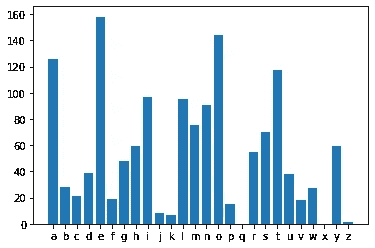
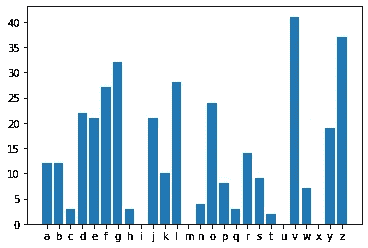
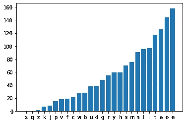
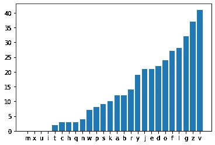

# Python 和 JS 中的替代密码

> 原文：<https://levelup.gitconnected.com/substitution-encoder-and-solver-in-python-19984a6b8d5d>

替代密码的实现及一些统计分析

# 动机

你来这里是因为担心你所有的流量都被政府嗅探分析吗？你来对地方了！在这里，您将学习加密您的文本和阅读别人的秘密聊天，这是加密的替代密码。

糟糕的是，最终，你会确定你在 WhatsApp 中的所有聊天都能被轻易解码(确定这不是真的，脸书在大约 40 年前就决定不对 WhatsApp 使用替代密码)。

我们将在 Python 中实现一个替代密码，然后我们将尝试使用统计来破解代码。


《美丽心灵》

# 替代密码

维基百科说:

> 在[密码学](https://en.wikipedia.org/wiki/Cryptography)中，**替代密码**是一种[加密](https://en.wikipedia.org/wiki/Encrypting)的方法，通过这种方法，按照固定的系统，将[明文](https://en.wikipedia.org/wiki/Plaintext)的单元替换为[密文](https://en.wikipedia.org/wiki/Ciphertext)；“单元”可以是单个字母(最常见的)、成对字母、三个字母、以上的混合等等。接收者通过执行反向替换来解密文本。

换句话说，所有的字母“A”都用“B”代替，所有的“B”都用别的东西代替。我们简单地混合所有的字母。接收加密文本的人知道字母是如何混合的。

让我们看一个例子。

你有这样的文字:

```
On a dark desert highway
Cool wind in my hair
Warm smell of colitas
Rising up through the air
Up ahead in the distance
I saw a shimmering light
My head grew heavy and my sight grew dim
I had to stop for the nightThere she stood in the doorway
I heard the mission bell
And I was thinkin' to myself
'This could be heaven or this could be hell
Then she lit up a candle
And she showed me the way
There were voices down the corridor
I thought I heard them say
```

让我们替换这些字母:

```
abcdefghijklmnopqrstuvwxyz
```

通过这些:

```
fcpevqkzgmtrayonujdlwhbxsi
```

所以，我们不写“a”，而是写“f”，不写“b”，而是写“c”，以此类推。

然后我们得到这个加密文本:

```
oy f efjt evdvjl zgkzbfs
poor bgye gy as zfgj
bfja davrr oq porglfd
jgdgyk wn lzjowkz lzv fgj
wn fzvfe gy lzv egdlfypv
g dfb f dzgaavjgyk rgkzl
as zvfe kjvb zvfhs fye as dgkzl kjvb ega
g zfe lo dlon qoj lzv ygkzl
lzvjv dzv dlooe gy lzv eoojbfs
g zvfje lzv agddgoy cvrr
fye g bfd lzgytgy' lo asdvrq
'lzgd powre cv zvfhvy oj lzgd powre cv zvrr
lzvy dzv rgl wn f pfyerv
fye dzv dzobve av lzv bfs
lzvjv bvjv hogpvd eoby lzv pojjgeoj
g lzowkzl g zvfje lzva dfs
```

为了简单起见，现在所有的字母都是小写的。当然，这不是必需的。

# 用 Python 实现

Python 中的实现很简单:我们查看每个字母，如果该字母在字母表中，那么我们用密钥替换它:

```
alphabet = **"abcdefghijklmnopqrstuvwxyz"** key = **"fcpevqkzgmtrayonujdlwhbxsi"** text = **"On a dark desert highway Cool wind in my hair"** result = **""
for** letter **in** text:
    **if** letter.lower() **in** alphabet:
        result += key[alphabet.find(letter.lower())]
    **else**:
        result += letter

print(result)
```

没错。我们完了。但这是 Python，为什么不简化一下呢？

```
alphabet = **"abcdefghijklmnopqrstuvwxyz"** key = **"fcpevqkzgmtrayonujdlwhbxsi"** text = **"On a dark desert highway Cool wind in my hair"**
print(**""**.join([key[alphabet.find(a)] **if** a **in** alphabet **else** a **for** a **in** text.lower() ]))
```

# 用 JavaScript 实现

JavaScript 中的实现包括一些 HTML 结构和其他结构，所以稍微长一点，尽管想法是一样的:

# 分析一下:)

那么，为什么脸书决定不用替代密码加密所有的聊天记录呢？破解密码真的很简单吗？

你会怎么做？

暴力破解需要一些时间，检查你是否已经解码了文本是很重要的，你需要检查每个单词，并与一些词汇进行比较。另一个问题是，有些单词可能是名字，比如“California”，你会找不到。

既然我们是一个字母一个字母的加密，那么用同样的方式解密也是有意义的。我们计算“正常文本”中的字母数量，并找出哪些字母出现的频率更高。比方说，如果字母“e”是最常遇到的，我们就在我们的加密文本中找到最常出现的字母，并用“e”代替它。很可能，我们是对的。

好的。我们如何计数？我拿着女王著名的《波西米亚狂想曲》的歌词，数着字母:

```
import matplotlib.pyplot as plt
alphabet = "abcdefghijklmnopqrstuvwxyz"
plt.bar(list(alphabet), [corpus.lower().count(letter) for letter in alphabet])
```

这里的语料库变量包含完整的歌词。最后，我们得到了这张图表:



《波西米亚狂想曲》中的字母频率

这是我们加密文本中字母的出现频率:



加密文本中的字母频率

所以，从这里，我们可以猜测“e”很可能是用“v”加密的，“o”是用“z”加密的。

让我们对这两个图表进行排序:

```
import pandas as pd
df = pd.DataFrame({
    "letter": list(alphabet),
    "count": [corpus.lower().count(letter) for letter in alphabet]
})
df = df.sort_values("count")
plt.bar(df["letter"], df["count"])
```

以下是文集(《波西米亚狂想曲》):



这是加密文本:



然后我们得到下面的密钥:

```
gpnkvqayftioedzcxbjlshwmru
```

vs 原始密钥:

```
fcpevqkzgmtrayonujdlwhbxsi
```

现在，这当然是不准确的:(但我们已经猜到了至少几个字母。可能是猜测其他的起点。

所以，我们成功地破解了这个密码。我太天真了，没想到会有这种方法。因此，我很快在互联网上寻找一种算法，并发现它要复杂得多。

你需要做的是收集二元图、四元图等的统计数据。所以，我们应该学一些类似“字母 A 后面经常跟着字母 T”的东西。为此，我们需要一个更大的语料库。也许下次吧。

有时我们会失败，是的:)我希望你仍然喜欢这个旅程。