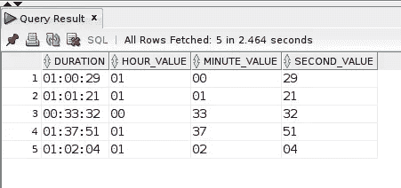
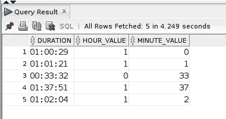
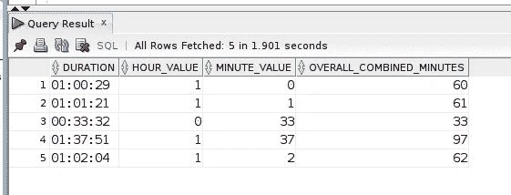

# SUBSTR()字符函数— Oracle SQL 示例

> 原文：<https://levelup.gitconnected.com/substr-character-function-oracle-sql-example-fcdd37a5a3a8>

操纵字符串或字符数据是编程中的基本实践。有太多的需求、原因和用例可能需要*分割和切割*一个字符串值。Oracle SQL `SUBSTR()`函数可用于提取字符串的特定部分。如果您对`SUBSTR()`不熟悉，请继续阅读以了解更多信息，并将这个方便的函数添加到您的 SQL 工具箱中。

图片由 [Gerd Altmann](https://pixabay.com/users/geralt-9301/?utm_source=link-attribution&utm_medium=referral&utm_campaign=image&utm_content=1989152) 来自 [Pixabay](https://pixabay.com/?utm_source=link-attribution&utm_medium=referral&utm_campaign=image&utm_content=1989152)

## 为什么我要写关于`SUBSTR() function?`的文章

我一直在研究 Oracle SQL，最近使用了`SUBSTR()`字符函数，试图在`INTERVAL`列中存储持续时间类型的数据值(例如，1 小时 20 分 17 秒)。

虽然我还没有完全确定那个解决方案，但是，(当我确定的时候，你可以期待一个关于它的巨大的博客帖子😁在我的学习中，这是一个很大的焦点。

在这篇特别的博客文章中，我不需要深入研究关于在`INTERVAL`列中存储数据的任何问题。然而，我很好地利用了`SUBSTR()`，并希望与其他对`SUBSTR()`如何工作感兴趣的开发人员分享一些简单的示例查询。

## 样本数据概述

下面的查询返回我所针对的样本字符串值的 5 行，存储在名为 **duration** 的`VARCHAR2`列中。该数据的格式表示值“HH:MI:SS”(小时:分钟:秒):

(注意:根据 **DAY_WALKED** `DATE`列(未显示为`SELECT`列列表的一部分),查询结果按最近的日期排序，因为这些行包含字符串中“小时”部分的值，最适合演示查询。)

# SUBSTR()语法和含义

`SUBSTR()`的语法如下:`SUBSTR(target_string, position, length)`

含义:

*   ***target _ string***—要从中提取文本/字符部分的必需字符串。
*   ***位置*** —开始提取的数值。也需要。位置编号值可以是负数，在这种情况下，提取将从目标字符串的最末端开始，并向后继续。
*   ***长度*** —该值是可选的。如果包含，`SUBSTR()`将从`n`位置值开始提取这么多字符。如果在`SUBSTR()`函数调用中没有提供长度参数值，则从`n`位置参数值开始完整提取目标字符串的剩余部分(直到末尾)。

## SUBSTR()示例查询

和任何事情一样，例子提供了清晰度。在第一个查询中，我首先提取第一个字符处的 *hour* 子字符串部分，然后再继续总共 2 个字符(由 2 length 参数值指定)，主要是提取第一个冒号(:)分隔符之前的小时值:

为了*隔离*持续时间列分钟部分，我使用`SUBSTR()`并提取第一个和第二个冒号分隔符之间的值。再次指定 2 作为长度，从 4 的起始位置返回 2 个字符(第一个冒号分隔符后的第一个字符)。

由于字符串的最后 2 个字符是秒的值，我可以根据提供的参数以 2 种不同的方式使用`SUBSTR ()`。

## 方法 1

从位置 7(最后一个冒号分隔符后的第一个字符)开始，长度为 2，返回秒的值:

## 方法 2

因为我知道秒的值是字符串的最后 2 个字符，所以我对 position 参数使用-2(记住负的位置值从 target_string 的末尾开始计数)。虽然我提供了 2 作为长度参数，但是我可以很容易地在这里省略它，因为没有它，`SUBSTR()`提取到目标字符串的末尾。因此，`SUBSTR()`在本例中也可以这样称呼:`SUBSTR(duration, -2)`

总的来说，所有 3 个单独的持续时间值都在一个查询中返回:

# SUBSTR()在这些例子中有什么用？

通过使用`SUBSTR()`并提取持续时间字符串的特定部分，可以使用`CAST()`函数进一步对这些值进行类型转换，如以下查询所示:

将`SUBSTR()`值转换为`NUMBER`数据类型，并使用`CASE`表达式，我可以在适当的地方给分钟值加 60，从而提供一个*分钟总数*值:

只要小时值为 1，分钟值就会加上 60 分钟。如果小时不为 1，则将 0(零)分钟加到分钟值上，基本保持不变。

本文中的示例使用了 Oracle SQL `SUBSTR()`函数，但是其他 SQL 实现也使用了`SUBSTR()`或类似的函数来实现相同的目的。

你在查询中使用`SUBSTR()`或类似功能的巧妙方法是什么？请在下面的评论中告诉我。

如果你在代码中发现任何错误或者有任何疑问，请在评论中分享。感谢您的阅读！

## 你会喜欢的其他帖子…

*   [如何使用 Oracle SQL 日期函数找到一个月的第一天和最后一天](/how-to-find-the-first-and-last-day-of-a-month-with-oracle-sql-date-functions-706572c751a8)
*   [MySQL 统计工作日出现次数](/mysql-count-weekday-occurrences-5241511dba8c)

喜欢的内容，你在这个帖子里看过？那么你肯定会喜欢我博客上的博文，数字猫头鹰的散文。

在那里你会找到关于 SQL 数据库开发/编程和 LAMP stack web 开发的博文。