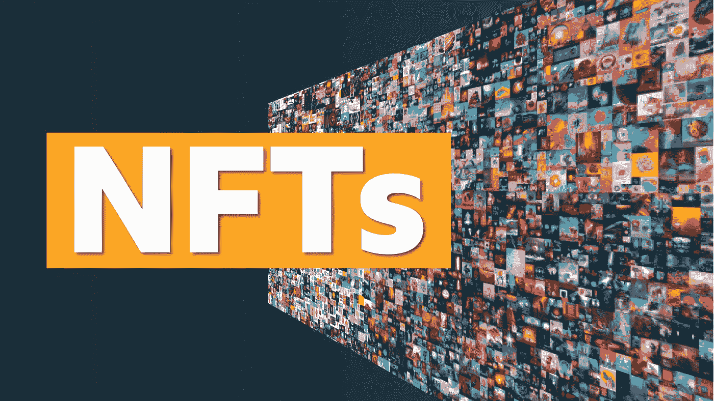

# 成功翻转 NFT 获利。

> 原文：<https://levelup.gitconnected.com/successfully-flip-an-nft-for-profit-4c913e8b7ab4>

这篇文章可能有点不合时宜，因为 NFT 市场目前正暴露出狗屎风暴。

NFT 包正从各个角度遭到核攻击。ETH 正在融入地球，项目底价下跌了 90%。

创始人？大多数都沉默了。

如果你符合“我买了顶”的描述或者在非金融交易中过度杠杆化，不要责备自己。你的失败经历将对你在下一轮牛市中获利大有裨益，即使这意味着你现在要重返正职。

也许你可以重新考虑你的交易策略？也许你不是一个交易天才，也许只是一个十足的赌徒。

不管你是什么，我都不在乎。人们在大多数事情上都很糟糕。

让我们来谈谈一些实用的策略，以利用一些短期的翻转。看什么，为什么有必要。

即使你打算袖手旁观，这在接下来的两年里是多余的，这篇文章的基本原理将帮助你在机会出现时利用它。

在高交易量项目上，仍然有一些突出的机会可以利用。而且，拥有社区小气候的项目可能并没有意识到我们实际上正处于熊市。

> 交易不同于投资

对于我在 NFT 的大部分投资，我都有一个长期的投资目标。但偶尔也会有机会翻翻 NFT 来获利。

以下是让你自己获得最佳拍摄效果的方法。你实际上是在瞎猜。

# 评估 Opensea 的购买压力

Opensea 主页有一个排名标签，你可以通过交易量过滤项目。具体来说，我观察 30 天、7 天和 24 小时的活动来衡量购买压力趋势。

您还应该查看“活动”选项卡，并注意每次销售之间的时间间隔。如果一个项目每 10 小时只卖出一辆 NFT，那就离开。立刻。

然后，我会查看上市出售的非功能性食物的数量。任何超过 15%的藏品都是危险信号。

如果你看这些区域的原因不是很明显，我们就来解释一下。更多的购买者和更少的供应给你更多的机会出售你的非流动数字资产，更少获得“Rekt”

# 不和谐中的情绪

如果你在“不和谐”的一般部分阅读 50 条信息，你可以很快发现公众对该项目的情绪。

如果最低价主导了谈话，你可以从中推断出，持有人是在短期内。

老实说，这是 2022 年的标准。

一个了解项目和创始人的有知识的社区，对创始人的艺术或愿景有热情，是一个他妈的大扁虱。

记住，要让价格上涨，买入压力需要大于卖出压力；越来越依赖于非金融资产的人往往是钻石手，对宏观经济问题有些漠不关心。

最后一点不完全正确。

# 这必须是一次“价值购买”

换句话说，你需要以低于底价的折扣购买你的 NFT。

当你买 NFT 的时候，要翻转，当然，你需要做的工作。钱不会长在树上；如果很简单，每个人都会做。

不知道我能不能在最后一句中听起来更陈词滥调，即使我尝试了。但众所周知，妈妈一定是有原因的。

把你的衣服包起来，在每一件非功能性衣物上贴上低报价。

如果你是在场内购买代币，请注意，在销售时，你需要计入 Opensea 的 2.5%的费用和创造者版税。

所以低调点，耐心点。把尽可能多的报价放在底价以下；保证骨头上有足够的肉，以获得费用后的利润。

有人谁是过度杠杆化或寻找快速出售购买其他东西会上钩。这对你来说将是一个神奇的时刻，所以不要忘记拍拍自己的背。

我不想这么说，但这很简单。

# 销售时，要有耐心。

[6 种培养销售耐心的方法](https://spiro.ai/blog/6-ways-to-develop-more-patience-in-sales/)

销售你的 NFTs 是困难的，需要时间和耐心。

但是如果你遵循了这篇博客中的步骤，并给了自己最好的机会，你就能获得一些利润。

把你的 NFT 放在稍微高于地板的地方。

在这一点上，购买高交易量项目的人不会因为多花 100 美元而不安。尤其是当这些鲸鱼中的一部分人盲目地扫地，或者主观上买自己喜欢的东西的时候。

最后但同样重要的是。

冲洗并重复。

***以上都不是理财建议。我不是一个合格的财务顾问，尽管我尽了最大努力，我也无法预测未来。***

***NFT 空间有风险。***

***专家说目前 99%的项目都是走向 0。***