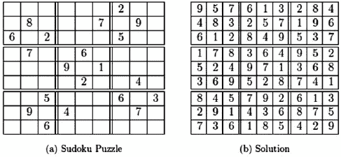
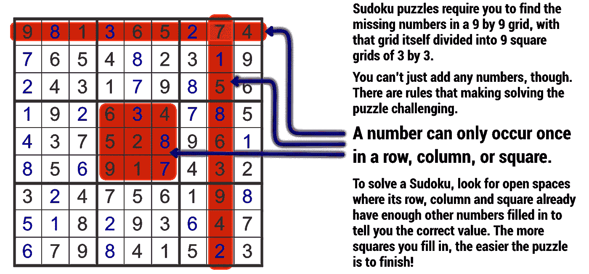
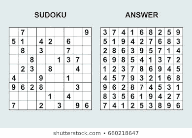
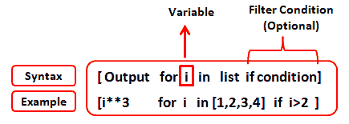
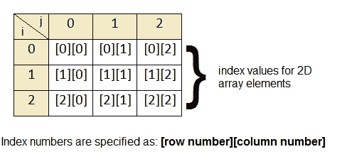

# 使用回溯的 Python

> 原文：<https://levelup.gitconnected.com/sudoku-solver-python-using-backtracking-1aff17a3340>

```
sudoku = input("Enter Soduku")
# 070000009510420600080300700008001370023080040400900100962800030000010400700203096
puz = [[int(sudoku[(i+j)-1]) for i in range(1,10)] for j in range(0,81,9)]

def check(puzzle, i, row, col):
    rows = puzzle[int(row)]
    column = [puzzle[r][col] for r in range(0,9,1)]
    if i in rows:
        return False
    if i in column:
        return False
    SquareRow = (row // 3)*3
    squareColumn = (col // 3)*3
    Square = [puzzle[y][z] for y in range(SquareRow, SquareRow+3) for z in range(squareColumn, squareColumn+3)]
    if i in Square:
        return False
    return True

def find(puzzle):
    for i in range(0,9,1):
        for j in range(0,9,1):
            if puzzle[i][j]==0:
                return i,j
    return None

def solve(board):
    finds = find(board)
    if not finds:
        return True
    else:
        row, col = finds

    for i in range(1,10):
        if check(board, i, row, col):
            board[row][col] = i

            if solve(board):
                return True

            board[row][col] = 0

    return False

print(solve(puz))
print(puz)
```

欢迎来到用 python 制作数独求解器的教程。我要警告你们所有人，这涉及回溯，如果你是一个绝对的初学者/新手，这是一个非常复杂的主题，所以我建议在你试图理解这段代码之前，先了解一下 python 的循环、函数和基本指令。在我看来，我仍然是一个中级程序员，我花了 5 个小时在网上找了很多指导来编写这个代码，所以我警告你！

如果你想在看这个之前知道所有的事情，这里有一个清单:

*   列表理解
*   递归
*   循环中的索引和范围的使用
*   函数和参数的使用方式
*   2D 数组以及如何从它们索引
*   比较语句

这是所有复杂的主题，所以如果你明白所有这些是什么，那么我们可以开始了！！

**我先来解释一下数独:**



带解决方案的数独游戏示例

在数独棋盘中，有一个 9x9 的格子，它被分成 3x3 的方块。您的目标是填充网格，使每行、每列和每个网格都有数字 1-9 穿过。这意味着每个列、行和 3x3 网格中不允许有重复的数字。



既然我们理解了这个概念，那么让我们开始解释这个代码。

```
sudoku = input("Enter Soduku")
# 070000009510420600080300700008001370023080040400900100962800030000010400700203096
```

这只是用来输入你想要解决的数独，这将有数独输入行，其中 0 是我们不知道的任何瓷砖。我注释掉了我的程序的测试数据，它是一长串整数，这个整数对应于下面的数独，正如你所看到的，如果你把所有的行从上到下一个接一个地放在一起，并用 0 替换空白，结果是一样的。我们选择 0 是因为它很容易索引，因为它的长度为 1 个字符，同时也不是可能的数字(1-9)的一部分，这使得它更容易索引。



之后我们做一个列表理解:

```
puz = [[int(sudoku[(i+j)-1]) for i in range(1,10)] for j in range(0,81,9
```

这是一个列表理解。它从之前的 sudoku 变量中获取输入，并将其拆分为 9 行，如上图所示。我们在 2D 数组中需要这个，所以我们必须在列表理解中列表理解。这与以下方式相同:



```
puz = []
for i in range(0,81,9):
    append = []
    for j in range(1,10):
        append.append(i+j)
    puz.append(append)

print(puz)
```

这基本上将代码缩短为一行，我们可以将代码分割成与数独相同的布局，这在我们想要检查一个数字在位置 ie 中是否有效时很重要。该数字不会在其所在的行、列或 3x3 正方形中重复出现。我们在这个程序中做的所有事情都使用这个 puz 变量。

当抽象这个问题时，你会意识到这个程序实际上只围绕 3 个真正的任务:找到 0，找到什么值是可能的，检查它是否导致一个可行的数独解决方案，如果不是，我们可以很容易地回溯并尝试不同的可能性。这使得使用函数非常有效，更重要的是使用递归。递归是一个自调用函数，它允许我们不断地遍历一个可能的解决方案，如果它失败了，我们可以返回 false，从而进行回溯。因此，接下来的 3 个部分都是关于这 3 个功能的。

**注意:这些是函数，所以它们不会运行，除非我们专门调用它们，最后两行是 print(solve(puz))，print(puz)，因为它们都将运行这些函数。我在其他函数中嵌套了一些函数，所以它们都是运行的。**

```
def check(puzzle, i, row, col):
    rows = puzzle[int(row)]
    column = [puzzle[r][col] for r in range(0,9,1)]
    if i in rows:
        return False
    if i in column:
        return False
    SquareRow = (row // 3)*3
    squareColumn = (col // 3)*3
    Square = [puzzle[y][z] for y in range(SquareRow, SquareRow+3) for z in range(squareColumn, squareColumn+3)]
    if i in Square:
        return False
    return True

def find(puzzle):
    for i in range(0,9,1):
        for j in range(0,9,1):
            if puzzle[i][j]==0:
                return i,j
    return None

def solve(board):
    finds = find(board)
    if not finds:
        return True
    else:
        row, col = finds

    for i in range(1,10):, 
        if check(board, i, row, col):
            board[row][col] = i

            if solve(board):
                return True

            board[row][col] = 0

    return False
```

如果没有彼此的上下文，这些函数很难解释，所以我将按照计算机(解释器)运行它们的顺序来解释它们，这样你就可以理解为什么会发生这种情况。所以，正如你在 print 语句中看到的，我们称这个函数为 solve。这将运行:

```
def solve(board):
    finds = find(board)
    if not finds:
        return True
    else:
        row, col = finds
```

第一行将变量 finds 赋给函数 find 返回的值，我将在解释完其余部分后再解释。find 函数有两种可能性，它要么在数独上找到一个空位置，在这种情况下，它会返回该位置的索引，要么整个棋盘都被填满，这意味着整个数独都已解决，在这种情况下，我们需要程序做出反应以结束循环。因此，我们说如果 not finds(这基本上意味着如果没有分配给 find 的值)返回 True，这将使我们脱离 solve 函数，否则，我们将把 finds 变量的值分配给 row，col，它表示 2D 数组的行索引和列索引。

```
def find(puzzle):
    for i in range(0,9,1):
        for j in range(0,9,1):
            if puzzle[i][j]==0:
                return i,j
    return None
```

这段代码将遍历拼图中的每个索引，如果我们在 puz 数组的索引中找到一个 0，那么我们将返回行和列的索引。你可能会问我是怎么把数组名从 puz 变成 puzzle 的，基本上在函数中，我们可能会使用局部变量，这意味着这些变量只存在于函数内部，不能在函数外部访问。同样，我们也不能在函数内部使用函数外部的变量。所以，为了使用外部变量，我们使用参数，这些参数是我们声明函数 find 的括号中的变量。这意味着当我们调用函数时，如果我们传递到函数中，例如 find(s ),这将把 s 的值赋给 puzzle，并遍历函数，然后把函数的结果赋给我们拥有的任何变量。



2D 数组的索引是什么样子的

```
for i in range(1,10):, 
        if check(board, i, row, col):
```

现在我们已经找到了一个需要添加整数的空白点，我们需要找出我们可以在那个位置放入什么数字。这意味着我们对范围(1，10)中的 I 进行循环，从 1 到 9 进行迭代，这是所有可能的数字，然后我们将这个可能的数字运行到检查函数中，以检查是否有可能根据数独规则将该数字放入该位置。

```
def check(puzzle, i, row, col):
    rows = puzzle[int(row)]
    column = [puzzle[r][col] for r in range(0,9,1)]
    if i in rows:
        return False
    if i in column:
        return False
    SquareRow = (row // 3)*3
    squareColumn = (col // 3)*3
    Square = [puzzle[y][z] for y in range(SquareRow, SquareRow+3) for z in range(squareColumn, squareColumn+3)]
    if i in Square:
        return False
    return True
```

这段代码将使用 list comprehension 来检查我们要放入数独的数字是否符合游戏规则，即行、列和正方形中没有数字是相同的。rows 变量只是索引出我们决定位置的整行。我们知道要检查的行，因为我们已经将空白空间位置的索引从 find 函数传递到这个函数中。我们对列使用列表理解，因为我们不能简单地索引一列，我们通过改变 r，行来实现，同时保持列不变，有效地在拉动列的数组上沿直线向下移动。

我们现在需要检查这些行和列中的值是否与我们正在检查有效性的值不匹配，我们通过在行中执行 if i 来完成这项工作，它主要检查 I 的值是否在指定的列表中，所以在这种情况下，如果语句为真，它将运行 if 语句，如果为假，则不会运行 if 语句。所以如果我在任一列表中，那么我们返回 false，告诉程序我们尝试的数字不可能被放在这个位置，所以我们要检查一个新的值。这将检查行和列，现在只剩下 3×3 的正方形，这是最难的部分。

```
SquareRow = (row // 3)*3
    squareColumn = (col // 3)*3
    Square = [puzzle[y][z] for y in range(SquareRow, SquareRow+3) for z in range(squareColumn, squareColumn+3)]
    if i in Square:
        return False
    return True
```

我们希望得到 3x3 的正方形，我们知道这些 3x3 网格的每个索引将从 3 的倍数开始，因此左上角第一个网格的索引将是 0，0，然后顶行中间正方形的第一个位置将是 0，3，依此类推。这意味着，如果我们想要遍历每个方块，我们想要找到保存该值的 3×3 方块，我们可以通过使用 div 函数非常容易地做到这一点，该函数编写为//，返回没有余数的除法。然后，我们需要将它乘以 3，以获得方块的起始索引。我们可以看到，如果您加入测试数据，例如(5，5)，将返回(3，3)，这是正方形的正确起始索引。现在，使用这些索引，我决定在方块中列出理解值。列表理解背后的逻辑应该是不言自明的，它将在第一行增加 y 值，然后增加 z 值，然后运行 3 次以取出正方形中的所有 9 个值。我们现在做一个和之前类似的检查，如果值在列表中，那么我们返回 false，因为我们不允许把数字放进去。在这一点上，如果这三个条件都被满足，这意味着我们有可能把数字放在这个位置，这意味着我们可以返回 True。我们可以在没有任何 if 语句的情况下返回 True，因为当我们执行 return 方法时，它会停止函数中的所有处理，这意味着函数的其余部分不会运行，所以当我们从所有 3 种可能性返回时，任何不允许的值都将返回 False，它不会到达 return True 行。

```
for i in range(1,10):, 
        if check(board, i, row, col):
            board[row][col] = i

            if solve(board):
                return True

            board[row][col] = 0

    return False
```

让你的大脑准备好一些令人兴奋的想法。这是真正的大脑。

我们已经运行了 if check(…):语句，从函数中，我们返回了 true 或 false，如果为 true，我们运行 if 语句。在 if 语句中，我们使用从 find 函数中获得的索引，并将我们测试过的值赋给那个位置。这改变了棋盘，所以它现在被更新了。然后，我们执行程序的递归部分，即 if solve(board ),它将使用更新后的 board 再次运行 solve 函数。正如你将注意到的，这意味着每次我们运行函数时，我们都在 puz 数组上添加值，这将是试图求解的程序。这是一种用蛮力解决的方法。这个递归会持续运行，除非我们 solve(board)变成 false 或者像我们之前看到的，当 find 函数找不到任何 0，所以数独已经解完了，那么我们返回 True。

这个函数会在数独中不断地添加数字，但最终你会注意到我们会遇到一个问题，我们可能会在一个正方形中添加错误的值，这意味着当棋盘部分解决时，同一位置可能会有不止一个数字。这是非常回溯使用的:

在 I 的所有可能值(也就是我们要放入数独的数字)都不可能的情况下(意味着我们的一个旧值是错误的)，上面的 if 语句不会运行，而是我们将返回 False。这将使我们退出当前的 solve 函数，进入我们已经更改的最后一个值，现在运行 I 的下一次迭代，因此在数独的索引中更改 I 的值。你会意识到我们首先通过使用 board[row][col] = 0 来重置索引。这意味着每当我们在数独游戏中遇到无法将任何值放入空白处的错误时，程序将自动回溯并尝试解决它之前写入空白处的值中的错误，以尝试允许它将一个值放入之前不允许写入的空白处。重复这一过程将最终强行通过整个数独，直到它解决了整个数独。一个真正的大脑回溯的方式来解决问题。我知道回溯是一个很难理解的概念(我在写这个程序的时候才了解到它，我花了几个小时才完全理解它，所以不要指望马上就能理解它)，所以如果你需要额外的指导，请观看这些视频。

此时，puz 变量将变形为解决方案，我们将 True 返回给 solve()函数，这就是为什么最初它会在终端上在解决方案列表之前打印 True。

你会注意到，我已经明确地将解决方案打印为列表，而不是以数独 9x9 网格格式打印，这是我对你的挑战。

**挑战:取解出的数独列表，以数独 9x9 格式打印出来。**

干得好！你在 python 上使用回溯法制作了一个数独解算器！