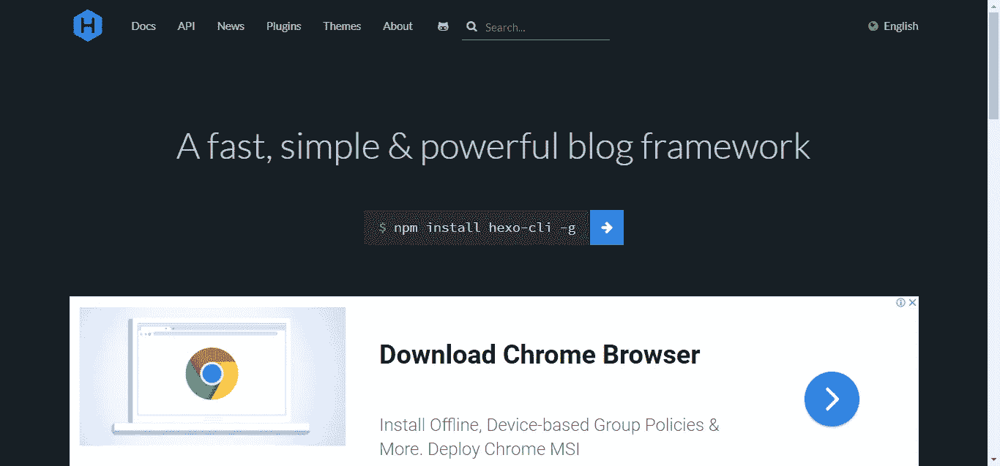
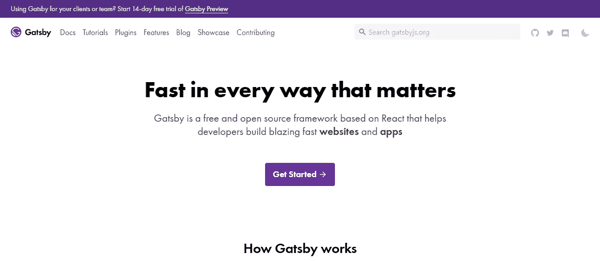
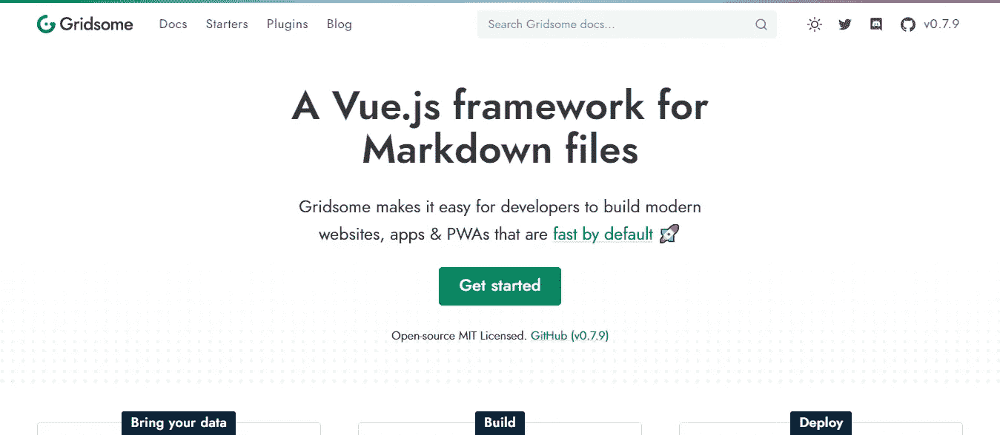
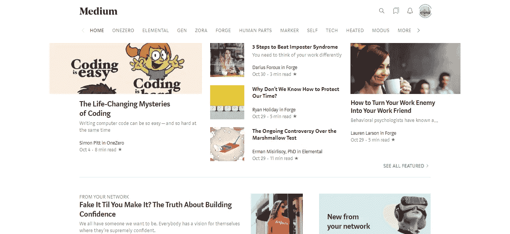
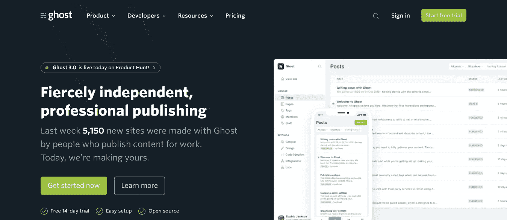

# 2019 年快速建立自己的博客或网站的平台

> 原文：<https://levelup.gitconnected.com/suggested-open-sources-and-platforms-to-build-your-own-site-in-2019-e2c675fc7652>

## 你自己的博客

## 本文详细介绍了为技术人员和非技术人员构建网站的最佳开源选项。

布鲁诺·瑟维拉在 [Unsplash](https://unsplash.com/s/photos/coffee?utm_source=unsplash&utm_medium=referral&utm_content=creditCopyText) 上拍摄的照片

我将这篇文章分为两个部分，分别介绍我们的技术和非技术解决方案。技术选项都使用 Node.js 作为服务器。将有静态和动态内容的选择，这些框架中的任何一个都可以用来构建登陆页面、个人博客和/或任何基本的内容驱动的网站。

**技术** : Hexo，Gatsby，Gridsome

**非技术性**:中型，幽灵

*更多类似内容，请查看*[*https://betterfullstack.com*](https://betterfullstack.com)

# 技术解决方案

对于一个技术人员，尤其是前端工程师来说，建立一个界面美观的网站是很容易的。

所以这里的问题是:

1.  你的站点需要调用 API 吗？
2.  你有时间编写你的站点代码或者想要添加自定义功能吗？

本节所有的开源选项都在使用 [Node.js](https://nodejs.org/en/) 。

## 不要调用 API

我建议用 [Hexo](https://hexo.io/) 。我正在我的个人博客上使用这个框架，我很喜欢它。我在**一小时内完成了一切**来部署它。

[https://hexo.io](https://hexo.io/)

[Hexo](https://hexo.io) 最初由[陈彦博](https://github.com/tommy351)于 2012 年创建和维护。从那时起，它已经帮助成千上万的人建立了他们梦想中的网站/博客。

好处:

*   Node.js 提供了令人难以置信的文件生成速度。数百个文件只需几秒钟即可构建完成。
*   支持 GitHub Flavored Markdown 的所有功能，包括大多数 Octopress 插件。
*   您只需要一个命令就可以将您的站点部署到 GitHub Pages、Heroku 或其他平台。
*   具有强大的 API，具有无限的可扩展性。各种插件可用于支持大多数模板引擎(EJS，帕格，Nunjucks，和许多其他)。容易与现有的 NPM 软件包(Babel，PostCSS，Less/Sass 等)集成。

你不需要花时间配置或编码。你可以把你的时间集中在为你的网站编写标准的降价文件上。

## 调用 API 的能力

如果你的站点需要调用 API，那么我更喜欢这两个框架。它们都可以构建静态站点，但是您可以在构建时和运行时使用 JavaScript，让页面更加动态。

**对于反应过来的家伙:** [**盖茨比**](https://www.gatsbyjs.org/)

Gatsby 是一个基于 React 的免费开源框架，可以帮助开发者快速构建网站和应用。

[https://www.gatsbyjs.org/](https://www.gatsbyjs.org/)

好处:

*   **超越静态网站**。获得静态网站的所有好处，没有任何限制。Gatsby 站点是功能齐全的 React 应用程序，因此您可以创建高质量的动态 web 应用程序，从博客到电子商务站点，再到用户仪表盘。
*   **为每个站点使用现代堆栈**。不管数据来自哪里，Gatsby 站点都是使用 React 和 GraphQL 构建的。为您和您的团队构建一个统一的工作流，不管数据是否来自同一个后端。
*   **从任何地方加载数据**。Gatsby 从任何数据源获取数据，无论是 Markdown 文件、Contentful 或 WordPress 之类的无头 CMS，还是 REST 或 GraphQL API。使用源代码插件加载您的数据，然后使用 Gatsby 的统一 GraphQL 接口进行开发。
*   **业绩在**烤。默认情况下，Ace 您的绩效审计。Gatsby 自动执行代码拆分、图像优化、内联关键样式、延迟加载和预取资源等操作，以确保您的站点快速运行——无需手动调整。
*   **主持人不惜工本**。Gatsby 站点不需要服务器，所以你可以在 CDN 上托管你的整个站点，而花费只是服务器提供的站点的一小部分。许多 Gatsby 网站可以完全免费托管在 GitHub Pages 和 Netlify 等服务上。

**对于 Vuejs 的家伙:**[**grid some**](https://gridsome.org/)

Gridsome 是一个 [Vue 驱动的](https://vuejs.org/)静态站点生成器，用于为任何无头 CMS、本地文件或 API 构建 CDN 就绪的网站。

[https://gridsome.org/](https://gridsome.org/)

好处:

*   **享受现代开发堆栈**。使用 Vue.js、webpack 和 Node.js 等现代工具构建网站。从 npm 热重装和访问任何包，并在您喜欢的预处理器中编写 CSS，如 Sass 或带有自动前缀的 Less。
*   **连接任何 CMS 或数据源**。对内容使用任何 CMS 或数据源。从 WordPress、Contentful、local Markdown 或任何其他无头 CMS 或 API 中提取数据，并在您的页面和组件中使用 GraphQL 访问它。
*   **PWA 离线优先架构**。只有关键的 HTML、CSS 和 JavaScript 会首先加载。然后预取下一页，这样用户可以快速点击，而无需重新加载页面，即使在离线时也是如此。
*   **获得完美的页面速度分数**。Gridsome 会自动优化您的前端，以极快的速度加载和执行。您可以获得代码分割、图像优化、延迟加载和开箱即用的几乎完美的 lighthouse 分数。
*   **构建面向未来的网站**。网络的未来是 JavaScript、API 和标记——jam stack。Gridsome 使用速度极快的静态站点生成器、JavaScript 和 API 来创建令人惊叹的动态 web 体验。
*   **准备称霸全球**。Gridsome 站点通常不连接任何数据库，可以完全托管在一个全球 CDN 上。它可以在不中断的情况下处理数千到数百万次点击，而且没有昂贵的服务器成本。

这两个框架的基本原理是相同的——它们可以构建静态网站，并可以在客户端使用 JavaScript 调用 API，构建功能丰富的完整客户端应用程序。然而，我更喜欢盖茨比，有几个原因:

1.  Gridsome 仍在开发中。
2.  React 目前拥有比 Vue 更大的社区。

# 非技术性解决方案

对于非技术人员，我将介绍 2 个能让你立即拥有博客的网站。

1.  每月 5 美元的中号
2.  幽灵酒店，每月 29 美元

我敢肯定，当你看到 5 美元和 29 美元的价格标签时，你会和我有同样的问题。我敢打赌，你看了这两个平台的资料后，一定会找到答案。

[**中等**](https://medium.com/)

Medium 是伊万·威廉姆斯开发的在线出版平台，于 2012 年 8 月推出。它为一家中型公司所有。

[https://medium.com/](https://medium.com/)

好处:

*   你可以免费或便宜地在 Medium 上即时创建一个博客
*   它提供了一个简单的文本编辑器，易于使用
*   Medium 擅长 SEO。你可以在谷歌上找到你的文章。
*   如果你是写作新手，很容易建立你的人际网络。
*   简单的仪表板，让你知道有多少人阅读你的文章
*   您可以通过合作伙伴计划获得报酬
*   你可以用手机应用程序写文章

这是我最喜欢的博客平台。作为一名软件工程师，我更喜欢使用媒体来写博客和分享我的技术知识。这是一个我可以与世界各地的其他开发者交流和联系的地方。

[**幽灵**](https://ghost.org/)

**Ghost 是一个基于现代 Node.js 技术堆栈的开源专业发布平台，专为需要功能、灵活性和性能的团队而设计。**

****

**【https://ghost.org/ **

**Ghost 是由约翰·奥诺兰和汉娜·沃尔夫在 2013 年创建的，此前 Kickstarter 发起了一场失控的运动，旨在创建一个新的现代出版平台，为专业出版商服务。**

**好处:**

*   ****独立结构**。Ghost 是一个非营利组织，以确保它永远不会被合法出售，并将永远保持独立，根据用户的需求来开发产品，而不是投资者的突发奇想💰退货。**
*   ****可持续经营**。虽然他们发布的软件是免费的，但他们也出售高级托管服务，这为非营利组织提供了一个可持续的商业模式，并允许它 100%自筹资金。**
*   ****分布式团队**。拥有一个可持续发展的企业可以让他们雇佣开源贡献者全职为 Ghost 工作，并且他们完全远程完成这项工作。**
*   ****默认透明**。他们透明地分享他们的收入，他们的代码是开放的，因此任何人都可以验证他们做了什么以及他们是如何做的。没有斗篷和匕首。**
*   ****无条件开源**。他们所有的项目都是在麻省理工学院许可的开源许可下发布的，所以即使公司倒闭了，他们的代码仍然可以被世界上的任何人不受限制地使用。**

**关于[鬼和灵媒比较](https://ghost.org/vs/medium/)有一整篇文章。但是，我个人认为，如果我们只是想写一个博客，与世界分享我们的知识，我们应该使用媒体。**

**另一方面，如果你在你的领域是专业的，那么你应该在你的大订户的基础上发展你的 Ghost 业务。基础**

**注意: **Ghost 用清晰的文档很好地支持了技术作者**。你完全不需要通过 Ghost 就可以自己建立和托管你的站点。因为他们的代码是 MIT 授权的，所以你完全可以随心所欲地使用它。**

# **摘要**

**在本文中，我介绍了框架和博客平台来帮助您在短时间内构建自己的站点。**

**当你只是需要在短时间内搭建一个站点，并且不调用 API 的时候，那么你应该使用 [Hexo](http://hexo.io) 。**

**当你想要与 API 通信的能力或者想要添加你自己代码的选项时，那么使用 [GatsbyJS](https://www.gatsbyjs.org/) 或者 [Gridsome](https://gridsome.org/) 。这取决于你的背景，因为一个使用 React，另一个使用 Vue。**

**不过对于非技术方案，我更喜欢用[中](https://medium.com)或者[鬼](https://ghost.org/)。这取决于你的目的和资金，因为价格是非常不同的。**

**我希望这篇文章对你有用！你可以通过我的[网站](https://www.hoangtran.co/)找到我。欢迎在下面的评论中留下任何问题。我很乐意帮忙！**

** [## 故事-更好的全栈

### 关于 JavaScript、Python 和 Wordpress 的有用文章，有助于开发人员减少开发时间并提高…

betterfullstack.com](https://betterfullstack.com/stories/)**