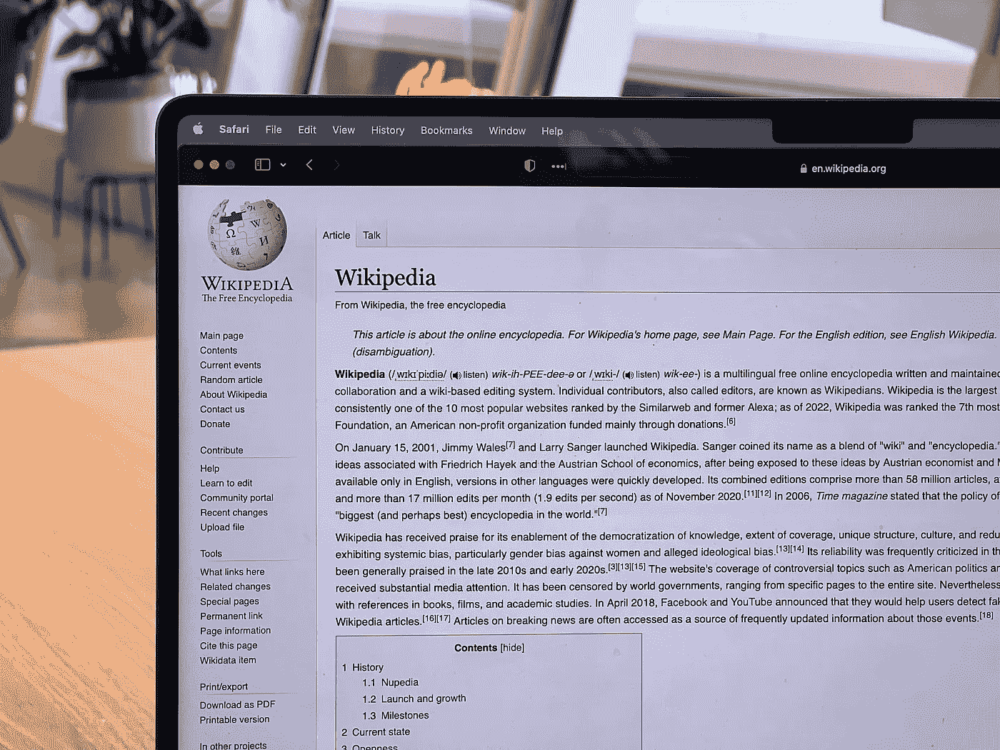
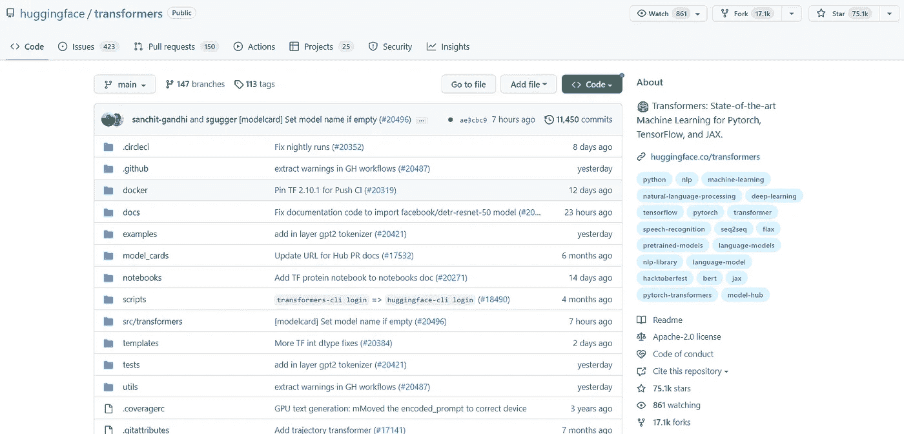
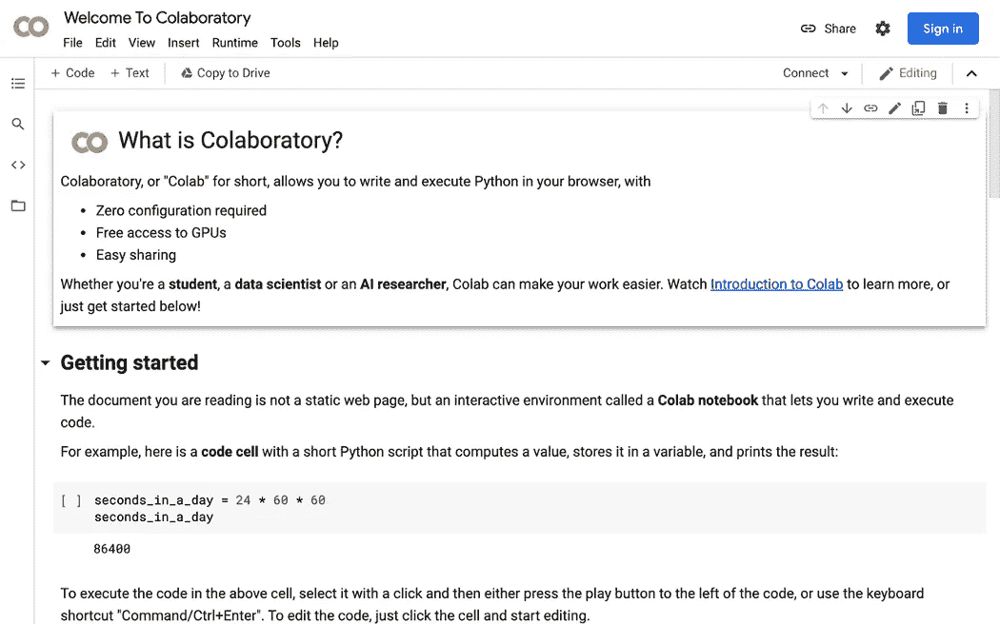
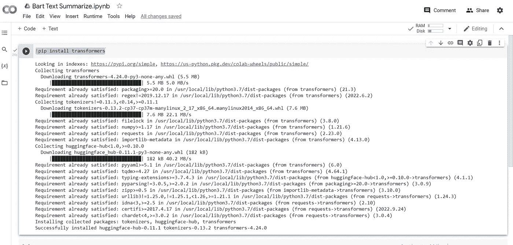
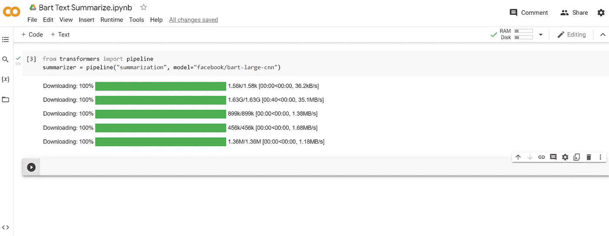
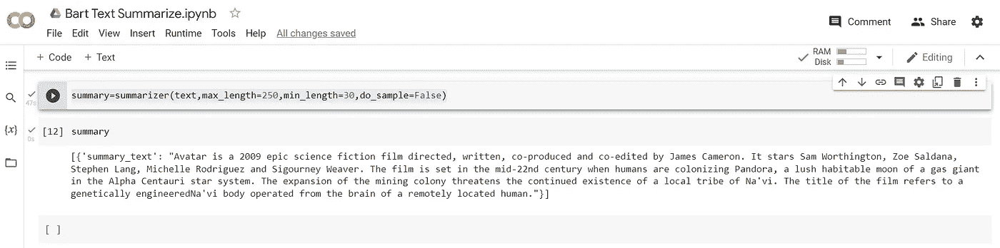
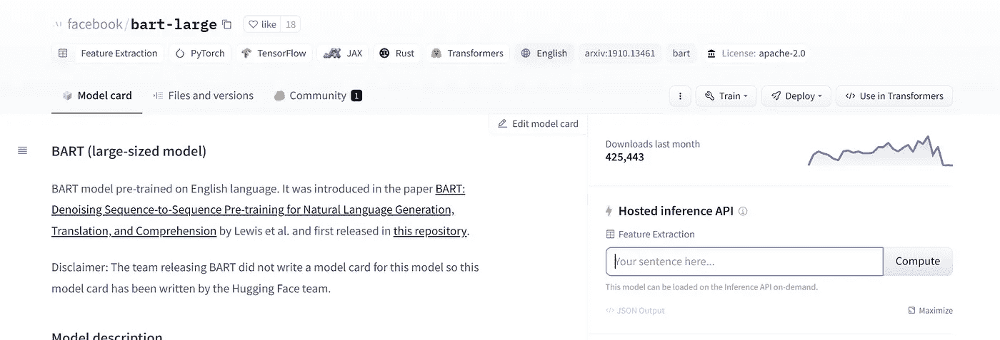

# 使用 Python 中的脸书巴特模型总结维基百科页面

> 原文：<https://levelup.gitconnected.com/summarizing-wikipedia-pages-using-facebooks-bart-model-in-python-e9d9d88f51f9>

让我们用脸书的 BART 模型来总结大型文本。

人工智能(AI)最近已经能够做很多事情，这个领域正在快速发展。它能够检测图像和视频中的对象，检测动作，总结文章，撰写文章，并在最近生成图像和视频。



ober on Copeland @ very informed . com 在 [Unsplash](https://unsplash.com/s/photos/wikipedia?utm_source=unsplash&utm_medium=referral&utm_content=creditCopyText) 上的照片

但是它能减少大量的文字并进行总结吗？它能忽略所有附加信息，给我们一篇冗长文章的摘要吗？让我们来了解一下！

我们将使用脸书的 BART 模型来总结大段的文本。

我们将使用拥抱脸变形金刚库。Transformers 库提供了数千个预先训练好的模型，用于在文本、视觉和音频等不同模态上执行任务。

资源库链接是 https://github.com/huggingface/transformers 的。



变形金刚 Github 页面

下面是 GitHub 页面上对变形金刚的介绍。

> Transformers 提供了数以千计的预训练模型，以在不同的形式(如文本、视觉和音频)上执行任务。
> 
> 这些模型可应用于:
> 
> 📝文本，用于文本分类、信息提取、问题回答、摘要、翻译和文本生成等任务，支持 100 多种语言。
> 
> 🖼️图像，用于图像分类、对象检测和分割等任务。
> 
> 🗣️音频，用于语音识别和音频分类等任务。

我将使用 Google Colab 来演示这个库的用法。

*(Google colab 允许我们在浏览器中运行代码，而无需在本地安装任何东西。)*



(如果你不熟悉 colab 或者不想运行整个代码，**在本文**的末尾有一个 web 应用**的链接，你可以在那里直接上传你的文本**并摆弄模型。但是**我强烈建议你使用代码**。)

让我们开始吧。

**进入**[**【https://colab.research.google.com/】**](https://colab.research.google.com/)**，点击“新建笔记本”。**
你会看到一个新的 colab 笔记本打开。单击第一个单元格，输入以下命令并点击 run。这将安装“变形金刚”库和所有其他需要的库。

```
!pip install transformers
```



pip 命令的输出

输入以下代码以导入管道并加载 bart 汇总模型。如果您是第一次运行此程序，此单元可能需要 2 分钟来运行，因为它会在第一次运行时下载模型重量。

```
from transformers import pipeline
summarizer = pipeline("summarization", model="facebook/bart-large-cnn",truncation=True)
```

运行完成后，该单元将如下所示。



我们将使用 Python 来提取维基百科的文本并对其进行总结。下面给出了从维基百科链接获取文本的代码。

```
import requests
from bs4 import BeautifulSoup

url = 'https://en.wikipedia.org/wiki/Avatar_(2009_film)'
res = requests.get(url)
html_page = res.content
soup = BeautifulSoup(html_page, 'html.parser')

text = ''
for paragraph in soup.find_all('p'):
    text += paragraph.text

# Import package
import re
# Clean text
text = re.sub(r'\[.*?\]+', '', text)
text = text.replace('\n', '')
text
```

上述代码将所有文本保存在“text”变量中。现在我们在汇总函数中输入“文本”变量。

```
summary=summarizer(text,max_length=250,min_length=30,do_sample=False)
```



汇总输出

下面是**头像**维基百科页面的输出。这是一个 250 字的总结。

> 《阿凡达》是一部 2009 年的史诗科幻电影，由詹姆斯·卡梅隆导演、编剧、联合制作和联合剪辑。它由萨姆·沃辛顿、佐伊·索尔达娜、史提芬·朗、米歇尔·罗德里格兹和西格妮·韦弗主演。这部电影以 22 世纪中期为背景，当时人类正在殖民潘多拉，这是半人马座阿尔法星系中一颗气体巨星的一颗郁郁葱葱的可居住卫星。采矿殖民地的扩张威胁到当地一个纳美人部落的继续存在。这部电影的名字指的是一个基因工程的纳威人身体，由一个遥远的人的大脑操纵。

这里是**鸣人**维基百科页面的输出。

> 火影忍者是由岸本齐史创作和插图的日本漫画系列。它讲述了一个年轻忍者的故事，他寻求同龄人的认可，并梦想成为火影，他的村庄的领袖。故事分两部分讲述——第一部分发生在鸣人十几岁的时候，第二部分发生在他十几岁的时候。这部漫画被皮埃罗和阿尼普莱克斯改编成动画电视连续剧，从 2002 年到 2007 年在日本播出了 220 集。该系列的英语配音于 2005 年至 2009 年在卡通电视网和 YTV 播出。

这里是**黑暗骑士**维基百科页面的输出。

> 《黑暗骑士》是 2008 年的一部超级英雄电影，由克里斯托弗·诺兰执导，剧本由他和他的兄弟乔纳森合写。根据 DC 漫画超级英雄蝙蝠侠改编，是《蝙蝠侠前传》(2005)的续集，也是《黑暗骑士三部曲》的第二部。全体演员包括克里斯蒂安·贝尔、克尔·凯恩、希斯·莱杰、加里·奥德曼、艾伦·艾克哈特、玛吉·吉伦哈尔和摩根·弗里曼。剧情跟随义警蝙蝠侠、警察中尉詹姆斯·戈登和地方检察官哈维·登特，他们结成联盟摧毁高谭市的有组织犯罪。

这是一个模型，它可以为你总结课文。但是有没有一种不用运行任何代码就能使用它的方法呢？
有，有！

以下链接允许在不运行任何代码的情况下使用模型。

> ***你对人工智能和机器学习有热情吗？*** *你想* ***随时了解*******领域的最新进展和见解吗？****
> 
> **那么* ***订阅媒介是必须的*** *。对于仅仅是***5 美元一个月，你就拥有了* ***从 e* ***获得丰富知识和见识的领域专家。*******
> 
> ***Plus、* ***你的订阅有助于支持独立作家*** *和像我这样的研究人员。随着人工智能世界的快速变化，保持消息灵通是至关重要的。* *不要错过——今天就加入 Medium，成为 AI 革命的一份子。这是你做过的最好的决定。****今日订阅中*** ***利用此*** [***链接***](https://medium.com/@arjungullbadhar/membership) ***。*****
> 
> ***Plus、* ***你的订阅有助于支持独立作家*** *和像我这样的研究人员。随着人工智能世界的快速变化，保持消息灵通是至关重要的。* *不要错过——今天就加入 Medium，成为人工智能革命的一份子。这是你做过的最好的决定。****今日订阅中*** ***使用本*** [***链接***](https://medium.com/@arjungullbadhar/membership) ***。*****

**[](https://huggingface.co/facebook/bart-large) [## Facebook/Bart-大拥抱脸

### 编辑模型卡 BART 模型预先接受了英语培训。文章介绍了 BART:去噪…

huggingface.co](https://huggingface.co/facebook/bart-large) ****[](/deblurring-images-using-ai-and-python-2e4f295c95d1) [## 使用人工智能和 Python 去模糊图像。

### AI 可以对你很想发布但因为最终变得模糊而无法发布的图片/图像进行去模糊吗？

levelup.gitconnected.com](/deblurring-images-using-ai-and-python-2e4f295c95d1) [](/remove-background-from-images-using-python-and-ai-149a6985e478) [## 使用 Python 和 AI 移除图像背景

### 从图像中移除背景，而无需花费数小时在使用人工智能的照片编辑应用上。再见，再见绿屏？

levelup.gitconnected.com](/remove-background-from-images-using-python-and-ai-149a6985e478) 

*嘿伙计们，*

我对在媒体上写作很陌生，希望听到你的反馈。如果你喜欢我写的东西，不要犹豫，竖起大拇指或者留下提示。如果您有任何问题或建议，请随时 ***发表评论。*** *我看了每一条留言，尽可能快地回复。*

阿尔琼·古尔巴达尔**