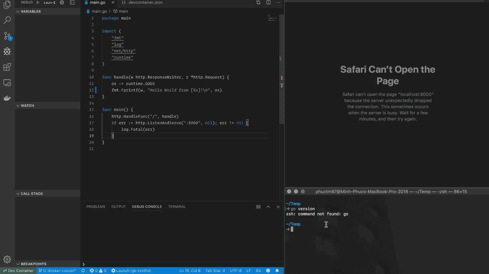

# Go 全时本地质量 VSCode 支持的容器化开发环境摘要

> 原文：<https://levelup.gitconnected.com/summary-of-a-go-full-time-local-quality-vscode-powered-containerized-development-environment-6aa20f50a338>

## [去宁静的](/go-restful-series-a7addbfef5b1)——# 5

上周(本系列的最后 3 篇文章)，我设法为 Golang 建立了一个**全时本地质量 VSCode 驱动的容器化开发环境，并完成了这张[史诗票](https://github.com/the-evengers/go-restful/projects/1#card-26142625)。我现在可以开始写一些 Go 代码了。然而，在此之前，让我们总结一下目前为止我所做的工作以及可以改进的地方。**

# 到目前为止我得到了什么？

感谢 Docker、Visual Studio Code、VS Code Remote-Containers 扩展和 VS Code Go 扩展，以及我为集成这些工具所做的一些努力，我现在可以:

*   使用 IntelliSense 的所有功能编写 Go 代码，例如自动完成、自动导入、代码导航等。

*   在本地计算机上没有安装 Go runtime 的情况下运行应用程序。感谢 Docker 端口发布/映射，我也可以直接从 Safari 测试应用程序。

*   使用出色的调试功能。

*   使用`go-dep`管理外部 Go 包，例如自动获取/构建外部包，自动锁定版本并提供一致的可复制构建等。

更重要的是，我可以用 Docker 和 VS 代码**实现以上所有功能，不需要额外的设置**。新人也是，以后来项目。

# 一切都是自动设置的！

[摇滚猴子](https://unsplash.com/@rocknrollmonkey?utm_source=medium&utm_medium=referral)在 [Unsplash](https://unsplash.com?utm_source=medium&utm_medium=referral) 上拍照

我和我的合作者所要做的就是开始开发所有提到的酷功能**只要通过 VS 代码打开项目，一切都会自动设置好**！

我也写了一份关于如何使用它的详细文档。查看项目以了解如何使用它以及我是如何实现它的。该项目是免费许可的，所以请随意制作您的叉子，并将其应用到您自己的项目中！

# 可以而且应该更好！如果你想去❤️，请帮助我！

尽管目前为止我所得到的非常酷，并且已经可以挽救很多开发人员的生命，但是仍然有一些问题可以并且应该变得更好:

*   我不能在 VS 代码用户界面中使用 Git 推送，因为它需要我的本地 SSH 凭证。它应该以某种方式自动安全地将我的 SSH 凭证装载到 dev 容器中。更多详情请参考[这张票](https://github.com/the-evengers/go-restful/issues/16)。
*   我不能在 VSCode 用户界面中进行 GPG 签名提交，因为它需要我的本地 GPG 代理。它应该以某种方式自动和安全地从开发容器转发 GPG 命令到本地 GPG 代理。更多详情请参考此票证。
*   当前配置中有重复值，包括`workspaceMount`、`workspaceFolder`、`.devcontainer.json`中的`appPort`、`Dockerfile`中的`EXPOSE`、`scripts/start-devcontainer.sh`中的`--publishing`选项。重复会造成不一致，并使更新和维护变得更加困难。更多详细信息，请参考此票。

查看[项目](https://github.com/the-evengers/go-restful)，在这一系列中我会继续改进。它是开源和免费许可的。因此，如果你觉得它有用，并且你有一些空闲时间，请与我合作，❤️。我们可以一起为我们和开发者社区做些有用的事情！

下一篇文章再见！