# Angular 团队主题演讲摘要@ ng-conf 2022

> 原文：<https://levelup.gitconnected.com/summary-of-angular-team-keynote-ng-conf-2022-18875b750637>

## [棱角分明的](https://medium.com/@lorenzozar/list/angular-5496c492a185)

## 以下是 Angular 团队主题演讲@ ng-conf 2022 的要点和幻灯片

你可以在 YouTube 上找到 ng-conf 2022 的 1h [Angular 团队主题演讲的简短摘要。您也可以在线找到](https://www.youtube.com/watch?v=CABHcf1gCbg&ab_channel=ng-conf)[幻灯片](https://www.icloud.com/keynote/07eT4YqA7g1seKvjWb_ihHbnA#ng-conf-2022-keynote-public)。

Angular 团队主题演讲

该活动是一个为期三天的角度会议，致力于提供角度训练。Minko Gechev、Sarah Drasner、Madleina Scheidegger 是主讲人。

## TL；博士

*   从 v14 开始提供严格类型的表单
*   通过代码查找错误参考，例如 [NG0100](https://angular.io/errors/NG0100) 。除了每个错误都有一个页面，并改进错误消息，Angular 团队还宣布与 [fireship.io](https://www.youtube.com/c/Fireship) 合作！
*   Treeshakable 错误消息
*   角度 CLI 自动完成，例如`ng g...`
*   在 v15 中，独立组件不再是开发预览版
*   指令组合 API 允许从多个组件继承
*   路由器的改进包括简化延迟加载组件、更好的树抖动和 11%的包大小缩减、实用的路由器防护、简化的类型安全注入函数
*   更多 CDK 原语，例如列表框

# 开始

Minko Gechev 开始了介绍新团队成员的主题演讲。

在高素质的成员中，我将提到其中的两位，因为他们将发表一部分主旨演讲。

*   mad leina scheid egger——拥有超过 15 年经验的谷歌员工。她是整个角平台的工程经理
*   Sarah dras ner——来自 Netlify，现在是整个谷歌核心开发者网络组织的工程总监

莎拉·德拉斯纳向我们展示了任何重大创新实际上是不同技术融合和许多人共同努力的产物。

我们无法指出孩子变成大人的确切时刻。同样，创新也不是简单的灵光一现。

Sarah 拥有跨框架和库的丰富经验，从 React、Vue 和 Angular 开始。


Angular 团队主题演讲

# 以前

Angular 不是凭空产生的，Sarah Drasner 简要解释了以前的技术如何影响 Angular.js，而 Angular . js 又反过来影响了其他框架、库和 Angular 本身。

每一个现代框架和库都从对方那里学到了一些东西，并启发了其他人。

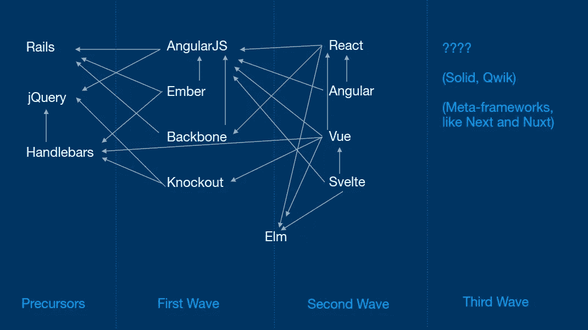

框架相互影响

虽然我们无法预测未来，但有一些有趣的技术即将出现，例如 Solid、Qwik、Next、Nuxt。

那么，Angular 到底发展了什么？

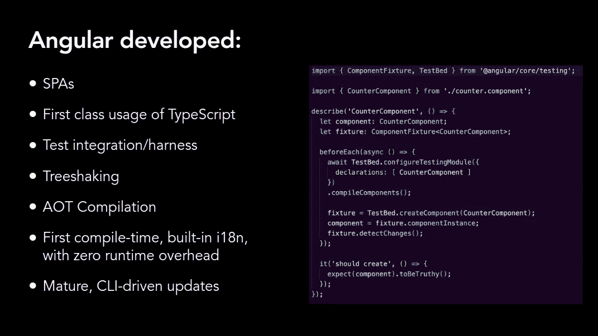

创新归功于 Angular

Angular 是跟谁学的？

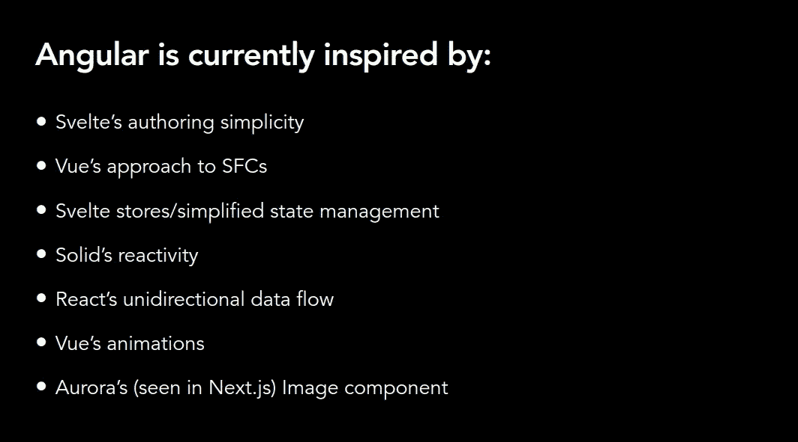

Angular 的灵感来自上述技术

## 过去几年

在过去的几年里，Angular 团队专注于 Angular 渲染器 Ivy。

由于 Ivy 独自成为一个相当大的项目，Angular 团队决定搁置其他提议，比如可选的 NgModules，这也导致了独立组件背后的[有趣故事。](https://javascript.plainenglish.io/the-little-known-story-behind-angular-standalone-components-2392abc4fcfa)

尽管暂停了其他的改进，Ivy 还是带来了重要的好处。

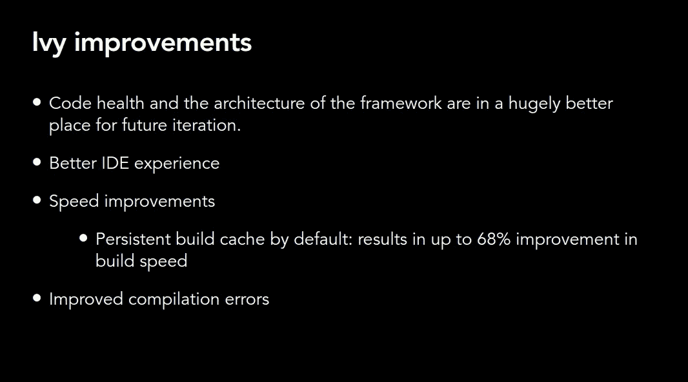

常春藤改进

艾薇完了，现在怎么办？

# 今天棱角分明

今天，Angular 有两个优先事项:高级功能和简化开发(开发者体验)。

## 高级功能

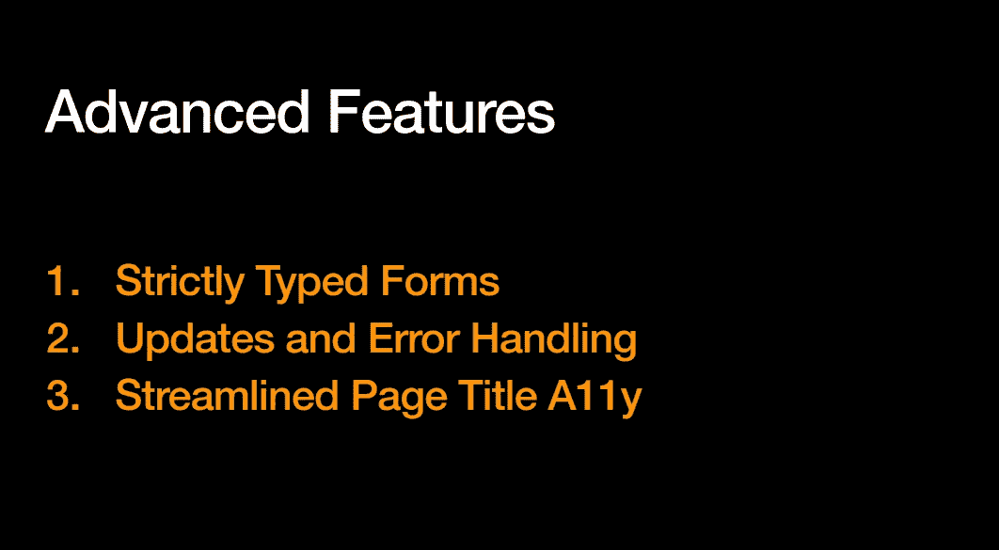

角度高级功能

## 高级功能—严格类型表单

Angular 14 附带了用于某些类型化表单和验证的 TypeScript。

这是说话者提出的一个例子

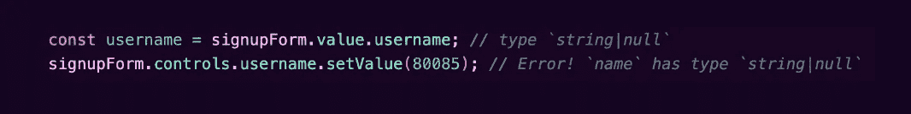

严格类型化的表单

## 高级功能—更新和错误处理

`ng update`和`ng schematics`都进行了改进，以提供更有用的信息。

这在大规模的情况下尤其有用，因为相关的错误日志可能更相关。

除此之外，增强的模板诊断以两种方式支持错误管理。

首先，它改进了错误检测，如下例所示。

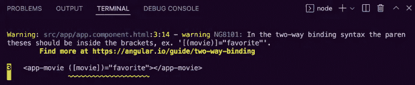

增强型模板诊断示例

其次，它增加了新的运行时错误代码的数量

*   **可以通过代码**找到参考。好吧，我找不到 NG0903，但是看看 [NG0100](https://angular.io/errors/NG0100) ！！
*   **构建优化器可以树摇错误消息**

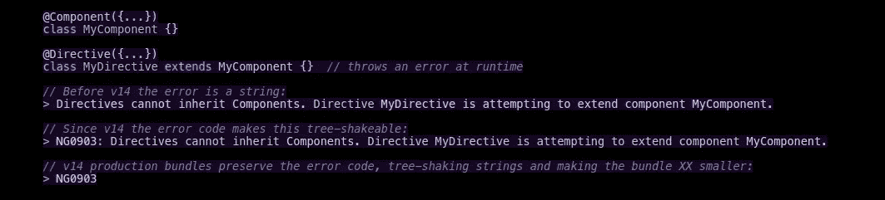

Treeshakable 错误消息

Angular CLI 也提供了一些自动完成功能。

## 高级功能—简化的页面标题 A11y

正如 Sarah Drasner 所解释的，简化的页面标题 A11y 是 SPA approads "*的一个重要特征，因为在这里没有任何意图，每个页面的标题将保持不变，这是屏幕阅读器在路线改变时阅读的第一件事。*

"*从 13.2 版本开始，Angular router 提供了一个新的简化标题属性，允许使用辅助技术的人理解页面的内容、标题和目的。*

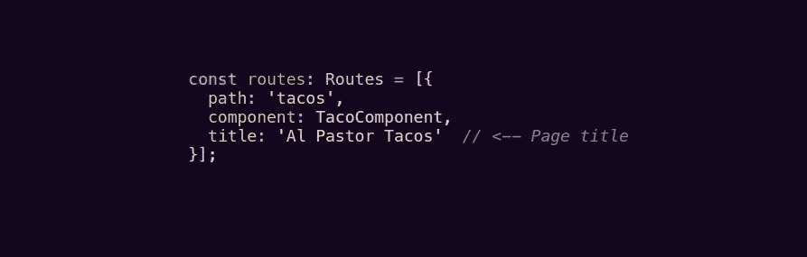

角度路由器中的页面标题

标题策略可以进一步扩展，以适应更复杂的逻辑。

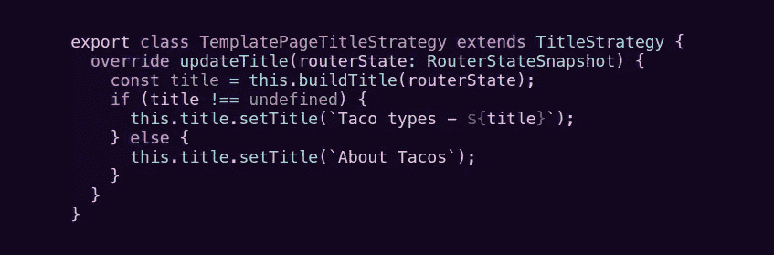

使用条件和变量的页面标题

最后，这是我们近期可以期待的

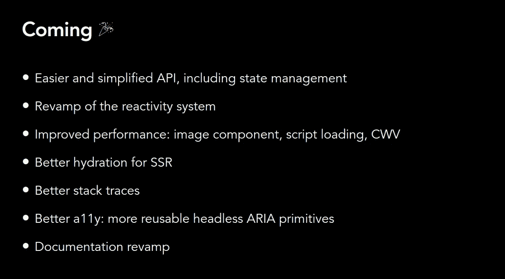

角度近期目标

# 将来的

Madleina Scheidegger 谈到了 Angular 的发展方向。

这里的要点是持续关注来自不同来源的反馈:

*   **社区**—Angular 团队开始更加关注社区的反馈。近 25，000 名开发人员参与了开发人员调查。
*   **问题分类—** 另一个想法来源是特性分类。在过去的 18 个月中，Angular 团队将积压的问题减少了 60%以上。由于这种坚持不懈的努力，随着时间的推移，积压减少了。
*   **没有使用 Angular 的用户—**Angular 团队正在学习更多关于人们和公司如何选择框架的知识。

在听取了这些资料并获得了使用其他框架和库的第一手经验后，Angular 团队决定将重点放在开发人员体验上。

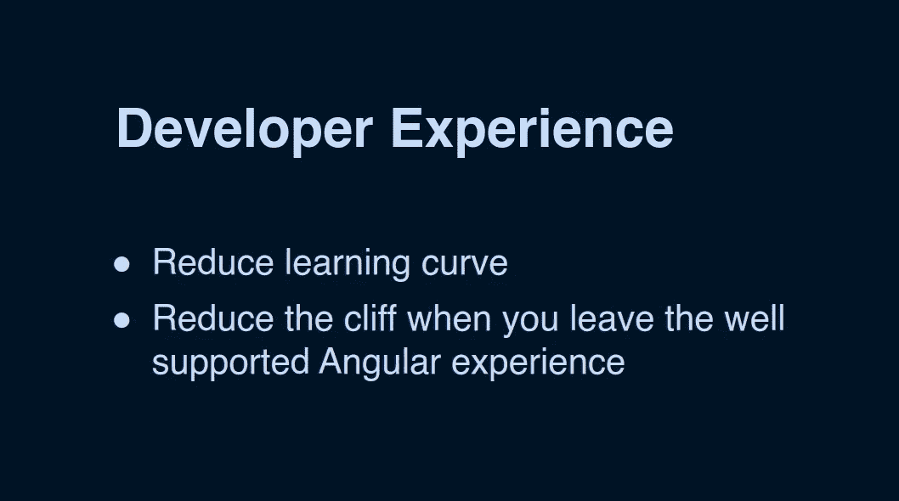

## 减少学习曲线

“*有很多步骤，[…]要开发第一个应用程序，第一次尝到成功的滋味，有很多东西要学，而成功的滋味是让你坚持下去的动力。*”

这个想法是为了平滑学习曲线，并期待第一次成功的滋味。以下是这种方法的初步成果。

*   **独立组件**减少您必须编写的代码量，推迟您刚开始学习 Angular 时对 NgModule 的学习。独立组件将不再是 v15 中的开发者预览版。
*   **指令组合 API** 在某些情况下允许从多个组件继承。
*   **路由器改进**包括惰性加载组件的简化、更好的树抖动和 11%的包大小缩减、实用的路由器防护、简化的类型安全注入功能
*   更多 CDK 原语，例如列表框

## 降低悬崖

当开发人员需要离开有围墙的道路时，简化他们的体验

改善开发人员体验的一般努力旨在简化文档并增加材料的一致性。

[](https://medium.com/subscribe/@lorenzozar) [## 让我们保持联系

### 如果你点击这里，会发生一些事情。试试吧！

medium.com](https://medium.com/subscribe/@lorenzozar) 

# 性能和 DX 合作伙伴关系

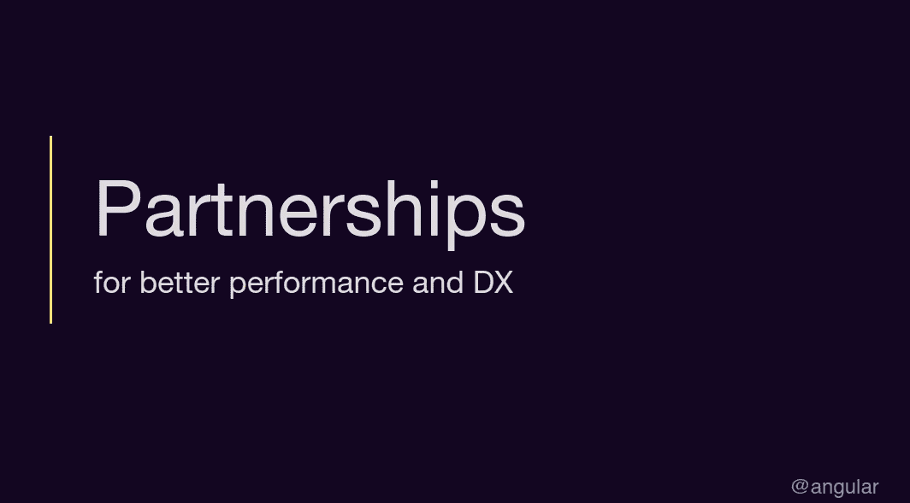

在主题演讲中，他们宣布了以下伙伴关系:

## **极光— Chrome 浏览器**

Aurora 团队已经与 Angular 合作来优化运行时性能。然而，新的合作伙伴关系应通过以下方式关注核心网站的活力

*   构建时优化
*   服务器端渲染的改进
*   图像方向的优化。在 v14.2 的开发预览版中提供。

要尝试新的 image 指令，您只需要将它导入您的独立组件或 NgModule 中，并在您的模板*中将`img`的 *src* 属性更新为 *rawSrc* 。*

## 重火力点

虽然这种伙伴关系是几年前开始的，但一些改进值得一提。

特别是，框架感知部署将与客户端呈现、SSR 和预呈现(例如，静态站点生成)一起工作。最后一个是正在进行的工作。

## 受 Vite 启发的实验生成器

你可能知道，谷歌喜欢实验。

从闭门造车的小实验到[碳实验语言](https://betterprogramming.pub/carbon-programming-language-tutorial-6d67b4cc16ae)再到使用 esbuild 的 Vite 启发的解决方案。

根据早期的基准测试，冷构建似乎比生产资产快 57%。

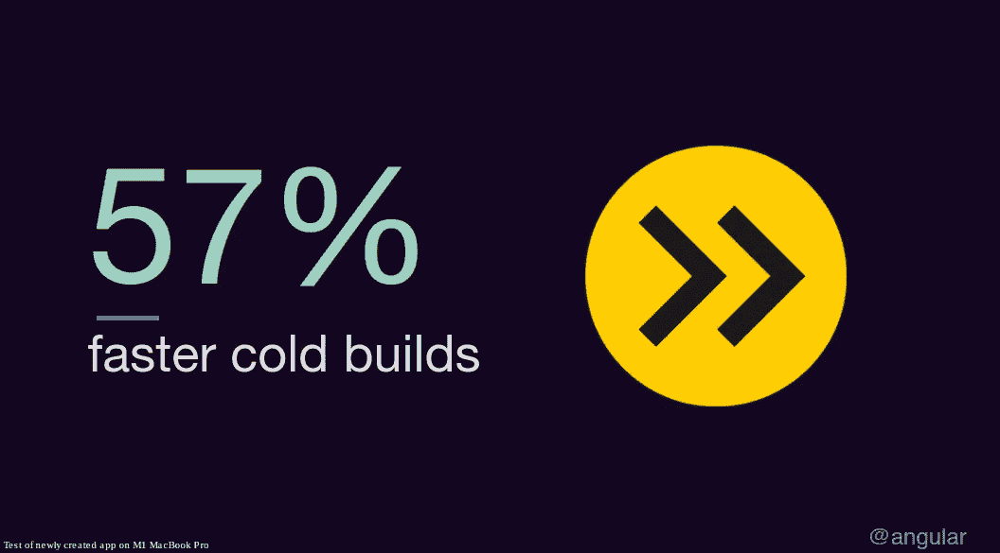

冷构建似乎要快 57%

再说一遍，这是实验性的。

但是，您可以在您的 v14+项目中尝试一下，方法是更新 angular.json 并用`browser-esbuild`替换`browser`构建器。

```
"builder": "@angular-devkit/build-angular:browser""builder": "@angular-devkit/build-angular:browser-esbuild",
```

这是一个超级快速的尝试，我尝试了一下。

我在一个非常小的应用程序中减少了大约 70%的构建时间。相当酷！

## **虫子赏金**

他们推出了一个软件漏洞奖励计划，简而言之，你可以通过在 Angular 中报告软件漏洞来赚钱。

多少钱？高达 31337 美元！你可以在 goo.gle/ng-vrp 找到更多。

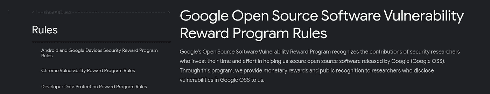

谷歌开源软件漏洞奖励计划规则

上面的小 *showValues* 规则算吗？？

## 外部伙伴关系

值得一提的是以下伙伴关系

*   与 Firebase.io 的合作旨在创造更多的内容。
*   与 Rangle.io 的合作旨在改进开发工具，尤其是获得更好的变更检测信息

## **其他**

由于 developer preview 中新的 [devtools 改进](https://github.com/angular/angular/tree/devtools-injector-debugging/devtools/docs)，也可以从 dev tools 中预览组件的依赖关系。

**更好的堆栈跟踪结构**使得阅读和理解错误消息更加容易。下图是未来的预览。应该从 v15 开始就有了。

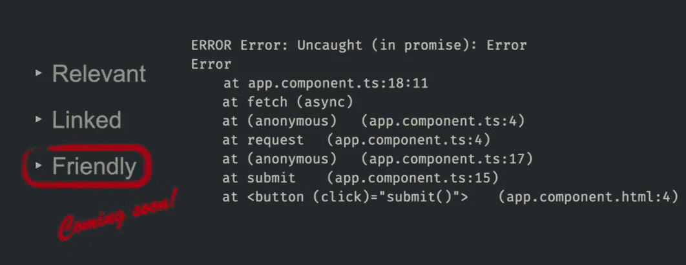

更好的堆栈跟踪

# 下一步是什么？

这是一个要点列表，列出了正在进行的改进。其中一些应该会在 v15 中出现，一些是探索，可能会也可能不会产生切实的结果。

*   更容易和简化的 API，包括状态管理
*   反应系统的改造
*   改进的性能:图像组件、脚本加载、CWV
*   更好的 SSR 水合作用
*   更好的堆栈跟踪
*   更好的 a11y:更多可重用的无头 ARIA 原语
*   文件修改
*   更好的主题 API 允许更容易的角度材料定制
*   水化探索:更好的文档、供应链整合、部分水化
*   关于反应性的探索:无区域角度，每个部件变化检测，状态管理存储，计算属性

[](https://medium.com/@lorenzozar/membership) [## 通过我的推荐链接加入 Medium-Lorenzo Zarantonello

### 如果这个有价值，直接支持我！我的文章大多是免费的。考虑成为会员以示支持…

medium.com](https://medium.com/@lorenzozar/membership) 

最后，请随意获取下面的主题演讲幻灯片。

Ng-Conf 2022 —主题演讲幻灯片

# 分级编码

感谢您成为我们社区的一员！在你离开之前:

*   👏为故事鼓掌，跟着作者走👉
*   📰查看[级编码出版物](https://levelup.gitconnected.com/?utm_source=pub&utm_medium=post)中的更多内容
*   🔔关注我们:[推特](https://twitter.com/gitconnected) | [LinkedIn](https://www.linkedin.com/company/gitconnected) | [时事通讯](https://newsletter.levelup.dev)

🚀👉 [**将像你这样的开发人员安置在顶级创业公司和科技公司**](https://jobs.levelup.dev/talent/welcome?referral=true)