# JavaScript 中的数据类型概述

> 原文：<https://levelup.gitconnected.com/summary-of-data-types-in-javascript-a04d02715a9a>

[克莱姆·奥诺杰霍](https://unsplash.com/@clemono2?utm_source=unsplash&utm_medium=referral&utm_content=creditCopyText)在 [Unsplash](https://unsplash.com/search/photos/coffee?utm_source=unsplash&utm_medium=referral&utm_content=creditCopyText) 拍摄的照片

JavaScript 是一种*松散类型*或*动态*语言。JavaScript 中的变量不与任何特定的值类型直接关联，任何变量都可以赋值。

在本文中，我将讨论 JavaScript 中目前存在的 8 种数据类型。

1.  线
2.  数字
3.  布尔代数学体系的
4.  空
5.  不明确的
6.  标志
7.  BigInt
8.  目标

更多类似的内容，请查看[https://betterfullstack.com](https://betterfullstack.com)

在我们开始之前，我想再次更新一下我们如何在 JavaScript 中定义原语以及如何记住它。

一个**原语**(原语值，原语数据类型)是不是一个[对象](https://developer.mozilla.org/en-US/docs/Glossary/object)并且没有[方法](https://developer.mozilla.org/en-US/docs/Glossary/method)的数据。共有 7 种原始数据类型:[字符串](https://developer.mozilla.org/en-US/docs/Glossary/string)，[数字](https://developer.mozilla.org/en-US/docs/Glossary/number)， [bigint](https://developer.mozilla.org/en-US/docs/Glossary/bigint) ，[布尔](https://developer.mozilla.org/en-US/docs/Glossary/boolean)，[空值](https://developer.mozilla.org/en-US/docs/Glossary/null)，[未定义](https://developer.mozilla.org/en-US/docs/Glossary/undefined)，以及[符号](https://developer.mozilla.org/en-US/docs/Glossary/symbol)。

# 线

字符串类型用于表示文本数据。它是一组 16 位无符号整数值的“元素”。字符串中的每个元素都在字符串中占据一个位置。

第一个元素在索引 0 处，下一个元素在索引 1 处，依此类推。字符串的长度是其中元素的数量。

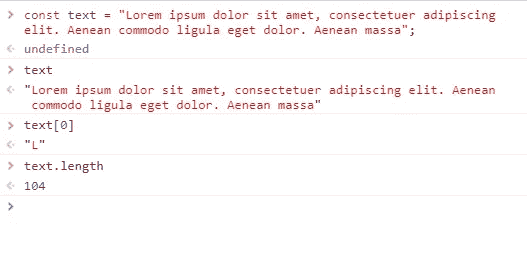

带有索引和长度的字符串示例

您可以使用`+`操作符将多个字符串附加在一起。

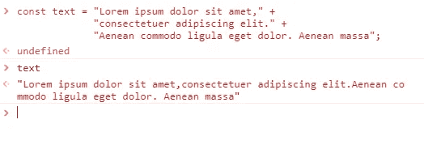

带+运算符的字符串示例

或者可以在每行的末尾使用反斜杠字符(`“\”`)来表示该字符串将在下一行继续。

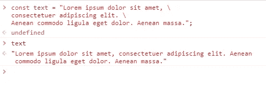

带反斜杠的字符串示例

注意:

1.  要剪断绳子，我们可以使用类似`[String.substr()](https://developer.mozilla.org/en-US/docs/Web/JavaScript/Reference/Global_Objects/String/substr)`的方法。
2.  要连接字符串，我们可以使用类似`[String.concat()](https://developer.mozilla.org/en-US/docs/Web/JavaScript/Reference/Global_Objects/String/concat)`的方法。
3.  要访问字符，我们有两种方法`[charAt()](https://developer.mozilla.org/en-US/docs/Web/JavaScript/Reference/Global_Objects/String/charAt)`和传递字符索引给字符串，就像上面的例子，在这种情况下，字符串被当作一个数组。

# 数字

数字类型是一个[双精度 64 位二进制格式的 IEEE 754 值](https://en.wikipedia.org/wiki/Double-precision_floating-point_format)。整数没有特定的类型。

数字类型有三个符号值:`+Infinity`、`-Infinity`和`[NaN](https://developer.mozilla.org/en-US/docs/Web/JavaScript/Reference/Global_Objects/NaN)`(非数字)。

您可以使用常量`[Number.MAX_VALUE](https://developer.mozilla.org/en-US/docs/Web/JavaScript/Reference/Global_Objects/Number/MAX_VALUE)`或`[Number.MIN_VALUE](https://developer.mozilla.org/en-US/docs/Web/JavaScript/Reference/Global_Objects/Number/MIN_VALUE)`获得最大和最小的可用值。

您可以使用常量`[Number.MAX_SAFE_INTEGER](https://developer.mozilla.org/en-US/docs/Web/JavaScript/Reference/Global_Objects/Number/MAX_SAFE_INTEGER)`和`[Number.MIN_SAFE_INTEGER](https://developer.mozilla.org/en-US/docs/Web/JavaScript/Reference/Global_Objects/Number/MIN_SAFE_INTEGER)`来检查整数的安全性。

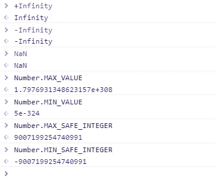

带有一些常数的数字样本

数字类型只有一个整数，该整数有两种表示形式:0 表示为-0 和+0。(“0”是+0 的别名)

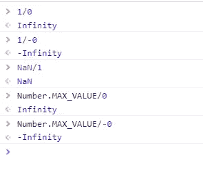

零样本数

# 布尔代数学体系的

布尔表示一个逻辑实体，可以有两个值:`true`和`false`。

当下面的所有值被转换/强制为布尔值时，它们被认为是`false`。也就是说，它们在 JavaScript 中被视为“false ”,因为 JavaScript 中的[类型强制](https://www.freecodecamp.org/news/js-type-coercion-explained-27ba3d9a2839/)在用作布尔值时会将它们转换为 false:

1.  `0`和`-0`
2.  `null`
3.  `false`
4.  `NaN`
5.  `undefined`
6.  空字符串:`''`

注意:

**任何**对象(除了`[undefined](https://developer.mozilla.org/en-US/docs/Web/JavaScript/Reference/Global_Objects/undefined)`或`[null](https://developer.mozilla.org/en-US/docs/Web/JavaScript/Reference/Global_Objects/null)`)，包括值为`false`的`Boolean`对象，当传递给条件语句时，计算结果为`true`。

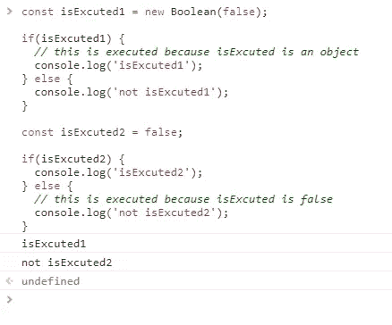

传递到条件语句时的示例布尔值

# 空

值`null`表示故意缺少任何对象值。

Null 通常在可以预期有对象但没有相关对象的地方被检索。设置为`null`的变量被故意声明为空。

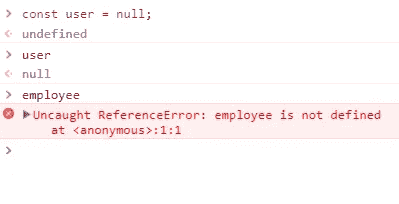

javascript 中的空样本

`**user**`已知存在被执行的时刻代码，但没有值，也就是说它是`null`。

# 不明确的

全局`**undefined**`属性表示原始值`[undefined](https://developer.mozilla.org/en-US/docs/Glossary/Undefined)`。

尚未赋值的变量属于`undefined`类型。

如果没有返回值，函数将返回 undefined。

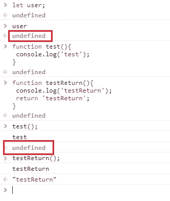

未定义的值

比较`**undefined**`和`**null**`。

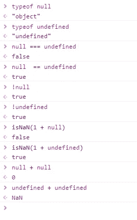

比较空值和未定义值

`null`和`undefined`的区别在于`null`变量被显式声明为空，但是`undefined`没有赋值，并且隐式为空。

# 标志

一个[符号](https://developer.mozilla.org/en-US/docs/Web/JavaScript/Reference/Global_Objects/Symbol)是一个**唯一的**和**不可变的**原始值，并且可以被用作一个对象属性的关键字。

符号不会自动转换为“字符串”

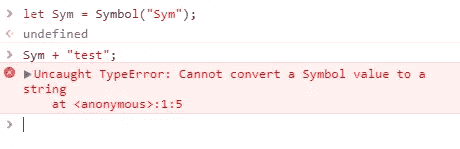

无法将符号转换为字符串

您不能将`Symbol`值转换为数字

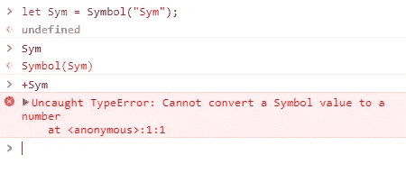

无法将符号转换为数字

使用宽松等式时:

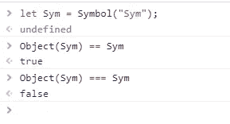

带符号的松散等式

作为属性键的符号包装对象:

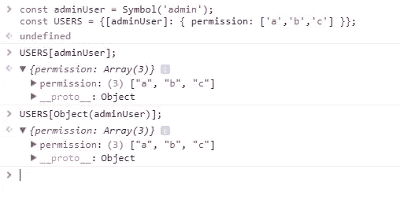

使用带有对象特性名称的符号

# BigInt

[BigInt](https://developer.mozilla.org/en-US/docs/Web/JavaScript/Reference/Global_Objects/BigInt) type 是 JavaScript 中的一个数字原语，可以用任意精度表示整数。即使超过安全整数限制，也可以安全地存储和操作大整数。

通过将`n`追加到整数文字的末尾来创建`BigInt`。

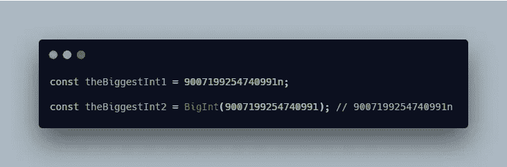

创建 BigInt 的方法

`BigInt`类似于`Number`，但在某些方面还是有所不同:

1.  它不能与内置`[Math](https://developer.mozilla.org/en-US/docs/Web/JavaScript/Reference/Global_Objects/Math)`对象中的方法一起使用。
2.  在操作中不能与`Number`的实例混合。
3.  它并不严格等于`Number`值

在转换为布尔值的情况下,`BigInt`的行为类似于`Number`。

注意:

`BigInt`Edge、Internet Explorer、Safari、IOS 中的 Safari 和 Samsum Internet 不支持。

# 目标

在计算机科学中，对象是内存中可能被标识符引用的值。

> 一个**标识符**是代码中的一个字符序列，用于识别一个[变量](https://developer.mozilla.org/en-US/docs/Glossary/variable)、[函数](https://developer.mozilla.org/en-US/docs/Glossary/function)或[属性](https://developer.mozilla.org/en-US/docs/Glossary/property)。

在 JavaScript 中，对象可以被视为属性的集合。有两种类型的对象属性具有特定的属性:数据属性和访问者属性。

**数据属性:**将一个键与一个值相关联。

**访问器属性:**将一个键与一个或两个访问器函数(get 和 set)相关联，以检索或存储值。也就是说，它可以有方法。

注意:

1.  对象特性名称可以是任何字符串，包括空字符串或符号。如果属性名不是有效的 JavaScript [标识符](https://developer.mozilla.org/en-US/docs/Glossary/Identifier)或数字，那么必须用引号括起来。
2.  值可以是任何值。
3.  JSON (JavaScript Object Notation)是一种轻量级数据交换格式，源于 JavaScript，但被许多编程语言使用。它只能存储数据，不能存储方法。

在 JavaScript 中，**数组和函数都是对象**。数组只是一个键是整数的对象，它包含对数组进行操作的方法。函数只是一个“可执行对象”。

# 摘要

在本文中，我们学习了解 JavaScript 中的 8 种数据类型。

我们了解到，不是对象也没有方法的数据类型是原始数据类型。我们还知道数字可以用 **Number** type 和 **BigInt** type 来表示。

此外，我们还了解了 **null** 和 **undefined** 的区别。

我希望这篇文章对你有用！可以跟着我上[媒](https://medium.com/@transonhoang?source=post_page---------------------------)。我也在推特上。欢迎在下面的评论中留下任何问题。我很乐意帮忙！

# 资源/参考资料

[1]:数据结构[https://developer . Mozilla . org/en-US/docs/Web/JavaScript/Data _ structures](https://developer.mozilla.org/en-US/docs/Web/JavaScript/Data_structures)

[2]:原始 JavaScript[https://developer.mozilla.org/en-US/docs/Glossary/Primitive](https://developer.mozilla.org/en-US/docs/Glossary/Primitive)

 [## 学习 JavaScript -最佳 JavaScript 教程(2019) | gitconnected

### JavaScript 是世界上最流行的编程语言之一——它随处可见。JavaScript 是一种…

gitconnected.com](https://gitconnected.com/learn/javascript)  [## 故事-更好的全栈

### 关于 JavaScript、Python 和 Wordpress 的有用文章，有助于开发人员减少开发时间并提高…

betterfullstack.com](https://betterfullstack.com/stories/)