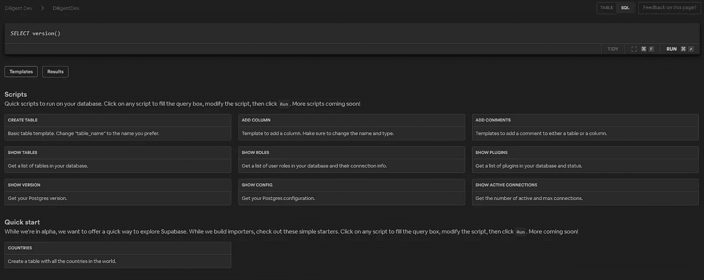
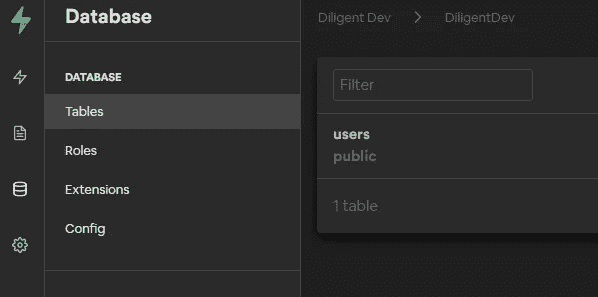
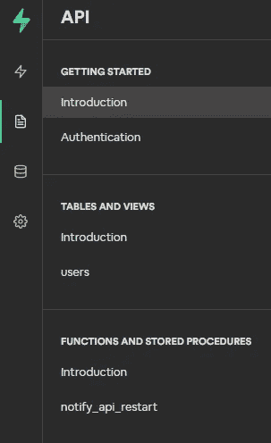

# supabase——开源 Firebase 的替代方案

> 原文：<https://levelup.gitconnected.com/supabase-the-open-source-firebase-alternative-dab5ac10cb>


Supabase 标志

如果你读过我的其他文章，你会注意到我是 [Firebase](https://firebase.google.com/) 的超级粉丝。他们的团队让应用程序的启动和运行变得极其容易，无需编写大量后端代码。即使是他们最接近的竞争对手， [AWS Amplify](https://aws.amazon.com/amplify/) ，也有相当长的学习曲线。

尽管如此，我相信我可能已经找到了一个数据库的替代方案。事不宜迟，我给你介绍 [Supabase](https://supabase.io/) 。那么什么是 Supabase 呢？

Supabase 是一个 PostgreSQL 数据库，提供即时 RESTful API。除此之外，它还通过 websockets 提供实时功能。而且，有了 SQL 数据库，我们可以执行连接和编写存储过程。您所要做的就是注册、登录、创建您的表/进程，剩下的事情由 Supabase 来处理。他们甚至有一个 npm 包，采用了与 Firebase 非常相似的方法。

不幸的是， **Supabase 还处于 Alpha** 阶段，还没有准备好投入生产。但是，这意味着这只是一个开始，我相信这将是一个伟大的产品。到目前为止，他们的托管服务是免费的(最终会付费)，他们有一个开源版本，需要你自己的托管服务([自托管安装文档](https://supabase.io/docs/postgres/postgres-intro))。

好了，炒作够了。让我们来看一个小演示。

# 创建表格

创建帐户并登录后，首先进入的是 SQL 编辑器。在编辑器中，他们会给你一些预置的命令，比如创建一个表。



Supabase SQL 编辑器

单击 Create Table，然后编辑 SQL 以创建一个用户表。

```
CREATE TABLE users (
  id bigint GENERATED BY DEFAULT AS IDENTITY PRIMARY KEY,
  firstName text,
  lastName text,
  userName text,
  email text  
);
```

在数据库菜单下，您现在应该看到用户表



用户表

# 自动生成的文档

Supabase 最令人印象深刻的一个方面是它的自动生成文档。当您构建表格时，您的文档实际上是自己构建的。你所要做的就是点击菜单上的文档图标。



超级文档

# 从前端初始化超级数据库

现在挑选你喜欢的前端框架(React、Vue、Angular 等)。在文档的简介选项卡下，您将看到如何初始化 Supabase:

## 安装

```
npm install --save @supabase/supabase-js
```

## 正在初始化

```
*import* *from* '@supabase/supabase-js'*const* supabaseUrl = 'https://<YOUR_DATABASE_URL>.supabase.co'
*const* supabaseKey = process.env.SUPABASE_KEY
*const* supabase = createClient(supabaseUrl, supabaseKey)
```

# RESTful API

在我们文档的表和视图部分，您会看到我们的用户表。如果您点击它，您将得到您的表模式和文档，用于在 users 表上执行 CRUD 操作。

## 创造

要在我们的用户表中插入一条记录，我们可以运行下面的代码:

```
const createUser = async () => {
 try {
  let user = await supabase
  .from('users')
  .insert([
   {
     firstName:'Diligent', 
     lastName: 'Dev, 
     username: 'DDev', 
     email: 'TheDiligentDev'
   }
  ])

  return user;
 } catch (error) {
  console.log('Error: ', error)
 }
}
```

要插入多条记录，您可以在插入数组中添加任意数量的用户对象。

## 阅读

要查询 users 表中的所有列,运行以下命令:

```
const getUsers = async () => {
 try {
  let user = await supabase
  .from('users')
  .select('*')

  return user;
 } catch (error) {
  console.log('Error: ', error)
 }
}
```

要查询 users 表中的特定列,运行以下命令:

```
const getUsers = async () => {
 try {
  let user = await supabase
  .from('users')
  .select('firstName, email')

  return user;
 } catch (error) {
  console.log('Error: ', error)
 }
}
```

## 更新

要更新用户，您可以运行以下命令:

```
const getUsers = async () => {
 try {
  let user = await supabase
  .from('users')
  .update({firstName: 'Developer'})
  .match({ name: 'Diligent' }) return user;
 } catch (error) {
  console.log('Error: ', error)
 }
}
```

## 删除

要删除用户，您可以运行以下命令:

```
const deleteUser = async () => {
 try {
  let values = await supabase
  .from('users')
  .match({ id: 1})
  .delete() return values;
 } catch (error) {
  console.log('Error: ', error)
 }
}
```

# 订阅更改

## 订阅所有事件

```
*const* users = supabase
 .*from*('users')
 .on('*', payload => {
   console.log('Change received!', payload)
}).subscribe()
```

## 订阅插页

```
*const* users = supabase
 .*from*('users')
 .on('INSERT', payload => {
   console.log('Change received!', payload)
}).subscribe()
```

## 订阅更新

```
*const* users = supabase
 .*from*('users')
 .on('UPDATE', payload => {
   console.log('Change received!', payload)
}).subscribe()
```

## 订阅删除

```
*const* users = supabase
 .*from*('users')
 .on('UPDATE', payload => {
   console.log('Change received!', payload)
}).subscribe()
```

## 订阅特定的行

```
*const* users = supabase
 .*from*('users')
 .eq('column_name', 'someValue')
 .on('UPDATE', payload => {
   console.log('Change received!', payload)
 }).subscribe()
```

# 存储过程

您还可以使用 Supabase 执行存储过程。例如，假设我们有一个名为“echo_users”的存储过程，它采用 firstName 参数。要执行它，我们可以运行以下命令:

```
const echoUsers = async () => {
 try{
  let users = await supabase
   .rpc('echo_users', { firstName: 'Diligent' })

  return users
  } catch (error) {
    console.log('Error: ', error)
  }
 }
}
```

# 视频演示

Supabase 的视频演示

# 最后的想法

我相信在 Alpha 发布之后，会有很多人采用这项技术。我喜欢 Firebase 的易用性和 SQL 数据库的强大功能。我个人计划在我的下一个兼职项目中使用它。

我很想听听你的想法。你会把它作为 Firebase 的替代品吗？请在下面留言，让我知道你的想法。一如既往，祝您编码愉快！