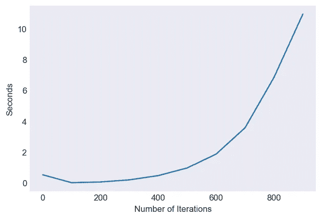

# 使用 Numba 将 Python 代码速度提高 100 倍。

> 原文：<https://levelup.gitconnected.com/super-charge-your-python-code-upto-100x2-3ad359785872>


由 [CHUTTERSNAP](https://unsplash.com/@chuttersnap?utm_source=medium&utm_medium=referral) 在 [Unsplash](https://unsplash.com?utm_source=medium&utm_medium=referral) 上拍摄的照片

> 本文的主要目标是展示如何轻松地将代码速度提高到原生 python 的 100 倍。

查找代码:[*https://www . ka ggle . com/rudra sing/speed-up-python-code-up-to-100 x-using-numba*](https://www.kaggle.com/rudrasing/speed-up-python-code-up-to-100x-using-numba)

## 我们将研究 4 种编写代码的方法，并验证哪种方法相对于其他方法更好。

> 1.普通香草蟒蛇皮
> 
> 2.Numpy
> 
> 3.农巴
> 
> 4.Numba + Numpy

## 1.普通香草蟒蛇皮

`example_function_python`函数将生成两个随机矩阵并将它们相乘。我们可以观察到这个函数有很高的时间和空间复杂度*请忽略这个函数的工作，因为它只是为了演示*。


简单的 python 执行

## 2.使用 NumPy 方法

正如我们所看到的，numpy 中的代码是可爱的、简单的和超快的


数字速度

## 3.用 Numba 这个节目的超级明星。

1.  Numba 是一个允许使用 LLVM 动态编译纯 Python 代码的包。一个简单例子中的应用程序，就像手边的这个，非常简单，而且是动态编译的函数
2.  Numba 使用实时编译器，该编译器使用行业标准的 LLVM 编译器库在运行时将 Python 函数翻译成优化的机器代码。也就是说，所有的重环提升都由 llvm 处理。
3.  当调用一个 Numba 修饰的函数时，该函数被编译成“即时”执行的机器码，并且全部或部分代码随后可以以本机机器码速度运行！

```
**import numba as nb
@nb.jit()
def example_function_numba(num):
        pass**
```

> 使用 Numba JIT 编译器，我们可以观察到它只花了 16 秒就运行了，而 python 用了 175 秒。我推荐使用 decorator 而不是以这种方式调用函数，但是为了简单起见，为了不重复代码，我使用下面的方法调用函数。

```
**numba_jit = nb.jit(example_function_python)
%time z = numba_jit(1000)****Wall time: 16.2 s**
```

## 在 Numba 中使用非 Python 模式

1.  Numba @jit decorator 基本上在两种编译模式下运行，nopython 模式和对象模式。在下面的例子中，使用了相当于@jit(nopython-True)的@ njit decorator 这是指示 Numba 在 nopython 模式下运行。nopython 编译模式的行为实质上是编译修饰函数，这样它将完全在没有 python 解释器参与的情况下运行。这是使用 Numba jit 装饰器的推荐和最佳实践方式，因为它能带来最佳性能。

> 下面的@njit 示例比@jit 方法少用了 1 秒(15.00 秒)。

```
**numba_njit = nb.njit(example_function_python)
numba_list = [timer(numba_njit,num) for num in range(0,1000,100)]
plt.figure(dpi = 120)
plt.plot(range(0,1000,100), numba_list)
plt.xlabel("Number of Iterations")
plt.ylabel("Seconds")**
```



> 使用并行=真

1.  为 njit()设置 parallel 选项会启用 Numba 转换过程，该过程会尝试自动并行化一个函数，并对该函数(的一部分)执行其他优化。这个特性只对 CPU 有效。
2.  但是这个函数只有在代码是可并行的情况下才有效，但是下面的函数是不可并行的，因此 Numba 抛出了一个警告。

```
**numba_njit = nb.njit(example_function_python, parallel = True)
%time z = numba_njit(1000)**C:\Users\siddharth_black_pred\anaconda3\lib\site-packages\numba\core\typed_passes.py:331: NumbaPerformanceWarning: [1m
The keyword argument 'parallel=True' was specified but no transformation for parallel execution was possible.

To find out why, try turning on parallel diagnostics, see https://numba.pydata.org/numba-doc/latest/user/parallel.html#diagnostics for help.
[1m
File "C:\Users\SIDDHA~1\AppData\Local\Temp\ipykernel_10804\2232291569.py", line 23:[0m
[1m<source missing, REPL/exec in use?>[0m
[0m
  warnings.warn(errors.NumbaPerformanceWarning(msg,

Wall time: 16.4 s
```

> 通过用 NumPy 向量替换 python 列表，代码得到了显著的改进，只需 2 秒钟就能执行。与之前的 150 秒相比，


> 让我们比较一下上面我们用来加速的方法

我们观察到 numba 结合 numpy 向量表现最好。

```
**import matplotlib.pyplot as plt 
plt.style.use('seaborn-dark')
plt.figure(dpi = 120)
plt.plot(range(0,1000,100), [0.0,
 0.214097,
 1.588295,
 5.530069,
 13.584038,
 27.472998,
 47.856996,
 77.211966,
 117.906999,
 179.297997], label = 'plain python'
)

plt.plot(range(0,1000,100), numba_numpy_list, label = 'numpy numba')
plt.xlabel("Number of Iterations")
plt.ylabel("Seconds")

plt.plot(range(0,1000,100), numba_list, label = 'numba python')
plt.xlabel("Number of Iterations")
plt.ylabel("Seconds")

plt.xlabel("Number of Iterations")
plt.ylabel("Seconds")
plt.legend()**
```


## Numba 的其他选项

1.  诺吉尔:试图释放编译函数内部的全局解释器锁。只有当 Numba 可以在 nopython 模式下编译该函数时，GIL 才会被释放，否则会打印一个编译警告。
2.  **parallel** :如果为 true，parallel 将启用大量公共 Numpy 构造的自动并行化，以及相邻并行操作的融合，以最大化缓存局部性。
3.  **fastmath** :如果为真，fastmath 将启用 LLVM 文档中描述的不安全的浮点转换

## 示例 2 计算 EWMA

1.  指数加权移动平均(EWMA)是一种用于建模或描述时间序列的定量或统计方法。EWMA 广泛应用于金融领域，主要应用于技术分析和波动性建模。
2.  EWMA 是一个递归函数，这意味着当前观测值是使用之前的观测值计算的。EWMA 的递归特性导致权重呈指数衰减，如下所示:


α=重量

r =当前时间段内时间序列的值

> 看看这个速度比普通代码快 145 倍。

## 例 3:用蒙特卡罗方法计算圆周率。

让我们考虑这个半径为 1 的圆内接于面积为 4 的正方形，即边长为 2 的正方形。


1.  上面是一个半径为 1 的单位圆，因此圆的面积=π* 2
2.  正方形的边长为 2。因此它的面积= 4。


然后嘣！！看看`monte_carlo_numba`的挂壁时间，那有多快。

这只是冰山的一角。如果你想要更复杂的例子，只要给我发消息或 ping 我。

## 结论

1.  虽然 numba 似乎是一个很好的替代品，但它不能用于所有的任务。
2.  Numba 只支持 python 核心数据结构和 numpy 数组。
3.  在 nopython 模式下，无法与 python 及其模块进行交互。
4.  对类的支持有限。