# 超级英雄布局—结合 CSS 网格和 CSS 形状

> 原文：<https://levelup.gitconnected.com/super-hero-layout-combining-css-grid-and-css-shapes-26a60acef643>

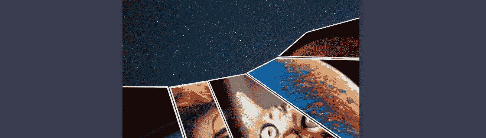

欢迎来到 CSS 网格布局系列的第四部分！在这一部分中，我们将以前文章中的技术与 CSS 形状结合起来，创建一个具有独特形状面板的漫画布局。如果你愿意，你可以[直接跳到 CodePen 演示](https://codepen.io/antonjb/pen/mYyJvj)。如果你需要重温之前的帖子，看看[交错面板](https://medium.com/@antonball/superhero-layout-staggered-css-grid-29430df9520)、[分层面板](https://medium.com/@antonball/superhero-layout-css-layering-panels-46bcb2a94b9c)和 [CSS 子网格](https://medium.com/@antonball/superhero-layout-css-subgrid-3b837f35b20e)。让我们开始吧。

这是我们的设计灵感，来自漫威漫画公司的《世代:凤凰和琴·葛蕾》。

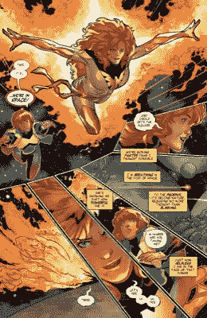

世代:凤凰和琴·葛蕾-漫威漫画

很高兴看到一个打破常规的布局。更好的是，CSS Grid 可以做到这一点。我们创建的所有东西仍然是一个矩形，你不能创建一个不是矩形的网格区域，但是使用 clip-path，我们可以给出任何我们喜欢的形状的错觉。

在我们开始之前，浏览器支持。IE11 不支持 clip-path，这是不会改变的，所以你需要考虑替代方案，但随着边缘交换到 Chromium，我们现在可以很好地跨浏览器访问 clip-path。

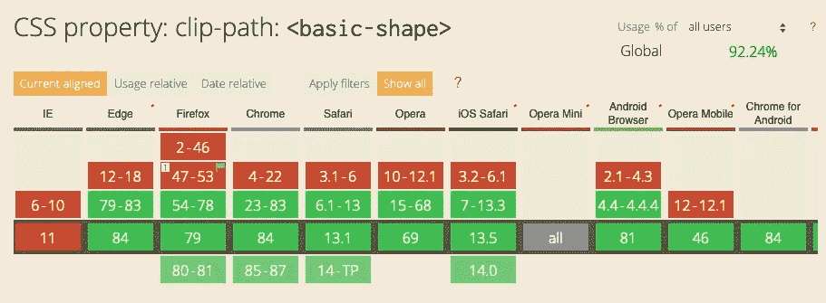

[https://cani use . com/# feat = MDN-CSS _ properties _ clip-path _ basic _ shape](https://caniuse.com/#feat=mdn-css_properties_clip-path_basic_shape)

让我们从漫画的容器开始。

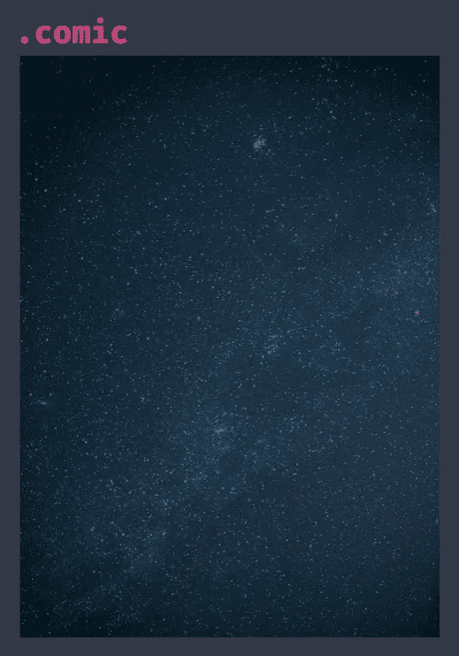

```
.comic {
  position: relative;
  background-image: url(space.jpg);
  background-size: cover;
  background-position: center;
  overflow: hidden;
}
```

漫画由五块嵌板组成，每块嵌板内都有一幅图像。

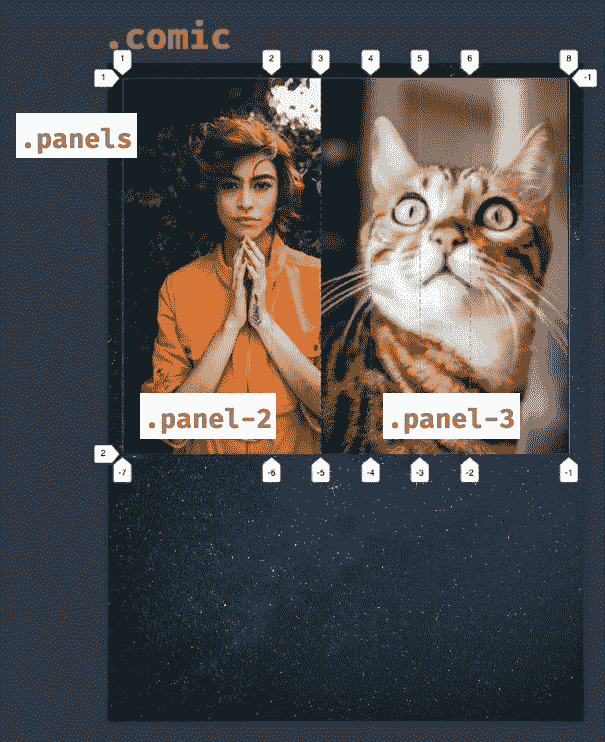

```
.panels {
  display: grid;
  grid-template-columns: 3fr repeat(4, 1fr) 2fr;
}
```

你有理由想知道为什么只有两个可见的图像——面板是重叠的。这是必要的，因为我们创建的角度重叠，我们需要图像可见。如果每个人都在自己的牢房里，我们就不会得到同样的效果。

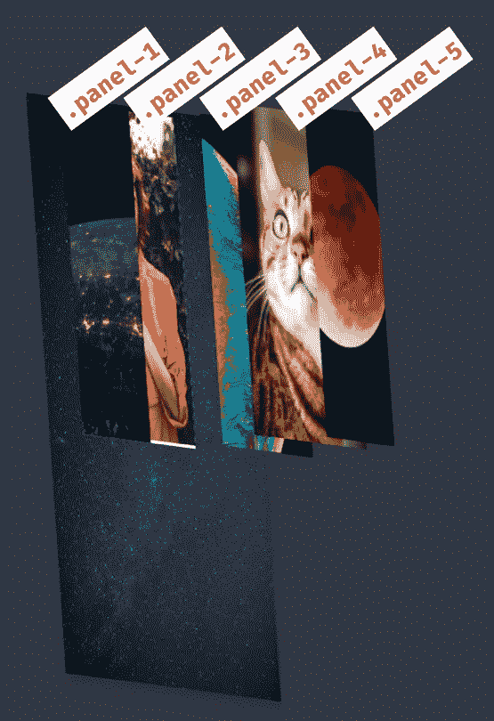

如果我们在 3D 中观察分层— [感谢曼迪·迈克尔的这项技术](https://medium.com/javascript-in-plain-english/creating-3d-layout-with-css-using-grid-perspective-65cd03dfc56c)——我们会更好地了解层是如何重叠的。

面板容器被旋转并绝对定位到它需要的位置。

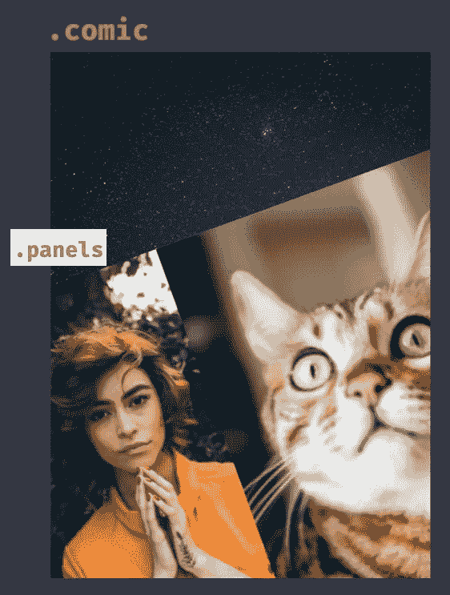

```
.panels {
  display: grid;
  grid-template-columns: 3fr repeat(4, 1fr) 2fr;
  position: absolute;
  left: -20%;
  right: -20%;
  bottom: -10%;
  top: 20%;
  transform: rotate(-20deg) translateY(100px);
}
```

# 剪辑路径

现在我们开始使用剪辑路径来制作奇特的形状！因为它对这项技术至关重要，所以让我们看看 clip-path 是如何工作的。

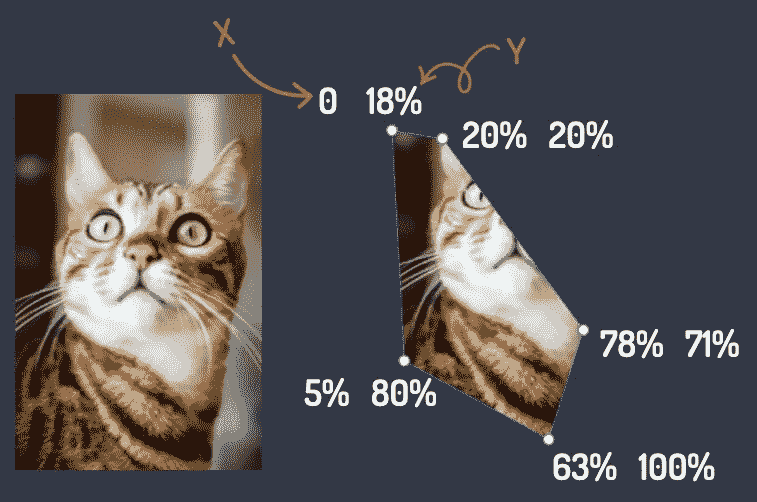

```
.panel-3 {
  clip-path: polygon(0 18%, 20% 20%, 78%
                     71%, 63% 100%, 5% 80%);
}
```

Clip-path 通过为形状中的每个节点提供 x，y 值对来设置形状(在本例中为多边形),从而更改面板的可见区域。路径之外的任何部分都被剪掉，留下我们创建的形状。方便。

当应用于漫画中的每个面板时，我们得到以下结果:

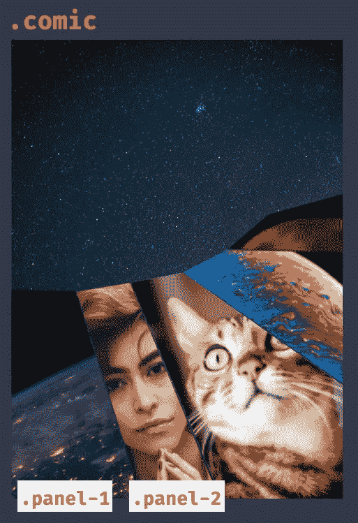

引用邦·乔维的话——“哇，我们已经成功了一半！”。我们的布局在很大程度上是漫画启发我们的。太好了。

```
.panel-1 {
  grid-column: 1 / 1;
  grid-row: 1;
  clip-path: polygon(0 2%, 98% 15%,
                     89% 100%, 0 100%);
}.panel-2 {
  grid-column: 1 / span 3;
  grid-row: 1;
  z-index: 1;
  clip-path: polygon(59% 16%, 80% 18%,
                     86% 100%, 54% 100%);
}
```

# 开发工具中的剪辑路径

剪辑路径值不是我仅仅通过查看图像就能确定的。谢天谢地 [Firefox 的形状路径编辑器](https://developer.mozilla.org/en-US/docs/Tools/Page_Inspector/How_to/Edit_CSS_shapes)允许你交互地拖动节点，并在浏览器中创建你需要的形状。我将浏览器中的这些值放到代码中。

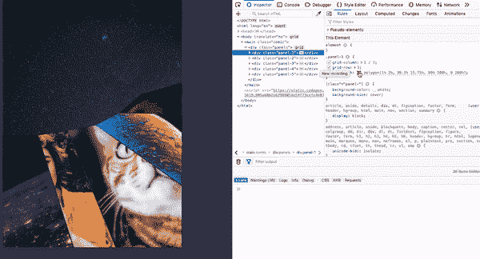

最后要重新创建的部分是图像边框。遗憾的是，我们不能使用 CSS 边框，因为 clip-path 隐藏了剪辑路径之外的内容，这将包括所述边框。所以我们需要另一个想法。

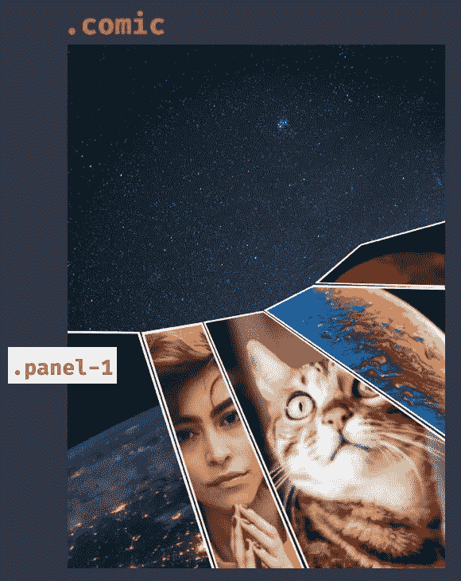

```
.panel-1 {
  grid-column: 1 / 1;
  grid-row: 1;
  clip-path: polygon(1% 2%, 98.5% 15.75%,
                     89% 100%, 0 100%);
  background-color: #fff;
}

.panel-1 img {
  clip-path: polygon(1% 2%, 98.5% 15.75%,
                     89% 100%, 0 100%);
  transform: scale(0.95);
  transform-origin: 70% 22%;
}
```

为了获得边框，将 div 上的背景颜色设置为白色，然后将相同的剪辑路径添加到 div 中的图像，缩小图像，使背景变得可见。由于形状古怪，我们需要设置偏移位置，因为它们不是很方。我们现在有了“边界”。

这种技术的缺点是你需要手动设置网格间隙，因为你需要裁剪和重叠。因此，如果你决定有一个缺口，你需要准确。

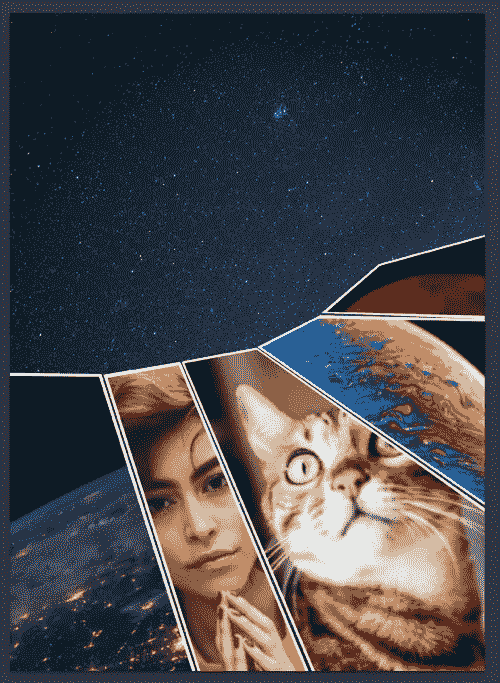

将裁剪路径和网格结合起来可以产生新的布局选项。如果我们将它与我们在第 3 部分中学到的分层结合起来，我们可以从 DC 漫画出版的侦探漫画 876 中重新创建这个布局。

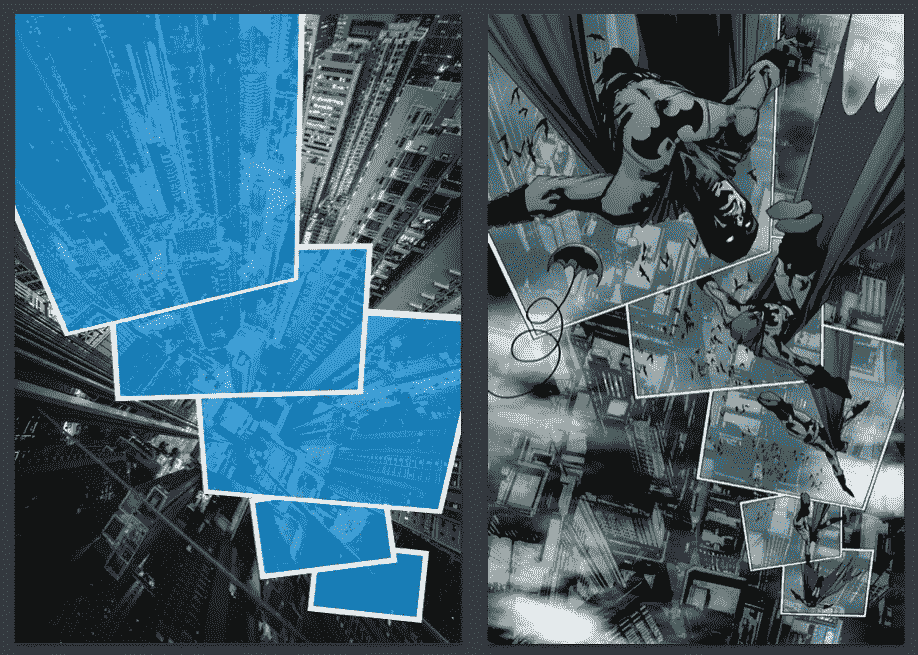

侦探漫画 876 旁边的网络娱乐

如果你想看的话，这个受《T2》侦探漫画启发的布局也可以在 CodePen 上找到。

剪辑路径也有其他可用的形状。多边形很适合做很多边，但是我们也可以用下面的代码创建一个椭圆或者圆。

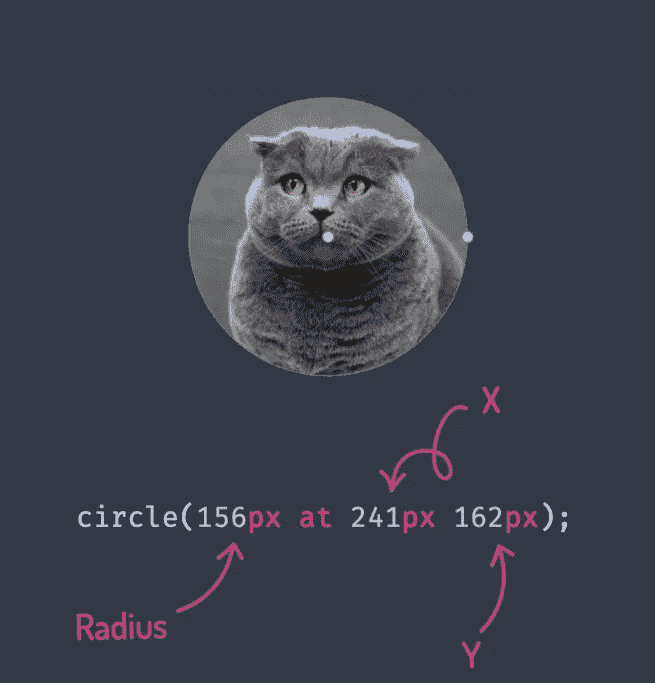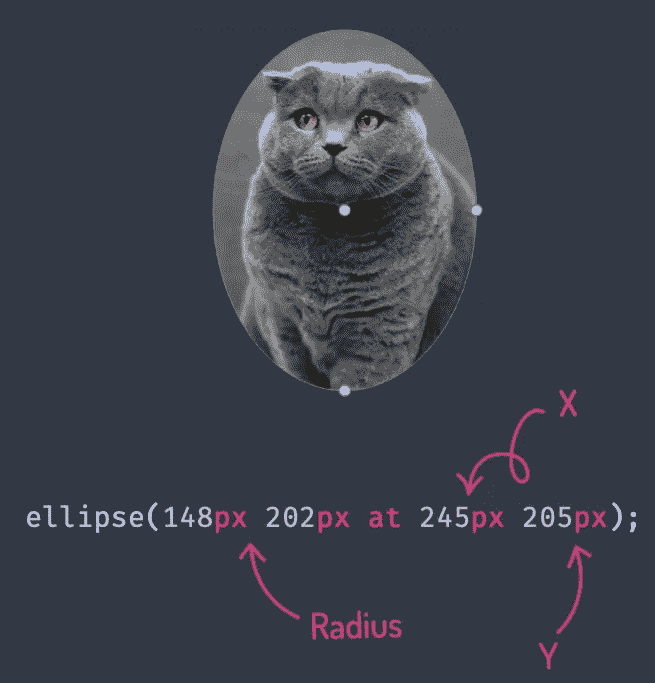

如果我们结合 CSS 网格，多边形，圆形和椭圆形剪辑路径的超能力，那么我们甚至可以从 Flash 漫画系列中重现这种狂野的布局。再次，[你可以在 CodePen](https://codepen.io/antonjb/pen/JqjdBr) 上预览这个布局。

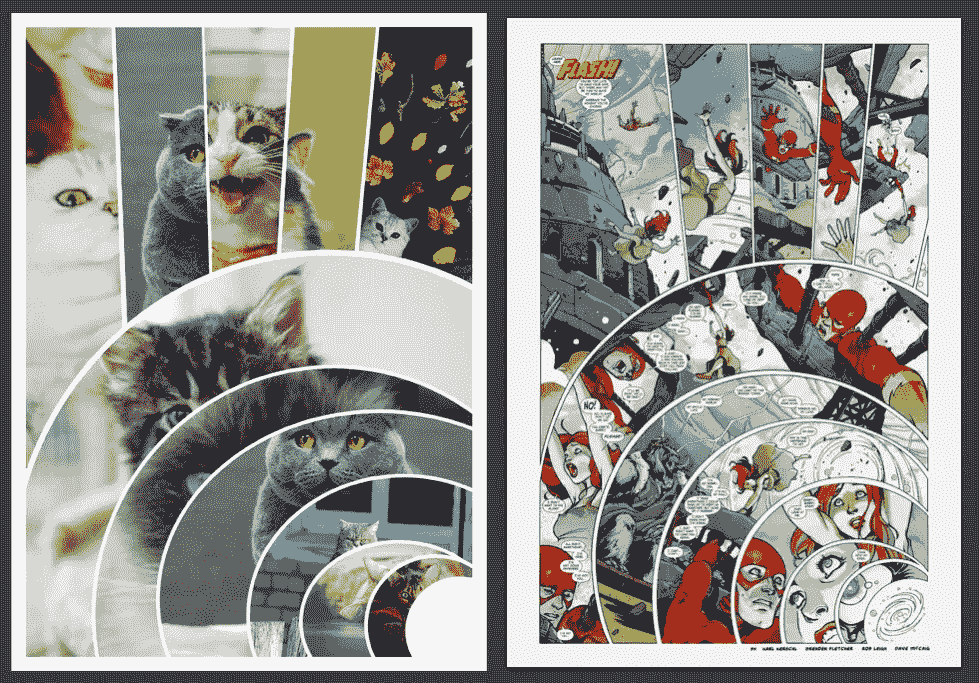

我希望这些例子已经激发了你跳出布局的框框去思考。将 CSS Grid 和 clip-path 结合起来可以为布局带来一些惊人的可能性。如果你想看看 CodePen 上的例子，这里有[凤凰启发布局](https://codepen.io/antonjb/pen/mYyJvj)、[侦探漫画启发布局](https://codepen.io/antonjb/pen/EJOLMx)和 [Flash 启发布局](https://codepen.io/antonjb/pen/JqjdBr)的链接。

在本系列的下一部分中，我们将对路径采取类似的方法，但是看看 CSS 形状如何使文本环绕图片。

# 超级英雄布局系列中的帖子

*   [交错 CSS 网格](https://medium.com/@antonball/superhero-layout-staggered-css-grid-29430df9520)
*   [CSS 子网格](https://medium.com/@antonball/superhero-layout-css-subgrid-3b837f35b20e)
*   [CSS 分层面板](https://medium.com/@antonball/superhero-layout-css-layering-panels-46bcb2a94b9c)
*   [CSS 形状](https://medium.com/@antonball/super-hero-layout-combining-css-grid-and-css-shapes-26a60acef643)
*   [文本的 CSS 形状](https://medium.com/@antonball/superhero-layout-css-shapes-for-text-5f22025a66d4)
*   [CSS 国际化](https://medium.com/@antonball/superhero-layout-internationalisation-3876672d2f12)

# 谢谢

感谢 [Mandy Michael](https://twitter.com/mandy_kerr) 为[关于透视布局](https://medium.com/javascript-in-plain-english/creating-3d-layout-with-css-using-grid-perspective-65cd03dfc56c)的帖子和评论这篇帖子。感激不尽。