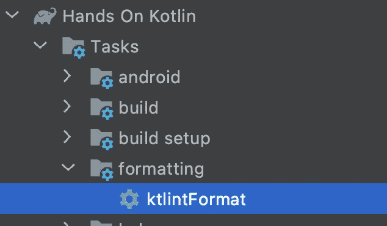
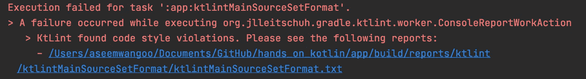
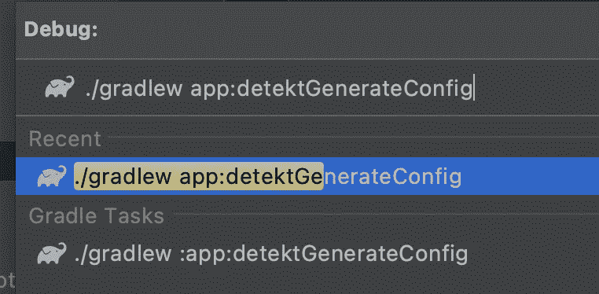
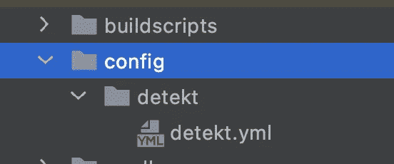
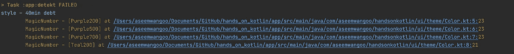
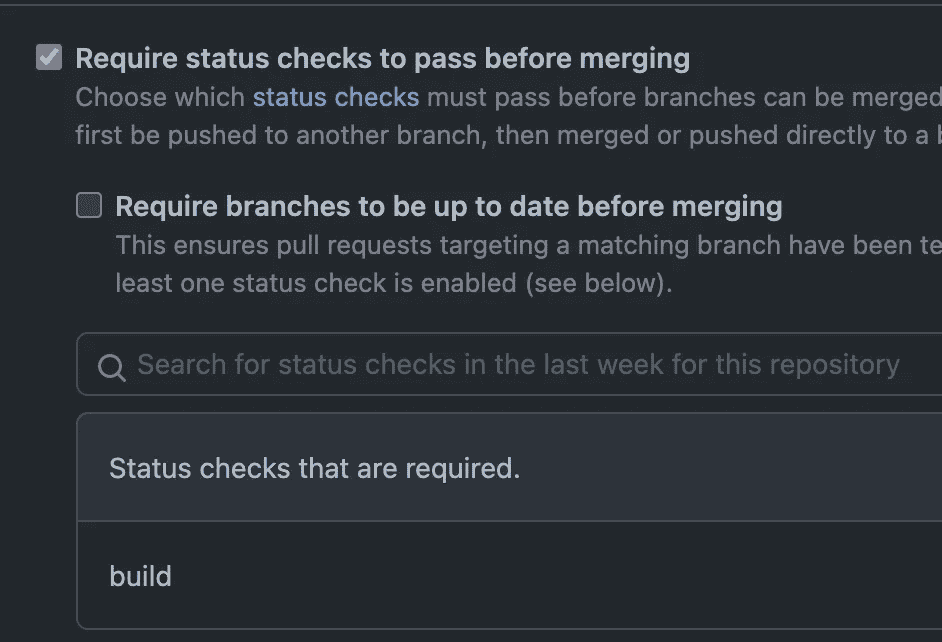

# 增强你的科特林项目

> 原文：<https://levelup.gitconnected.com/supercharge-your-kotlin-project-726d85857798>

Kotlin 项目的提示

> 此处:[https://flatteredwithflutter.com/tips-for-kotlin-project/文章](https://flatteredwithflutter.com/tips-for-kotlin-project/)

增强你的科特林项目

本文分享了一些关于 kotlin 项目中应包含的内容的提示。我们将简要介绍:

1.  Ktlint
2.  检测
3.  Github 工作流程

> 注意:本文假设读者了解科特林


增强你的科特林项目

# Ktlint

[](https://youtube.com/shorts/JZsJln3Cl4U?feature=share) [## 使用 Ktlint 的技巧🤩👨‍💻# kotlin #编程#shorts @aseem wangoo

### 这个视频展示了你的 kotlin 项目的一些技巧。我们用 detekt、ktlint 和 github 增强我们的 kotlin 项目…

youtube.com](https://youtube.com/shorts/JZsJln3Cl4U?feature=share) 

林挺是分析代码潜在错误的过程，在 Kotlin 中我们可以这样做的方法之一是使用 [**Ktlint**](https://ktlint.github.io/) 。根据文件:

> [**Ktlint**](https://ktlint.github.io/) 是一种防自行车脱落的科特林棉绒

在 kotlin 项目中集成 Ktlint 有两种方法。

```
[jlleitschuh/ktlint-gradle](https://github.com/jlleitschuh/ktlint-gradle)[jeremymailen/kotlinter-gradle](https://github.com/jeremymailen/kotlinter-gradle)
```

我们将使用 [ktlint-gradle](https://github.com/JLLeitschuh/ktlint-gradle) ，它是 ktlint 的包装器。

## 设置

*   前往项目级 [build.gradle](https://github.com/AseemWangoo/hands_on_kotlin/blob/master/build.gradle)
*   在`buildscripts`中添加最新版本，在`ext`中添加依赖，在`dependencies`下添加依赖

```
ext **{**
   // https://github.com/JLLeitschuh/ktlint-gradle/releases
   ktlintPluginVersion = "10.2.0"
**}**dependencies **{** classpath 'com.android.tools.build:gradle:7.0.0'
    classpath "org.jetbrains.kotlin:kotlin-gradle-plugin:1.4.32"
        ## KTLINT DEPENDENCY
    classpath "org.jlleitschuh.gradle:ktlint-   gradle:$ktlintPluginVersion"    
**}**
```

*   在`repositories`部分中，添加以下内容

```
repositories **{** google()
    mavenCentral() ## ADDED THIS FOR KTLINT
    maven **{** url "https://plugins.gradle.org/m2/"
    **}
}**
```

*   我们为配置/定制`ktlint`创建一个单独的文件。在项目级别创建一个目录`buildscripts`，并在其中创建一个名为`[ktlint.gradle](https://github.com/AseemWangoo/hands_on_kotlin/blob/master/buildscripts/ktlint.gradle)`的新文件

```
apply plugin: "org.jlleitschuh.gradle.ktlint"ktlint {
    // [https://github.com/pinterest/ktlint/releases](https://github.com/pinterest/ktlint/releases)
    version = "0.42.1" reporters {
        reporter "plain"
        reporter "checkstyle"
        reporter "html"
    } outputColorName = "RED"
}
```

*   最后，我们通过在项目级 [build.gradle](https://github.com/AseemWangoo/hands_on_kotlin/blob/master/build.gradle) 中添加以下内容，将此配置应用到我们所有的`subprojects`中

```
subprojects **{** apply from: "../buildscripts/ktlint.gradle"
**}**
```

*   点击`Sync Now`如果一切顺利，我们应该会看到一个名为`ktlintformat`的渐变任务



ktlintFormat 梯度任务

> 注意:如果你看不到你的任务，请查看这个[帖子](https://programmerah.com/gradle-tasks-disappeared-after-upgrading-android-stuido-4-2-29098/)

*   在运行任务`ktlintformat`之后，它输出结果，(如果出现错误，它将显示包含文件详细信息的文件)



ktlintformat 错误

点击`.txt`文件并相应纠正错误。

> 注意:你可能会有很多文件变更，因为`ktlintformat`会检查你所有的项目文件，并根据 kotlin 标准进行修正。

# 检测

[](https://www.youtube.com/shorts/2ACLWbLzWGg) [## Kotlin -使用 Detekt 的提示🤩👨‍💻# kot Lin # shorts # programming @ aseem wangoo

### 这个视频展示了你的 kotlin 项目的一些技巧。我们用 detekt、ktlint 和 github 增强我们的 kotlin 项目…

www.youtube.com](https://www.youtube.com/shorts/2ACLWbLzWGg) 

[Detekt](https://github.com/detekt/detekt) 是一个针对 *Kotlin* 编程语言的静态代码分析工具。它对 Kotlin 编译器提供的抽象语法树进行操作。

它使用多个规则集分析 Kotlin 代码，并标记违反任何规则的代码。

## 设置

*   前往项目级 [build.gradle](https://github.com/AseemWangoo/hands_on_kotlin/blob/master/build.gradle)
*   在`buildscripts`中添加最新版本的`ext`，并在`dependencies`下添加依赖关系

```
ext **{**
   // https://github.com/detekt/detekt/releases
   detektVersion = "1.17.0"
**}**dependencies **{** classpath 'com.android.tools.build:gradle:7.0.0'
    classpath "org.jetbrains.kotlin:kotlin-gradle-plugin:1.4.32"
      ## DETEKT DEPENDENCY
    classpath "io.gitlab.arturbosch.detekt:detekt-gradle-    plugin:$detektVersion"  
**}**
```

*   我们为配置/定制`detekt`创建一个单独的文件。在项目级别创建一个目录`buildscripts`(如果您在上面的步骤中创建了目录，请忽略它),并在其中创建一个名为`[detekt.gradle](https://github.com/AseemWangoo/hands_on_kotlin/blob/master/buildscripts/detekt.gradle)`的新文件

```
apply plugin: "io.gitlab.arturbosch.detekt"

detekt **{** config = files("$**{**rootProject.projectDir**}**/config/detekt/detekt.yml")

    reports **{** html.enabled = true
        xml.enabled = true
        txt.enabled = true
    **}
}**
```

> 注意:配置文件`detekt.yml`还不存在，我们将在后面的步骤中看到

*   最后，我们通过在项目级 [build.gradle](https://github.com/AseemWangoo/hands_on_kotlin/blob/master/build.gradle) 中添加以下内容，将这种配置应用到我们所有的`subprojects`中

```
subprojects **{** apply from: "../buildscripts/detekt.gradle"
**}**
```

*   点击`Sync Now`如果一切顺利，我们应该会看到一个名为`detektGenerateConfig`的分级任务并运行它



检测生成配置梯度任务

*   运行任务后，它生成名为`detekt.yml`的配置文件



检测配置符号

它包含了所有的配置。我们可以根据自己的喜好定制。

*   最后，我们在项目中运行以下内容

```
./gradlew detekt
```

这将向您显示项目中的所有问题，以及配置名称。



项目中的检测问题

如果您想要隐藏文件中的某个问题，例如，上述与`MagicNumber`相关的问题，我们可以简单地转到该文件并添加

```
 @file:Suppress("MagicNumber")
```

# Github 工作流程

[](https://youtube.com/shorts/2s3Aaf3s_xU?feature=share) [## Kotlin 使用 Github 工作流的技巧🤩👨‍💻#编程#短裤#kotlin @aseem wangoo

### 这个视频展示了你的 kotlin 项目的一些技巧。我们用 detekt、ktlint 和 github 增强我们的 kotlin 项目…

youtube.com](https://youtube.com/shorts/2s3Aaf3s_xU?feature=share) 

在上面的步骤中，我们看到了如何将`ktlint`和`detekt`集成到我们的 kotlin 项目中。

最后一步，我们将把这两者与我们的 CI 整合，确保主要分支始终保持标准化。

*   在项目中添加一个`.github`目录。
*   创建一个子目录`workflows`，并在其中创建一个名为`[android_build.yml](https://github.com/AseemWangoo/hands_on_kotlin/blob/master/.github/workflows/android_build.yml)`的文件

```
name: Android Build

on: push

jobs:
  build:
    runs-on: ubuntu-latest
    steps:
      - name: Checkout
        uses: actions/checkout@v1

      - name: Set Up JDK
        uses: actions/setup-java@v1
        with:
          java-version: 1.11

      - name: Build Project
        run: ./gradlew assemble

      - name: Run Tests
        run: ./gradlew test

      - name: Lint Checks
        run: ./gradlew ktlintCheck detekt
```

*   在最后一步中，我们包括了`ktlintCheck`和`detekt`，因为这个任务是在推送模式下运行的，我们将确保代码符合我们的约定。
*   我们还可以添加一个分支保护规则，要求通过状态检查并选择`build`



分支保护规则

其他文章:

[](https://proandroiddev.com/google-signin-compose-a9afa67b7519) [## Google 登录撰写

### Google 登录撰写

谷歌登录 Composeproandroiddev.com](https://proandroiddev.com/google-signin-compose-a9afa67b7519) [](/testing-in-compose-d09b59337e4e) [## 撰写中的测试

### 撰写中的测试

levelup.gitconnected.com](/testing-in-compose-d09b59337e4e) [](/using-room-in-jetpack-compose-d2b6b674d3a5) [## 在 Jetpack Compose 中使用房间

### 在 Jetpack Compose 中使用房间

使用喷气背包 Composelevelup.gitconnected.com 的房间](/using-room-in-jetpack-compose-d2b6b674d3a5) [](/using-workmanager-in-android-be5cae1f155a) [## 在 Android 中使用工作管理器

### 在 Android 中使用工作管理器

在 Androidlevelup.gitconnected.com 使用工作管理器](/using-workmanager-in-android-be5cae1f155a) 

```
[Source code](https://github.com/AseemWangoo/hands_on_kotlin)
```