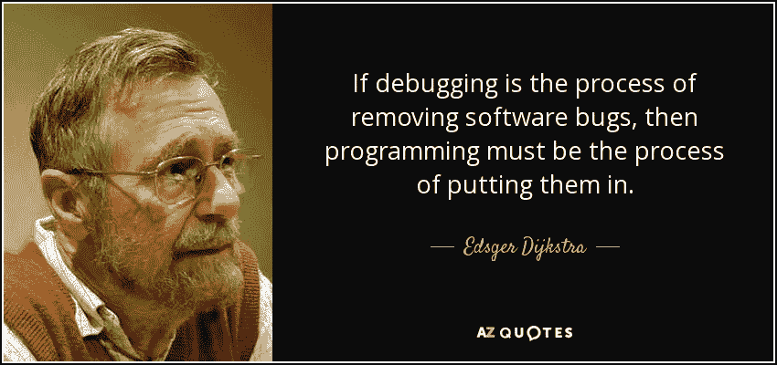
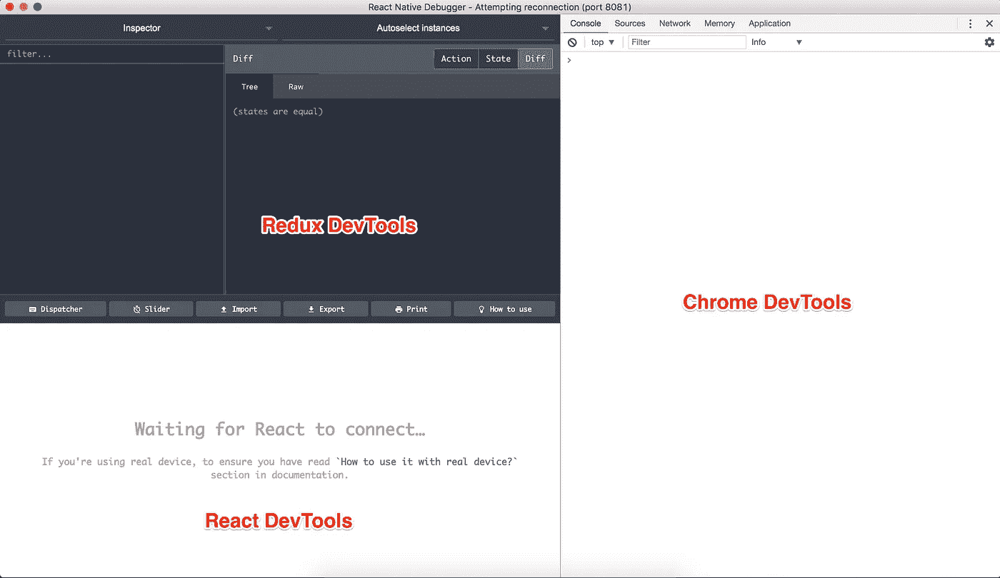
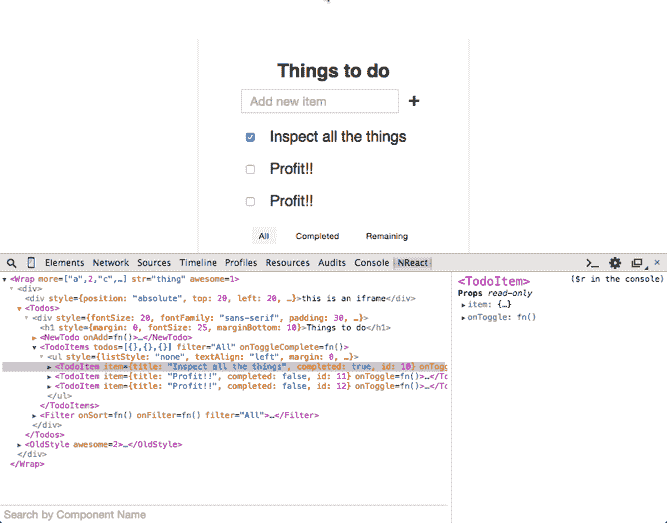
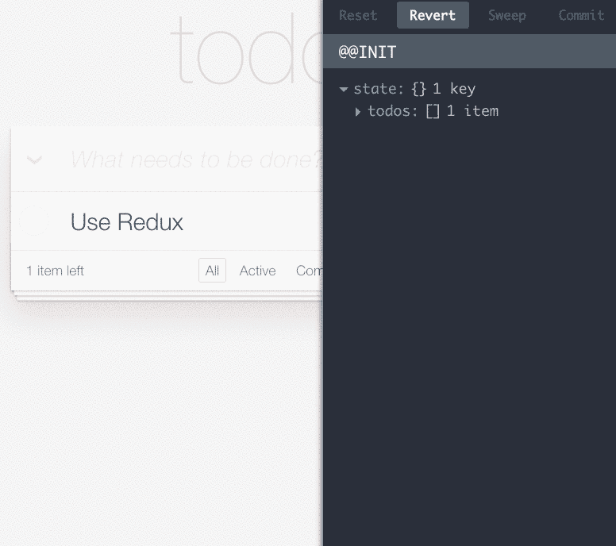

# 使用 React-Native-Debugger 增强您的 React 本机开发

> 原文：<https://levelup.gitconnected.com/supercharge-your-react-native-development-with-react-native-debugger-7633882683a9>

反应本机调试器应用程序图标

总会有 bug——我们永远不会用完它们。有*奋斗和得到挫败*调试，然后有*寒心*调试在那里有一个工具可以帮你省时省力。

正如明智的埃德格·迪克斯特拉曾经说过的

> 如果说调试是去除软件 bug 的过程，那么编程一定是把 bug 放进去的过程。

**什么是 React 原生调试器？**

[React 原生调试器](https://github.com/jhen0409/react-native-debugger)是一款独立的 app，用于调试 React 原生应用。它结合了 3 个非常重要的调试工具，让您的开发生命周期变得非常棒。

React 本机调试器零状态的屏幕截图

## [反应开发工具](https://github.com/facebook/react-devtools):

**React 开发工具**允许您检查 React 组件层次结构，包括组件属性和状态。它使您能够检查/更改 react 本机应用程序中的元素，就像您在 web 浏览器中浏览网页一样

## [Redux 开发工具](https://github.com/gaearon/redux-devtools):

Redux DevTools 允许您检查每个状态和动作负载变化。它提供了一个清晰的界面来跟踪应用程序中的每个状态变化和每个触发的动作。我真的很喜欢这个。

## Chrome 开发工具:

这是 React Native 默认提供的。当你点击“远程调试”时，会打开一个 Chrome 标签。当你用代码中的`console.log`打印到控制台或者使用`debugger`语句时，你可以在 Chrome devtools 中看到它们。

React Native Debugger 将所有这些工具集合在一起，让您的开发生活变得更加轻松，相信我。

# 如何安装 React 本机调试器

## …请记住

## 所以请自便…

祝你愉快！