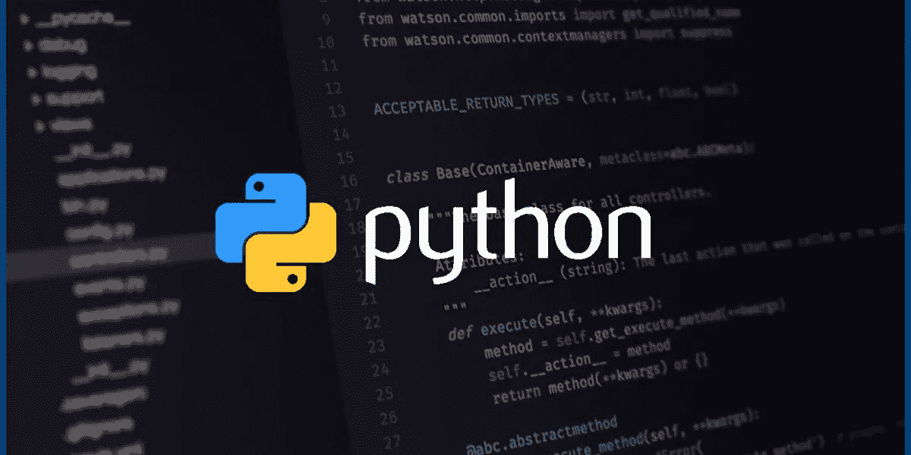
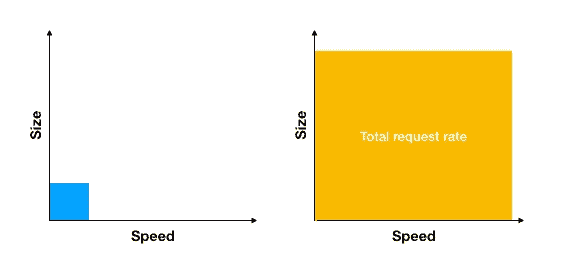

# 增强 Python 的可伸缩性

> 原文：<https://levelup.gitconnected.com/supercharging-pythons-scalability-1eec2f501dd5>

## 我们如何把一个简单的 Flask 应用程序变成一个怪物



途经 technotification.com[的](https://www.technotification.com/2018/05/top-5-python-programming-ide.html)[萨加尔](https://www.technotification.com/author/sagar)

数据科学中的大多数前沿工作都是由 Python 开创的。对于软件行业来说尤其如此，Python 是机器学习部署的首选。

然而，这提出了一个明显的悖论:**调和了 Python 独特的能力和其根本缺乏可伸缩性。**

任何试图将 Jupyter 笔记本转化为高吞吐量、高可伸缩性的微服务的人都会理解——这当然不容易。在这篇文章中，我将分享我是如何让一个 ML 服务为每秒 **10 个请求**服务到每秒 **200 个请求**服务的，并且还有增长的空间。

## 高级方法

当考虑可伸缩性时，我们需要考虑可以扩展的维度。我们可以探索哪些轴？

今天，我们将关注两个问题:

1.  多个进程(大小)
2.  同步与异步处理(速度)



如果您将*区域*视为您的服务可以服务的请求数量，我们的目标是使我们的最终产品看起来像右图。

那么，我们该怎么做呢？

## 最低限度

> 让我们快速后退一步。我们需要了解蓝色方块是什么样子的。

研究？*搞定。*

实验？*搞定。*

微服务时间到了。将一个模型从实验室带入生产需要一个 web 框架。我选择的框架是 Flask，如果你不熟悉的话，[你应该是](https://flask.palletsprojects.com/en/1.1.x/foreword/#what-does-micro-mean)。我把笔记本上的代码翻译成了回购协议，并在整个程序上安装了一个 Flask 应用程序。通过添加一些 POST 端点，我已经成功地将我的数据科学转化为“生产就绪”代码。

我们大多数人都到了这一步。假设一切正常，从技术上来说，你的代码已经*准备好部署了*。

然而，运行一个单一的进程，同步烧瓶应用程序不会做得很好。我们的肯定没有。它倒下了，每秒超过 10-12 个请求后出现巨大的延迟峰值。


这就是最低值的样子，离它的最大潜力还很远。

## 升级 1:流程

再来看我们的第一轴:*单处理 vs 多处理。*

为了澄清任何混淆，这里不涉及多处理库。相反，我们将讨论[](https://gunicorn.org/)**。**

**Gunicorn 允许我们运行单个应用程序的多个**工作进程**。这真的很简单，我们可以很容易地增加或减少我们的工人数量。例如，下面的代码运行 myapp 的两个 workers。**

```
gunicorn -w 2 myapp:app
```

**有了它，我们能够将请求服务率提高一倍，从 10%提高到 20%(令人震惊。硬件允许的话，你可以增加工人的数量。对于我们的服务，服务器只能处理 2。**

****

**我们做得更好，但现在真正的升级来了。**

## **升级 2:同步到异步**

> **为了充分理解我们试图解决的问题，你应该熟悉为什么存在这种限制。Python 建立在全局解释器锁(GIL)的基础上，它本质上是线程运行的互斥锁。为了限制竞争条件和防止奇怪的错误，GIL 被创建了，随之而来的是对 Python 可伸缩性限制的(理所当然的)抗议。**

**如果你不熟悉这两者的区别，我建议你[读完这篇文章再回来](https://stackoverflow.com/questions/748175/asynchronous-vs-synchronous-execution-what-does-it-really-mean)。**

**我们的目标是将**升级** **Gunicorn workers** 到**支持异步处理**。那么，我们该怎么做呢？我们用夸脱和超立方。**

**更具体地说，我们:**

1.  **用夸脱替换烧瓶**
2.  **用 Hypercorn 代替 Gunicorn**

> **Quart 和 Hypercorn，像许多其他 Python 框架一样，是建立在用于异步处理的 Python 库 [**Asyncio**](https://docs.python.org/3/library/asyncio.html) 之上的。**

## **烧瓶至夸脱**

**升级烧瓶到夸脱，这几乎是滑稽的简单。你所要做的就是用**夸脱**替换**烧瓶**，并在适当的地方添加**异步**和**等待**关键字。**

**例如，这段代码:**

```
from flask import Flask, render_template app = Flask(__name__) @app.route(‘/’) 
def hello(): 
    return render_template(‘index.html’, hello=’world’) app.run()
```

**变成了这样:**

```
from **quart** import **Quart**, render_template app = **Quart**(__name__) @app.route(‘/’) 
**async** def hello(): 
    return **await** render_template(‘index.html’, hello=’world’) app.run()
```

**简单吧？**

## **Gunicorn 到 Hypercorn**

**现在，Gunicorn 工人不支持 Asyncio。相反，我们需要将他们升级为超级员工。**

**为此，只需安装并运行:**

```
pip install hypercorn
hypercorn -w 2 myapp:app
```

**再简单不过了。**

**通过一系列相对简单的升级，我们能够将一个简单的 Flask 应用程序从每秒 **10 个请求**提升到每秒 **200 个请求**，只需要两个进程！**

****

## **结论**

**垂直和水平缩放始终是选项—在适当的时候使用它们而不是过早地使用*非常重要。在花钱解决这个问题之前，请确保您最大限度地利用了现有的硬件。***

***此外，还有很多空间可以继续尝试。例如，你可以用**[**Uvicor**](https://www.uvicorn.org/)**n workers**来替换 **Hypercorn workers** 来进一步提升性能。不要害怕发挥创造力。*****

*****感谢阅读！*****

**********