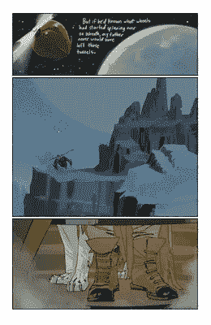
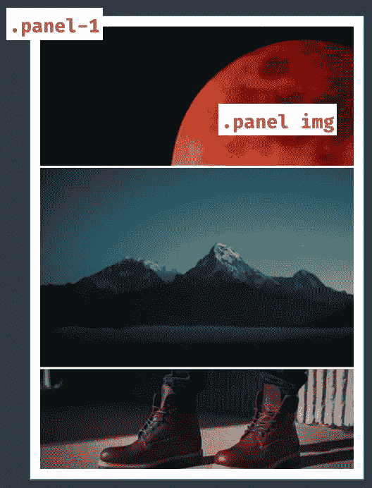
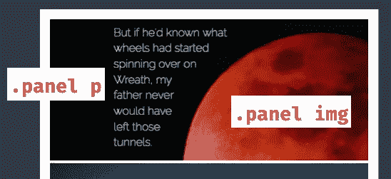
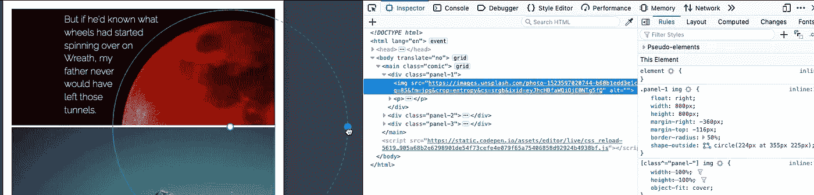
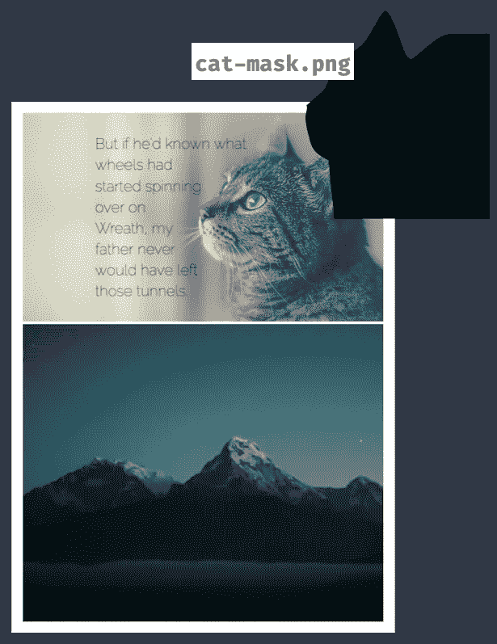

# 超级英雄布局—文本的 CSS 形状

> 原文：<https://levelup.gitconnected.com/superhero-layout-css-shapes-for-text-5f22025a66d4>


欢迎来到 CSS 网格超级英雄布局系列的第五部分。在第五部分中，我们利用 CSS 形状使文本围绕形状流动。与第四部分有相似之处，我们使用几何形状来塑造我们的面板，我们将让我们的文本以独特而有趣的方式流动。让我们开始吧。

该系列的每篇文章都是从灵感开始的。第五部分的灵感来自图像漫画的佐贺。我们的目标？像我们在第一个面板中看到的那样，将文字环绕在行星的形状周围:



传奇#1 —图像漫画

很久以前，人们就已经可以在印刷品上看到像 Saga 那样的文字环绕形状。我们可以从我们的布局中汲取灵感，并将它们应用到网络上，这很棒。这将使我们的漫画布局比你可能从漫画中期待的演讲泡沫更有趣。

首先，这是布局的样板代码。诚然，CSS 网格并不是我们所做的事情所必需的，但是让我们保持我们的漫画主题。



```
.comic {
    display: grid;
    grid-template-columns: 1fr;
    grid-template-rows: 1.4fr 2fr 1fr;
    grid-gap: 0.25rem;
    margin: 0 auto;
}.panel-1 {
  position: relative;
}.panel img {
  float: right;
  width: 800px;
  height: 800px;
}
```

接下来，添加文字将包裹星球。文本是一个有宽度的段落，这样就不会太长。我们需要边界，这样我们就能给文本一个好的形状。

[形外](https://developer.mozilla.org/en-US/docs/Web/CSS/shape-outside)是使效果成为可能的属性。我们对图像应用形状外，给段落一个边界。



```
.panel p {
  margin: 0;
  margin-left: 100px;
  margin-top: 8px;
  width: 400px;
}

.panel img {
  float: right;
  width: 800px;
  height: 800px;
  shape-outside: circle(219px at 355px 225px);
}
```

我们做到了！现在，段落环绕应用于图像的 CSS 形状。你可以在 CodePen 上探索[的例子。更改值是深入了解该技术的一个好方法。](https://codepen.io/antonjb/pen/xNGEye?editors=1100)

如果你想知道浏览器的支持，[还不算太坏](https://caniuse.com/css-shapes)。如果您选择使用这种技术，您将需要对旧浏览器的回退。

圆形是一种可用的形状选项，但也有椭圆形和多边形。[本系列的第四部分](/super-hero-layout-combining-css-grid-and-css-shapes-26a60acef643)更详细地介绍了可用形状的差异。如果你对细节感兴趣，可以看看那篇文章。

还记得这个方便的提示吗(第四部分也有视频介绍) [Firefox 有很棒的开发工具](https://developer.mozilla.org/en-US/docs/Tools/Page_Inspector/How_to/Edit_CSS_shapes)，可以让你直接在浏览器中编辑 CSS 形状。打开开发工具，检查图像元素，然后单击 shape-outside 旁边的图标，找到那个完美的值。



除了几何形状，shape-outside 还有另一个方便的选项，图像遮罩。对于稍微复杂一点的图像，比如这只猫，我们可以提供一个带有 alpha 蒙版的图像。外形决定其余部分。



```
.panel img {
  float: right;
  shape-outside: url(‘cat-mask.png’)
}
```

当您有现成的图像蒙版(例如透明图像或具有复杂形状的图像)时非常有用。有一个问题，图像必须是可获取的，没有任何 CORS 问题，否则，就好像没有提供图像遮罩。

能够如此重现围绕图形流动的文本是现代网络的一个奇妙部分。像我们看到的这种布局在几年前会很复杂。

在你的布局中使用 CSS 形状，看看你能想出什么！如果你想看 CodePen 上的演示，那么[传奇风格的布局](https://codepen.io/antonjb/pen/xNGEye)和[猫面具](https://codepen.io/antonjb/pen/dEMLJm)都是可用的。在本系列的下一部分，我们将探索 CSS Grid 的国际化(i12n)。

# 超级英雄布局系列中的帖子

*   [交错的 CSS 网格](https://medium.com/@antonball/superhero-layout-staggered-css-grid-29430df9520)
*   [CSS 子网格](https://medium.com/@antonball/superhero-layout-css-subgrid-3b837f35b20e)
*   [CSS 分层面板](https://medium.com/@antonball/superhero-layout-css-layering-panels-46bcb2a94b9c)
*   [CSS 形状](https://medium.com/@antonball/super-hero-layout-combining-css-grid-and-css-shapes-26a60acef643)
*   [文本的 CSS 形状](https://medium.com/@antonball/superhero-layout-css-shapes-for-text-5f22025a66d4)
*   [CSS 国际化](https://medium.com/@antonball/superhero-layout-internationalisation-3876672d2f12)