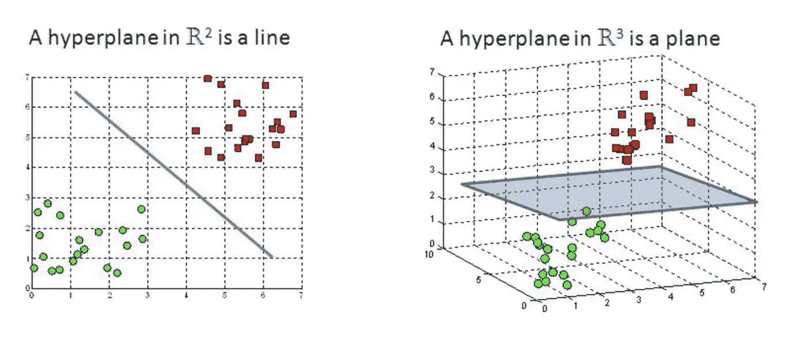
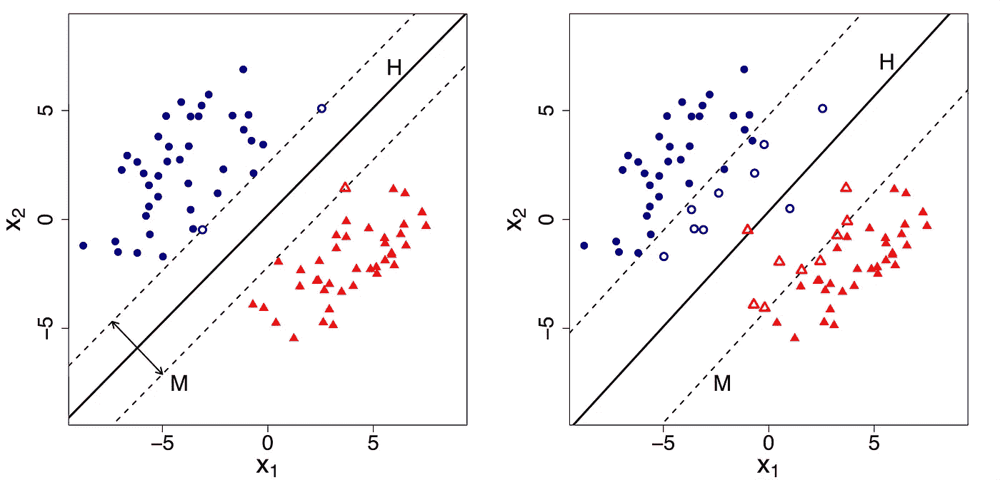
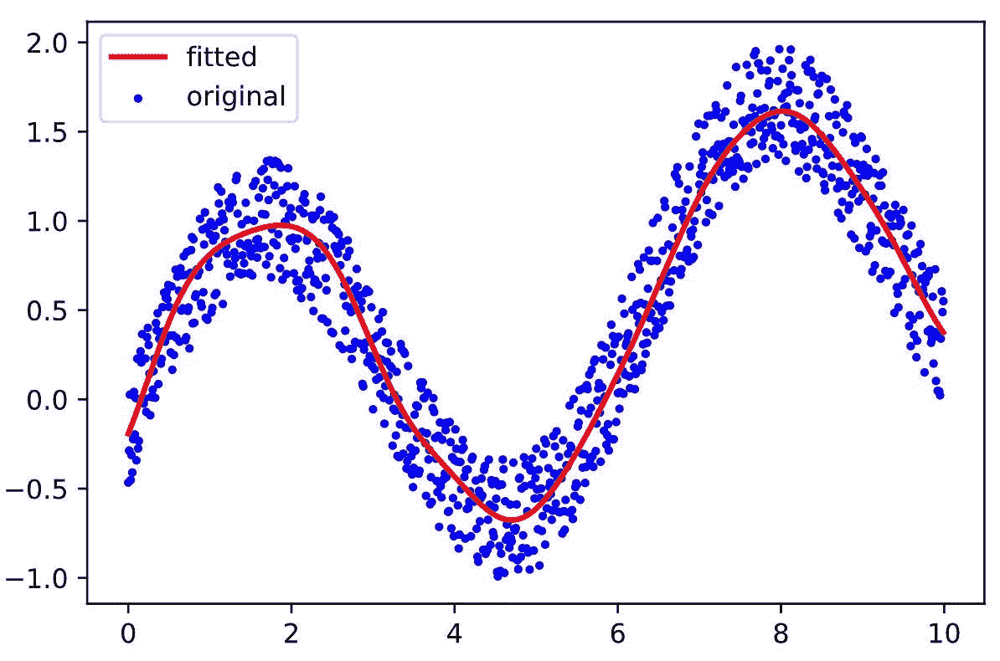

# 支持向量机:高层次的概述

> 原文：<https://levelup.gitconnected.com/support-vector-machines-a-high-level-overview-b692bc30e5ce>

## 使用 SVM 的分类和回归的基础

支持向量机或 SVM 是一种广泛用于机器学习中的分类和回归任务的算法。但是到底什么是支持向量机，它们是如何工作的？

如果你是机器学习领域的新手，一开始可能会有点害怕。但是不要担心——在本文中，我们将深入研究支持向量机的基础知识，并探索如何使用它们来解决广泛的问题。

## 什么是 SVM

首先，让我们定义什么是 SVM。简而言之，SVM 是一种线性模型，它使用一种称为“超平面”的概念将数据点分成不同的类。

这是通过找到在高维空间中最大限度地分隔不同类别的线或平面来实现的。一旦找到超平面，新的数据点可以很容易地根据它们落在超平面的哪一侧进行分类。

但这仅仅是开始——支持向量机可以做的不仅仅是分类。它们还可用于回归任务，例如根据其他特征预测连续变量的值。为了使事情更加灵活，支持向量机可以与不同类型的“内核”一起使用，以处理数据中的非线性关系。

## 那么，你能从这篇文章中期待什么呢？以下是我们将涵盖内容的简要概述:

*   超平面的概念以及如何在支持向量机中使用它来分离数据点
*   使用支持向量机进行分类，包括分类过程概述和支持向量机可以解决的分类任务示例
*   使用支持向量机进行回归，包括回归过程概述和可以使用支持向量机解决的回归任务示例
*   为您的数据选择正确的内核，包括不同类型内核的概述以及如何为您的数据选择正确的内核
*   使用支持向量机的利与弊，包括这些算法的优点和局限性

# 超平面的概念

正如引言中提到的，支持向量机中的一个关键概念是“超平面”的概念但是什么是超平面，它和支持向量机有什么关系？

超平面是高维空间中的线或平面，用于将数据点分成不同的类。在二维空间中(例如，简单的散点图)，超平面只是将数据分成两类的线。在三维空间中(例如，3D 散点图)，超平面是将数据分成两类的平面。而在一个更高维的空间里(比如有很多特征的数据集)，超平面就是超平面！

## 不同维空间中的超平面

甘地[走向科学](http://Rohith Gandhi Rohith Gandhi)

SVM 的目标是找到最大限度地分隔数据中不同类别的超平面。这是通过最大化裕度或者超平面和每个类的最近数据点之间的距离来实现的。离超平面最近的数据点称为“支持向量”，它们在确定超平面的位置中起着关键作用。

一旦找到超平面，新的数据点可以很容易地根据它们落在超平面的哪一侧进行分类。例如，在二元分类问题(即两个类)中，如果新的数据点落在超平面的正侧，则它被分类为属于正类。如果它落在负的一边，它被归类为属于负类。

要了解更多关于超平面的概念以及如何在支持向量机中使用它，你可以查看维基百科上的这个[优秀资源](https://en.wikipedia.org/wiki/Support-vector_machine)。

# 支持向量机分类

支持向量机可用于解决广泛的分类任务，包括二元分类(两类)和多类分类(两类以上)。在这一节中，我们将探索支持向量机分类的基础，并讨论这些算法是如何工作的。

## 支持向量机的分类过程

使用支持向量机的分类过程包括在 N 维空间中找到最大地分离两个或多个类别的超平面。超平面和最近的数据点之间的距离称为边界。支持向量机试图最大化边际，因为这将导致对新数据的最佳概括。

在本例中，SVM 发现了一个超平面(显示为黑色实线),该超平面最大程度地分隔了数据中的两个类。支持向量是最接近超平面的数据点，并在确定其位置中起关键作用。基于新数据点落在超平面的哪一侧，可以容易地对它们进行分类。例如，落在超平面右侧的新数据点可以被分类为属于正类，而左侧的点可以被分类为属于负类。

## 以下是一些可以使用支持向量机解决的分类任务示例:

*   **垃圾邮件检测:**支持向量机可用于根据某些特征，如某些单词的存在或发件人的声誉，将电子邮件分类为垃圾邮件或非垃圾邮件。
*   **欺诈检测**:支持向量机可用于识别金融交易数据集中的欺诈交易，基于交易金额、交易地点和账户历史等特征。
*   **医学诊断**:支持向量机可用于根据医学测试结果和患者病史等特征将患者分为健康或患病。

这些只是可以使用支持向量机解决的多种分类任务的几个例子。支持向量机能够处理高维数据和复杂的非线性关系，是解决各种分类问题的强大工具。

# 支持向量机回归

除了分类，支持向量机还可以用于回归任务。回归是一种机器学习问题，其目标是根据数据中的其他特征预测连续变量的值。例如，您可以根据房子的大小、位置和其他特征，使用回归来预测房子的价格。

为了使用支持向量机执行回归，我们使用了相同的超平面概念，但是我们没有尝试将数据分成不同的类，而是尝试将数据拟合为一条连续的曲线。这是通过最小化预测值和实际值之间的误差平方和来实现的。

正如您在本例中所看到的，SVM 能够用连续曲线拟合数据，从而使我们能够准确预测因变量的值。

## 可以用支持向量机解决的回归任务的一些例子包括:

*   根据历史销售数据预测产品需求
*   根据客户的使用模式预测客户流失的可能性
*   根据各种气象特征预测天气

要了解更多关于支持向量机回归的知识，你可以在维基百科上查看这个[优秀资源](https://en.wikipedia.org/wiki/Support-vector_machine#Regression)。

# 为您的数据选择正确的内核

支持向量机的主要优势之一是它们处理数据中非线性关系的能力。这是通过使用不同类型的“内核”来实现的，内核是用于将数据转换到更高维度空间的函数，在该空间中线性分离是可能的。

有许多不同类型的核可用于支持向量机，包括线性、多项式和径向基函数(RBF)核。内核的选择将取决于数据的性质和您试图解决的具体问题。

## 以下是为您的数据选择正确内核的一些通用指南:

*   **线性核:**如果数据是线性可分的，线性核可能是最好的选择。这是因为线性核将简单地找到最大地分离原始数据空间中的类的超平面，而不需要任何额外的变换。
*   **多项式核**:如果数据不是线性可分的，而是可以通过非线性边界来分离，那么多项式核可能是一个不错的选择。多项式核将数据转换到一个更高维的空间，在这里可以进行线性分离。
*   **径向基函数(RBF)核**:如果数据不是线性可分的，并且非线性边界不足以分离类别，则 RBF 核可能是最佳选择。通过使用高斯函数将数据转换到更高维的空间，RBF 核可以在数据中创建更复杂的非线性分离。

需要注意的是，内核的选择会对 SVM 的性能产生重大影响。通常建议尝试不同的内核，并选择对您的特定数据产生最佳结果的内核。一些技术，比如交叉验证，可以用来帮助为您的数据选择最好的内核。

# 使用支持向量机的利弊

像任何机器学习算法一样，支持向量机也有自己的优点和局限性。以下是使用支持向量机的一些优点和缺点:

## 优点:

*   支持向量机在处理高维数据方面非常有效，因为它们能够使用内核将数据转换到更高维的空间。
*   支持向量机相对简单且易于实现，尤其是与神经网络等更复杂的算法相比。
*   支持向量机相对快速有效，是大型数据集的良好选择。

## 缺点:

*   SVM 可能对核和超参数的选择很敏感，这可能需要仔细调整以实现最佳性能。
*   支持向量机可能是计算密集型的，尤其是对于大型数据集。
*   支持向量机不能很好地扩展到非常大的数据集，因为训练时间会变得不切实际。

# 包扎

支持向量机是解决机器学习中广泛的分类和回归任务的强大工具。我们已经了解了支持向量机的基础知识，以及它们如何使用超平面的概念将数据点分成不同的类或预测连续值。我们还探索了不同类型的核，这些核可用于支持向量机来处理数据中的非线性关系。

虽然支持向量机有许多优点，包括处理非线性关系的能力和对噪声的鲁棒性，但它们也有一些局限性。例如，它们可能对核的选择很敏感，并且在大型数据集上训练它们在计算上可能很昂贵。

尽管有这些限制，支持向量机仍然是许多机器学习任务的流行选择，它们仍然是一个活跃的研究领域。如果你对学习更多关于支持向量机和机器学习的其他主题感兴趣，一定要关注我的[媒体](https://medium.com/@johnvastola)。我定期发表关于这些主题的文章，我希望你能加入我的学习和发现之旅。