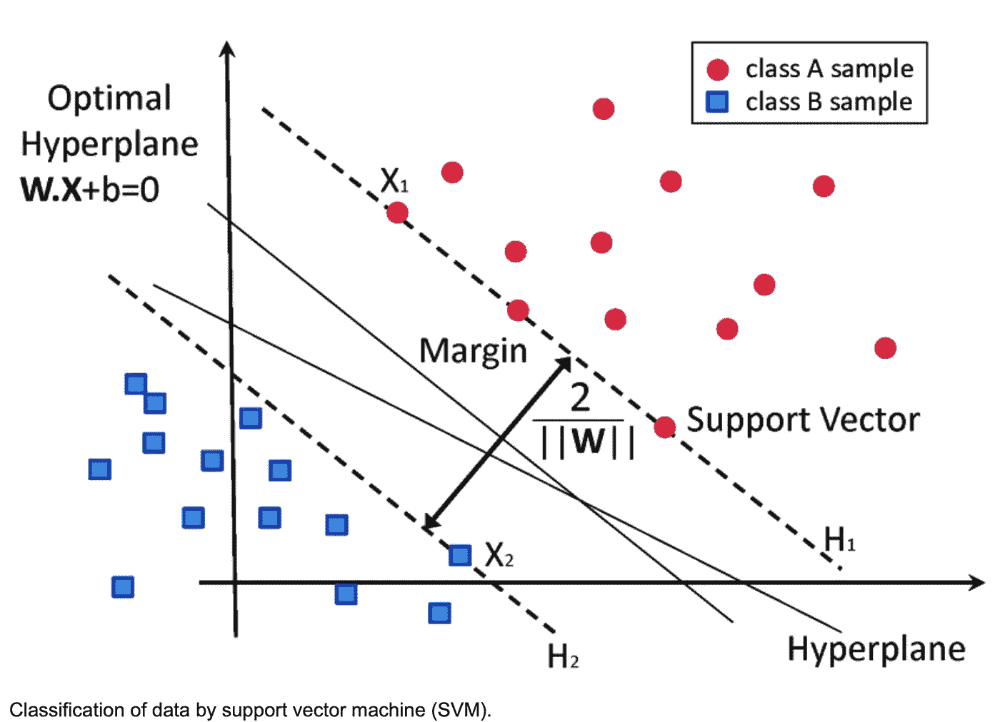
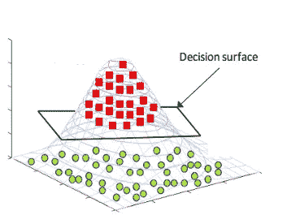
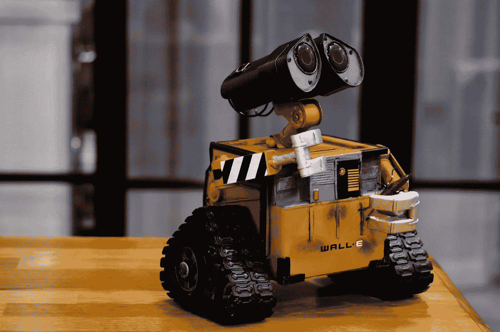

# 支持向量机(SVM)很难掌握:不用编码就能学会

> 原文：<https://levelup.gitconnected.com/support-vector-machines-svm-are-hard-to-master-learn-it-without-coding-20b3e9a771e6>

对 SVM 关键概念、3 种经过实战检验的方法、如何提高其准确性以及机会有一个深入的基本理解。


来自 Unsplash 的 Nikita Ignatev

支持向量机(SVM)是一种监督学习算法，可用于分类和回归任务[2]。

# **支持向量机背后的主要思想是找到分隔两类数据点的最佳直线或超平面[2]。**

这一行不仅处理了边缘的大小，还处理了最小化训练数据的错误分类数量的方法，这可以防止过度拟合。本文将解释支持向量机的操作及其相对于其他机器学习算法的优势。



来自[13]

# **其背景，简体**

SVM 的可实现目标是找到一个超平面，该超平面最大程度地分离两个类，同时最小化训练数据上的分类错误的数量。为了实现这一点，SVM 变换的方法被用来创建一种格式，这种分离可以很容易地被识别。这个转换可以通过所谓的内核技巧来完成[4]。最常见的核是线性、多项式和径向基函数(RBF) [5]。

> 核是将数据从其原始输入空间映射到新的特征空间的函数。

这种映射可以是非线性的，这使得核对于学习数据中的复杂模式非常有用。在支持向量机(SVMs)中，使用核来寻找数据点类别之间的决策边界。


来自 Unsplash 的杰克·安斯蒂

# **线性内核**

线性核通过创建告知原始要素组合的新要素，将数据转换到更高维度的空间。这个变换的空间找到一个最佳超平面来分离这两个类。虽然这可能看起来像是“矫枉过正”[7]仅仅添加新的功能，但我发现这些新创建的功能存在于所谓的复制希尔伯特空间[6](它具有有益的数学属性，我们可以在优化过程中加以利用)。此外，处理高维输入变得比低维输入更容易，因为当样本大小相对于维度较大时，许多机器学习现象(例如，用于处理拟合优化)更有规律地发生。



来自[14]

因为 SVM 决策边界依赖于靠近它们的支持向量周围的局部信息(输入空间中的决策边界[8])，所以它们可能会更优化地进行概化(取决于您拥有的数据量)。虽然在训练集上可能存在具有类似错误率的其他分离超平面，但是根据留一交叉验证[9]或一些类似的设计用于从可用数据集估计泛化性能的技术，该超平面通常表现最佳。

# **多项式内核**

我们花了一点时间来分解线性核，因为它直接表明了线性核和多项式核之间的区别。多项式核是我在机器学习中经常选择的支持向量机，因为它在线性和非线性模型中具有灵活性。这种类型的核有许多优点，包括处理非线性数据集的能力和选择多项式次数的适应性。

与通过计算每对样本之间的点积将数据变换到新的特征空间以实现线性可分数据的变换的线性核相比，多项式核通过计算每对样本之间的叉积将数据变换到新的特征空间。


来自 Unsplash 的[马丁·桑切斯](https://unsplash.com/@martinsanchez)

# **RBF 内核**

RBF(或高斯)核与前两个不同，它计算空间中的每个点离某个中心有多远(或各种“距离”理论)。因为 RBF 核可以通过将这些中心放置在一起来潜在地模拟任意复杂的决策边界[10]，所以从这种类型的信息编码策略中收集的见解可以通知那些期望的用例。根据这些内核，你应该使用哪一个，我可能会从线性开始，然后根据性能和运行时的考虑选择多项式或 RBF(因为处理高维输入通常比低维输入需要更多的时间)。

# **机遇**

除了成本，我们还会考虑扩展。支持向量机扩展到高维数据；由于 SVM 核将输入向量隐式映射到一个非常高维的特征空间中，因此它在高维空间中可能是有效的。此外，一旦我们执行这种类型的映射，我们就可以潜在地降低对监控我们的输入的期望，因为维度缩减技术可以进一步降低对于普通计算设备来说太大的训练集的内存/存储需求。

它们比其他型号更能抵抗过度拟合。这是因为与数据点数量相比，支持向量机解决的优化问题考虑了不同的“自由度”[11]。此外，高级算法实施通常会在训练期间使用一些验证集自动调整模型复杂性，相对于留一交叉验证[9]或类似技术(隐含要求所有数据点都用于拟合和性能估计)，这可以进一步减少过度拟合的机会。



来自 Unsplash 的 ray rui

# **优化它以提高精确度**

一种方法是使用内核，它可以将低维数据转换到高维空间，以便更好地区分类别。另一种方法是针对不同的任务使用不同类型的支持向量机；例如，在处理特定类型的数据标签时，使用一类 SVM 进行新颖性检测[12]或使用回归 SVM 而不是分类 SVM。此外，超参数调整可用于优化模型的各个方面，如核类型和正则化参数。

## **离别的思念**

如果你对这篇文章的编辑有任何建议，或者对进一步扩展这个主题领域有什么建议，请和我分享你的想法。

```
Here is my newsletter; I hope that you kindly **consider subscribing**.[https://pventures.substack.com](https://pventures.substack.com/)
```

## 考虑阅读我写的以下内容:

[](https://pub.towardsai.net/visual-guide-to-big-data-10-differences-vs-data-and-technologies-7bd8b27ba87) [## 大数据视觉指南:与数据和技术的 10 大差异

### 了解数据和大数据之间的 10 个区别，大数据实施中采取的 4 个高级步骤…

pub.towardsai.net](https://pub.towardsai.net/visual-guide-to-big-data-10-differences-vs-data-and-technologies-7bd8b27ba87) [](https://pub.towardsai.net/regression-analysis-is-exceedingly-difficult-how-to-master-it-without-coding-542ae1d6edaf) [## 回归分析极其困难:不编码如何掌握它

### 对关键概念、3 个经过实战检验的模型和 3 个挑战有一个很好的基本理解，包括…

pub.towardsai.net](https://pub.towardsai.net/regression-analysis-is-exceedingly-difficult-how-to-master-it-without-coding-542ae1d6edaf) 

*参考文献:*

*1。蒂尔贝，阿尼尔。(2022 年 8 月 2 日)。简化的 20 种机器学习方法。升级编码。*[*https://level up . git connected . com/top-20-machine-learning-algorithms-explained-in-less-10-seconds-each-8fd 728 f 70 b 19*](/top-20-machine-learning-algorithms-explained-in-less-than-10-seconds-each-8fd728f70b19)

*2。什米洛维奇。(2009 年 1 月 1 日)。支持向量机。斯普林格我们。*[*https://link . springer . com/chapter/10.1007/978-0-387-09823-4 _ 12*](https://link.springer.com/chapter/10.1007/978-0-387-09823-4_12)

*3。苏塔哈兰。(2016 年 1 月 1 日)。支持向量机。斯普林格我们。*[*https://link . springer . com/chapter/10.1007/978-1-4899-7641-3 _ 9*](https://link.springer.com/chapter/10.1007/978-1-4899-7641-3_9)

*4。支持向量机教程(SVM)。*[](https://course.ccs.neu.edu/cs5100f11/resources/jakkula.pdf)

**5。Razaque，a .，Frej，M. B. H .，Almi'ani，m .，Alotaibi，m .，&# 38；阿洛泰比，B. (2021)。改进的支持向量机支持径向基函数和线性变量的遥感图像分类。传感器，21(13)。*[*https://doi.org/10.3390/s21134431*](https://doi.org/10.3390/s21134431)*

**6。海克曼。罚最小二乘法的理论和应用或再生核希尔伯特空间变得容易，1997。**

**7。布雷雷顿，r . g .&# 38；劳埃德·格雷(未标明)。分类和回归的支持向量机。分析师，135(2)，230–267。*[*https://doi.org/10.1039/B918972F*](https://doi.org/10.1039/B918972F)*

*8。多梅尼科尼，c .，&# 38；古诺普洛斯博士(未注明)。基于支持向量机的自适应最近邻分类。神经信息处理系统进展，14。*

*9。张，&# 38；王。(2015).SVM 式家庭的快速留一交叉验证。神经计算和应用，27(6)，1717-1730。[*https://doi.org/10.1007/s00521-015-1970-4*](https://doi.org/10.1007/s00521-015-1970-4)*

*10。Park，J.-E .，Quanz，b .，Wood，s .，Higgins，h .，&# 38；Harishankar 河(2020 年 12 月 14 日)。量子 SVM 的实际应用改进:理论到实践。ArXiv.Org。[*https://arxiv.org/abs/2012.07725*](https://arxiv.org/abs/2012.07725)*

**11。机器人抓取的 SVM 学习方法。(未注明)。IEEE Xplore。检索到 2022 年 8 月 13 日，来自*[*https://ieeexplore.ieee.org/abstract/document/1308797*](https://ieeexplore.ieee.org/abstract/document/1308797)*

**12。基于单类支持向量机的时间序列新奇性检测。(未注明)。IEEE Xplore。检索到 2022 年 8 月 13 日，转自*【https://ieeexplore.ieee.org/abstract/document/1223670/】*

**13。加西亚·贡萨洛(2016 年 6 月 29 日)。图二。通过支持向量机(SVM)对数据进行分类。研究之门。[*https://www . researchgate . net/figure/class ification-of-data-by-support-vector-machine-SVM _ fig 8 _ 304611323*](https://www.researchgate.net/figure/Classification-of-data-by-support-vector-machine-SVM_fig8_304611323)**

**14。[*https://www . section . io/engineering-education/kernel-SVM-in-python/*](https://www.section.io/engineering-education/kernel-svm-in-python/)**

# **分级编码**

**感谢您成为我们社区的一员！在你离开之前:**

*   **👏为故事鼓掌，跟着作者走👉**
*   **📰查看[升级编码出版物](https://levelup.gitconnected.com/?utm_source=pub&utm_medium=post)中的更多内容**
*   **🔔关注我们:[Twitter](https://twitter.com/gitconnected)|[LinkedIn](https://www.linkedin.com/company/gitconnected)|[时事通讯](https://newsletter.levelup.dev)**

**🚀👉 [**加入人才集体，找到一份令人惊喜的工作**](https://jobs.levelup.dev/talent/welcome?referral=true)**