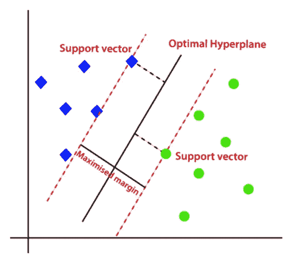

# SVM:从理论到实施

> 原文：<https://levelup.gitconnected.com/support-vector-machines-svms-from-theory-to-implementation-e4bf507cc35c>



[图像来源](https://www.javatpoint.com/machine-learning-support-vector-machine-algorithm)

# 介绍

**支持向量机(SVMs)** 是一种监督学习算法，可用于分类和回归任务。它们被称为“支持向量”机器，因为它们通过在高维空间中找到最大限度地分离不同类别的超平面来工作。

在本文中，我们将介绍支持向量机背后的概念和理论，然后向您展示如何在实践中实现和使用它们。我们将从支持向量机的高级概述开始，然后深入到它们如何工作以及如何有效使用它们的细节。

# 第一部分:支持向量机理论

## 什么是支持向量机？

支持向量机(SVM)是一种监督学习算法，可用于分类和回归任务。它的工作原理是在一个高维空间中找到最大限度地分离不同类别的超平面。

例如，考虑具有两个类 A 和 B 的数据集，这两个类在二维空间中不是线性可分的。一个 SVM 会在一个三维空间中找到最大限度地分开这两类的超平面。

离超平面最近的点称为“支持向量”，超平面和最近的支持向量之间的距离称为“边缘”。SVM 的目标是找到具有最大裕度的超平面，因为较大的裕度意味着模型更健壮并且不容易过度拟合。

## 支持向量机是如何工作的？

支持向量机的工作原理是在高维空间中找到最大限度地分离不同类别的超平面。该算法通过最小化“误差”或“损失”函数来做到这一点，该函数测量模型能够将类分开的程度。

误差函数被定义为支持向量到超平面的距离之和，加上惩罚更复杂模型的正则化项。SVM 算法通过求解由误差函数定义的优化问题来寻找超平面。

一旦对 SVM 模型进行了训练，就可以使用它来对新的、看不见的数据进行预测，方法是根据数据点相对于超平面的位置找到最有可能与该数据点相关联的类。

## 支持向量机的优缺点

支持向量机有几个优点，使它们成为许多应用的流行选择:

*   准确性:众所周知，支持向量机可以生成高度准确的模型，尤其是当数据清晰且分离良好时。
*   稳健性:支持向量机对数据中的噪声和异常值相对稳健，因为它们基于边际最大化的概念。
*   效率:支持向量机计算效率高，并且可以很好地扩展到大型数据集。

然而，支持向量机也有一些限制和缺点:

*   计算复杂性:训练 SVM 的计算量很大，尤其是对于包含许多要素的大型数据集。
*   超参数调整:支持向量机有几个超参数需要调整，比如核函数、正则化参数和核参数。寻找超参数的最佳组合可能非常耗时，并且需要一些反复试验。
*   限于线性和基于核的模型:支持向量机限于线性和基于核的模型，这意味着它们可能不适合某些类型的数据，例如具有复杂非线性关系的数据。

# 第 2 部分:支持向量机实现

既然我们已经介绍了支持向量机背后的基本概念和理论，让我们演示一下如何在实践中实现和使用它们。在本教程中，我们将使用 Python 编程语言和 scikit-learn 库。

## 步骤 1:导入必要的库

首先，我们将从导入本教程所需的库开始。我们需要 NumPy 和 pandas 进行数据操作，需要 scikit-learn 来构建和评估模型。

```
import numpy as np
import pandas as pd
from sklearn.svm import SVC
from sklearn.model_selection import train_test_split
```

## 步骤 2:加载和准备数据

接下来，我们将加载数据并为模型构建做准备。我们将使用 pandas 将数据加载到一个 dataframe 中，然后将数据分成特征(X)和目标(y)。

```
# Load the data
df = pd.read_csv('iris.csv')

# Split the data into features and target
X = df.drop('species', axis=1)
y = df['species']
```

## 步骤 3:将数据分成训练集和测试集

在构建和评估模型之前，我们需要将数据分成训练集和测试集。我们将使用 scikit-learn 的`train_test_split`函数将数据随机分成 75%的训练集和 25%的测试集。

```
X_train, X_test, y_train, y_test = train_test_split(X, y, test_size=0.25, random_state=42)
```

## 步骤 4:构建和训练模型

现在我们准备建立和训练支持向量机模型。我们将使用 scikit-learn 的`SVC`类来创建一个模型，然后使用`fit`方法在训练数据上训练它。

```
# Build the model
model = SVC(kernel='linear', random_state=42)

# Train the model
model.fit(X_train, y_train)
```

默认情况下，`SVC`类使用线性内核，这意味着模型将只能学习线性决策边界。如果我们想使用非线性核，如多项式或径向基函数(RBF)核，我们可以将`kernel`超参数设置为相应的值。

## 步骤 5:评估模型

既然模型已经定型，我们就可以根据测试数据评估它的性能了。我们可以使用几个指标来评估分类模型的性能，如准确度、精确度、召回率和 f1 值。

我们将使用 scikit-learn 的`classification_report`函数来计算测试数据的这些指标。

```
from sklearn.metrics import classification_report

# Make predictions on the test data
y_pred = model.predict(X_test)

# Print the classification report
print(classification_report(y_test, y_pred))
```

分类报告的输出将显示测试数据的不同评估指标的值。

## 步骤 6:微调模型

支持向量机模型的性能可能不是开箱即用的最佳性能，通过微调超参数来提高模型的性能是可能的。

如前所述，SVM 有几个需要调整的超参数，比如核函数、正则化参数和核参数。我们可以使用 scikit-learn 的`GridSearchCV`函数，通过搜索可能值的网格来微调模型的超参数。

```
from sklearn.model_selection import GridSearchCV

# Define the hyperparameter grid
param_grid = {'C': [0.1, 1, 10],
              'kernel': ['linear', 'poly', 'rbf'],
              'degree': [2, 3, 4],
              'gamma': ['scale', 'auto']}

# Build the model
model = SVC(random_state=42)

# Set up the grid search
grid_search = GridSearchCV(model, param_grid, cv=5, scoring='accuracy', return_train_score=True)

# Fit the grid search to the data
grid_search.fit(X_train, y_train)

# Print the best hyperparameters
print(grid_search.best_params_)
```

网格搜索的输出将显示基于交叉验证的不同折叠的最高平均准确度的最佳超参数。

## 第 7 步:使用微调后的模型进行预测

一旦我们对模型进行了微调，我们就可以用它来对新的、看不见的数据进行预测。为此，我们可以使用模型的`predict`方法，就像之前一样。

```
# Make predictions on the test data
y_pred = grid_search.predict(X_test)

# Print the classification report
print(classification_report(y_test, y_pred))
```

分类报告的输出将显示测试数据上的微调模型的评估指标。

# 结论

在本文中，我们介绍了支持向量机的概念，并演示了如何使用 Python 和 scikit-learn 在实践中实现和使用它们。我们讨论了支持向量机背后的理论，并展示了如何构建和评估模型，以及如何微调模型以提高其性能。我们希望本教程已经让你很好地理解了支持向量机以及如何在你自己的项目中使用它们。

# 分级编码

感谢您成为我们社区的一员！在你离开之前:

*   👏为故事鼓掌，跟着作者走👉
*   📰更多内容请查看[升级编码刊物](https://levelup.gitconnected.com/?utm_source=pub&utm_medium=post)
*   💰免费编码面试课程[查看课程](https://skilled.dev/?utm_source=luc&utm_medium=article)
*   🔔关注我们:[Twitter](https://twitter.com/gitconnected)|[LinkedIn](https://www.linkedin.com/company/gitconnected)|[时事通讯](https://newsletter.levelup.dev)

🚀👉 [**加入升级人才集体，找到一份神奇的工作**](https://jobs.levelup.dev/talent/welcome?referral=true)