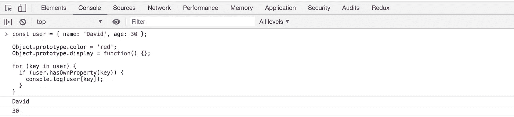

# for…在循环中的惊人行为

> 原文：<https://levelup.gitconnected.com/surprising-behavior-of-for-in-loop-9854ed3b823c>

了解如何在使用 for…in 循环遍历对象时防止代码中出现错误。


[艾蒂安·布朗热](https://unsplash.com/@etienneblg?utm_source=medium&utm_medium=referral)在 [Unsplash](https://unsplash.com?utm_source=medium&utm_medium=referral) 上的照片

在本文中，我们将看到如何使用`for...in`循环来避免不可预测的错误。

看看下面的代码:

```
const user = { name: 'David', age: 30 };
for (key in user) {
 console.log(user[key]);
}
```

你能预测上面代码的输出吗？

*输出将是:*
大卫
30

这是意料之中的。

现在看一下下面的代码:

```
const user = { name: 'David', age: 30 };Object.prototype.color = 'red';
Object.prototype.display = function() {};for (key in user) {
 console.log(user[key]);
}
```

现在的产量会是多少？


所以它也打印了`color`属性和`display`函数，这显然不是我们所期望的。

因此，如果在你的代码中的某个地方，你或某人已经向`Object`原型添加了一些属性或方法，那么当使用`for...in`循环时，它们将会显示出来。

因此`for...in`循环将显示它自己的属性以及它的原型属性。我们可以使用`hasOwnProperty`方法解决这个问题。

**object . prototype . hasownproperty:**

它具有以下语法:

```
obj.hasOwnProperty(prop)
```

如果提供的`prop`是`obj’s`自己声明的属性，则该方法返回 true。

```
const user = { name: 'David', age: 30 };Object.prototype.color = 'red';
Object.prototype.display = function() {};for (key in user) {
 **if (user.hasOwnProperty(key)) {**
  console.log(user[key]);
 }
}
```

现在，输出将如预期的那样出现



有另一种方法可以解决这个问题，使用`Object.keys`方法和`for...of`循环

**Object.keys:**

它具有以下语法:

```
Object.keys(obj)
```

此方法返回给定对象自己的可枚举属性名的数组。

```
const user = { name: 'David', age: 30 };Object.prototype.color = 'red';
Object.prototype.display = function() {};for (key of Object.keys(user)) {
 console.log(user[key]);
}
```


因此，在使用`for...in`循环时，您可能需要注意这些事情。

今天到此为止。希望你今天学到了新东西。

不要忘记订阅我的每周简讯，里面有惊人的技巧、窍门和文章，直接在这里的收件箱里。