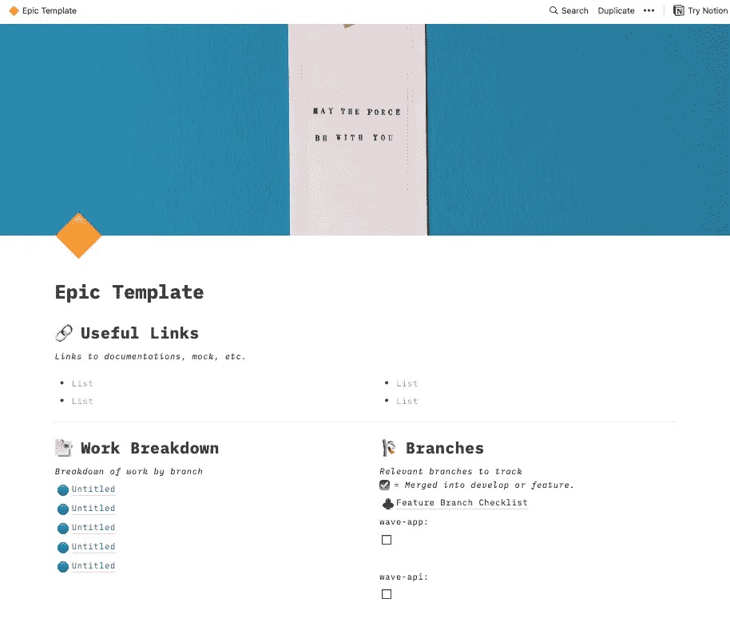

# 从你的第一个开发角色中幸存下来:一些实用技巧

> 原文：<https://levelup.gitconnected.com/surviving-your-first-developer-role-some-practical-tips-986497f5d3bb>

[梁杰森](https://unsplash.com/@ninjason?utm_source=medium&utm_medium=referral)在 [Unsplash](https://unsplash.com?utm_source=medium&utm_medium=referral) 上的照片

恭喜你！你刚刚获得了软件开发员的第一份工作。啊，Leetcode 辛苦工作的时间，成堆的拒绝邮件，令人紧张的面试——他们终于让*得到了回报！*

如果你和一年前的我一样，获得第一个角色就像是对你的技能、努力和坚韧的最大肯定。但伴随着这种闪亮的认可而来的是许多不确定性引发的恐惧。我的意思是，天哪，有人真的认为你足够好，开始给你钱做这个！你如何试着*而不是*把事情搞砸？

最近，我一直在想去年我在哪里(亲爱的读者，你现在可能在哪里)。我想如果我能给过去的自己一些指引，那会是什么样的指引呢？这篇博文就是这样的产物。我希望它有一些用处。

# 秘诀 0:做一块海绵——吸收一切:把一切都写下来

格伦·卡斯滕斯-彼得斯在 [Unsplash](https://unsplash.com?utm_source=medium&utm_medium=referral) 上拍摄的照片

我个人的信念，也许是由于我糟糕的记忆力，是你应该把一切都写下来，而不是完全相信你的大脑。

与你一起工作的高级开发人员是否给你提供了代码库或某些过程的概要？记下他们告诉你的话。这是你的第一张罚单吗，你不知道怎么解决？记录下你到达目的地的过程。你在开团队会议吗？草草记下讨论的主要观点。更好的是，注意你*还不知道的讨论要点——写下来，查阅，再写下来。*

以这种方式成为一块海绵的最终目的是让你未来的生活尽可能的容易。这样，你就不必问同一个问题两次，而且随着时间的推移，你会成为你自己的资源。

以下是我保存笔记的电子页面示例:

我是[概念](https://www.notion.so/)的忠实粉丝(一有机会我就会大肆宣扬)，尤其是因为它非常容易使用，并且能让你做一些很棒的事情。例如，您可以在页面中生成页面、创建表格、格式化代码以及制作可重用的模板。

下面是一个我如何组织我的关于概念的冲刺笔记的例子:

我根据需要在不同的部分移动页面，并有现成的模板为我当前的工作流服务。Epic 页面用于更长的工作流(例如，像构建一个新特性一样，epic 包含多个任务)。由于不是所有分配给我的工作都是史诗的一部分，我还保留了一个单独的任务模板页面。以下是我的任务页面的外观:

任务页面使我按照我正在处理的当前任务分支的程度进行组织。当然，并不是所有的任务都需要这种程度的大量笔记，但我仍然发现在我找到解决方法的时候，有一个这样的页面来组织我的想法很有帮助。预公关提交清单是一个自我提醒，提醒我在提交审查之前审查自己的工作(自从我读了 Atul Gawande 的[清单宣言](http://atulgawande.com/book/the-checklist-manifesto/)后，我开始真正欣赏清单这种简单但极其有效的方法；我强烈推荐那本书。

这是我的史诗笔记模板的样子:

乍看之下，这些页面似乎有些冗长。但是它们对我来说非常有用，因为我用它们来保持有条理。随着时间的推移，我开始相信这些页面上的笔记，而不是我脑海中那些杂乱无章、转瞬即逝的想法。我曾不止一次地遇到一些让我隐约想起的事情，我知道我应该知道。我所要做的就是在我的黑板上点击几个键，然后沿着我的足迹找到我解释那件事的笔记。你的笔记方法可能看起来和我的不完全一样，但是我强烈建议你创建一个并坚持使用。会有回报的。

# 技巧 1: Git 熟悉

[扬西·敏](https://unsplash.com/@yancymin?utm_source=medium&utm_medium=referral)在 [Unsplash](https://unsplash.com?utm_source=medium&utm_medium=referral) 上的照片

好的，事情是这样的，你现在将为一个*企业级*代码库做贡献。你可以灵活地用类似于`"changed a thing"`的愚蠢信息直接提交到你个人项目回购的`master`分支的日子已经一去不复返了。不，你将与不同的分公司合作，比如`develop`，可能是`staging`分公司，最有可能是`task`分公司。因此，说您需要非常了解 git 的基础知识并不为过。您还应该对不同开发环境之间的差异有所了解。

回到 git，你应该已经对下面的命令了如指掌:`git add`、`git commit`、`git push`、`git fetch`、`git merge`、`git pull`。知道如何编写好的提交消息。此外，我建议您也熟悉一下`git commit --amend -m`和`git commit --amend --no-edit`。第一个用一条新消息将您的当前提交与之前的提交相结合。第二种方法与第一种方法相同，只是保留了前一次提交的消息。这些可以帮助您更简洁地捆绑您的提交，这样您就不会以 100 个提交结束您的拉请求。

# 技巧 2:了解组织流程和角色

[杰森·古德曼](https://unsplash.com/@jasongoodman_youxventures?utm_source=medium&utm_medium=referral)在 [Unsplash](https://unsplash.com?utm_source=medium&utm_medium=referral) 上的照片

你应该大致了解什么是[敏捷方法](https://www.atlassian.com/agile)，理解 scrum sprint 的不同部分以及它们是如何工作的。比如冲刺规划会发生什么？什么是复古？什么是积压？什么是点估计？

同样的，了解你团队中其他人的角色。以下是一些你可能直接与之共事的普通人:

*   产品经理/产品负责人
*   UI/UX 设计器
*   质量保证工程师
*   开发运营工程师
*   商业分析员

同样，我会让你自己研究这些。

# 技巧 3:知道如何从现有代码中学习

弗洛里安·奥利佛在 [Unsplash](https://unsplash.com?utm_source=medium&utm_medium=referral) 上拍摄的照片

刚开始工作时，我最关心的一个问题是一家公司庞大的代码库，仅仅一瞥就会让你感到失落和恶心。在这方面，我得到的最好的建议来自 [RealToughCandy](https://www.youtube.com/c/RealToughCandy) 。她说你应该一行一行地阅读代码*(见鬼，如果你需要的话，甚至是一个字一个字地阅读)。对于每一行，你应该用人类的语言来解构代码试图做什么。整个森林可能看起来势不可挡，但放大后你会发现你确实有能力近距离观察一棵树，数它的树枝，看它在哪里扎根。从那里开始！*

此外，利用公关审查。作为初级阶段的学生，审阅别人的工作不一定是添加你的意见，因为你可能还没有到那一步。但还是要利用 PRs，因为这是一个巨大的学习机会！对于我早期回顾的每一份公关，我都试图理解它在做什么，并记下我所学到的东西。即使我不明白一个大型公关活动中发生的所有事情，我仍然会挑选出我学到的一两件事，并把这个公关活动作为一个例子，如果需要的话可以回头再看。下面是我看完一份简历后记下的例子:

> 链接到 PR: http://www…
> 我学到了什么:如何设置路线，如何从查询中读取搜索参数

另一个重要的相关提示是，当你被分配了某件事情，不要试图从头开始！在代码库中寻找类似的例子，有耐心，通读一个类似的特性以前是如何完成的。如上所述，一行一行地分解代码，直到理解为止。沿途做笔记，然后定义一条你可以着手工作的路线。只有到那时，你才应该开始编码。虽然这听起来很广泛，但是相信我，从以前的实现中学习最终会为您节省很多时间。您还会发现，在这个过程中，您将获得有用的编码约定，并学习常用的模式。

# 秘诀 4:寻求指导

[杰森·古德曼](https://unsplash.com/@jasongoodman_youxventures?utm_source=medium&utm_medium=referral)在 [Unsplash](https://unsplash.com?utm_source=medium&utm_medium=referral) 上的照片

寻求指导的第一件事是知道如何在自己的团队中寻求帮助。这里有一个有用的模板，告诉你在自己尝试了一段时间后，如何向别人寻求帮助:

> *嘿* <帮手的名字> *，我正在做* <任务> *。我目前正在尝试* <描述你卡在> *上的事情。我尝试了* <一个潜在的解决方案你尝试了> *因为* <推理为尝试这个解决方案> *。我还尝试了* <另一个潜在的解决方案，你尝试了> *来看看* <是否有理由尝试这个解决方案> *，但是这些似乎都没有解决问题。有什么指点吗？*

如果你通过团队或 Slack 寻求帮助，并试图解释一些令人困惑的事情，如果你添加一个截图，或者更好的是，一个问题的屏幕记录，会给你加分。目标是尊重你的帮助者的时间——以最有效的方式帮助他们。

此外，你可以在课程中寻求指导。组织是否使用 GraphQL，而您对该技术的接触很少？不要等到有人牵着你的手，引导你走过！自己去找资源学习材料。作为开发人员，我们知道现在寻找资源只需要简单的谷歌搜索。

其他与指南相关的技巧(注意例子有点偏向前端，因为我是前端开发人员):

*   订阅并阅读技术时事通讯。我最喜欢的几个:[前端周刊、](https://frontendweekly.co/)前端聚焦、[反应快讯](https://reactnewsletter.com/)、[编程文摘](https://programmingdigest.net/)。
*   订阅科技播客并收听。我最喜欢的一些: [React Round Up](https://www.podbean.com/podcast-detail/m55ng-68d22/React-Round-Up-Podcast//DirEpisode_page/3/page/10) ，[fronten Happy Hour](https://www.frontendhappyhour.com/)， [Developer Tea。](https://www.podbean.com/podcast-detail/s3cre-33acb/Developer-Tea-Podcast)
*   看书！我的一些推荐:[干净的代码](https://www.amazon.com/Clean-Code-Handbook-Software-Craftsmanship/dp/0132350882)和[罗伯特·马丁的干净的编码者](https://www.amazon.com/Clean-Coder-Conduct-Professional-Programmers/dp/0137081073/ref=pd_lpo_2?pd_rd_i=0137081073&psc=1)(我也喜欢这个[相关系列讲座](https://www.youtube.com/watch?v=7EmboKQH8lM))，[你还不知道的 JS](https://www.amazon.com/You-Dont-Know-JS-Yet-ebook/dp/B084BNMN7T)凯尔·辛普森的[原子设计](https://atomicdesign.bradfrost.com/)布拉德·弗罗斯特的。

你也可以寻求指导。我很幸运，能够得到团队中一位高级工程师的指导。我经常和她交流我的技术和软技能，我的职业生涯，以及我未来的目标。但是仅仅因为你没有指定的人作为你的导师，并不意味着你没有指导——只是寻找资源！让那些经历过的人来引导你——不管是 Youtube 视频、博客帖子还是一本书。也有多个开发社区，你可以在其中寻求导师或同伴导师。下面是我推荐的几个: [NYC Coders](https://www.linkedin.com/company/nyc-coders/) 、 [Year One](https://www.linkedin.com/company/yearonecareers/) 和 [Femmecubator](https://www.linkedin.com/company/femmecubator/) 。

唉，保持冷静，继续编码吧！坚持对你有效的方法，知道如何寻求指导，记得有时要慢下来深呼吸。这是一场马拉松，而你才刚刚开始比赛！