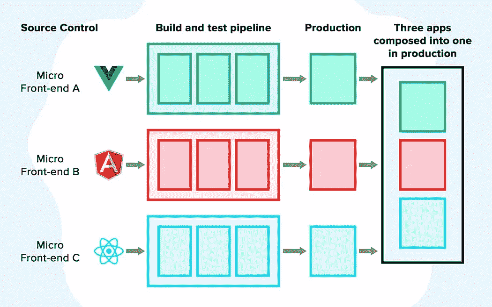
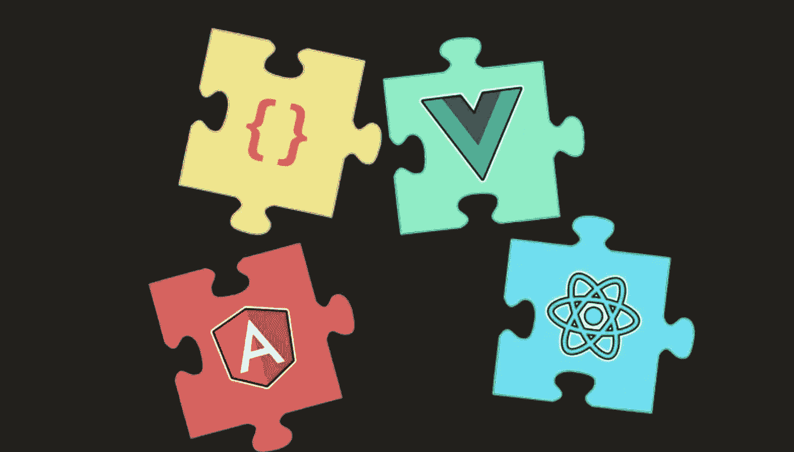
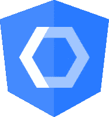

# 可持续的(经得起未来考验的)网络前端

> 原文：<https://levelup.gitconnected.com/sustainable-future-proof-web-frontends-89ac5dd67dfb>

图片来源:[https://www . August . com . au/blog/resources-for-frontend-developers/](https://www.august.com.au/blog/resources-for-frontend-developers/)

在这一点上，每隔几个月就会出现一个新的 JavaScript 框架并颠覆整个行业，这已经成为一个公认的迷因。尽管这在今天并不完全正确，但无论如何，我们仍然可以观察到在过去几年中我们开发 web 应用程序的方式发生了巨大的变化。不久前 Angular 还是第一框架，然后其他框架出现了，今天 React 正在主宰这个行业。在路上，许多其他框架像 Vue，Ember，Svelte，Preact，Next 等。被开发出来。有些人做得很好，其他人如恩伯未能取得成功。

随着网络的不断变化，我们如何决定选择合适的框架呢？好吧，你必须选择当时最适合你的情况，但是没有办法预见未来和预测将要发生什么。如果您的应用程序需要维护几年，甚至几十年，那么您肯定会遇到风险，您在开始时选择的框架可能会在那个时候死亡。在这种情况下，招聘人才变得困难，社区减少，框架可能会过时。

为了防止这种情况发生并保持节约，我们必须遵循一个概念来构建可持续的应用程序，这些应用程序不局限于某些框架的生命周期，这样应用程序本身就更加独立于框架，并能适应行业变化。幸运的是，在过去的几年中，我们看到了一些趋势，允许我们构建这种适应性强，甚至部分与框架无关的应用程序。

# 微前端

为了拥有一个可以有效适应和重构的系统，我们必须划分清楚界限，将应用程序分成独立的小领域。微前端并不是实现这一点的必要条件，但是它们确实迫使我们考虑小的单元和领域。微前端架构的另一大优势是每个微前端的灵活性。理论上，你可以用 React 创建一个微前端，用 Angular 创建另一个微前端，并且基本上将各种框架混合在一起。尽管公平地说，这不是一个好的实践，因为应用程序的性能会急剧下降。

许多公司已经在使用微前端方法将遗留的 monoliths 迁移到具有较新框架的微前端。例如，当从 AngularJS(目前已被弃用)迁移到 Angular 的新版本时，构建微前端会有所帮助。同样，你可以用它从角度转换到反应，或者其他。

拥有一个微前端架构基本上给了你更容易切换框架的可能性，减少了你的产品和你一开始选择的框架之间的依赖性。

# Web 组件

假设您正在从 Angular 迁移到一个新的 hot 框架，但是糟糕的是，您不能简单地重用您在应用程序中创建的所有组件。如果有一种方法可以创建与框架无关的纯 JavaScript 的普通组件，那不是很好吗？幸运的是，有一种方法已经成为可行的实践，任何人都可以使用，可以在所有常见的浏览器中工作。这个解决方案被称为 web 组件，它是由相当新引入的技术 shadow DOM 实现的。影子 DOM 是必不可少的，因为 web 组件需要被隔离，这样它的样式就不会受到外部的影响，也不会影响 DOM 的其他部分。通过为 web 组件创建一个完全独立的 DOM，提供了所需的隔离。

web 组件可以直接与流行的 JavaScript 框架中的组件相比较，因为它们是可重用的，可以有属性和绑定。甚至插槽本身也是可用的，这是 web 组件进行内容投影的方式。

也就是说，如果您计划创建一个 UI 库，在任何选择的框架中使用 web 组件来使用 UI 库可能是有意义的。是不是很神奇？

# 角度元素

@角度/元素

作为一个角度爱好者，我会推荐你检查角度元素，这使得有可能将一个规则的角度组件转换成一个 web 组件。你什么时候想这么做？例如，当您从 AngularJS 迁移到 Angular 时。或者您想与其他不是基于 Angular 的应用程序共享您的 Angular 组件。

如果你想知道更多关于 Angular Elements 的信息，请继续关注并订阅我发表博客文章时的电子邮件，这样当详细的 Angular Elements 文章发表时，你会收到通知。

# 结论

框架来来去去。我们看到不断的创新和不断的变化。这并不是构建长寿命产品的最佳先决条件，这些产品依赖于我们一开始选择的技术。为了让我们的应用程序不太依赖底层技术，我们必须减少对某个框架的依赖。尽管我很喜欢 Angular，但也许有一天 Angular 会失去相关性，我希望使用另一个框架来代替。使用分离的系统、划定严格的界限和使用 web 组件是给你的应用程序提供所需灵活性的好方法。一旦建立了这样的东西，你就可以很容易地移植到任何框架。

如果你喜欢这篇博文，并想在 Medium 上无限阅读，如果你能使用我的推荐链接创建一个 Medium 订阅，我将不胜感激:

 [## 通过我的推荐链接-斯特凡·哈斯加入媒体

### 阅读斯特凡·哈斯的每一个故事(以及媒体上成千上万的其他作家)。您的会员费直接支持…

medium.com](https://medium.com/@stefan.haas.privat/membership)